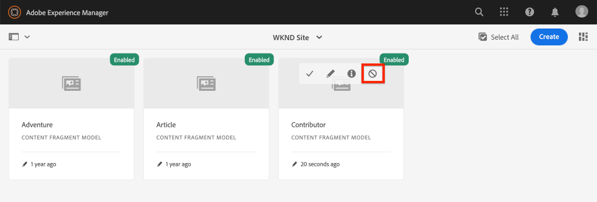

# Definição dos modelos de fragmento do conteúdo {#content-fragment-models}

Neste capítulo, saiba como modelar conteúdo e criar um schema com **Modelos de fragmentos do conteúdo**. Você verificará os modelos existentes e criará um novo modelo. Você também aprenderá sobre os diferentes tipos de dados que podem ser usados para definir um schema como parte do modelo.

Neste capítulo, você criará um novo modelo para um **Colaborador**, que é o modelo de dados para os usuários que criam conteúdo de revista e aventura como parte da marca WKND.

## Pré-requisitos {#prerequisites}

Este é um tutorial de várias partes e presume-se que as etapas descritas na seção [Configuração rápida](../quick-setup/local-sdk.md) foram concluídas.

## Objetivos {#objectives}

* Crie um novo Modelo de fragmento de conteúdo.
* Identifique os tipos de dados disponíveis e as opções de validação para criar modelos.
* Entenda como o modelo de fragmento de conteúdo define **both** o schema de dados e o modelo de criação para um Fragmento de conteúdo.

## Visão geral do modelo de fragmento de conteúdo {#overview}

>[!VIDEO](https://video.tv.adobe.com/v/22452/?quality=12&learn=on)

O vídeo acima fornece uma visão geral de alto nível do trabalho com Modelos de fragmento de conteúdo.

>[!CAUTION]
>
> O vídeo acima mostra a criação da variável **Colaborador** modelo com o nome `Contributors`. Ao executar as etapas em seu próprio ambiente, assegure-se de que o título use a forma singular: `Contributor` sem a **s**. A nomeação do Modelo do fragmento de conteúdo direciona as chamadas de API GraphQL que serão executadas posteriormente no tutorial.

## Inspect o modelo de fragmento de conteúdo de publicidade

No capítulo anterior, vários Fragmentos de conteúdo de empresas foram editados e exibidos em um aplicativo externo. Vamos inspecionar o Modelo de fragmento de conteúdo do Adventure para entender o esquema de dados subjacente desses fragmentos.

1. No **Início do AEM** navegue até **Ferramentas** > **Ativos** > **Modelos de fragmentos do conteúdo**.

   

1. Navegue até o **Site WKND** e passe o mouse sobre a pasta **Aventura** Modelo do fragmento de conteúdo e clique no **Editar** ícone (lápis) para abrir o modelo.

   

1. Isso abre o **Editor do modelo de fragmento de conteúdo**. Observe que os campos definem o modelo de Aventura incluem **Tipos de dados** like **Texto de linha única**, **Texto de várias linhas**, **Enumeração** e **Referência de conteúdo**.

1. A coluna à direita do editor lista os **Tipos de dados** que definem os campos de formulário usados para criar Fragmentos de conteúdo.

1. Selecione o **Título** no painel principal. Na coluna à direita, clique no botão **Propriedades** guia :

   

   Observe a **Nome da propriedade** estiver definido como `adventureTitle`. Isso define o nome da propriedade que é mantida para AEM. O **Nome da propriedade** também define a variável **key** nome dessa propriedade como parte do schema de dados. Essa **key** será usada quando os dados do Fragmento de conteúdo forem expostos por meio de APIs GraphQL.

   >[!CAUTION]
   >
   > Modificação do **Nome da propriedade** de um campo **after** Os Fragmentos de conteúdo são derivados do Modelo, têm efeitos downstream. Os valores de campo em fragmentos existentes não serão mais referenciados e o esquema de dados exposto pelo GraphQL será alterado, afetando os aplicativos existentes.

1. Role para baixo no **Propriedades** e visualize a **Tipo de validação** lista suspensa.

   

   As validações prontas para uso do formulário estão disponíveis para **E-mail** e **URL**. Também é possível definir uma **Personalizado** validação usando uma expressão regular.

1. Clique em **Cancelar** para fechar o Editor do modelo de fragmento de conteúdo.

## Criar um modelo de colaborador

Em seguida, crie um novo modelo para **Colaborador**, que é o modelo de dados para os usuários que criam conteúdo de revista e aventura como parte da marca WKND.

1. Clique em **Criar** no canto superior direito para trazer o **Criar modelo** assistente.
1. Para **Título do modelo** digite: **Colaborador** e clique em **Criar**

   

   Clique em **Abrir** para abrir o modelo recém-criado.

1. Arrastar e soltar uma **Texto de linha única** no painel principal. Insira as seguintes propriedades no **Propriedades** guia :

   * **Rótulo do campo**: **Nome completo**
   * **Nome da Propriedade**: `fullName`
   * Verificar **Obrigatório**

   

1. Clique no botão **Tipos de dados** e arraste e solte uma **Texto de várias linhas** abaixo do campo **Nome completo** campo. Insira as seguintes propriedades:

   * **Rótulo do campo**: **Biografia**
   * **Nome da Propriedade**: `biographyText`
   * **Tipo padrão**: **Texto formatado**

1. Clique no botão **Tipos de dados** e arraste e solte uma **Referência de conteúdo** campo. Insira as seguintes propriedades:

   * **Rótulo do campo**: **Referência de imagem**
   * **Nome da Propriedade**: `pictureReference`
   * **Caminho raiz**: `/content/dam/wknd`

   Ao configurar o **Caminho raiz** você pode clicar no botão **pasta** ícone para exibir uma modal e selecionar o caminho. Isso restringirá quais pastas os autores podem usar para preencher o caminho.

   

1. Adicionar uma validação ao **Referência de imagem** para que somente os tipos de conteúdo **Imagens** pode ser usada para preencher o campo.

   

1. Clique no botão **Tipos de dados** e arraste e solte uma **Enumeração**  tipo de dados abaixo do **Referência de imagem** campo. Insira as seguintes propriedades:

   * **Rótulo do campo**: **Ocupação**
   * **Nome da Propriedade**: `occupation`

1. Adicione vários **Opções** usando o **Adicionar uma opção** botão. Use o mesmo valor para **Rótulo da opção** e **Valor da opção**:

   **Artista**, **Influenciador**, **Fotógrafo**, **Viajante**, **Escritor**, **YouTuber**

   

1. A final **Colaborador** O modelo deve ser semelhante ao seguinte:

   

1. Clique em **Salvar** para salvar as alterações.

## Ativar o modelo de colaborador

Os modelos de fragmento de conteúdo precisam ser **Ativado** antes que os autores de conteúdo possam usá-lo. É possível **Desativar** um Modelo de fragmento de conteúdo, proibindo assim os autores de usá-lo. Lembre-se de que modificando a **Nome da propriedade** de um campo no modelo altera o schema de dados subjacente e pode ter efeitos downstream significativos em fragmentos e aplicativos externos existentes. É recomendável planejar cuidadosamente a convenção de nomenclatura usada para a variável **Nome da propriedade** de campos antes de ativar o Modelo do fragmento de conteúdo para usuários.

1. Certifique-se de que **Colaborador** no momento, o modelo está em um **Ativado** estado.

   

   É possível alternar o estado de um Modelo de fragmento de conteúdo ao passar o mouse sobre o cartão e clicar no botão **Desativar** / **Habilitar** ícone .

## Parabéns! {#congratulations}

Parabéns, você acabou de criar seu primeiro Modelo de fragmento de conteúdo!

## Próximas etapas {#next-steps}

No próximo capítulo, [Criação de modelos de fragmentos de conteúdo](author-content-fragments.md), você criará e editará um novo Fragmento de conteúdo com base em um Modelo de fragmento de conteúdo. Você também aprenderá a criar variações de Fragmentos de conteúdo.
