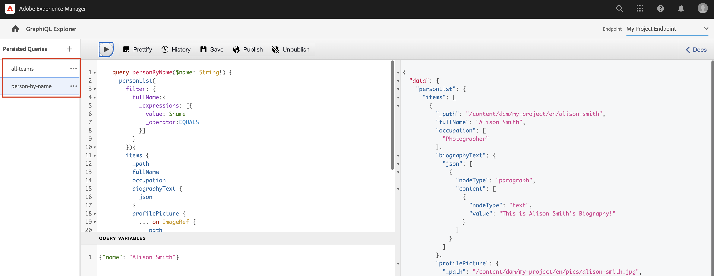

# Explorar APIs GraphQL {#explore-graphql-apis}

A API GraphQL do AEM fornece uma linguagem de consulta avançada para expor os dados dos Fragmentos de conteúdo aos aplicativos de downstream. Os modelos de Fragmento de conteúdo definem o schema de dados usado pelos Fragmentos de conteúdo. Sempre que um Modelo de fragmento de conteúdo é criado ou atualizado, o esquema é traduzido e adicionado ao &quot;gráfico&quot; que compõe a API GraphQL.

Neste capítulo, exploraremos algumas consultas GraphQL comuns para coletar conteúdo usando um IDE chamado [GraphiQL](https://github.com/graphql/graphiql). O GraphiQL IDE permite testar e refinar rapidamente as consultas e os dados retornados. O GraphiQL também oferece acesso fácil à documentação, facilitando o aprendizado e a compreensão de quais métodos estão disponíveis.

## Pré-requisitos {#prerequisites}

Este é um tutorial de várias partes e presume-se que as etapas descritas na seção [Criação de fragmentos de conteúdo](./author-content-fragments.md) foram concluídas.

## Objetivos {#objectives}

* Saiba como usar a ferramenta GraphiQL para criar uma consulta usando a sintaxe GraphQL.
* Saiba como consultar uma lista de Fragmentos de conteúdo e um único Fragmento de conteúdo.
* Saiba como filtrar e solicitar atributos de dados específicos.
* Saiba como associar-se a uma consulta de vários modelos de Fragmento de conteúdo
* Saiba como Persistir consulta GraphQL.

## Habilitar endpoint GraphQL {#enable-graphql-endpoint}

É necessário configurar um ponto de extremidade GraphQL para ativar consultas de API GraphQL para Fragmentos de conteúdo.

1. Na tela inicial AEM, acesse **Ferramentas** > **Geral** > **GraphQL**.

   

1. Toque **Criar** no canto superior direito. Na caixa de diálogo, digite os seguintes valores:

   * Nome*: **Ponto de Extremidade do Meu Projeto**.
   * Use o esquema GraphQL fornecido por ... *: **Meu projeto**

   

   Toque **Criar** para salvar o terminal.

   Os pontos de extremidade GraphQL criados com base em uma configuração de projeto só permitirão consultas em relação a modelos pertencentes a esse projeto. Nesse caso, os únicos queries em relação à variável **Pessoa** e **Equipe** podem ser usados.

   >[!NOTE]
   >
   > Um endpoint Global também pode ser criado para permitir consultas contra modelos em várias configurações. Isso deve ser usado com cautela, pois pode abrir o ambiente para vulnerabilidades de segurança adicionais e aumentar a complexidade geral no gerenciamento de AEM.

1. Agora você deve ver um ponto de extremidade GraphQL habilitado no seu ambiente.

   

## Uso do GraphiQL IDE

O [Ferramenta GraphiQL](https://experienceleague.adobe.com/docs/experience-manager-cloud-service/content/headless/graphql-api/graphiql-ide.html) permite que os desenvolvedores criem e testem consultas contra conteúdo no ambiente de AEM atual. A ferramenta GraphiQL também permite que os usuários **persist** ou salvar consultas a serem usadas por aplicativos clientes em uma configuração de produção.

Em seguida, explore o potencial da API GraphQL AEM usando o GraphiQL IDE integrado.

1. Na tela inicial AEM, acesse **Ferramentas** > **Geral** > **Editor de consultas GraphQL**.

   

   >[!NOTE]
   >
   > Para versões mais antigas do AEM o GraphiQL IDE pode não ser incorporado. Ele pode ser instalado manualmente seguindo estes [instruções](#install-graphiql).

1. No canto superior direito, verifique se o **Endpoint** está definida como **Ponto de Extremidade do Meu Projeto**.

   

Isso abrangerá todas as consultas a modelos criados no **Meu projeto** projeto.

### Consultar uma lista de fragmentos de conteúdo {#query-list-cf}

Um requisito comum será consultar vários Fragmentos de conteúdo.

1. Cole o seguinte query no painel principal (substituindo a lista de comentários):

   ```graphql
   query allTeams {
     teamList {
       items {
         _path
         title
       }
     }
   } 
   ```

1. Pressione a tecla **Reproduzir** no menu superior para executar a query. Você deve ver os resultados dos fragmentos de conteúdo do capítulo anterior:

   

1. Posicione o cursor abaixo do `title` texto e insira **CTRL+Espaço** para acionar a dica de código. Adicionar `shortname` e `description` à query.

   

1. Execute o query novamente pressionando a tecla **Reproduzir** e você deverá ver os resultados incluindo as propriedades adicionais de `shortname` e `description`.

   

   O `shortname` é uma propriedade simples e `description` é um campo de texto de várias linhas e a API GraphQL permite escolher diversos formatos para os resultados, como `html`, `markdown`, `json` ou `plaintext`.

### Consulta de fragmentos aninhados

Em seguida, experimentar com querying é recuperar fragmentos aninhados, lembrar que a variável **Equipe** O modelo faz referência ao **Pessoa** modelo.

1. Atualize a consulta para incluir a variável `teamMembers` propriedade. Lembre-se de que isso é um **Referência do fragmento** para o Modelo da pessoa. As propriedades do modelo Pessoa podem ser retornadas:

   ```graphql
   query allTeams {
       teamList {
           items {
               _path
               title
               shortName
               description {
                   plaintext
               }
               teamMembers {
                   fullName
                   occupation
               }
           }
       }
   }
   ```

   Resposta JSON:

   ```json
   {
       "data": {
           "teamList": {
           "items": [
               {
               "_path": "/content/dam/my-project/en/team-alpha",
               "title": "Team Alpha",
               "shortName": "team-alpha",
               "description": {
                   "plaintext": "This is a description of Team Alpha!"
               },
               "teamMembers": [
                   {
                   "fullName": "John Doe",
                   "occupation": [
                       "Artist",
                       "Influencer"
                   ]
                   },
                   {
                   "fullName": "Alison Smith",
                   "occupation": [
                       "Photographer"
                   ]
                   }
                 ]
           }
           ]
           }
       }
   }
   ```

   A capacidade de consultar fragmentos aninhados é poderosa para a API GraphQL AEM. Neste exemplo simples, o aninhamento tem apenas dois níveis de profundidade. No entanto, é possível aninhar fragmentos ainda mais. Por exemplo, se houver um **Endereço** modelo associado a **Pessoa** seria possível retornar dados de todos os três modelos em uma única query.

### Filtrar uma lista de fragmentos de conteúdo {#filter-list-cf}

Em seguida, vamos examinar como é possível filtrar os resultados para um subconjunto de Fragmentos de conteúdo com base em um valor de propriedade.

1. Insira a seguinte query na interface do usuário GraphiQL:

   ```graphql
   query personByName($name:String!){
     personList(
       filter:{
         fullName:{
           _expressions:[{
             value:$name
             _operator:EQUALS
           }]
         }
       }
     ){
       items{
         _path
         fullName
         occupation
       }
     }
   }  
   ```

   A consulta acima executa uma pesquisa em relação a todos os fragmentos de Pessoa no sistema. O filtro adicionado ao início do query executará uma comparação no `name` e a string da variável `$name`.

1. No **Variáveis de consulta** painel insira o seguinte:

   ```json
   {"name": "John Doe"}
   ```

1. Execute o query, é esperado que somente **Pessoas** será retornado com o valor &quot;John Doe&quot;.

   

   Há muitas outras opções para filtrar e criar consultas complexas. consulte [Saiba como usar GraphQL com AEM - Conteúdo de amostra e consultas](https://experienceleague.adobe.com/docs/experience-manager-cloud-service/assets/admin/content-fragments-graphql-samples.html?lang=pt-BR).

1. Aprimorar a consulta acima para obter a imagem do perfil

   ```graphql
   query personByName($name:String!){
     personList(
       filter:{
         fullName:{
           _expressions:[{
             value:$name
             _operator:EQUALS
           }]
         }
       }
     ){
       items{  
         _path
         fullName
         occupation
         profilePicture{
           ... on ImageRef{
             _path
             _authorUrl
             _publishUrl
             height
             width
   
           }
         }
       }
     }
   } 
   ```

   O `profilePicture` é uma referência de conteúdo e deve ser uma imagem, portanto, incorporada `ImageRef` é usado. Isso nos permite solicitar dados adicionais sobre a imagem que está sendo referenciada, como a `width` e `height`.

### Consultar um único fragmento de conteúdo {#query-single-cf}

Também é possível consultar diretamente um único Fragmento de conteúdo. O conteúdo no AEM é armazenado de maneira hierárquica e o identificador exclusivo de um fragmento é baseado no caminho do fragmento.

1. Insira a seguinte query no editor GraphiQL:

   ```graphql
   query personByPath($path: String!) {
       personByPath(_path: $path) {
           item {
           fullName
           occupation
           }
       }
   }
   ```

1. Insira o seguinte para o **Variáveis de consulta**:

   ```json
   {"path": "/content/dam/my-project/en/alison-smith"}
   ```

1. Execute a query e observe que o único resultado é retornado.

## Consultas Persistentes {#persist-queries}

Quando um desenvolvedor estiver satisfeito com a consulta e os dados retornados, a próxima etapa será armazenar ou manter a consulta em AEM. [Consultas persistentes](https://experienceleague.adobe.com/docs/experience-manager-cloud-service/content/headless/graphql-api/persisted-queries.html) é o mecanismo preferido para expor a API GraphQL aos aplicativos cliente. Depois que um query é persistente, ele pode ser solicitado usando uma solicitação GET e armazenado em cache nas camadas do Dispatcher e CDN. O desempenho de consultas persistentes é muito melhor. Além dos benefícios de desempenho, as consultas persistentes garantem que dados extras não sejam expostos acidentalmente aos aplicativos clientes. Mais detalhes sobre [Consultas persistentes podem ser encontradas aqui](https://experienceleague.adobe.com/docs/experience-manager-cloud-service/content/headless/graphql-api/persisted-queries.html).

Em seguida, persiste dois queries simples, eles serão usados no próximo capítulo.

1. No GraphiQL IDE, insira a seguinte consulta:

   ```graphql
   query allTeams {
       teamList {
           items {
               _path
               title
               shortName
               description {
                   plaintext
               }
               teamMembers {
                   fullName
                   occupation
               }
           }
       }
   }
   ```

   Verifique se a consulta funciona.

1. Próximo toque **Salvar como** e insira `all-teams` como **Nome da consulta**.

   A query agora deve ser mostrada em **Consultas Persistentes** no painel esquerdo.

   
1. Próximo toque nas elipses **...** ao lado da consulta persistente e toque em **Copiar URL** para copiar o caminho para a área de transferência.

   

1. Abra uma nova guia e cole o caminho copiado em seu navegador:

   ```plain
   https://$YOUR-AEMasCS-INSTANCEID$.adobeaemcloud.com/graphql/execute.json/my-project/all-teams
   ```

   Deve ser semelhante ao caminho acima. Você deve ver os resultados JSON da consulta retornada.

   Detalhando o URL:

   | Nome | Descrição |
   | ---------|---------- |
   | `/graphql/execute.json` | Ponto de extremidade de consulta persistente |
   | `/my-project` | Configuração do projeto para `/conf/my-project` |
   | `/all-teams` | Nome da consulta persistente |

1. Volte para o GraphiQL IDE e use o botão de adição **+** para manter a consulta NEW

   ```graphql
   query personByName($name: String!) {
     personList(
       filter: {
         fullName:{
           _expressions: [{
             value: $name
             _operator:EQUALS
           }]
         }
       }){
       items {
         _path
         fullName
         occupation
         biographyText {
           json
         }
         profilePicture {
           ... on ImageRef {
             _path
             _authorUrl
             _publishUrl
             width
             height
           }
         }
       }
     }
   }
   ```

1. Salve a consulta como: **pessoa por nome**.
1. Você deve ter 2 consultas persistentes salvas:

   


## Publicar ponto de extremidade GraphQL e consultas persistentes

Após análise e verificação, publique o `GraphQL Endpoint` &amp; `Persisted Queries`

1. Na tela inicial AEM, acesse **Ferramentas** > **Geral** > **GraphQL**.

1. Toque na caixa de seleção ao lado de **Ponto de Extremidade do Meu Projeto** e tocar **Publicar**

   

1. Na tela inicial AEM, acesse **Ferramentas** > **Geral** > **Editor de consultas GraphQL**

1. Toque no *todas as equipes* no painel Consultas persistentes e toque em **Publicar**

   

1. Repita a etapa acima para `person-by-name` query

## Arquivos de solução {#solution-files}

Baixe o conteúdo, os modelos e as consultas persistentes criadas nos últimos três capítulos: [tutorial-solution-content.zip](assets/explore-graphql-api/tutorial-solution-content.zip)

## Recursos adicionais

Para obter mais exemplos de consultas GraphQL, consulte: [Saiba como usar GraphQL com AEM - Conteúdo de amostra e consultas](https://experienceleague.adobe.com/docs/experience-manager-cloud-service/assets/admin/content-fragments-graphql-samples.html).

## Parabéns.  {#congratulations}

Parabéns, você acabou de criar e executar várias consultas GraphQL!

## Próximas etapas {#next-steps}

No próximo capítulo, [Criar aplicativo React](./graphql-and-react-app.md), você explorará como um aplicativo externo pode consultar AEM pontos de extremidade GraphQL e aproveitar essas duas consultas persistentes. Você também será apresentado a algum tratamento básico de erros.

## Instalação da ferramenta GraphiQL (opcional) {#install-graphiql}

Para algumas versões do AEM a ferramenta GraphiQL IDE precisa ser instalada manualmente. Siga as instruções abaixo para instalar manualmente:

1. Navegue até o **[Portal de distribuição de software](https://experience.adobe.com/#/downloads/content/software-distribution/en/aemcloud.html)** > **AEM as a Cloud Service**.
1. Pesquise por &quot;GraphiQL&quot; (não deixe de incluir o **i** em **GraphiQL**.
1. Baixe a versão mais recente do **pacote de conteúdo GraphiQL v.x.x.x**

   

   O arquivo zip é um pacote AEM que pode ser instalado diretamente.

1. No menu de **Início do AEM**, navegue até **Ferramentas** > **Implantação** > **Pacotes**.
1. Clique em **Fazer upload do pacote** e escolha o pacote baixado na etapa anterior. Clique em **Instalar** para instalar o pacote.

   
