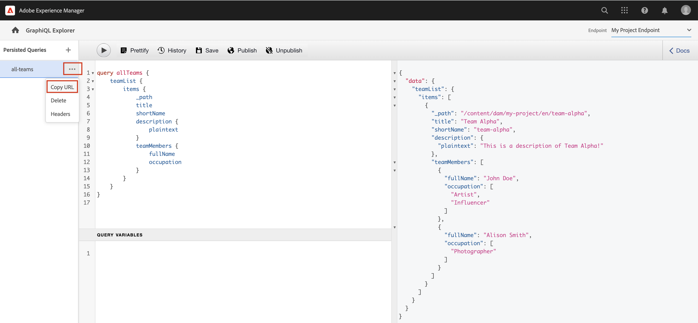

# Explorar APIs do GraphQL {#explore-graphql-apis}

A API do GraphQL do AEM fornece uma linguagem de consulta poderosa para expor dados de Fragmentos de conteúdo para aplicativos downstream. Os modelos de Fragmento de conteúdo definem o esquema de dados usado pelos Fragmentos de conteúdo. Sempre que um modelo de fragmento de conteúdo é criado ou atualizado, o esquema é traduzido e adicionado ao &quot;gráfico&quot; que compõe a API do GraphQL.

Neste capítulo, vamos explorar algumas consultas comuns do GraphQL para coletar conteúdo usando um IDE chamado [GraphiQL](https://github.com/graphql/graphiql). O GraphiQL IDE permite testar e refinar rapidamente as consultas e os dados retornados. Ele também fornece acesso fácil à documentação, facilitando o aprendizado e a compreensão de quais métodos estão disponíveis.

## Pré-requisitos {#prerequisites}

Este é um tutorial em várias partes e presume-se que as etapas descritas no [Criação de fragmentos de conteúdo](./author-content-fragments.md) foram concluídas.

## Objetivos {#objectives}

* Saiba como usar a ferramenta GraphiQL para criar uma consulta usando a sintaxe do GraphQL.
* Saiba como consultar uma lista de fragmentos de conteúdo e um único fragmento de conteúdo.
* Saiba como filtrar e solicitar atributos de dados específicos.
* Saiba como unir uma consulta de vários modelos de Fragmento de conteúdo
* Saiba como criar uma consulta persistente do GraphQL.

## Habilitar endpoint GraphQL {#enable-graphql-endpoint}

Um endpoint do GraphQL deve ser configurado para habilitar consultas da API do GraphQL para Fragmentos de conteúdo.

1. Na tela inicial do AEM, acesse **Ferramentas** > **Geral** > **GraphQL**.

   

1. Toque **Criar** no canto superior direito, na caixa de diálogo resultante, insira os seguintes valores:

   * Nome*: **Meu Ponto de Extremidade de Projeto**.
   * Use o esquema do GraphQL fornecido por ... *: **Meu projeto**

   

   Toque **Criar** para salvar o endpoint.

   Os endpoints do GraphQL criados com base em uma configuração de projeto só permitem consultas em modelos que pertencem a esse projeto. Nesse caso, as únicas consultas em relação ao **Person** e **Equipe** podem ser usados.

   >[!NOTE]
   >
   > Um endpoint global também pode ser criado para permitir consultas em modelos de várias configurações. Isso deve ser usado com cuidado, pois pode gerar vulnerabilidades de segurança adicionais no ambiente e aumentar a complexidade geral no gerenciamento do AEM.

1. Agora você deve ver um endpoint do GraphQL habilitado no seu ambiente.

   

## Uso do GraphiQL IDE

A variável [GraphiQL](https://experienceleague.adobe.com/docs/experience-manager-cloud-service/content/headless/graphql-api/graphiql-ide.html) A ferramenta permite que os desenvolvedores criem e testem consultas em relação ao conteúdo no ambiente AEM atual. A ferramenta GraphiQL também permite que os usuários **persistir ou salvar** consultas a serem usadas por aplicativos clientes em uma configuração de produção.

Em seguida, explore o poder da API GraphQL do AEM usando o IDE GraphiQL integrado.

1. Na tela inicial do AEM, acesse **Ferramentas** > **Geral** > **Editor de consultas GraphQL**.

   

   >[!NOTE]
   >
   > No, as versões mais antigas do AEM no GraphiQL IDE podem não ser incorporadas. Ele pode ser instalado manualmente seguindo esses [instruções](#install-graphiql).

1. No canto superior direito, verifique se a Extremidade está definida como **Meu Ponto de Extremidade de Projeto**.

   

Isso determinará o escopo de todas as consultas para modelos criados na **Meu projeto** projeto.

### Consultar uma lista de fragmentos de conteúdo {#query-list-cf}

Um requisito comum é consultar vários fragmentos de conteúdo.

1. Cole a seguinte consulta no painel principal (substituindo a lista de comentários):

   ```graphql
   query allTeams {
     teamList {
       items {
         _path
         title
       }
     }
   } 
   ```

1. Pressione a **Reproduzir** no menu superior para executar a consulta. Você deve ver os resultados dos fragmentos de conteúdo do capítulo anterior:

   

1. Posicione o cursor abaixo do `title` text e enter **CTRL+Espaço** para acionar referências de código. Adicionar `shortname` e `description` à consulta.

   

1. Execute o query novamente pressionando o **Reproduzir** e você verá que os resultados incluem as propriedades adicionais de `shortname` e `description`.

   

   A variável `shortname` é uma propriedade simples e `description` é um campo de texto multilinha e a API do GraphQL permite escolher vários formatos para os resultados, como `html`, `markdown`, `json`ou `plaintext`.

### Consulta de fragmentos aninhados

Em seguida, o experimento com a consulta é recuperar fragmentos aninhados, lembre-se de que a variável **Equipe** o modelo faz referência ao **Person** modelo.

1. Atualize a consulta para incluir a `teamMembers` propriedade. Lembre-se de que este é um **Referência do fragmento** ao Modelo de pessoa. As propriedades do modelo de Pessoa podem ser retornadas:

   ```graphql
   query allTeams {
       teamList {
           items {
               _path
               title
               shortName
               description {
                   plaintext
               }
               teamMembers {
                   fullName
                   occupation
               }
           }
       }
   }
   ```

   Resposta JSON:

   ```json
   {
       "data": {
           "teamList": {
           "items": [
               {
               "_path": "/content/dam/my-project/en/team-alpha",
               "title": "Team Alpha",
               "shortName": "team-alpha",
               "description": {
                   "plaintext": "This is a description of Team Alpha!"
               },
               "teamMembers": [
                   {
                   "fullName": "John Doe",
                   "occupation": [
                       "Artist",
                       "Influencer"
                   ]
                   },
                   {
                   "fullName": "Alison Smith",
                   "occupation": [
                       "Photographer"
                   ]
                   }
                 ]
           }
           ]
           }
       }
   }
   ```

   A capacidade de consultar em fragmentos aninhados é um recurso eficiente da API GraphQL do AEM. Neste exemplo simples, o aninhamento tem apenas dois níveis de profundidade. No entanto, é possível aninhar fragmentos ainda mais. Por exemplo, se houver uma variável **Endereço** modelo associado a um **Person** seria possível retornar dados de todos os três modelos em um único query.

### Filtrar uma lista de fragmentos de conteúdo {#filter-list-cf}

Em seguida, vamos analisar como é possível filtrar os resultados para um subconjunto de Fragmentos de conteúdo com base em um valor de propriedade.

1. Insira a seguinte consulta na interface do GraphiQL:

   ```graphql
   query personByName($name:String!){
     personList(
       filter:{
         fullName:{
           _expressions:[{
             value:$name
             _operator:EQUALS
           }]
         }
       }
     ){
       items{
         _path
         fullName
         occupation
       }
     }
   }  
   ```

   A consulta acima executa uma pesquisa em relação a todos os fragmentos de Pessoa no sistema. O filtro adicionado ao início do query executa uma comparação no `name` e a string da variável `$name`.

1. No **Variáveis de consulta** insira o seguinte:

   ```json
   {"name": "John Doe"}
   ```

1. Execute a query, espera-se que somente **Pessoas** O fragmento de conteúdo é retornado com um valor de `John Doe`.

   

   Há muitas outras opções para filtrar e criar consultas complexas, consulte [Saiba como usar o GraphQL com AEM - Exemplos de conteúdo e consultas](https://experienceleague.adobe.com/docs/experience-manager-cloud-service/content/headless/graphql-api/sample-queries.html).

1. Aprimorar a consulta acima para obter a foto do perfil

   ```graphql
   query personByName($name:String!){
     personList(
       filter:{
         fullName:{
           _expressions:[{
             value:$name
             _operator:EQUALS
           }]
         }
       }
     ){
       items{  
         _path
         fullName
         occupation
         profilePicture{
           ... on ImageRef{
             _path
             _authorUrl
             _publishUrl
             height
             width
   
           }
         }
       }
     }
   } 
   ```

   A variável `profilePicture` é uma referência de conteúdo e espera-se que seja uma imagem, portanto, incorporada `ImageRef` objeto é usado. Isso nos permite solicitar dados adicionais sobre a imagem que está sendo referenciada, como `width` e `height`.

### Consultar um único fragmento de conteúdo {#query-single-cf}

Também é possível consultar diretamente um único Fragmento do conteúdo. O conteúdo no AEM é armazenado em uma forma hierárquica e o identificador exclusivo de um fragmento se baseia no caminho do fragmento.

1. Insira a seguinte consulta no editor de GraphiQL:

   ```graphql
   query personByPath($path: String!) {
       personByPath(_path: $path) {
           item {
           fullName
           occupation
           }
       }
   }
   ```

1. Insira o seguinte para o **Variáveis de consulta**:

   ```json
   {"path": "/content/dam/my-project/en/alison-smith"}
   ```

1. Execute a consulta e observe que o único resultado é retornado.

## Consultas persistentes {#persist-queries}

Quando um desenvolvedor estiver satisfeito com a consulta e os dados de resultado retornados, a próxima etapa é armazenar ou persistir a consulta para AEM. A variável [Consultas persistentes](https://experienceleague.adobe.com/docs/experience-manager-cloud-service/content/headless/graphql-api/persisted-queries.html) são o mecanismo preferido para expor a API do GraphQL aos aplicativos clientes. Depois que uma consulta for persistente, ela poderá ser solicitada usando uma solicitação do GET e armazenada em cache nas camadas do Dispatcher e do CDN. O desempenho das consultas persistentes é muito melhor. Além dos benefícios de desempenho, as consultas persistentes garantem que os dados extras não sejam expostos acidentalmente aos aplicativos clientes. Mais detalhes sobre [Consultas persistentes podem ser encontradas aqui](https://experienceleague.adobe.com/docs/experience-manager-cloud-service/content/headless/graphql-api/persisted-queries.html).

Em seguida, se as duas consultas simples persistirem, elas serão usadas no próximo capítulo.

1. Insira a seguinte consulta no GraphiQL IDE:

   ```graphql
   query allTeams {
       teamList {
           items {
               _path
               title
               shortName
               description {
                   plaintext
               }
               teamMembers {
                   fullName
                   occupation
               }
           }
       }
   }
   ```

   Verifique se o query funciona.

1. Próximo toque **Salvar como** e insira `all-teams` como o **Nome da consulta**.

   A consulta deve ser mostrada em **Consultas persistentes** no painel esquerdo.

   
1. Próximo toque nas reticências **..** ao lado da consulta persistente e toque em **Copiar URL** para copiar o caminho para a área de transferência.

   

1. Abra uma nova guia e cole o caminho copiado no navegador:

   ```plain
   https://$YOUR-AEMasCS-INSTANCEID$.adobeaemcloud.com/graphql/execute.json/my-project/all-teams
   ```

   Deve ser semelhante ao caminho acima. Você deve ver que os resultados JSON da consulta retornaram.

   Analisando o URL acima:

   | Nome | Descrição |
   | ---------|---------- |
   | `/graphql/execute.json` | Ponto de acesso da consulta persistente |
   | `/my-project` | Configuração de projeto para `/conf/my-project` |
   | `/all-teams` | Nome da consulta persistente |

1. Retorne ao GraphiQL IDE e use o botão de adição **+** para criar uma consulta persistente NEW

   ```graphql
   query personByName($name: String!) {
     personList(
       filter: {
         fullName:{
           _expressions: [{
             value: $name
             _operator:EQUALS
           }]
         }
       }){
       items {
         _path
         fullName
         occupation
         biographyText {
           json
         }
         profilePicture {
           ... on ImageRef {
             _path
             _authorUrl
             _publishUrl
             width
             height
           }
         }
       }
     }
   }
   ```

1. Salve a consulta como: `person-by-name`.
1. Você deve ter duas consultas persistentes salvas:

   


## Publicar endpoint do GraphQL e consultas persistentes

Após revisão e verificação, publicar o `GraphQL Endpoint` &amp; `Persisted Queries`

1. Na tela inicial do AEM, acesse **Ferramentas** > **Geral** > **GraphQL**.

1. Toque na caixa de seleção ao lado de **Meu Ponto de Extremidade de Projeto** e toque em **Publish**

   

1. Na tela inicial do AEM, acesse **Ferramentas** > **Geral** > **Editor de consultas GraphQL**

1. Toque no **todas as equipes** consulte no painel Consultas persistentes e toque em **Publish**

   

1. Repita a etapa acima para `person-by-name` query

## Arquivos de solução {#solution-files}

Baixe o conteúdo, os modelos e as consultas persistentes criadas nos últimos três capítulos: [basic-tutorial-solution.content.zip](assets/explore-graphql-api/basic-tutorial-solution.content.zip)

## Recursos adicionais

Saiba mais sobre as consultas do GraphQL em [Saiba como usar o GraphQL com AEM - Exemplos de conteúdo e consultas](https://experienceleague.adobe.com/docs/experience-manager-cloud-service/content/headless/graphql-api/sample-queries.html).

## Parabéns. {#congratulations}

Parabéns, você criou e executou várias consultas do GraphQL.

## Próximas etapas {#next-steps}

No próximo capítulo, [Criar aplicativo React](./graphql-and-react-app.md), você explora como um aplicativo externo pode consultar endpoints do AEM GraphQL e usar essas duas consultas persistentes. Você também está familiarizado com o tratamento básico de erros durante a execução de consultas do GraphQL.

## Instalar a ferramenta GraphiQL (opcional) {#install-graphiql}

No, algumas versões do AEM (6.X.X) da ferramenta GraphiQL IDE precisam ser instaladas manualmente, use o [instruções aqui](../how-to/install-graphiql-aem-6-5.md).

