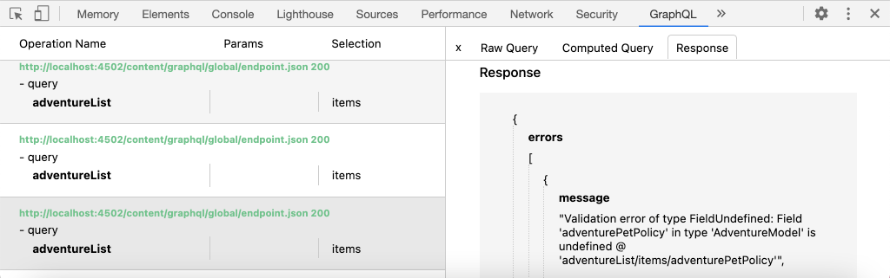

# Consultar AEM usando GraphQL de um aplicativo externo

Neste capítulo, exploramos como AEM APIs GraphQL podem ser usadas para impulsionar a experiência em um aplicativo externo.

Este tutorial usa um aplicativo React simples para consultar e exibir conteúdo de Aventura exposto por APIs GraphQL AEM. O uso do React não é, em grande medida, importante e a aplicação externa de consumo poderia ser escrita em qualquer estrutura para qualquer plataforma.

## Pré-requisitos

Este é um tutorial com várias partes e presume-se que as etapas descritas nas partes anteriores foram concluídas.

_As capturas de tela do IDE neste capítulo vêm do Código do  [Visual Studio](https://code.visualstudio.com/)_

Como opção, instale uma extensão de navegador como [GraphQL Network Inspetor](https://chrome.google.com/webstore/detail/graphql-network-inspector/ndlbedplllcgconngcnfmkadhokfaaln) para poder exibir mais detalhes sobre uma consulta GraphQL.

## Objetivos

Neste capítulo, aprenderemos a:

* Comece e entenda a funcionalidade do aplicativo React de amostra
* Explore como as chamadas são feitas do aplicativo externo para AEM pontos finais GraphQL
* Definir uma consulta GraphQL para filtrar uma lista de Fragmentos de conteúdo de aventuras por atividade
* Atualize o React app para fornecer controles para filtrar via GraphQL, a lista de aventuras por atividade

## Inicie o aplicativo React

Como este capítulo se concentra no desenvolvimento de um cliente para consumir Fragmentos de Conteúdo em GraphQL, a amostra do [Código de origem do aplicativo GraphQL WKND deve ser baixada e configurada](./setup.md#react-app) no computador local, e o [AEM SDK está sendo executado como o serviço de Autor](./setup.md#aem-sdk) com o [Site WKND de amostra instalado](./setup.md#wknd-site).

A inicialização do aplicativo React é descrita com mais detalhes no capítulo [Quick Setup](./setup.md), no entanto, as instruções resumidas podem ser seguidas:

1. Caso ainda não o tenha feito, clone o aplicativo WKND GraphQL React de [Github.com](https://github.com/adobe/aem-guides-wknd-graphql) de amostra

   ```shell
   $ git clone --branch tutorial/react git@github.com:adobe/aem-guides-wknd-graphql.git
   ```

1. Abra o aplicativo WKND GraphQL React no IDE

   

1. Na linha de comando, navegue até a pasta `react-app`
1. Inicie o aplicativo WKND GraphQL React, executando o seguinte comando da raiz do projeto (a pasta `react-app`)

   ```shell
   $ cd aem-guides-wknd-graphql/react-app
   $ npm start
   ```

1. Revise o aplicativo em [http://localhost:3000/](http://localhost:3000/). O aplicativo React de amostra tem duas partes principais:

   * A experiência residencial atua como um índice de Aventuras WKND, consultando __Aventura__ Fragmentos de Conteúdo em AEM usando GraphQL. Neste capítulo, modificaremos essa visualização para suportar a filtragem de aventuras por atividade.

      

   * A experiência de detalhes da aventura usa GraphQL para consultar o __Fragmento de conteúdo__ da Aventura e exibe mais pontos de dados.

      

1. Use as ferramentas de desenvolvimento do navegador e uma extensão do navegador como [GraphQL Network Inspetor](https://chrome.google.com/webstore/detail/graphql-network-inspector/ndlbedplllcgconngcnfmkadhokfaaln) para inspecionar as consultas GraphQL enviadas ao AEM e suas respostas JSON. Essa abordagem pode ser usada para monitorar solicitações e respostas GraphQL para garantir que elas sejam formuladas corretamente e suas respostas estejam conforme o esperado.

   

   *Consulta GraphQL enviada ao AEM do aplicativo React*

   

   *Resposta JSON do AEM para o aplicativo React*

   As consultas e a resposta devem corresponder ao que foi visto no GraphiQL IDE.

   >[!NOTE]
   >
   > Durante o desenvolvimento, o aplicativo React é configurado para proxy de solicitações HTTP por meio do servidor de desenvolvimento do webpack para AEM. O aplicativo React está fazendo solicitações para `http://localhost:3000` que as envia por proxy para o serviço de Autor do AEM em execução em `http://localhost:4502`. Revise o arquivo `src/setupProxy.js` e `env.development` para obter detalhes.
   >
   > Em cenários que não são de desenvolvimento, o aplicativo React seria configurado diretamente para fazer solicitações ao AEM.

## Explore o código GraphQL do aplicativo

1. No IDE, abra o arquivo `src/api/useGraphQL.js`.

   Este é um [React Effect Hook](https://reactjs.org/docs/hooks-overview.html#effect-hook) que escuta alterações no `query` do aplicativo e, quando altera, faz uma solicitação HTTP POST ao ponto final GraphQL da AEM e retorna a resposta JSON ao aplicativo.

   Sempre que o aplicativo React precisar fazer uma consulta GraphQL, ele chama esse gancho `useGraphQL(query)` personalizado, passando pelo GraphQL para enviar ao AEM.

   Este Gancho usa o módulo simples `fetch` para fazer a solicitação HTTP POST GraphQL, mas outros módulos como o [cliente Apollo GraphQL](https://www.apollographql.com/docs/react/) podem ser usados de forma semelhante.

1. Abra `src/components/Adventures.js` no IDE, que é responsável pela listagem de aventuras da exibição inicial, e revise a invocação do gancho `useGraphQL`.

   Esse código define o `query` padrão para ser o `allAdventuresQuery` conforme definido mais abaixo neste arquivo.

   ```javascript
   const [query, setQuery] = useState(allAdventuresQuery);
   ```

   ... e sempre que a variável `query` for alterada, o gancho `useGraphQL` será chamado, que por sua vez executa a consulta GraphQL em relação ao AEM, retornando o JSON para a variável `data`, que é usada para renderizar a lista de aventuras.

   ```javascript
   const { data, errorMessage } = useGraphQL(query);
   ```

   O `allAdventuresQuery` é uma consulta GraphQL constante definida no arquivo, que consulta todos os Fragmentos de Conteúdo da Adventure, sem filtragem, e retorna somente os pontos de dados precisam renderizar a visualização inicial.

   ```javascript
   const allAdventuresQuery = `
   {
       adventureList {
         items {
           _path
           adventureTitle
           adventurePrice
           adventureTripLength
           adventurePrimaryImage {
           ... on ImageRef {
               _path
               mimeType
               width
               height
             }
           }
         }
     }
   }
   `;
   ```

1. Abra `src/components/AdventureDetail.js`, o componente React responsável pela exibição da experiência de detalhes da aventura. Essa exibição solicita um Fragmento do conteúdo específico, usando seu caminho JCR como sua id exclusiva e renderiza os detalhes fornecidos.

   De maneira semelhante a `Adventures.js`, o React Hook personalizado `useGraphQL` é reutilizado para executar a consulta GraphQL em relação ao AEM.

   O caminho do Fragmento de conteúdo é coletado da parte superior do componente `props` para ser usado na especificação do Fragmento de conteúdo para o qual consultar.

   ```javascript
   const contentFragmentPath = props.location.pathname.substring(props.match.url.length);
   ```

   ... e a consulta parametrizada GraphQL é construída usando a função `adventureDetailQuery(..)` e passada para `useGraphQL(query)`, que executa a consulta GraphQL em relação a AEM e retorna os resultados para a variável `data`.

   ```javascript
   const { data, errorMessage } = useGraphQL(adventureDetailQuery(contentFragmentPath));
   ```

   A função `adventureDetailQuery(..)` simplesmente envolve uma consulta GraphQL de filtragem, que usa AEM sintaxe `<modelName>ByPath` para consultar um único Fragmento de conteúdo identificado por seu caminho JCR, e retorna todos os pontos de dados especificados necessários para renderizar os detalhes da aventura.

   ```javascript
   function adventureDetailQuery(_path) {
   return `{
       adventureByPath (_path: "${_path}") {
         item {
           _path
           adventureTitle
           adventureActivity
           adventureType
           adventurePrice
           adventureTripLength
           adventureGroupSize
           adventureDifficulty
           adventurePrice
           adventurePrimaryImage {
               ... on ImageRef {
               _path
               mimeType
               width
               height
               }
           }
           adventureDescription {
               html
           }
           adventureItinerary {
               html
           }
         }
       }
   }
   `;
   }
   ```

## Criar uma consulta GraphQL parametrizada

Em seguida, vamos modificar o aplicativo React para realizar consultas GraphQL parametrizadas, que restringem a visualização inicial pela atividade das aventuras.

1. No IDE, abra o arquivo : `src/components/Adventures.js`. Esse arquivo representa o componente de aventuras da experiência inicial, que consulta e exibe os cartões de Aventuras.
1. Inspect a função `filterQuery(activity)`, que não é usada, mas foi preparada para formular uma consulta GraphQL que filtra aventuras por `activity`.

   Observe que o parâmetro `activity` é inserido na consulta GraphQL como parte de `filter` no campo `adventureActivity`, exigindo que o valor desse campo corresponda ao valor do parâmetro.

   ```javascript
   function filterQuery(activity) {
       return `
           {
           adventures (filter: {
               adventureActivity: {
               _expressions: [
                   {
                   value: "${activity}"
                   }
                 ]
               }
           }){
               items {
               _path
               adventureTitle
               adventurePrice
               adventureTripLength
               adventurePrimaryImage {
               ... on ImageRef {
                   _path
                   mimeType
                   width
                   height
               }
               }
             }
         }
       }
       `;
   }
   ```

1. Atualize a instrução `return` do componente React Adventures para adicionar botões que chamam o novo `filterQuery(activity)` parametrizado para fornecer as aventuras a serem listadas.

   ```javascript
   function Adventures() {
       ...
       return (
           <div className="adventures">
   
           {/* Add these three new buttons that set the GraphQL query accordingly */}
   
           {/* The first button uses the default `allAdventuresQuery` */}
           <button onClick={() => setQuery(allAdventuresQuery)}>All</button>
   
           {/* The 2nd and 3rd button use the `filterQuery(..)` to filter by activity */}
           <button onClick={() => setQuery(filterQuery('Camping'))}>Camping</button>
           <button onClick={() => setQuery(filterQuery('Surfing'))}>Surfing</button>
   
           <ul className="adventure-items">
           ...
       )
   }
   ```

1. Salve as alterações e recarregue o aplicativo React no navegador da Web. Os três novos botões aparecem na parte superior e o clique neles faz uma nova consulta automaticamente AEM Fragmentos de conteúdo do Adventure com a atividade correspondente.

   

1. Tente adicionar mais botões de filtragem para as atividades: `Rock Climbing`, `Cycling` e `Skiing`

## Gerenciar erros de GraphQL

GraphQL é altamente digitado e, portanto, pode retornar mensagens de erro úteis se a consulta for inválida. Em seguida, vamos simular uma consulta incorreta para ver a mensagem de erro retornada.

1. Abra novamente o arquivo `src/api/useGraphQL.js`. Inspect o seguinte trecho para ver o tratamento de erros:

   ```javascript
   //useGraphQL.js
   .then(({data, errors}) => {
           //If there are errors in the response set the error message
           if(errors) {
               setErrors(mapErrors(errors));
           }
           //Otherwise if data in the response set the data as the results
           if(data) {
               setData(data);
           }
       })
       .catch((error) => {
           setErrors(error);
       });
   ```

   A resposta é inspecionada para ver se inclui um objeto `errors`. O objeto `errors` será enviado por AEM se houver problemas com a consulta GraphQL, como um campo indefinido com base no esquema. Se não houver nenhum objeto `errors`, `data` será definido e retornado.

   O `window.fetch` inclui uma instrução `.catch` para *catch* qualquer erro comum, como uma solicitação HTTP inválida ou se a conexão com o servidor não puder ser feita.

1. Abra o arquivo `src/components/Adventures.js`.
1. Modifique o `allAdventuresQuery` para incluir uma propriedade inválida `adventurePetPolicy`:

   ```javascript
   /**
    * Query for all Adventures
    * adventurePetPolicy has been added beneath items
   */
   const allAdventuresQuery = `
   {
       adventureList {
         items {
           adventurePetPolicy
           _path
           adventureTitle
           adventurePrice
           adventureTripLength
           adventurePrimaryImage {
           ... on ImageRef {
               _path
               mimeType
               width
               height
           }
           }
         }
       }
   }
   `;
   ```

   Sabemos que `adventurePetPolicy` não faz parte do modelo Adventure, portanto, isso deve acionar um erro.

1. Salve as alterações e retorne ao navegador. Você deve ver uma mensagem de erro como a seguinte:

   

   A API GraphQL detecta que `adventurePetPolicy` está indefinido no `AdventureModel` e retorna uma mensagem de erro apropriada.

1. Inspect a resposta de AEM usando as ferramentas de desenvolvedor do navegador para ver o objeto JSON `errors`:

   

   O objeto `errors` é detalhado e inclui informações sobre o local da consulta malformada e a classificação do erro.

1. Retorne para `Adventures.js` e reverta a alteração de consulta para retornar o aplicativo ao seu estado adequado.

## Parabéns!{#congratulations}

Parabéns! Você explorou com sucesso o código do aplicativo WKND GraphQL React da amostra e o atualizou para o uso de consultas GraphQL com parâmetros filtrados e parametrizadas para listar aventuras por atividade! Você também tem a oportunidade de explorar algumas práticas básicas de tratamento de erros.

## Próximas etapas {#next-steps}

No próximo capítulo, [Modelagem de dados avançada com Referências de fragmento](./fragment-references.md) você aprenderá como usar o recurso Referência de fragmento para criar uma relação entre dois Fragmentos de conteúdo diferentes. Você também aprenderá a modificar uma consulta GraphQL para incluir um campo de um modelo referenciado.
