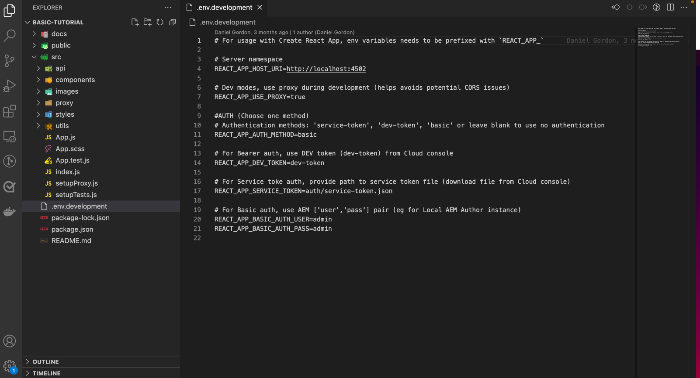

# Criar um aplicativo React que use APIs AEM GraphQL

Neste capítulo, você explora como as APIs do AEM GraphQL podem impulsionar a experiência em um aplicativo externo.

Um aplicativo React simples é usado para query e exibição **Equipe** e **Person** conteúdo exposto por APIs do GraphQL AEM. O uso do React não é muito importante, e o aplicativo externo de consumo poderia ser escrito em qualquer estrutura para qualquer plataforma.

## Pré-requisitos

Pressupõe-se que as etapas descritas nas partes anteriores deste tutorial de várias partes foram concluídas ou [basic-tutorial-solution.content.zip](assets/explore-graphql-api/basic-tutorial-solution.content.zip) O está instalado nos serviços de Autor e Publicação as a Cloud Service do AEM.

_As capturas de tela do IDE neste capítulo vêm de [Código do Visual Studio](https://code.visualstudio.com/)_

Os softwares a seguir devem ser instalados:

- [Node.js v18](https://nodejs.org/en)
- [Código do Visual Studio](https://code.visualstudio.com/)

## Objetivos

Saiba como:

- Baixe e inicie o aplicativo React de exemplo
- Consulte pontos de extremidade do GraphQL com AEM usando o [SDK JS do AEM Headless](https://github.com/adobe/aem-headless-client-js)
- Consultar AEM para obter uma lista de equipes e seus membros referenciados
- Consultar AEM para obter detalhes de um membro da equipe

## Obter a amostra do aplicativo React

Neste capítulo, um aplicativo React de amostra teimoso é implementado com o código necessário para interagir com a API do AEM GraphQL e exibir os dados de equipe e pessoa obtidos a partir dele.

O exemplo de código-fonte do aplicativo React está disponível em Github.com em <https://github.com/adobe/aem-guides-wknd-graphql/tree/main/basic-tutorial>

Para obter o aplicativo React:

1. Clonar o aplicativo WKND GraphQL React de amostra de [Github.com](https://github.com/adobe/aem-guides-wknd-graphql).

   ```shell
   $ cd ~/Code
   $ git clone git@github.com:adobe/aem-guides-wknd-graphql.git
   ```

1. Navegue até `basic-tutorial` e abra-a no IDE.

   ```shell
   $ cd ~/Code/aem-guides-wknd-graphql/basic-tutorial
   $ code .
   ```

   

1. Atualizar `.env.development` para se conectar ao serviço de Publicação do AEM as a Cloud Service.

   - Definir `REACT_APP_HOST_URI`O valor de para ser o URL de publicação do AEM as a Cloud Service (por exemplo, `REACT_APP_HOST_URI=https://publish-p123-e456.adobeaemcloud.com`) e `REACT_APP_AUTH_METHOD`do valor para `none`

   >[!NOTE]
   >
   > Verifique se você publicou a configuração do projeto, os modelos de fragmento de conteúdo, os fragmentos de conteúdo criados, os endpoints do GraphQL e as consultas persistentes das etapas anteriores.
   >
   > Se você executou as etapas acima no SDK do autor do AEM local, é possível apontar para `http://localhost:4502` e `REACT_APP_AUTH_METHOD`do valor para `basic`.


1. Na linha de comando, vá para a guia `aem-guides-wknd-graphql/basic-tutorial` pasta

1. Iniciar o aplicativo React

   ```shell
   $ cd ~/Code/aem-guides-wknd-graphql/basic-tutorial
   $ npm install
   $ npm start
   ```

1. O aplicativo React é iniciado no modo de desenvolvimento em [http://localhost:3000/](http://localhost:3000/). As alterações feitas no aplicativo React em todo o tutorial são refletidas imediatamente.


>[!IMPORTANT]
>
>   Este aplicativo React está parcialmente implementado. Siga as etapas deste tutorial para concluir a implementação. Os arquivos JavaScript que precisam de trabalho de implementação têm o seguinte comentário: adicione/atualize o código nesses arquivos com o código especificado neste tutorial.
>
>
> //*******************************
>
>  // TODO :: Implemente isso seguindo as etapas do Tutorial AEM Headless
>
>  //*********************************
>

## Anatomia do aplicativo React

A amostra do aplicativo React tem três partes principais:

1. A variável `src/api` a pasta contém arquivos usados para fazer consultas do GraphQL ao AEM.
   - `src/api/aemHeadlessClient.js` inicializa e exporta o cliente AEM headless usado para se comunicar com AEM
   - `src/api/usePersistedQueries.js` implementa [ganchos personalizados do React](https://react.dev/learn/reusing-logic-with-custom-hooks#custom-hooks-sharing-logic-between-components) retornar dados do AEM GraphQL para o `Teams.js` e `Person.js` exibir componentes.

1. A variável `src/components/Teams.js` arquivo exibe uma lista de equipes e seus membros usando uma consulta de lista.
1. A variável `src/components/Person.js` arquivo exibe os detalhes de uma única pessoa, usando uma consulta parametrizada de resultado único.

## Revisar o objeto AEMHeadless

Revise o `aemHeadlessClient.js` arquivo para saber como criar o `AEMHeadless` objeto usado para se comunicar com o AEM.

1. Abrir `src/api/aemHeadlessClient.js`.

1. Revise as linhas 1-40:

   - A importação `AEMHeadless` declaração da [Cliente AEM Headless para JavaScript](https://github.com/adobe/aem-headless-client-js), linha 11.

   - A configuração da autorização com base nas variáveis definidas no `.env.development`, linha 14-22, e, a expressão de função de seta `setAuthorization`, linha 31-40.

   - A variável `serviceUrl` configuração para o incluído [proxy de desenvolvimento](https://github.com/adobe/aem-guides-wknd-graphql/tree/main/react-app#proxy-api-requests) configuração, linha 27.

1. linhas 42-49, são as mais importantes, uma vez que instanciam a `AEMHeadless` cliente e exporte-o para uso no aplicativo React.

```javascript
// Initialize the AEM Headless Client and export it for other files to use
const aemHeadlessClient = new AEMHeadless({
  serviceURL: serviceURL,
  endpoint: REACT_APP_GRAPHQL_ENDPOINT,
  auth: setAuthorization(),
});

export default aemHeadlessClient;
```

## Implementar para executar consultas persistentes do AEM GraphQL

Para implementar o genérico `fetchPersistedQuery(..)` para executar as consultas persistentes do GraphQL no AEM, abra a `usePersistedQueries.js` arquivo. A variável `fetchPersistedQuery(..)` A função usa o `aemHeadlessClient` do objeto `runPersistedQuery()` função para executar a consulta de forma assíncrona, comportamento baseado em promessa.

Posteriormente, o React personalizado `useEffect` O hook chama essa função para recuperar dados específicos do AEM.

1. Entrada `src/api/usePersistedQueries.js` **atualizar** `fetchPersistedQuery(..)`, linha 35, com o código abaixo.

```javascript
/**
 * Private, shared function that invokes the AEM Headless client.
 *
 * @param {String} persistedQueryName the fully qualified name of the persisted query
 * @param {*} queryParameters an optional JavaScript object containing query parameters
 * @returns the GraphQL data or an error message
 */
async function fetchPersistedQuery(persistedQueryName, queryParameters) {
  let data;
  let err;

  try {
    // AEM GraphQL queries are asynchronous, either await their return or use Promise-based syntax
    const response = await aemHeadlessClient.runPersistedQuery(
      persistedQueryName,
      queryParameters
    );
    // The GraphQL data is stored on the response's data field
    data = response?.data;
  } catch (e) {
    // An error occurred, return the error messages
    err = e
      .toJSON()
      ?.map((error) => error.message)
      ?.join(", ");
    console.error(e.toJSON());
  }

  // Return the GraphQL and any errors
  return { data, err };
}
```

## Implementar a funcionalidade Equipes

Em seguida, crie a funcionalidade para exibir as Equipes e seus membros na visualização principal do aplicativo React. Essa funcionalidade exige:

- Um novo [personalizado React useEffect gancho](https://react.dev/reference/react/useEffect#useeffect) in `src/api/usePersistedQueries.js` que invoca o `my-project/all-teams` consulta persistente, retornando uma lista de Fragmentos de conteúdo da equipe no AEM.
- Um componente do React em `src/components/Teams.js` que invoca o novo React personalizado `useEffect` e renderiza os dados das equipes.

Uma vez concluída, a visualização principal do aplicativo é preenchida com os dados das equipes do AEM.


### Etapas

1. Abrir `src/api/usePersistedQueries.js`.

1. Localize a função `useAllTeams()`

1. Para criar um `useEffect` gancho que invoca a consulta persistente `my-project/all-teams` via `fetchPersistedQuery(..)`, adicione o código a seguir. O gancho também retorna apenas os dados relevantes da resposta do AEM GraphQL em `data?.teamList?.items`, permitindo que os componentes de visualização do React sejam agnósticos das estruturas JSON principais.

   ```javascript
   /**
    * Custom hook that calls the 'my-project/all-teams' persisted query.
    *
    * @returns an array of Team JSON objects, and array of errors
    */
   export function useAllTeams() {
     const [teams, setTeams] = useState(null);
     const [error, setError] = useState(null);
   
     // Use React useEffect to manage state changes
     useEffect(() => {
       async function fetchData() {
         // Call the AEM GraphQL persisted query named "my-project/all-teams"
         const { data, err } = await fetchPersistedQuery(
           "my-project/all-teams"
         );
         // Sets the teams variable to the list of team JSON objects
         setTeams(data?.teamList?.items);
         // Set any errors
         setError(err);
       }
       // Call the internal fetchData() as per React best practices
       fetchData();
     }, []);
   
     // Returns the teams and errors
     return { teams, error };
   }
   ```

1. Abrir `src/components/Teams.js`

1. No `Teams` Componente do React, obtenha a lista de equipes do AEM usando o `useAllTeams()` gancho.

   ```javascript
   import { useAllTeams } from "../api/usePersistedQueries";
   ...
   function Teams() {
     // Get the Teams data from AEM using the useAllTeams
     const { teams, error } = useAllTeams();
     ...
   }
   ```


1. Execute a validação de dados com base em visualização, exibindo uma mensagem de erro ou indicador de carregamento com base nos dados retornados.

   ```javascript
   function Teams() {
     const { teams, error } = useAllTeams();
   
     // Handle error and loading conditions
     if (error) {
       // If an error ocurred while executing the GraphQL query, display an error message
       return <Error errorMessage={error} />;
     } else if (!teams) {
       // While the GraphQL request is executing, show the Loading indicator
       return <Loading />;
     }
     ...
   }
   ```

1. Por fim, renderize os dados das equipes. Cada equipe retornada da consulta do GraphQL é renderizada usando o método fornecido `Team` Subcomponente do React.

   ```javascript
   import React from "react";
   import { Link } from "react-router-dom";
   import { useAllTeams } from "../api/usePersistedQueries";
   import Error from "./Error";
   import Loading from "./Loading";
   import "./Teams.scss";
   
   function Teams() {
     const { teams, error } = useAllTeams();
   
     // Handle error and loading conditions
     if (error) {
       return <Error errorMessage={error} />;
     } else if (!teams) {
       return <Loading />;
     }
   
     // Teams have been populated by AEM GraphQL query. Display the teams.
     return (
       <div className="teams">
         {teams.map((team, index) => {
           return <Team key={index} {...team} />;
         })}
       </div>
     );
   }
   
   // Render single Team
   function Team({ title, shortName, description, teamMembers }) {
     // Must have title, shortName and at least 1 team member
     if (!title || !shortName || !teamMembers) {
       return null;
     }
   
     return (
       <div className="team">
         <h2 className="team__title">{title}</h2>
         <p className="team__description">{description.plaintext}</p>
         <div>
           <h4 className="team__members-title">Members</h4>
           <ul className="team__members">
             {/* Render the referenced Person models associated with the team */}
             {teamMembers.map((teamMember, index) => {
               return (
                 <li key={index} className="team__member">
                   <Link to={`/person/${teamMember.fullName}`}>
                     {teamMember.fullName}
                   </Link>
                 </li>
               );
             })}
           </ul>
         </div>
       </div>
     );
   }
   
   export default Teams;
   ```


## Implementar a funcionalidade Pessoa

Com o [Funcionalidade de equipes](#implement-teams-functionality) completa, vamos implementar a funcionalidade para lidar com a exibição dos detalhes de um membro da equipe ou pessoa.

Essa funcionalidade exige:

- Um novo [personalizado React useEffect gancho](https://react.dev/reference/react/useEffect#useeffect) in `src/api/usePersistedQueries.js` que invoca o parâmetro `my-project/person-by-name` consulta persistente e retorna um único registro de pessoa.

- Um componente do React em `src/components/Person.js` que usa o nome completo de uma pessoa como um parâmetro de consulta, invoca o novo React personalizado `useEffect` e renderiza os dados da pessoa.

Uma vez concluída, selecionar o nome de uma pessoa na exibição Equipes renderiza a exibição de pessoa.


1. Abrir `src/api/usePersistedQueries.js`.

1. Localize a função `usePersonByName(fullName)`

1. Para criar um `useEffect` gancho que invoca a consulta persistente `my-project/all-teams` via `fetchPersistedQuery(..)`, adicione o código a seguir. O gancho também retorna apenas os dados relevantes da resposta do AEM GraphQL em `data?.teamList?.items`, permitindo que os componentes de visualização do React sejam agnósticos das estruturas JSON principais.

   ```javascript
   /**
    * Calls the 'my-project/person-by-name' and provided the {fullName} as the persisted query's `name` parameter.
    *
    * @param {String!} fullName the full
    * @returns a JSON object representing the person
    */
   export function usePersonByName(fullName) {
     const [person, setPerson] = useState(null);
     const [errors, setErrors] = useState(null);
   
     useEffect(() => {
       async function fetchData() {
         // The key is the variable name as defined in the persisted query, and may not match the model's field name
         const queryParameters = { name: fullName };
   
         // Invoke the persisted query, and pass in the queryParameters object as the 2nd parameter
         const { data, err } = await fetchPersistedQuery(
           "my-project/person-by-name",
           queryParameters
         );
   
         if (err) {
           // Capture errors from the HTTP request
           setErrors(err);
         } else if (data?.personList?.items?.length === 1) {
           // Set the person data after data validation
           setPerson(data.personList.items[0]);
         } else {
           // Set an error if no person could be found
           setErrors(`Cannot find person with name: ${fullName}`);
         }
       }
       fetchData();
     }, [fullName]);
   
     return { person, errors };
   }
   ```

1. Abrir `src/components/Person.js`
1. No `Person` Componente do React, analise o `fullName` parâmetro de rota e obtenha os dados da pessoa do AEM usando o `usePersonByName(fullName)` gancho.

   ```javascript
   import { useParams } from "react-router-dom";
   import { usePersonByName } from "../api/usePersistedQueries";
   ...
   function Person() {
     // Read the person's `fullName` which is the parameter used to query for the person's details
     const { fullName } = useParams();
   
     // Query AEM for the Person's details, using the `fullName` as the filtering parameter
     const { person, error } = usePersonByName(fullName);
     ...
   }
   ```

1. Execute a validação de dados com base em visualização, exibindo uma mensagem de erro ou indicador de carregamento com base nos dados retornados.

   ```javascript
   function Person() {
     // Read the person's `fullName` which is the parameter used to query for the person's details
     const { fullName } = useParams();
   
     // Query AEM for the Person's details, using the `fullName` as the filtering parameter
     const { person, error } = usePersonByName(fullName);
   
     // Handle error and loading conditions
     if (error) {
       return <Error errorMessage={error} />;
     } else if (!person) {
       return <Loading />;
     }
     ...
   }
   ```

1. Por fim, renderize os dados da pessoa.

   ```javascript
   import React from "react";
   import { useParams } from "react-router-dom";
   import { usePersonByName } from "../api/usePersistedQueries";
   import { mapJsonRichText } from "../utils/renderRichText";
   import Error from "./Error";
   import Loading from "./Loading";
   import "./Person.scss";
   
   function Person() {
     // Read the person's `fullName` which is the parameter used to query for the person's details
     const { fullName } = useParams();
   
     // Query AEM for the Person's details, using the `fullName` as the filtering parameter
     const { person, error } = usePersonByName(fullName);
   
     // Handle error and loading conditions
     if (error) {
       return <Error errorMessage={error} />;
     } else if (!person) {
       return <Loading />;
     }
   
     // Render the person data
     return (
       <div className="person">
         
         <div className="person__occupations">
           {person.occupation.map((occupation, index) => {
             return (
               <span key={index} className="person__occupation">
                 {occupation}
               </span>
             );
           })}
         </div>
         <div className="person__content">
           <h1 className="person__full-name">{person.fullName}</h1>
           <div className="person__biography">
             {/* Use this utility to transform multi-line text JSON into HTML */}
             {mapJsonRichText(person.biographyText.json)}
           </div>
         </div>
       </div>
     );
   }
   
   export default Person;
   ```

## Experimente o aplicativo

Analisar o aplicativo [http://localhost:3000/](http://localhost:3000/) e clique em _Membros_ links. Você também pode adicionar mais equipes e/ ou membros à Equipe Alfa adicionando Fragmentos de conteúdo no AEM.

## Debaixo da tampa

Abra o navegador do **Ferramentas do desenvolvedor** > **Rede** e _Filtro_ para `all-teams` solicitação. Observe a solicitação da API do GraphQL `/graphql/execute.json/my-project/all-teams` é feita contra `http://localhost:3000` e **NOT** contra o valor de `REACT_APP_HOST_URI` (por exemplo, <https://publish-p123-e456.adobeaemcloud.com>). As solicitações são feitas no domínio do aplicativo React porque [configuração de proxy](https://create-react-app.dev/docs/proxying-api-requests-in-development/#configuring-the-proxy-manually) é ativado usando `http-proxy-middleware` módulo.


Revise o principal `../setupProxy.js` arquivo e em `../proxy/setupProxy.auth.**.js` os arquivos observam como `/content` e `/graphql` os caminhos são encaminhados por proxy e indicam que não é um ativo estático.

```javascript
module.exports = function(app) {
  app.use(
    ['/content', '/graphql'],
  ...
```

O uso do proxy local não é uma opção adequada para implantação de produção, e mais detalhes podem ser encontrados em _Implantação de produção_ seção.

## Parabéns!{#congratulations}

Parabéns! Você criou com sucesso o aplicativo React para consumir e exibir dados de APIs AEM GraphQL como parte de um tutorial básico!
