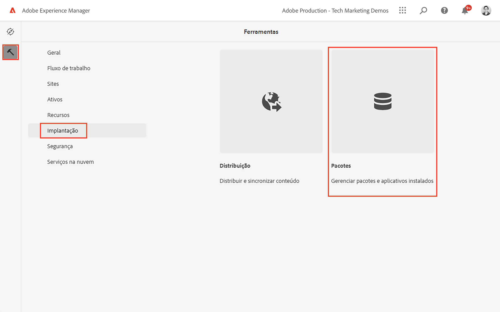
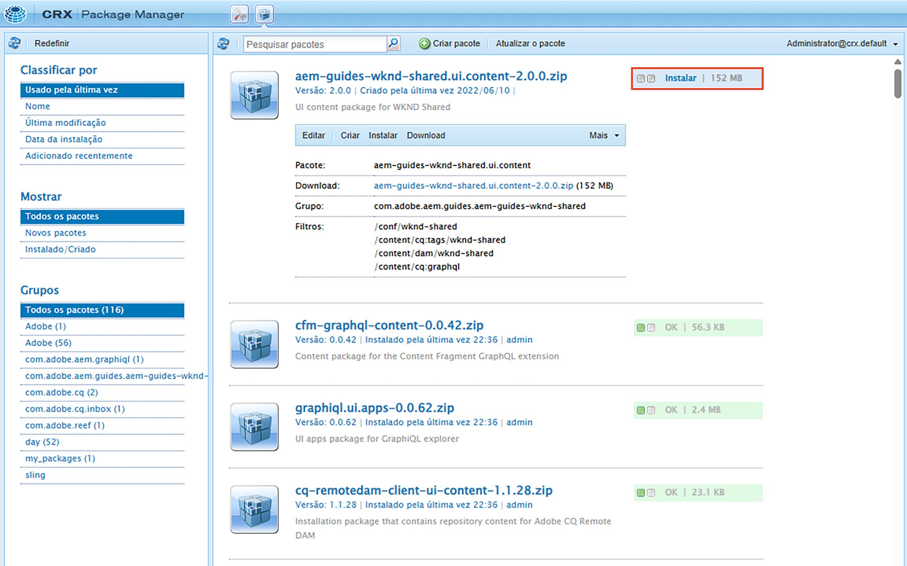

# Introdução ao AEM Headless - GraphQL

Um tutorial completo que ilustra como criar e expor conteúdo usando APIs GraphQL AEM consumidas por um aplicativo externo, em um cenário de CMS sem periféricos.

Este tutorial explica como AEM APIs GraphQL e recursos sem periféricos podem ser usados para potencializar as experiências encontradas em um aplicativo externo.

Este tutorial abordará os seguintes tópicos:

* Criar uma nova configuração de projeto
* Criar novos modelos de fragmento de conteúdo para modelar dados
* Crie novos Fragmentos de conteúdo com base nos modelos feitos anteriormente.
* Explore como os Fragmentos de conteúdo no AEM podem ser consultados usando a ferramenta de desenvolvimento GraphiQL integrada.
* Para armazenar ou manter as consultas GraphQL no AEM
* Consumir consultas GraphQL persistentes de um aplicativo React de amostra

## Pré-requisitos {#prerequisites}

Os seguintes itens são necessários para seguir este tutorial:

* Habilidades básicas de HTML e JavaScript
* As seguintes ferramentas devem ser instaladas localmente:
   * [Node.js v10+](https://nodejs.org/en/)
   * [npm 6+](https://www.npmjs.com/)
   * [Git](https://git-scm.com/)
   * Um IDE (por exemplo, [Código Microsoft® Visual Studio](https://code.visualstudio.com/))

### Ambiente AEM

Um ambiente Adobe Experience Manager é necessário para concluir este tutorial. É possível usar qualquer um dos seguintes itens (capturas de tela são registradas de um ambiente AEM as a Cloud Service):

* AEM ambiente as a Cloud Service com:
   * [Acesso ao AEM as a Cloud Service e ao Cloud Manager](/help/cloud-service/accessing/overview.md)
      * **Administrador AEM** acesso a AEM as a Cloud Service
      * **Cloud Manager - Desenvolvedor** acesso ao Cloud Manager

### Instalar conteúdo de amostra {#install-sample-content}

Pode ser útil ter conteúdo de amostra já disponível no ambiente de AEM para ser usado como referência.

1. Navegue até o [AEM Projeto compartilhado WKND](https://github.com/adobe/aem-guides-wknd-shared/releases).
1. Baixe o ativo lançado mais recente: `aem-guides-wknd-shared.ui.content-x.x.x.zip`.
1. Faça logon no ambiente de criação do AEM a ser usado para o tutorial.
1. Na tela inicial AEM, navegue até **Ferramentas** > **Implantação** > **Pacotes**:

   

1. Toque **Fazer upload do pacote** e escolha a `aem-guides-wknd-shared.ui.content-x.x.x.zip` baixado anteriormente. Toque **Ok** para fazer upload.
1. Depois que o upload do pacote terminar, toque em **Instalar** para instalar o conteúdo.

   

1. Fragmentos de conteúdo de amostra, Modelos de fragmento de conteúdo, imagens e muito mais serão instalados para o fictício [Marca WKND](https://wknd.site/). O conteúdo de amostra será referenciado posteriormente no tutorial.

## Vamos começar!

1. Inicie o tutorial com [Definição dos modelos de fragmento do conteúdo](content-fragment-models.md).

## Projeto do GitHub

O código-fonte e os pacotes de conteúdo estão disponíveis na variável [Guias de AEM - Projeto GitHub GraphQL da WKND](https://github.com/adobe/aem-guides-wknd-graphql).

Se você encontrar um problema com o tutorial ou o código, deixe um [Problema do GitHub](https://github.com/adobe/aem-guides-wknd-graphql/issues).

Fragmentos de conteúdo de amostra, modelos e consultas podem ser encontrados na seção [AEM Projeto compartilhado WKND](https://github.com/adobe/aem-guides-wknd-shared)
