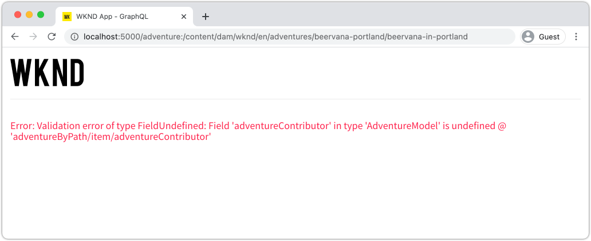

# Implantação de produção com um serviço de publicação do AEM

Neste tutorial, você definirá um ambiente local para simular o conteúdo que está sendo distribuído de uma instância de autor para uma instância de publicação. Você também gerará a criação de produção de um Aplicativo React configurado para consumir conteúdo do ambiente AEM Publish usando as APIs GraphQL. Ao longo do caminho, você aprenderá a usar variáveis de ambiente de maneira eficaz e a atualizar as configurações AEM CORS.

## Pré-requisitos

Este tutorial é parte de um tutorial de várias partes. Pressupõe-se que as etapas descritas nas partes anteriores foram concluídas.

## Objetivos

Saiba como:

* Entenda a arquitetura Autor e publicação do AEM.
* Conheça as práticas recomendadas para gerenciar variáveis de ambiente.
* Saiba como configurar corretamente o AEM para o CORS (Cross-Origin resource sharing).

## Padrão de implantação de publicação do autor {#deployment-pattern}

Um ambiente AEM completo é composto de um Autor, Publicação e Dispatcher. O serviço Autor é onde os usuários internos criam, gerenciam e visualizam o conteúdo. O serviço de Publicação é considerado o ambiente &quot;Ao vivo&quot; e normalmente é com o que os usuários finais interagem. O conteúdo, após ser editado e aprovado no serviço Autor, é distribuído ao serviço de Publicação.

O padrão de implantação mais comum com AEM aplicativos sem cabeçalho é ter a versão de produção do aplicativo conectada a um serviço de publicação do AEM.


O diagrama acima descreve esse padrão de implantação comum.

1. Um **Autor de conteúdo** usa o serviço de criação de AEM para criar, editar e gerenciar conteúdo.
2. O **Autor de conteúdo** e outros usuários internos podem visualizar o conteúdo diretamente no serviço Autor. É possível configurar uma versão de Visualização do aplicativo que se conecta ao serviço Autor.
3. Depois que o conteúdo é aprovado, ele pode ser **publicado** no serviço de publicação do AEM.
4. **Os** usuários finais interagem com a versão Produção do aplicativo. O aplicativo de Produção se conecta ao serviço de Publicação e usa as APIs GraphQL para solicitar e consumir conteúdo.

O tutorial simula a implantação acima adicionando uma instância de publicação do AEM à configuração atual. Em capítulos anteriores, o Aplicativo de reação agiu como uma visualização ao se conectar diretamente à instância do autor. Uma build de produção do aplicativo React será implantada em um servidor Node.js estático que se conecta à nova instância de publicação.

No final, três servidores locais serão executados:

* http://localhost:4502 - Instância do autor
* http://localhost:4503 - Instância de publicação
* http://localhost:5000 - React App em modo de produção, conectando à instância de publicação.

## Instalar AEM SDK - Modo de publicação {#aem-sdk-publish}

Atualmente, temos uma instância em execução do SDK no modo **Author**. O SDK também pode ser iniciado no modo **Publish** para simular um ambiente de publicação do AEM.

Um guia mais detalhado para configurar um ambiente de desenvolvimento local [pode ser encontrado aqui](https://experienceleague.adobe.com/docs/experience-manager-learn/cloud-service/local-development-environment-set-up/overview.html?lang=en#local-development-environment-set-up).

1. No sistema de arquivos local, crie uma pasta dedicada para instalar a instância de publicação, ou seja, `~/aem-sdk/publish`.
1. Copie o arquivo jar do Quickstart usado para a instância do Autor em capítulos anteriores e cole-o no diretório `publish`. Como alternativa, navegue até o [Portal de distribuição de software](https://experience.adobe.com/#/downloads/content/software-distribution/en/aemcloud.html) e baixe o SDK mais recente e extraia o arquivo jar do Quickstart.
1. Renomeie o arquivo jar para `aem-publish-p4503.jar`.

   A sequência de caracteres `publish` especifica que o jar do Quickstart começa no modo de Publicação. O `p4503` especifica que o servidor Quickstart é executado na porta 4503.

1. Abra uma nova janela do terminal e navegue até a pasta que contém o arquivo jar. Instale e inicie a instância de AEM:

   ```shell
   $ cd ~/aem-sdk/publish
   $ java -jar aem-publish-p4503.jar
   ```

1. Forneça uma senha de administrador como `admin`. Qualquer senha de administrador é aceitável, no entanto, é recomendável usar o padrão para desenvolvimento local para evitar configurações adicionais.
1. Quando a instância de AEM terminar de instalar, uma nova janela do navegador será aberta em [http://localhost:4503/content.html](http://localhost:4503/content.html)

   É esperado que retorne uma página 404 Not Found . Esta é uma instância de AEM totalmente nova e nenhum conteúdo foi instalado.

## Instalar conteúdo de amostra e pontos de extremidade GraphQL {#wknd-site-content-endpoints}

Assim como na instância Autor, a instância de Publicação precisa ter os pontos de extremidade GraphQL ativados e precisa de conteúdo de amostra. Em seguida, instale o site de referência WKND na instância de publicação.

1. Baixe o pacote de AEM compilado mais recente para o site WKND: [aem-guides-wknd.all-x.x.zip](https://github.com/adobe/aem-guides-wknd/releases/latest).

   >[!NOTE]
   >
   > Faça o download da versão padrão compatível com o AEM como Cloud Service e **not** a versão `classic`.

1. Faça logon na instância de publicação navegando diretamente para: [http://localhost:4503/libs/granite/core/content/login.html](http://localhost:4503/libs/granite/core/content/login.html) com o nome de usuário `admin` e a senha `admin`.
1. Em seguida, navegue até o Gerenciador de pacotes em [http://localhost:4503/crx/packmgr/index.jsp](http://localhost:4503/crx/packmgr/index.jsp).
1. Clique em **Upload Package** e escolha o pacote WKND baixado na etapa anterior. Clique em **Install** para instalar o pacote.
1. Depois de instalar o pacote, o site de referência WKND agora está disponível em [http://localhost:4503/content/wknd/us/en.html](http://localhost:4503/content/wknd/us/en.html).
1. Faça logoff como o usuário `admin` clicando no botão &quot;Sair&quot; na barra de menus.

   

   Diferentemente da instância do autor do AEM, as instâncias de Publicação do AEM assumem o padrão de acesso anônimo somente leitura. Queremos simular a experiência de um usuário anônimo ao executar o aplicativo React.

## Atualizar variáveis de Ambiente para apontar para a instância de publicação {#react-app-publish}

Em seguida, atualize as variáveis de ambiente usadas pelo aplicativo React para apontar para a instância de publicação. O aplicativo React deve **somente** se conectar à instância Publish no modo de produção.

Em seguida, adicione um novo arquivo `.env.production.local` para simular a experiência de produção.

1. Abra o aplicativo WKND GraphQL React no IDE.

1. Abaixo de `aem-guides-wknd-graphql/react-app`, adicione um arquivo chamado `.env.production.local`.
1. Preencha `.env.production.local` com o seguinte:

   ```plain
   REACT_APP_HOST_URI=http://localhost:4503
   REACT_APP_GRAPHQL_ENDPOINT=/content/graphql/global/endpoint.json
   ```

   

   O uso de variáveis de ambiente facilita a alternância do ponto de extremidade GraphQL entre um ambiente de Autor ou Publicação sem adicionar lógica extra dentro do código do aplicativo. Mais informações sobre [variáveis de ambiente personalizadas para o React podem ser encontradas aqui](https://create-react-app.dev/docs/adding-custom-environment-variables).

   >[!NOTE]
   >
   > Observe que nenhuma informação de autenticação é incluída, pois os ambientes de Publicação fornecem acesso anônimo ao conteúdo por padrão.

## Implantar um servidor Nó estático {#static-server}

O aplicativo React pode ser iniciado usando o servidor webpack, mas isso é somente para desenvolvimento. Em seguida, simule uma implantação de produção usando [serve](https://github.com/vercel/serve) para hospedar uma build de produção do aplicativo React usando Node.js.

1. Abra uma nova janela de terminal e navegue até o diretório `aem-guides-wknd-graphql/react-app`

   ```shell
   $ cd aem-guides-wknd-graphql/react-app
   ```

1. Instale [serve](https://github.com/vercel/serve) com o seguinte comando:

   ```shell
   $ npm install serve --save-dev
   ```

1. Abra o arquivo `package.json` em `react-app/package.json`. Adicione um script chamado `serve`:

   ```diff
    "scripts": {
       "start": "react-scripts start",
       "build": "react-scripts build",
       "test": "react-scripts test",
       "eject": "react-scripts eject",
   +   "serve": "npm run build && serve -s build"
   },
   ```

   O script `serve` executa duas ações. Primeiro, uma criação de produção do aplicativo React é gerada. Segundo, o servidor Node.js é iniciado e usa a build de produção.

1. Retorne ao terminal e insira o comando para iniciar o servidor estático:

   ```shell
   $ npm run serve
   
   ┌────────────────────────────────────────────────────┐
   │                                                    │
   │   Serving!                                         │
   │                                                    │
   │   - Local:            http://localhost:5000        │
   │   - On Your Network:  http://192.168.86.111:5000   │
   │                                                    │
   │   Copied local address to clipboard!               │
   │                                                    │
   └────────────────────────────────────────────────────┘
   ```

1. Abra um novo navegador e navegue até [http://localhost:5000/](http://localhost:5000/). Você deve ver o aplicativo React sendo exibido.

   

   Observe que o query GraphQL está funcionando na página inicial. Inspect a solicitação **XHR** usando as ferramentas do desenvolvedor. Observe que o POST GraphQL está na instância Publish em `http://localhost:4503/content/graphql/global/endpoint.json`.

   No entanto, todas as imagens estão quebradas na página inicial!

1. Clique em uma das páginas Detalhes da Aventura.

   

   Observe que um erro GraphQL é lançado para `adventureContributor`. Nos próximos exercícios, as imagens quebradas e os problemas `adventureContributor` são corrigidos.

## Referências de imagem absoluta {#absolute-image-references}

As imagens parecem quebradas porque o atributo ``:

   ```diff
   - 
   + 
   ```

1. Abra o arquivo `AdventureDetail.js` em `react-app/src/components/AdventureDetail.js`.
1. Repita as mesmas etapas para modificar a consulta GraphQL e adicionar a propriedade `_publishUrl` para a Aventura

   ```diff
    adventureByPath (_path: "${_path}") {
       item {
           _path
           adventureTitle
           adventureActivity
           adventureType
           adventurePrice
           adventureTripLength
           adventureGroupSize
           adventureDifficulty
           adventurePrice
           adventurePrimaryImage {
               ... on ImageRef {
               _path
   +           _publishUrl
               mimeType
               width
               height
               }
           }
           adventureDescription {
               html
           }
           adventureItinerary {
               html
           }
           adventureContributor {
               fullName
               occupation
               pictureReference {
                   ...on ImageRef {
                       _path
   +                   _publishUrl
                   }
               }
           }
       }
       }
   } 
   ```

1. Modifique as duas tags `` para a Imagem principal do Adventure e a referência Imagem do colaborador em `AdventureDetail.js`:

   ```diff
   /* AdventureDetail.js */
   ...
   
   ...
   pictureReference =  
   ```

1. Retorne ao terminal e inicie o servidor estático:

   ```shell
   $ npm run serve
   ```

1. Navegue até [http://localhost:5000/](http://localhost:5000/) e observe que as imagens são exibidas e que o atributo `` aponta para `http://localhost:4503`.

   

## Simular publicação de conteúdo {#content-publish}

Lembre-se de que um erro GraphQL é lançado para `adventureContributor` quando uma página Detalhes da Aventura é solicitada. O **Contributor** Modelo de fragmento de conteúdo ainda não existe na instância de publicação. As atualizações feitas no **Aventura** Modelo de fragmento de conteúdo também não estão disponíveis na instância Publicar . Essas alterações foram feitas diretamente na instância de autor e precisam ser distribuídas para a instância de publicação.

Isso é algo a ser considerado ao lançar novas atualizações em um aplicativo que depende de atualizações em um Fragmento de conteúdo ou um Modelo de fragmento de conteúdo.

Em seguida, permite simular a publicação de conteúdo entre as instâncias de Autor e Publicação local.

1. Inicie a instância do autor (se ainda não tiver sido iniciada) e navegue até o Gerenciador de pacotes em [http://localhost:4502/crx/packmgr/index.jsp](http://localhost:4502/crx/packmgr/index.jsp)
1. Baixe o pacote [EnableReplicationAgent.zip](./assets/publish-deployment/EnableReplicationAgent.zip) e instale-o usando o Gerenciador de Pacotes.

   Esse pacote instala uma configuração que permite à instância do autor publicar conteúdo na instância de publicação. As etapas manuais para [esta configuração pode ser encontrada aqui](https://experienceleague.adobe.com/docs/experience-manager-learn/cloud-service/local-development-environment-set-up/aem-runtime.html?lang=en#content-distribution).

   >[!NOTE]
   >
   > Em um ambiente AEM como Cloud Service, o nível Autor é configurado automaticamente para distribuir conteúdo no nível Publicação .

1. No menu **AEM Iniciar**, navegue até **Ferramentas** > **Ativos** > **Modelos de fragmento de conteúdo**.

1. Clique na pasta **Site WKND**.

1. Selecione todos os três modelos e clique em **Publicar**:

   

   Uma caixa de diálogo de confirmação é exibida, clique em **Publish**.

1. Navegue até o Fragmento de conteúdo do campo de pesquisa de Bali em [http://localhost:4502/editor.html/content/dam/wknd/en/adventures/bali-surf-camp/bali-surf-camp](http://localhost:4502/editor.html/content/dam/wknd/en/adventures/bali-surf-camp/bali-surf-camp).

1. Clique no botão **Publicar** na barra de menu superior.

   

1. O Assistente de publicação mostra todos os ativos dependentes que devem ser publicados. Nesse caso, o fragmento referenciado **stacey-roswells** é listado e várias imagens também são referenciadas. Os ativos referenciados são publicados junto com o fragmento.

   

   Clique no botão **Publicar** novamente para publicar o Fragmento de conteúdo e os ativos dependentes.

1. Retorne ao Aplicativo React em [http://localhost:5000/](http://localhost:5000/). Agora você pode clicar em Bali Surf Camp para ver os detalhes da aventura.

1. Volte para a instância do autor do AEM em [http://localhost:4502/editor.html/content/dam/wknd/en/adventures/bali-surf-camp/bali-surf-camp](http://localhost:4502/editor.html/content/dam/wknd/en/adventures/bali-surf-camp/bali-surf-camp) e atualize o **Título** do fragmento. **Salve e** feche o fragmento. Em seguida, **publique** o fragmento.
1. Retorne para [http://localhost:5000/adventure:/content/dam/wknd/en/adventures/bali-surf-camp/bali-surf-camp](http://localhost:5000/adventure:/content/dam/wknd/en/adventures/bali-surf-camp/bali-surf-camp) e observe as alterações publicadas.

   

## Atualizar configuração de CORs

AEM é seguro por padrão e não permite que propriedades da Web que não sejam AEM façam chamadas do lado do cliente. AEM configuração de CORS (Cross-Origin Resource Sharing, Compartilhamento de recursos de várias origens) pode permitir que domínios específicos façam chamadas para AEM.

Em seguida, experimente a configuração do CORS da instância de publicação do AEM.

1. Retorne à janela do terminal onde o Aplicativo de Reação está em execução com o comando `npm run serve`:

   ```shell
   ┌────────────────────────────────────────────────────┐
   │                                                    │
   │   Serving!                                         │
   │                                                    │
   │   - Local:            http://localhost:5000        │
   │   - On Your Network:  http://192.168.86.205:5000   │
   │                                                    │
   │   Copied local address to clipboard!               │
   │                                                    │
   └────────────────────────────────────────────────────┘
   ```

   Observe que dois URLs são fornecidos. Um usando `localhost` e outro usando o endereço IP da rede local.

1. Navegue até o endereço que começa com [http://192.168.86.XXX:5000](http://192.168.86.XXX:5000). O endereço será um pouco diferente para cada computador local. Observe que há um erro de CORS ao buscar os dados. Isso ocorre porque a configuração atual do CORS está permitindo somente solicitações de `localhost`.

   

   Em seguida, atualize a configuração do CORS de publicação do AEM para permitir solicitações do endereço IP de rede.

1. Navegue até [http://localhost:4503/content/wknd/us/en/errors/sign-in.html](http://localhost:4503/content/wknd/us/en/errors/sign-in.html) e faça logon com o nome de usuário `admin` e senha `admin`.

1. Navegue até [http://localhost:4503/system/console/configMgr](http://localhost:4503/system/console/configMgr) e localize a configuração WKND GraphQL em `com.adobe.granite.cors.impl.CORSPolicyImpl~wknd-graphql`.

1. Atualize o campo **Origens permitidas** para incluir o endereço IP da rede:

   

   Também é possível incluir uma expressão regular para permitir todas as solicitações de um subdomínio específico. Salve as alterações.

1. Procure por **Apache Sling Referrer Filter** e revise a configuração. A configuração **Permitir vazio** também é necessária para habilitar solicitações GraphQL de um domínio externo.

   

   Eles foram configurados como parte do site de referência WKND. Você pode visualizar o conjunto completo de configurações de OSGi por meio do [repositório GitHub](https://github.com/adobe/aem-guides-wknd/tree/master/ui.config/src/main/content/jcr_root/apps/wknd/osgiconfig).

   >[!NOTE]
   >
   > As configurações de OSGi são gerenciadas em um projeto AEM que é comprometido com o controle de origem. Um AEM Project pode ser implantado em ambientes AEM como Cloud Service usando o Cloud Manager. O [Arquétipo de Projeto AEM](https://github.com/adobe/aem-project-archetype) pode ajudar a gerar um projeto para uma implementação específica.

1. Retorne ao Aplicativo React a partir de [http://192.168.86.XXX:5000](http://192.168.86.XXX:5000) e observe que o aplicativo não lança mais um erro de CORS.

   

## Parabéns! {#congratulations}

Parabéns! Agora você simulou uma implantação de produção completa usando um ambiente de publicação do AEM. Você também aprendeu a usar a configuração do CORS no AEM.

## Outros recursos

Para obter mais detalhes sobre Fragmentos de conteúdo e GraphQL, consulte os seguintes recursos:

* [Entrega de conteúdo sem cabeçalho usando Fragmentos de conteúdo com GraphQL](https://experienceleague.adobe.com/docs/experience-manager-cloud-service/assets/content-fragments/content-fragments-graphql.html)
* [AEM API GraphQL para uso com Fragmentos de conteúdo](https://experienceleague.adobe.com/docs/experience-manager-cloud-service/assets/admin/graphql-api-content-fragments.html)
* [Autenticação baseada em token](https://experienceleague.adobe.com/docs/experience-manager-learn/getting-started-with-aem-headless/authentication/overview.html?lang=en#authentication)
* [Implantação do código no AEM como Cloud Service](https://experienceleague.adobe.com/docs/experience-manager-learn/cloud-service/cloud-manager/devops/deploy-code.html?lang=en#cloud-manager)
