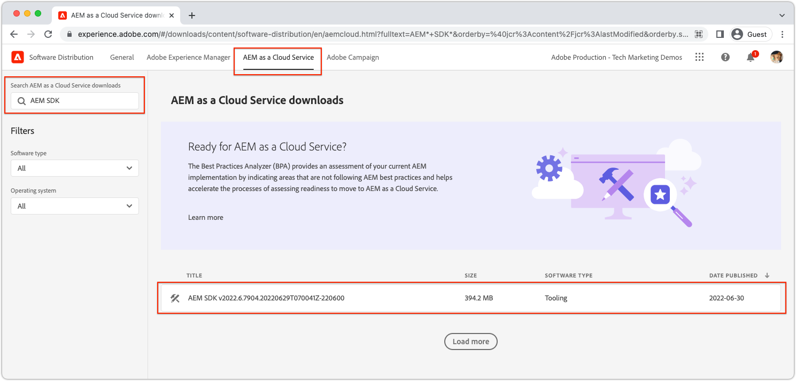

# Configuração rápida do AEM Headless usando o AEM SDK local {#setup}

A configuração rápida do AEM sem periféricos oferece uma abordagem prática do AEM sem periféricos usando conteúdo do projeto de amostra do WKND Site e uma amostra do aplicativo React (um SPA) que consome o conteúdo por meio das APIs do GraphQL do AEM sem periféricos. Este guia usa o [SDK AS A CLOUD SERVICE AEM](https://experienceleague.adobe.com/docs/experience-manager-cloud-service/content/implementing/developing/aem-as-a-cloud-service-sdk.html?lang=pt-BR).

## Pré-requisitos {#prerequisites}

As seguintes ferramentas devem ser instaladas localmente:

* [JDK 11](https://experience.adobe.com/#/downloads/content/software-distribution/en/general.html?1_group.propertyvalues.property=.%2Fjcr%3Acontent%2Fmetadata%2Fdc%3AsoftwareType&amp;1_group.propertyvalues.operation=equals&amp;1_group.propertyvalues.0_values=software-type%3Atooling&amp;fulltext=Oracle%7E+JDK%7E+11%7E&amp;orderby=%40jcr%3Acontent%2Fjcr%3AlastModified&amp;orderby.sort=desc&amp;layout=list&amp;p.offset=0&amp;p.limit=11)
* [Node.js v18](https://nodejs.org/en/)
* [Git](https://git-scm.com/)

## 1. Instalar o SDK do AEM {#aem-sdk}

Esta configuração usa o [SDK AS A CLOUD SERVICE AEM](https://experienceleague.adobe.com/docs/experience-manager-cloud-service/implementing/developing/aem-as-a-cloud-service-sdk.html?#aem-as-a-cloud-service-sdk) para explorar APIs AEM GraphQL. Esta seção fornece um guia rápido para instalar o SDK do AEM e executá-lo no modo Autor. Um guia mais detalhado para configurar um ambiente de desenvolvimento do local [pode ser encontrado aqui](https://experienceleague.adobe.com/docs/experience-manager-learn/cloud-service/local-development-environment-set-up/overview.html#local-development-environment-set-up).

>[!NOTE]
>
> Também é possível seguir o tutorial com um [Ambiente as a Cloud Service AEM](./cloud-service.md). Observações adicionais para usar um ambiente de nuvem são incluídas no tutorial.

1. Navegue até a **[Portal de distribuição de software](https://experience.adobe.com/#/downloads/content/software-distribution/en/aemcloud.html?fulltext=AEM*+SDK*&amp;orderby=%40jcr%3Acontent%2Fjcr%3AlastModified&amp;orderby.sort=desc&amp;layout=list&amp;p.offset=0&amp;p.limit=1)** > **AEM as a Cloud Service** e baixe a versão mais recente da **SDK do AEM**.

   

1. Descompacte o download e copie o jar de Início rápido (`aem-sdk-quickstart-XXX.jar`) para uma pasta dedicada, ou seja, `~/aem-sdk/author`.
1. Renomeie o arquivo jar para `aem-author-p4502.jar`.

   A variável `author` O nome especifica que o Quickstart jar inicia no modo Autor. A variável `p4502` especifica que o Quickstart é executado na porta 4502.

1. Para instalar e iniciar a instância do AEM, abra um prompt de comando na pasta que contém o arquivo jar e execute o seguinte comando:

   ```shell
   $ cd ~/aem-sdk/author
   $ java -jar aem-author-p4502.jar
   ```

1. Forneça uma senha de administrador como `admin`. Qualquer senha de administrador é aceitável, no entanto, é recomendável usar `admin` para que o desenvolvimento local reduza a necessidade de reconfiguração.
1. Quando o serviço AEM terminar de ser instalado, uma nova janela do navegador deverá abrir em [http://localhost:4502](http://localhost:4502).
1. Fazer logon com o nome de usuário `admin` e a senha selecionada durante a primeira inicialização do AEM (geralmente `admin`).

## 2. Instalar conteúdo de amostra {#install-sample-content}

Exemplo de conteúdo do **Site de referência da WKND** é usado para acelerar o tutorial. A WKND é uma marca fictícia de estilo de vida, geralmente usada com treinamento em AEM.

O site da WKND inclui as configurações necessárias para expor uma [endpoint do GraphQL](https://experienceleague.adobe.com/docs/experience-manager-cloud-service/content/headless/graphql-api/content-fragments.html). Em uma implementação real, siga as etapas documentadas para [incluir os endpoints do GraphQL](https://experienceleague.adobe.com/docs/experience-manager-cloud-service/content/headless/graphql-api/content-fragments.html) no projeto do cliente. A [CORS](#cors-config) O também foi empacotado como parte do Site WKND. Uma configuração do CORS é necessária para conceder acesso a um aplicativo externo, mais informações sobre [CORS](#cors-config) podem ser encontradas abaixo.

1. Baixe o pacote AEM compilado mais recente para o Site WKND: [aem-guides-wknd.all-x.x.x.zip](https://github.com/adobe/aem-guides-wknd/releases/latest).

   >[!NOTE]
   >
   > Certifique-se de baixar a versão padrão compatível com o AEM as a Cloud Service e **não** o `classic` versão.

1. No **Início do AEM** , navegue até **Ferramentas** > **Implantação** > **Pacotes**.

   

1. Clique em **Fazer upload do pacote** e escolha o pacote WKND baixado na etapa anterior. Clique em **Instalar** para instalar o pacote.

1. No **Início do AEM** , navegue até **Assets** > **Arquivos** > **WKND compartilhado** > **Inglês** > **Aventuras**.

   

   Esta é uma pasta de todos os ativos que compõem as várias Aventuras promovidas pela marca WKND. Isso inclui tipos de mídia tradicionais, como imagens e vídeos, e mídias específicas para AEM, como **Fragmentos de conteúdo**.

1. Clique em na **Downhill Skiing Wyoming** e clique no link **Fragmento de conteúdo de esqui downhill em Wyoming** cartão:

   

1. O editor de Fragmento de conteúdo abre para a aventura Downhill Skiing Wyoming.

   

   Observe que vários campos como **Título**, **Descrição**, e **Atividade** defina o fragmento.

   **Fragmentos de conteúdo** são uma das maneiras pelas quais o conteúdo pode ser gerenciado no AEM. Fragmento de conteúdo são conteúdos reutilizáveis e de apresentação independente, compostos de elementos de dados estruturados, como texto, rich text, datas ou referências a outros Fragmentos de conteúdo. Os fragmentos de conteúdo são explorados com mais detalhes posteriormente na configuração rápida.

1. Clique em **Cancelar** para fechar o fragmento. Sinta-se à vontade para navegar em algumas das outras pastas e explorar o outro conteúdo de aventura.

>[!NOTE]
>
> Se estiver usando um ambiente de Cloud Service, consulte a documentação para saber como [implantar uma base de código, como o site de referência WKND, em um ambiente Cloud Service](https://experienceleague.adobe.com/docs/experience-manager-cloud-service/implementing/deploying/overview.html#coding-against-the-right-aem-version).

## 3. Baixe e execute o aplicativo WKND React {#sample-app}

Um dos objetivos deste tutorial é mostrar como consumir conteúdo AEM de um aplicativo externo usando as APIs do GraphQL. Este tutorial usa um aplicativo React de exemplo. O aplicativo React é intencionalmente simples, para se concentrar na integração com APIs AEM GraphQL.

1. Abra um novo prompt de comando e clone o aplicativo React de amostra do GitHub:

   ```shell
   $ git clone git@github.com:adobe/aem-guides-wknd-graphql.git
   $ cd aem-guides-wknd-graphql/react-app
   ```

1. Abra o aplicativo React no `aem-guides-wknd-graphql/react-app` no IDE de sua escolha.
1. No IDE, abra o arquivo `.env.development` em `/.env.development`. Verifique se `REACT_APP_AUTHORIZATION` A linha não está comentada e o arquivo declara as seguintes variáveis:

   ```plain
   REACT_APP_HOST_URI=http://localhost:4502
   REACT_APP_GRAPHQL_ENDPOINT=/content/graphql/global/endpoint.json
   # Use Authorization when connecting to an AEM Author environment
   REACT_APP_AUTHORIZATION=admin:admin
   ```

   Assegurar `REACT_APP_HOST_URI` aponta para o seu SDK AEM local. Para maior comodidade, este início rápido conecta o aplicativo React ao  **Autor do AEM**. **Autor** os serviços exigem autenticação, portanto, o aplicativo usa o `admin` para estabelecer sua conexão. Conectar um aplicativo ao AEM Author é uma prática comum durante o desenvolvimento, pois facilita a iteração rápida no conteúdo, sem a necessidade de publicar as alterações.

   >[!NOTE]
   >
   > Em um cenário de produção, o aplicativo será conectado a um AEM **Publish** ambiente. Este aspecto é abordado em mais pormenor no _Implantação de produção_ seção.


1. Instale e inicie o aplicativo React:

   ```shell
   $ cd aem-guides-wknd-graphql/react-app
   $ npm install
   $ npm start
   ```

1. Uma nova janela do navegador abre automaticamente o aplicativo em [http://localhost:3000](http://localhost:3000).

   

   Uma lista do conteúdo de aventura do AEM é exibida.

1. Clique em uma das imagens da aventura para exibir os detalhes da aventura. Um pedido é feito ao AEM para retornar os detalhes de uma aventura.

   

1. Use as ferramentas de desenvolvedor do navegador para inspecionar o **Rede** solicitações. Exibir o **XHR** e observe várias solicitações do GET para `/graphql/execute.json/...`. Esse prefixo de caminho invoca o endpoint da consulta persistente AEM, selecionando a consulta persistente a ser executada usando o nome e os parâmetros codificados após o prefixo.

   

## 4. Editar conteúdo no AEM

Com o aplicativo React em execução, faça uma atualização do conteúdo no AEM e veja se a alteração se reflete no aplicativo.

1. Navegar até o AEM [http://localhost:4502](http://localhost:4502).
1. Navegue até **Assets** > **Arquivos** > **WKND compartilhado** > **Inglês** > **Aventuras** > **[Campo de Surf de Bali](http://localhost:4502/assets.html/content/dam/wknd-shared/en/adventures/bali-surf-camp)**.

   

1. Clique em na **Campo de Surf de Bali** fragmento de conteúdo para abrir o editor de Fragmento de conteúdo.
1. Modifique o **Título** e a variável **Descrição** da aventura.

   

1. Clique em **Salvar** para salvar as alterações.
1. Atualizar o aplicativo React em [http://localhost:3000](http://localhost:3000) para ver suas alterações:

   

## 5. Explorar GraphiQL {#graphiql}

1. Abertura [GraphiQL](http://localhost:4502/aem/graphiql.html) navegando até **Ferramentas** > **Geral** > **Editor de consultas GraphQL**
1. Selecione as consultas persistentes existentes à esquerda e execute-as para ver os resultados.

   >[!NOTE]
   >
   > A ferramenta GraphiQL e a API do GraphQL são [explorado com mais detalhes posteriormente no tutorial](../multi-step/explore-graphql-api.md).

## Parabéns.{#congratulations}

Parabéns, agora você tem um aplicativo externo que consome conteúdo AEM com o GraphQL. Fique à vontade para inspecionar o código no aplicativo React e continuar a experimentar a modificação de fragmentos de conteúdo existentes.

### Próximas etapas

* [Iniciar o tutorial AEM Headless](../multi-step/overview.md)
