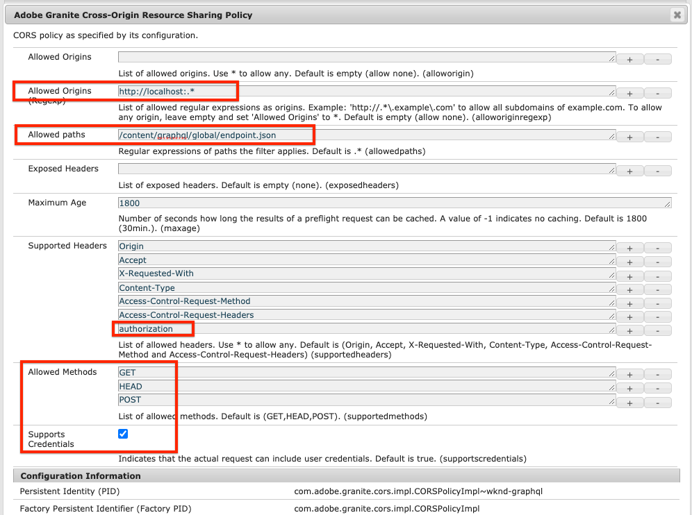

# AEM Configuração rápida sem cabeçalho usando o SDK local {#setup}

A configuração rápida do AEM Headless leva você com AEM Headless usando o conteúdo do projeto de amostra do WKND Site e uma amostra do React App (a SPA) que consome o conteúdo por meio AEM APIs GraphQL headless. Este guia usa o [AEM SDK as a Cloud Service](https://experienceleague.adobe.com/docs/experience-manager-cloud-service/implementing/developing/aem-as-a-cloud-service-sdk.html?lang=en#aem-as-a-cloud-service-sdk).

## Pré-requisitos {#prerequisites}

As seguintes ferramentas devem ser instaladas localmente:

* [JDK 11](https://experience.adobe.com/#/downloads/content/software-distribution/en/general.html?1_group.propertyvalues.property=.%2Fjcr%3Acontent%2Fmetadata%2Fdc%3AsoftwareType&amp;1_group.propertyvalues.operation=equals&amp;1_group.propertyvalues.0_values=software-type%3Atooling&amp;fulltext=Oracle%7E+JDK%7E+11%7E&amp;orderby=%40jcr%3Acontent%2Fjcr%3AlastModified&amp;orderby.sort=desc&amp;layout=list&amp;p.offset=0&amp;p.limit=14)
* [Node.js v10+](https://nodejs.org/en/)
* [npm 6+](https://www.npmjs.com/)
* [Git](https://git-scm.com/)

## 1. Instalar o SDK do AEM {#aem-sdk}

Essa configuração usa o [AEM SDK as a Cloud Service](https://experienceleague.adobe.com/docs/experience-manager-cloud-service/implementing/developing/aem-as-a-cloud-service-sdk.html?lang=en#aem-as-a-cloud-service-sdk) para explorar AEM APIs GraphQL. Esta seção fornece um guia rápido para instalar o SDK do AEM e executá-lo no modo Autor. Um guia mais detalhado para configurar um ambiente de desenvolvimento local [pode ser encontrada aqui](https://experienceleague.adobe.com/docs/experience-manager-learn/cloud-service/local-development-environment-set-up/overview.html?lang=en#local-development-environment-set-up).

>[!NOTE]
>
> Também é possível seguir o tutorial com um [AEM ambiente as a Cloud Service](./cloud-service.md). Observações adicionais sobre o uso de um ambiente do Cloud estão incluídas em todo o tutorial.

1. Navegue até o **[Portal de distribuição de software](https://experience.adobe.com/#/downloads/content/software-distribution/en/aemcloud.html)** > **AEM as a Cloud Service** e baixe a versão mais recente do **AEM SDK**.

   

   >[!CAUTION]
   >
   > O recurso GraphQL é ativado por padrão somente no SDK do AEM de 2021-02-04 ou mais recente.

1. Descompacte o download e copie o jar do Quickstart (`aem-sdk-quickstart-XXX.jar`) em uma pasta dedicada, ou seja, `~/aem-sdk/author`.
1. Renomeie o arquivo jar para `aem-author-p4502.jar`.

   O `author` name especifica que o jar do Quickstart será iniciado no modo Autor. O `p4502` especifica que o servidor Quickstart será executado na porta 4502.

1. Abra uma nova janela do terminal e navegue até a pasta que contém o arquivo jar. Execute o seguinte comando para instalar e iniciar a instância do AEM:

   ```shell
   $ cd ~/aem-sdk/author
   $ java -jar aem-author-p4502.jar
   ```

1. Forneça uma senha de administrador como `admin`. Qualquer senha de administrador é aceitável, no entanto, sua recomendação é usar `admin` para desenvolvimento local para reduzir a necessidade de reconfigurar.
1. Após alguns minutos, a instância de AEM terminará a instalação e uma nova janela do navegador deverá abrir em [http://localhost:4502](http://localhost:4502).
1. Faça logon com o nome de usuário `admin` e a senha selecionada durante AEM primeira inicialização (normalmente `admin`).

## 2. Instale o conteúdo WKND de amostra {#wknd-site-content}

Conteúdo de amostra do **Site de referência WKND** será instalado para acelerar o tutorial. A WKND é uma marca fictícia ao estilo de vida, frequentemente usada em conjunto com AEM treinamento.

O site de referência WKND inclui configurações necessárias para expor um [Ponto de extremidade GraphQL](https://experienceleague.adobe.com/docs/experience-manager-cloud-service/assets/admin/graphql-api-content-fragments.html?lang=en#graphql-aem-endpoint). Em uma implementação real, siga as etapas documentadas para [incluir os pontos de extremidade GraphQL](https://experienceleague.adobe.com/docs/experience-manager-cloud-service/assets/admin/graphql-api-content-fragments.html?lang=en#graphql-aem-endpoint) no projeto do cliente. A [CORS](#cors-config) também foi embalada como parte do site WKND. Uma configuração do CORS é necessária para conceder acesso a um aplicativo externo, mais informações sobre [CORS](#cors-config) pode ser encontrada abaixo.

1. Baixe o pacote de AEM compilado mais recente para o site WKND: [aem-guides-wknd.all-x.x.x.zip](https://github.com/adobe/aem-guides-wknd/releases/latest).

   >[!NOTE]
   >
   > Faça o download da versão padrão compatível com AEM as a Cloud Service e **not** o `classic` versão.

1. No **Início do AEM** navegue até **Ferramentas** > **Implantação** > **Pacotes**.

   

1. Clique em **Fazer upload do pacote** e escolha o pacote WKND baixado na etapa anterior. Clique em **Instalar** para instalar o pacote.

1. No **Início do AEM** navegue até **Ativos** > **Arquivos**.
1. Clique nas pastas para navegar até **Site WKND** > **Inglês** > **Aventuras**.

   

   Esta é uma pasta de todos os ativos que compõem as várias Aventuras promovidas pela marca WKND. Isso inclui tipos de mídia tradicionais, como imagens e vídeo, além de mídia específica de AEM como **Fragmentos de conteúdo**.

1. Clique no botão **Descarga do Skiing Wyoming** e clique no botão **Fragmento de conteúdo de esqui descendente do Wyoming** cartão:

   

1. A interface do usuário do Editor de fragmento de conteúdo será aberta para a aventura de esqui de Baixo no Wyoming.

   

   Observe que vários campos como **Título**, **Descrição** e **Atividade** defina o fragmento.

   **Fragmentos de conteúdo** são uma das maneiras de gerenciar o conteúdo no AEM. Os Fragmentos de conteúdo são conteúdo reutilizável e agnóstico de apresentação composto de elementos de dados estruturados, como texto, rich text, datas ou referências a outros Fragmentos de conteúdo. Os Fragmentos de conteúdo serão explorados com mais detalhes posteriormente no tutorial.

1. Clique em **Cancelar** para fechar o fragmento. Você pode navegar em algumas das outras pastas e explorar o outro conteúdo da Adventure.

>[!NOTE]
>
> Se estiver usando um ambiente de Cloud Service, consulte a documentação para saber como [implante uma base de código como o site de referência WKND em um ambiente Cloud Service](https://experienceleague.adobe.com/docs/experience-manager-cloud-service/implementing/deploying/overview.html?lang=en#coding-against-the-right-aem-version).

## 3. Baixe e execute o aplicativo WKND React {#sample-app}

Um dos objetivos deste tutorial é mostrar como consumir conteúdo AEM de um aplicativo externo usando APIs GraphQL. Este tutorial usa um exemplo de aplicativo React que foi parcialmente concluído para acelerar o tutorial. As mesmas lições e conceitos se aplicam a aplicativos criados com o iOS, Android ou qualquer outra plataforma. O aplicativo React é intencionalmente simples, para evitar complexidade desnecessária; não se trata de uma implementação de referência.

1. Abra uma nova janela de terminal e clone a ramificação inicial do tutorial usando o Git:

   ```shell
   $ git clone --branch tutorial/react git@github.com:adobe/aem-guides-wknd-graphql.git
   ```

1. No IDE de sua escolha, abra o arquivo `.env.development` at `aem-guides-wknd-graphql/react-app/.env.development`. Verifique se a variável `REACT_APP_AUTHORIZATION` é não comentada e o arquivo tem a seguinte aparência:

   ```plain
   REACT_APP_HOST_URI=http://localhost:4502
   REACT_APP_GRAPHQL_ENDPOINT=/content/graphql/global/endpoint.json
   # Use Authorization when connecting to an AEM Author environment
   REACT_APP_AUTHORIZATION=admin:admin
   ```

   Certifique-se de que `React_APP_HOST_URI` corresponde à instância de AEM local. Neste capítulo, conectaremos o aplicativo React diretamente ao AEM **Autor** ambiente. **Autor** por padrão, os ambientes exigem autenticação, portanto, nosso aplicativo se conectará como o `admin` usuário. Essa é uma prática comum durante o desenvolvimento, pois permite que façamos rapidamente alterações no ambiente de AEM e as vejamos imediatamente refletidas no aplicativo.

   >[!NOTE]
   >
   > Em um cenário de produção, o aplicativo se conectará a um AEM **Publicar** ambiente. Isso é abordado com mais detalhes na seção [Implantação de produção](../multi-step/production-deployment.md) capítulo.

1. Navegue até o `aem-guides-wknd-graphql/react-app` pasta. Instale e inicie o aplicativo:

   ```shell
   $ cd aem-guides-wknd-graphql/react-app
   $ npm install
   $ npm start
   ```

1. Uma nova janela do navegador deve iniciar automaticamente o aplicativo em [http://localhost:3000](http://localhost:3000).

   

   Uma lista do conteúdo Aventura atual do AEM deve ser exibida.

1. Clique em uma das imagens da aventura para ver os detalhes da aventura. É feito um pedido para AEM retornar os detalhes de uma aventura.

   

1. Use as ferramentas do desenvolvedor do navegador para inspecionar a **Rede** solicitações. Visualize o **XHR** solicitações e observe várias solicitações do POST para `/content/graphql/global/endpoint.json`, o ponto de extremidade GraphQL configurado para AEM.

   

1. Você também pode visualizar os parâmetros e a resposta JSON inspecionando a solicitação de rede. Pode ser útil instalar uma extensão de navegador como [Inspetor de rede GraphQL](https://chrome.google.com/webstore/detail/graphql-network-inspector/ndlbedplllcgconngcnfmkadhokfaaln) para que o Chrome entenda melhor a consulta e a resposta.

## 4. Editar conteúdo no AEM

Agora que o aplicativo React está em execução, faça uma atualização do conteúdo no AEM e veja a alteração refletida no aplicativo.

1. Navegar para AEM [http://localhost:4502](http://localhost:4502).
1. Navegar para **Ativos** > **Arquivos** > **Site WKND** > **Inglês** > **Aventuras** > **[Campo de Surf de Bali](http://localhost:4502/assets.html/content/dam/wknd/en/adventures/bali-surf-camp)**.

   

1. Clique no botão **Campo de Surf de Bali** fragmento de conteúdo para abrir o Editor de fragmento de conteúdo.
1. Modifique o **Título** e **Descrição** da aventura

   

1. Clique em **Salvar** para salvar as alterações.
1. Navegue de volta ao aplicativo React em [http://localhost:3000](http://localhost:3000) e atualize para ver suas alterações:

   

## 5. Instale a ferramenta GraphiQL {#install-graphiql}

[GraphiQL](https://github.com/graphql/graphiql) O é uma ferramenta de desenvolvimento e é necessária somente em ambientes de nível inferior, como uma instância de desenvolvimento ou local. O GraphiQL IDE permite testar e refinar rapidamente as consultas e os dados retornados. O GraphiQL também oferece acesso fácil à documentação, facilitando o aprendizado e a compreensão de quais métodos estão disponíveis.

1. Navegue até o **[Portal de distribuição de software](https://experience.adobe.com/#/downloads/content/software-distribution/en/aemcloud.html)** > **AEM as a Cloud Service**.
1. Procure por &quot;GraphiQL&quot; (não deixe de incluir a variável **i** em **GraphiQL**.
1. Baixe a versão mais recente **Pacote de Conteúdo GraphiQL v.x.x**

   

   O arquivo zip é um pacote AEM que pode ser instalado diretamente.

1. No **Início do AEM** navegue até **Ferramentas** > **Implantação** > **Pacotes**.
1. Clique em **Fazer upload do pacote** e escolha o pacote baixado na etapa anterior. Clique em **Instalar** para instalar o pacote.

   
1. Navegue até o GraphiQL IDE em [http://localhost:4502/content/graphiql.html](http://localhost:4502/content/graphiql.html) e comece a explorar as APIs GraphQL.

   >[!NOTE]
   >
   > A ferramenta GraphiQL e a API GraphQL são [explorado com mais detalhes posteriormente no tutorial](../multi-step/explore-graphql-api.md).

## Parabéns! {#congratulations}

Parabéns, agora você tem um aplicativo externo consumindo conteúdo AEM com GraphQL. Inspecione o código no aplicativo React e continue a testar a modificação dos Fragmentos de conteúdo existentes.

### Próximas etapas

* [Inicie o tutorial AEM Headless](../multi-step/overview.md)

## (Bônus) Configuração do CORS {#cors-config}

AEM, por padrão, bloqueia solicitações entre origens, impedindo que aplicativos não autorizados se conectem e surjam seu conteúdo.

Para permitir que o aplicativo React deste tutorial interaja com AEM pontos de extremidade da API GraphQL, uma configuração de compartilhamento de recursos entre origens foi definida no projeto de referência do site WKND.



Para exibir a configuração implantada:

1. Navegue até AEM console da Web do SDK em [http://localhost:4502/system/console](http://localhost:4502/system/console).

   >[!NOTE]
   >
   > O Console da Web só está disponível no SDK. Em um ambiente AEM as a Cloud Service, essas informações podem ser visualizadas por meio de [o Console do desenvolvedor](https://experienceleague.adobe.com/docs/experience-manager-learn/cloud-service/debugging/debugging-aem-as-a-cloud-service/developer-console.html).

1. No menu superior, clique em **OSGI** > **Configuração** para exibir todas as [Configurações do OSGi](http://localhost:4502/system/console/configMgr).
1. Rolar para baixo na página **Compartilhamento de recursos entre origens do Adobe Granite**.
1. Clique na configuração para `com.adobe.granite.cors.impl.CORSPolicyImpl~wknd-graphql`.
1. Os seguintes campos foram atualizados:
   * Origens permitidas (Regex): `http://localhost:.*`
      * Permite todas as conexões de host local.
   * Caminhos permitidos: `/content/graphql/global/endpoint.json`
      * Este é o único ponto de extremidade GraphQL configurado atualmente. Como prática recomendada, as configurações de CORs devem ser o mais restritivas possível.
   * Métodos permitidos: `GET`, `HEAD`, `POST`
      * Somente `POST` O é necessário para GraphQL, no entanto, os outros métodos podem ser úteis ao interagir com AEM sem interface.
   * Cabeçalhos suportados: **autorização** foi adicionado para transmitir a autenticação básica no ambiente do autor.
   * Suporta Credenciais: `Yes`
      * Isso é necessário, pois o aplicativo React se comunicará com os pontos finais GraphQL protegidos no serviço de autor do AEM.

Essa configuração e os pontos de extremidade GraphQL fazem parte do projeto WKND AEM. Você pode exibir todas as [Configurações do OSGi aqui](https://github.com/adobe/aem-guides-wknd/tree/master/ui.config/src/main/content/jcr_root/apps/wknd/osgiconfig).
