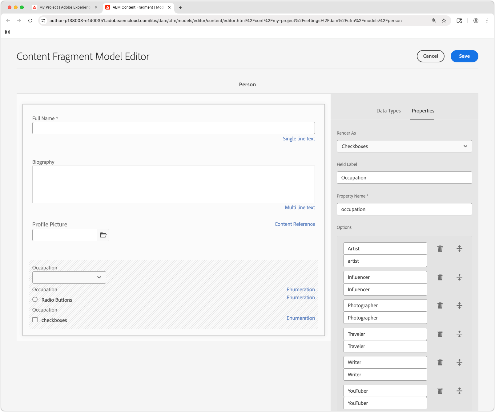

# Criar modelos de fragmentos de conteúdo

Neste capítulo, saiba como modelar conteúdo e criar um esquema com **Modelos de fragmento de conteúdo** e sobre os diferentes tipos de dados que definem um Modelo de fragmento de conteúdo.

Neste tutorial, você cria dois modelos simples, **Equipe** e **Pessoa**. O modelo de dados da **Equipe** tem nome, nome curto e descrição e faz referência ao modelo de dados **Pessoa**, que tem nome completo, biodetalhes, imagem de perfil e lista de ocupações.

## Objetivos

* Crie um modelo de fragmento de conteúdo.
* Explore os tipos de dados disponíveis e as opções de validação para criar modelos.
* Entenda como os Modelos de fragmento de conteúdo definem **ambos** o esquema de dados e o modelo de criação de um Fragmento de conteúdo.

## Criar uma configuração de projeto

Uma configuração de projeto contém todos os modelos de fragmento de conteúdo associados a um projeto específico e fornece um meio de organizar modelos. Crie pelo menos um projeto **antes** de criar o Modelo de fragmento de conteúdo.

1. Faça logon no ambiente **Author** do AEM (ex. `https://author-p<PROGRAM_ID>-e<ENVIRONMENT_ID>.adobeaemcloud.com/`)
1. Na tela inicial do AEM, navegue até **Ferramentas** > **Geral** > **Navegador de Configuração**.
1. Clique em **Criar** na barra de ações superior e insira os seguintes detalhes de configuração:
   * Título: **Meu Projeto**
   * Nome: **meu-projeto**
   * Modelos de fragmentos do conteúdo: **Marcado**

   

1. Selecione **Criar** para criar a configuração do projeto.

## Criar modelos de fragmentos de conteúdo

Em seguida, crie Modelos de Fragmento de Conteúdo para uma **Equipe** e uma **Pessoa**. Eles atuarão como modelos de dados ou esquemas, representando uma equipe e uma pessoa que faz parte de uma equipe, e definirão a interface para os autores criarem e editarem fragmentos de conteúdo com base nesses modelos.

### Criar o modelo de fragmento de conteúdo de pessoa

Crie um Modelo de fragmento de conteúdo para uma **Pessoa**, que é o modelo de dados ou esquema, representando uma pessoa que faz parte de uma equipe.

1. Na tela inicial do AEM, navegue até **Ferramentas** > **Geral** > **Modelos de fragmentos de conteúdo**.
1. Navegue até a pasta **Meu Projeto**.
1. Selecione **Criar** no canto superior direito para exibir o assistente **Criar Modelo**.
1. Crie um modelo de fragmento de conteúdo com as seguintes propriedades:

   * Título do modelo: **Pessoa**
   * Habilitar modelo: **Verificado**

   Selecione **Criar**. Na caixa de diálogo resultante, selecione **Abrir** para criar o modelo.

1. Arraste e solte um elemento **Texto de linha única** no painel principal. Insira as seguintes propriedades na guia **Propriedades**:

   * Rótulo do Campo: **Nome Completo**
   * Nome da Propriedade: `fullName`
   * Verificar **Obrigatório**

   O **Nome da Propriedade** define o nome da propriedade em que o valor criado está armazenado no AEM. O **Nome da Propriedade** também define o nome **chave** dessa propriedade como parte do esquema de dados e é usado como a chave na resposta JSON quando o Fragmento de Conteúdo é entregue via OpenAPIs do AEM.

1. Selecione a guia **Tipos de Dados** e arraste e solte um campo **Texto de várias linhas** abaixo do campo **Nome Completo**. Insira as seguintes propriedades:

   * Rótulo do Campo: **Biografia**
   * Nome da Propriedade: `biographyText`
   * Tipo Padrão: **Rich Text**

1. Clique na guia **Tipos de Dados** e arraste e solte um campo **Referência de Conteúdo**. Insira as seguintes propriedades:

   * Rótulo do Campo: **Imagem do Perfil**
   * Nome da Propriedade: `profilePicture`
   * Caminho raiz: `/content/dam`

     Ao configurar o **Caminho raiz**, você pode clicar no ícone de **pasta** para exibir uma modal e selecionar o caminho. Restringe quais pastas os autores podem usar para preencher o caminho. `/content/dam` é a raiz na qual todas as AEM Assets (imagens, vídeos, outros fragmentos de conteúdo) são armazenadas.

   * Aceitar apenas tipos de conteúdo específicos: **Imagem**

     Adicione uma validação à **Referência da Imagem** para que somente os tipos de conteúdo de **Imagens** possam ser usados para preencher o campo.

   * Mostrar miniatura: **Marcado**

1. Clique na guia **Tipos de Dados** e arraste e solte um tipo de dados **Enumeração** abaixo do campo **Referência de Imagem**. Insira as seguintes propriedades:

   * Renderizar como: **Caixas de seleção**
   * Rótulo do Campo: **Ocupação**
   * Nome da Propriedade: `occupation`
   * Opções:
      * **Artista**
      * **Influenciador**
      * **Fotógrafo**
      * **Viajante**
      * **Gravador**
      * **YouTuber**

   Defina o rótulo Opção e o valor com o mesmo valor.

1. O modelo final **Pessoa** deve ser semelhante ao seguinte:

   

1. Clique em **Salvar** para salvar as alterações.

### Criar o modelo de fragmento de conteúdo da equipe

Crie um Modelo de Fragmento de Conteúdo para uma **Equipe**, que é o modelo de dados para uma equipe de pessoas. O modelo Equipe faz referência aos Fragmentos de conteúdo de pessoa, representando os membros da equipe.

1. Na pasta **Meu Projeto**, selecione **Criar** no canto superior direito para exibir o assistente **Criar Modelo**.
1. No campo **Título do Modelo**, insira **Equipe** e selecione **Criar**.

   Selecione **Abrir** na caixa de diálogo resultante para abrir o modelo recém-criado.

1. Arraste e solte um elemento **Texto de linha única** no painel principal. Insira as seguintes propriedades na guia **Propriedades**:

   * Rótulo do Campo: **Título**
   * Nome da Propriedade: `title`
   * Verificar **Obrigatório**

1. Selecione a guia **Tipos de Dados** e arraste e solte um campo **Texto de várias linhas** abaixo do campo **Nome Curto**. Insira as seguintes propriedades:

   * Rótulo do Campo: **Descrição**
   * Nome da Propriedade: `description`
   * Tipo Padrão: **Rich Text**

1. Clique na guia **Tipos de dados** e arraste e solte um campo **Referência de fragmento**. Insira as seguintes propriedades:

   * Renderizar como: **Vários campos**
   * Número Mínimo de Itens: **2**
   * Rótulo do Campo: **Membros da Equipe**
   * Nome da Propriedade: `teamMembers`
   * Modelos de fragmentos do conteúdo permitidos: use o ícone de pasta para selecionar o modelo **Pessoa**.

1. O modelo final **Equipe** deve ser semelhante ao seguinte:

   

1. Clique em **Salvar** para salvar as alterações.

1. Agora você deve ter dois modelos para trabalhar:

   

## Parabéns!

Parabéns, você acabou de criar seus primeiros modelos de fragmento de conteúdo!

## Próximas etapas

No próximo capítulo, [Criação de modelos de fragmento de conteúdo](2-author-content-fragments.md), você cria e edita um novo fragmento de conteúdo com base em um modelo de fragmento de conteúdo. Você também aprenderá a criar variações de Fragmentos de conteúdo.

## Documentação relacionada

* [Modelos de fragmentos do conteúdo](https://experienceleague.adobe.com/docs/experience-manager-cloud-service/content/assets/content-fragments/content-fragments-models.html?lang=pt-BR)

