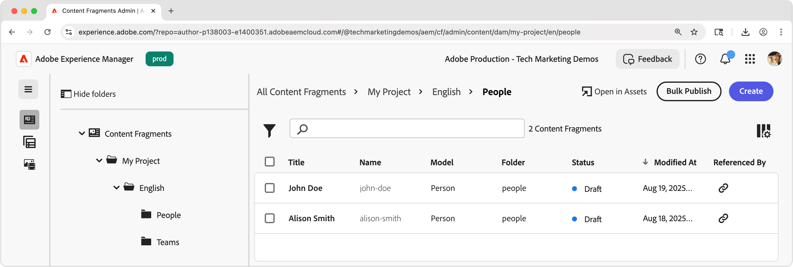

# Fragmentos de conteúdo do autor

Neste capítulo, você cria e edita novos Fragmentos de conteúdo com base nos [Modelos de fragmento de conteúdo de Equipe e Pessoa](./1-content-fragment-models.md). Esses fragmentos de conteúdo serão o conteúdo consumido pelo aplicativo React usando a entrega de fragmentos de conteúdo do AEM com APIs OpenAPI.

## Pré-requisitos

Este é um tutorial de várias partes e presume-se que as etapas descritas em [Definição dos modelos de fragmento de conteúdo](./1-content-fragment-models.md) foram concluídas.

## Objetivos

* Crie um fragmento de conteúdo com base em um modelo de fragmento de conteúdo.
* Crie um fragmento de conteúdo.
* Publicar um fragmento de conteúdo.

## Criar pastas de ativos para fragmentos de conteúdo

Os fragmentos de conteúdo são armazenados em pastas no AEM Assets. Para criar fragmentos de conteúdo a partir dos modelos de fragmento de conteúdo criados no capítulo anterior, uma pasta deve existir para armazená-los. Uma configuração é necessária na pasta para habilitar a criação de fragmentos de conteúdo de modelos de fragmento de conteúdo específicos.

O AEM é compatível com a organização de pastas &quot;simples&quot;, o que significa que os fragmentos de conteúdo de diferentes modelos de fragmento de conteúdo são misturados em uma única pasta. No entanto, neste tutorial, uma estrutura de pastas que se alinha aos Modelos de fragmento de conteúdo é usada, em parte, para explorar a API **Listar todos os fragmentos de conteúdo por pasta** no [próximo capítulo](./3-explore-openapis.md). Ao determinar sua organização do fragmento de conteúdo, considere como você deseja criar e gerenciar os fragmentos de conteúdo, bem como como como entregá-los e consumi-los por meio da Entrega de fragmento de conteúdo do AEM com APIs OpenAPI.

1. Na tela inicial do AEM, navegue até **Assets** > **Arquivos**.
1. Selecione **Criar** no canto superior direito e selecione **Pasta**. Insira:

   * Título: **Meu Projeto**
   * Nome: **meu-projeto**

   Selecione **Criar** para criar a pasta.

1. Abra a nova pasta **Meu Projeto** e crie uma subpasta na nova pasta **Meu Projeto** com os seguintes valores:

   * Título: **inglês**
   * Nome: **en**

   Uma pasta de idioma raiz é criada para posicionar o projeto de forma a oferecer suporte aos recursos de localização nativos do AEM. Uma prática recomendada é configurar projetos para suporte multilíngue, mesmo que você não precise de localização hoje. Consulte [a seguinte página de documentos para obter mais informações](https://experienceleague.adobe.com/docs/experience-manager-cloud-service/content/assets/admin/translate-assets.html).

1. Crie duas subpastas na nova pasta **Meu Projeto > Inglês** com os seguintes valores:

   Uma pasta `teams` que contém os Fragmentos de Conteúdo da **Equipe**

   * Título: **Equipes**
   * Nome: **equipes**

   ... e uma pasta `people` que contém os Fragmentos de conteúdo **Person**.

   * Título: **Pessoas**
   * Nome: **pessoas**

1. Volte para a pasta **Meu projeto > Inglês** e verifique se as duas novas pastas foram criadas.
1. Selecione a pasta **Equipes** e selecione **Propriedades** na barra de ações superior.
1. Selecione a guia **Políticas** e desmarque **Herdado de`/content/dam/my-project`**.
1. Na guia **Políticas**, selecione o modelo de fragmento de conteúdo **Equipe** no campo **Modelos de fragmento de conteúdo permitidos por caminho**.

   

   Essas políticas são herdadas automaticamente pelas subpastas, mas podem ser substituídas. Os modelos de fragmento de conteúdo podem ser permitidos por tags ou ativar modelos de fragmento de conteúdo de outras configurações de projeto. Esse mecanismo fornece uma maneira eficiente de gerenciar a hierarquia de conteúdo.

1. Selecione **Salvar e fechar** para salvar as alterações nas propriedades da pasta.
1. Atualize as **Políticas** da pasta **Pessoas** da mesma maneira, mas selecione o Modelo de Fragmento de Conteúdo **Pessoa**.

## Criar um fragmento de conteúdo para uma pessoa

Crie Fragmentos de Conteúdo com base no Modelo de Fragmento de Conteúdo **Person** na pasta **Meu Projeto > Inglês > Pessoas**.

1. Na tela inicial do AEM, selecione **Fragmentos de conteúdo** para abrir o Console de fragmentos de conteúdo.
1. Selecione o botão **Mostrar pasta** para abrir o navegador de pastas.
1. Selecione a pasta **Meu Projeto > Inglês > Pessoas**.
1. Selecione **Criar > Fragmento do conteúdo** e insira os seguintes valores:

   * Localização: `/content/dam/my-project/en/people`
   * Modelo de fragmento de conteúdo: **Pessoa**
   * Título: **João da Silva**
   * Nome: `john-doe`

   Lembre-se de que os campos **Título**, **Nome** e **Descrição** da caixa de diálogo **Novo fragmento de conteúdo** são armazenados como metadados sobre o fragmento de conteúdo e não são parte dos dados do fragmento de conteúdo.

   

1. Selecione **Criar e abrir**.
1. Preencha os campos do fragmento **João da Silva**:

   * Nome completo: **João da Silva**
   * Biografia: **John Doe adora mídia social e um entusiasta de viagens.**
   * Imagem do Perfil: Selecione uma imagem de `/content/dam` ou carregue uma nova.
   * Ocupação: **Influenciador**, **Viajante**

   Esses campos e valores definem o conteúdo do fragmento de conteúdo que será consumido por meio da entrega de fragmentos de conteúdo do AEM com APIs OpenAPI.

   

1. As alterações no Fragmento do conteúdo são salvas automaticamente, portanto, não há o botão **Salvar**.
1. Retorne ao Console de fragmentos de conteúdo e selecione **Meu projeto > Inglês > Pessoa** para ver seu novo fragmento de conteúdo.

### Criar fragmentos de conteúdo adicionais da pessoa

Repita as etapas acima para criar fragmentos adicionais de **Pessoa**.

1. Crie um fragmento de conteúdo de pessoa para **Alison Smith** com as seguintes propriedades:

   * Localização: `/content/dam/my-project/en/people`
   * Modelo de fragmento de conteúdo: **Pessoa**
   * Título: **Alison Smith**
   * Nome: `alison-smith`

   Selecione **Criar e abrir** e crie os seguintes valores:

   * Nome completo: **Alison Smith**
   * Biografia: **Alison é fotógrafa e adora escrever sobre suas viagens.**
   * Imagem do Perfil: Selecione uma imagem de `/content/dam` ou carregue uma nova.
   * Ocupação: **Fotógrafo**, **Viajante**, **Escritor**.

Agora você deve ter dois fragmentos de conteúdo na pasta **Meu projeto > Inglês > Pessoas**:

Opcionalmente, é possível criar mais alguns Fragmentos de conteúdo de pessoa para representar outras pessoas.

## Criar um fragmento do conteúdo da equipe

Usando a mesma abordagem, crie um fragmento de conteúdo **Equipe** com base no modelo de fragmento de conteúdo **Equipe** na pasta **Meu projeto > Inglês > Equipes**.

1. Crie um fragmento de **Equipe** representando **Equipe Alpha** com as seguintes propriedades:

   * Localização: `/content/dam/my-project/en`
   * Modelo de fragmento de conteúdo: **Equipe**
   * Título: **Alpha da Equipe**
   * Nome: `team-alpha`

   Selecione **Criar e abrir** e crie os seguintes valores:

   * Título: **Alpha da Equipe**
   * Descrição: **O Team Alpha é uma equipe de conteúdo de viagem especializada em fotografia e redação de viagens.**
   * **Membros da Equipe**: Selecione os Fragmentos de Conteúdo de **João da Silva** e **Alison Smith** para preencher o campo **Membros da Equipe**.

   

1. Selecione **Criar e abrir** para criar o fragmento de conteúdo da equipe
1. Deve haver um Fragmento de conteúdo abaixo de **Meu projeto > Inglês > Equipe**:

Agora você deve ter um Fragmento de Conteúdo do **Team Alpha** na pasta **Meu Projeto > Inglês > Equipes**:

Opcionalmente, crie uma **Equipe Omega** com um conjunto diferente de pessoas.

## Publicar fragmentos de conteúdo

Para disponibilizar Fragmentos de conteúdo por meio de OpenAPIs, publique-os. A publicação permite que os fragmentos de conteúdo sejam acessados por meio de:

* **Serviço de publicação** - fornece conteúdo aos aplicativos de produção
* **Serviço de visualização** - veicula conteúdo para visualizar aplicativos

Normalmente, o conteúdo é publicado primeiro no **Serviço de visualização** e revisado em um aplicativo de visualização antes de ser publicado no **Serviço de publicação**. Publicar no **Serviço de publicação** não é publicado também no **Serviço de visualização**. Você deve publicar no **Serviço de visualização** separadamente.

Neste tutorial, publicaremos no serviço de Publicação do AEM, no entanto, usar o serviço de Visualização do AEM é tão fácil quanto alterar a URL do [serviço AEM no aplicativo React](./4-react-app.md)

1. No Console de Fragmentos de Conteúdo, localize a pasta **Meu Projeto > Inglês**.
1. Selecione todos os Fragmentos de conteúdo na pasta **Inglês** - que exibe todos os Fragmentos de conteúdo em todas as subpastas - e selecione **Publicar > Agora** na barra de ações superior.

   

1. Selecione o **Serviço de publicação** em **Incluir todas as referências** selecione **Não publicado** e **Modificado** e selecione **Publicar**.

   

Agora os Fragmentos de conteúdo e todos os Fragmentos de conteúdo de pessoas aos quais os Fragmentos de conteúdo da equipe fazem referência, além de todos os ativos aos quais é feita referência, são publicados no **Serviço de publicação**.

Você pode publicar no **serviço de Visualização** da mesma maneira.

## Parabéns!

Parabéns, você criou fragmentos de conteúdo com base em modelos de fragmento de conteúdo no AEM. Você criou um modelo de fragmento de conteúdo de **Pessoa**, criou vários fragmentos de conteúdo de **Pessoa** e criou um fragmento de conteúdo de **Equipe** que faz referência a vários fragmentos de conteúdo de **Pessoa**.

Com os fragmentos de conteúdo publicados, agora você pode acessá-los por meio da entrega de fragmentos de conteúdo do AEM com APIs OpenAPI.

## Próximas etapas

No próximo capítulo, [Explorar OpenAPIs](3-explore-openapis.md), você explorará a Entrega de fragmentos de conteúdo do AEM com APIs OpenAPIs usando o recurso **Experimentar** integrado à documentação da API.

