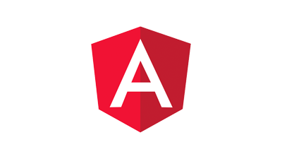

# Tutoriais AEM headless

O Adobe Experience Manager (AEM) tem várias opções para definir endpoints sem periféricos e fornecer seu conteúdo como JSON. Use tutoriais práticos para explorar como usar as várias opções e escolher o que é certo para você.

>[!TIP]
>
>Essa coleção de tutoriais foi projetada para aqueles que preferem **aprenda fazendo**. Se preferir conceitos de aprendizagem desde o início, verifique o [jornada do desenvolvedor sem periféricos do AEM](https://experienceleague.adobe.com/docs/experience-manager-cloud-service/headless-journey/developer/overview.html). Esse conjunto de tutoriais e a jornada se complementam.

## Tutorials por API

<table>
<tr>
  <td>
    
    

      <a href="https://experienceleague.adobe.com/docs/experience-manager-learn/getting-started-with-aem-headless/graphql/overview.html">
    <strong>API GraphQL</strong>
    </a>
    

    

    <em>Saiba como um aplicativo pode usar AEM API GraphQL para consultar conteúdo.</em>
    

  </td>
  <td>
    
    

    <a href="https://experienceleague.adobe.com/docs/experience-manager-learn/getting-started-with-aem-headless/authentication/overview.html">
    <strong>Autenticação de token</strong>
    </a>
    

    

    <em>Saiba como um aplicativo pode se autenticar com segurança no AEM.</em>
    

  </td>
  <td>
    
     

      <a href="https://experienceleague.adobe.com/docs/experience-manager-learn/getting-started-with-aem-headless/content-services/overview.html">
        <strong>Content Services</strong>
      </a>
    

    

    <em>Saiba como um aplicativo pode usar uma REST API para consumir conteúdo.</em>
    

  </td>
</tr>
</table>

## Exemplos de aplicativos

Exemplos de aplicativos são uma ótima maneira de explorar os recursos headless do Adobe Experience Manager (AEM). Baixe e instale esses exemplos concluídos para começar imediatamente.

<table>
<tr>
  <td>
    
    

      <a href="https://experienceleague.adobe.com/docs/experience-manager-learn/getting-started-with-aem-headless/graphql/example-apps/ios-swiftui-app.html">
    <strong>Exemplo de iOS SwiftUI</strong>
    </a>
    

    

    <em>Um aplicativo iOS com APIs GraphQL AEM.</em>
    

  </td>
  <td>
    
    

    <a href="https://experienceleague.adobe.com/docs/experience-manager-learn/getting-started-with-aem-headless/graphql/example-apps/android-app.html">
    <strong>Exemplo de Android</strong>
    </a>
    

    

    <em>Um aplicativo Android com APIs GraphQL AEM.</em>
    

  </td>
  <td>
    
     

      <a href="https://experienceleague.adobe.com/docs/experience-manager-learn/getting-started-with-aem-headless/graphql/example-apps/react-app.html">
        <strong>Exemplo de reação</strong>
      </a>
    

    

    <em>Um aplicativo React desenvolvido por APIs GraphQL AEM.</em>
    

  </td>
</tr>
</table>

## Tutorials por estrutura

Navegue pelos seguintes tutoriais com base na tecnologia usada. Saiba como o AEM pode ir além de um caso de uso sem interface, com opções para criação em contexto e gerenciamento de experiência.

<table>
<tr>
  <td>
    
    

      <a href="https://experienceleague.adobe.com/docs/experience-manager-learn/getting-started-with-aem-headless/graphql/overview.html">
    <strong>Reação - Sem cabeça</strong>
    </a>
    

    

    <em>Crie um aplicativo React JS usando GraphQL em um cenário sem interface.</em>
    

  </td>
  <td>
    
    

    <a href="https://experienceleague.adobe.com/docs/experience-manager-learn/getting-started-with-aem-headless/spa-editor/remote-spa/overview.html">
    <strong>React - Editor remoto</strong>
    </a>
    

    

    <em>Crie no contexto uma parte de um aplicativo React hospedado remotamente.</em>
    

  </td>
  <td>
    
     

      <a href="https://experienceleague.adobe.com/docs/experience-manager-learn/getting-started-with-aem-headless/spa-editor/react/overview.html">
        <strong>Reagir - Editor de SPA</strong>
      </a>
    

    

    <em>Use o editor de SPA de AEM para gerenciar a experiência completa do aplicativo React.</em>
    

  </td>
</tr>
<tr>
  <td>
    
    

      <a href="https://experienceleague.adobe.com/docs/experience-manager-learn/getting-started-with-aem-headless/spa-editor/angular/overview.html">
    <strong>Angular - Editor de SPA</strong>
    </a>
    

    

    <em>Use o editor de SPA de AEM para gerenciar a experiência completa do aplicativo Angular.</em>
    

  </td>
  <td>
    
    

    <a href="https://experienceleague.adobe.com/docs/experience-manager-learn/getting-started-with-aem-headless/content-services/overview.html">
    <strong>Android - Serviços de conteúdo</strong>
    </a>
    

    

    <em>Use os Serviços de conteúdo e REST para alimentar um aplicativo Android para dispositivos móveis.</em>
    

  </td>
  <td>
    
     

      <a href="https://experienceleague.adobe.com/docs/experience-manager-learn/getting-started-with-aem-headless/authentication/overview.html">
        <strong>Node.js - Autenticação</strong>
      </a>
    

    

    <em>Crie um aplicativo Node.js usando tokens de desenvolvedor e de serviço para autenticar.</em>
    

  </td>
</tr>
</table>
