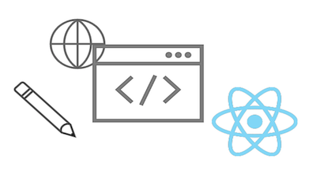

# Tutoriais do headless no AEM{#aem-headless-tutorials}

O Adobe Experience Manager (AEM) tem várias opções para definir endpoints headless e fornecer seu conteúdo como JSON. Use tutoriais práticos para explorar como usar as várias opções e escolher a mais certa para você.

>[!TIP]
>
>Esta coleção de tutoriais foi criada para aqueles que preferem **aprender fazendo**. Se preferir aprender conceitos desde o início, confira a [Jornada de desenvolvedores headless do AEM](https://experienceleague.adobe.com/docs/experience-manager-cloud-service/content/headless/journeys/developer/overview.html). Esse conjunto de tutoriais e a jornada se complementam.

## Tutoriais por API

<table>
<tr>
  <td>
    
    

      <a href="https://experienceleague.adobe.com/docs/experience-manager-learn/getting-started-with-aem-headless/graphql/overview.html?lang=pt-BR">
    <strong>API GraphQL</strong>
    </a>
    

    

    <em>Saiba como um aplicativo pode usar a API GraphQL do AEM para consultar conteúdo.</em>
    

  </td>
  <td>
    
    

    <a href="https://experienceleague.adobe.com/docs/experience-manager-learn/getting-started-with-aem-headless/authentication/overview.html">
    <strong>Autenticação do token</strong>
    </a>
    

    

    <em>Saiba como um aplicativo pode ser autenticado com segurança no AEM.</em>
    

  </td>
  <td>
    
     

      <a href="https://experienceleague.adobe.com/docs/experience-manager-learn/getting-started-with-aem-headless/content-services/overview.html">
        <strong>Serviços de conteúdo</strong>
      </a>
    

    

    <em>Saiba como um aplicativo pode usar uma API REST para consumir conteúdo.</em>
    

  </td>
</tr>
</table>

## Aplicativos de exemplo

Aplicativos de exemplo são uma ótima maneira de explorar os recursos headless do Adobe Experience Manager (AEM). Baixe e instale estes exemplos concluídos para começar imediatamente.

<table>
<tr>
  <td>
    
    

      <a href="https://experienceleague.adobe.com/docs/experience-manager-learn/getting-started-with-aem-headless/graphql/example-apps/ios-swiftui-app.html">
    <strong>Exemplo de SwiftUI para iOS</strong>
    </a>
    

    

    <em>Um aplicativo do iOS baseado nas APIs do GraphQL da AEM.</em>
    

  </td>
  <td>
    
    

    <a href="https://experienceleague.adobe.com/docs/experience-manager-learn/getting-started-with-aem-headless/graphql/example-apps/android-app.html">
    <strong>Exemplo do Android™</strong>
    </a>
    

    

    <em>Um aplicativo da Android™ baseado nas APIs GraphQL da AEM.</em>
    

  </td>
  <td>
    
     

      <a href="https://experienceleague.adobe.com/docs/experience-manager-learn/getting-started-with-aem-headless/graphql/example-apps/react-app.html">
        <strong>React Exemplo</strong>
      </a>
    

    

    <em>Um aplicativo React baseado nas APIs GraphQL do AEM.</em>
    

  </td>
</tr>
</table>

## Tutoriais

Navegue pelos seguintes tutoriais com base na tecnologia usada. Saiba como o AEM pode ir além de um caso de uso headless puro, com opções de criação em contexto e gerenciamento de experiência.

<table>
<tr>
  <td>
    
    

      <a href="https://experienceleague.adobe.com/docs/experience-manager-learn/getting-started-with-aem-headless/graphql/overview.html?lang=pt-BR">
    <strong>React - Headless</strong>
    </a>
    

    

    <em>Crie um aplicativo React JS usando GraphQL em um cenário headless puro.</em>
    

  </td>
  <td>
    
     

      <a href="https://experienceleague.adobe.com/en/docs/experience-manager-learn/cloud-service/developing/universal-editor/react-app-editing/overview">
        <strong>Reagir - Editar Conteúdo via Editor Universal</strong>
      </a>
    

    

    <em>Use o Editor Universal para editar o conteúdo de um aplicativo React.</em>
    

  </td>  
  <td>
    
    

    <a href="https://experienceleague.adobe.com/docs/experience-manager-learn/getting-started-with-aem-headless/spa-editor/remote-spa/overview.html">
    <strong>React - Editor remoto</strong>
    </a>
    

    

    <em>Crie no contexto uma parte de um aplicativo React hospedado remotamente.</em>
    

  </td>
</tr>
<tr>  
  <td>
    
     

      <a href="https://experienceleague.adobe.com/docs/experience-manager-learn/getting-started-with-aem-headless/spa-editor/react/overview.html">
        <strong>React - Editor SPA</strong>
      </a>
    

    

    <em>Use o editor de SPA do AEM para gerenciar a experiência completa do aplicativo React.</em>
    

  </td>
  <td>
    
    

    <a href="https://experienceleague.adobe.com/docs/experience-manager-learn/getting-started-with-aem-headless/content-services/overview.html">
    <strong>Android - Serviços de Conteúdo</strong>
    </a>
    

    

    <em>Use o Content Services e o REST para habilitar um aplicativo Android™ para dispositivos móveis.</em>
    

  </td>
  <td>
    
     

      <a href="https://experienceleague.adobe.com/docs/experience-manager-learn/getting-started-with-aem-headless/authentication/overview.html">
        <strong>Node.js - Autenticação</strong>
      </a>
    

    

    <em>Crie um aplicativo Node.js usando tokens de desenvolvedor e de serviço para autenticar.</em>
    

  </td>
</tr>
</table>
