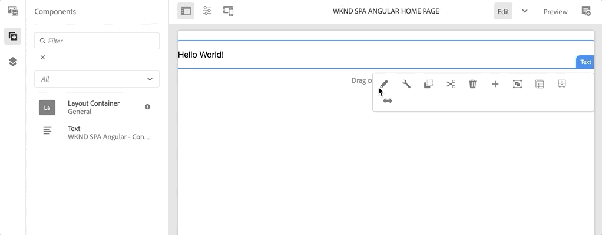
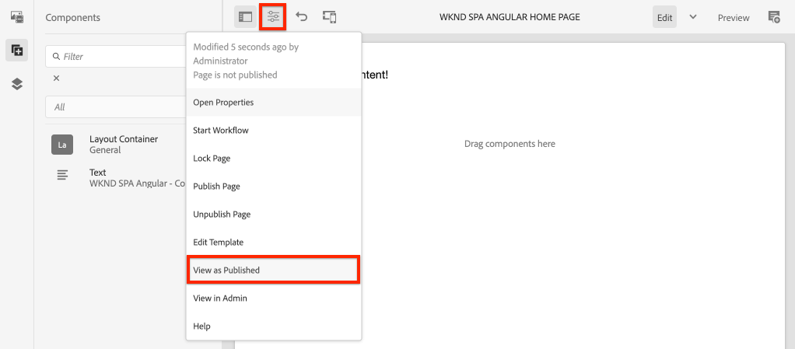

# Projeto do Editor de SPA {#create-project}

Saiba como usar um projeto Maven do Adobe Experience Manager (AEM) como ponto de partida para um aplicativo do Angular AEM SPA integrado ao editor do.

## Objetivo

1. Entenda a estrutura de um novo projeto SPA AEM Editor construído a partir de um arquétipo Maven.
2. Implante o projeto inicial em uma instância local do AEM.

## O que você vai criar

Neste capítulo, é implantado um novo projeto AEM, com base no [Arquétipo de projeto AEM](https://github.com/adobe/aem-project-archetype). O projeto AEM é inicializado com um ponto de partida muito simples para o Angular SPA. O projeto usado neste capítulo servirá de base para uma implementação do SPA WKND e será construído em capítulos futuros.


*Uma mensagem clássica do Hello World.*

## Pré-requisitos

Analisar as ferramentas e instruções necessárias para a configuração de um [ambiente de desenvolvimento local](overview.md#local-dev-environment). Verifique se uma nova instância do Adobe Experience Manager, iniciada em **autor** está sendo executado localmente.

## Obter o projeto

Há várias opções para criar um projeto de vários módulos Maven para AEM. Este tutorial usou o mais recente [Arquétipo de projeto AEM](https://github.com/adobe/aem-project-archetype) como base para o código tutorial. Foram feitas modificações no código do projeto para suportar várias versões do AEM. Revise [a observação sobre compatibilidade com versões anteriores](overview.md#compatibility).

>[!CAUTION]
>
>É uma prática recomendada usar a variável **mais recente** versão do [arquétipo](https://github.com/adobe/aem-project-archetype) para gerar um novo projeto para uma implementação real. Os projetos de AEM devem visar uma única versão do AEM utilizando o `aemVersion` propriedade do arquétipo.

1. Baixe o ponto de partida para este tutorial pelo Git:

   ```shell
   $ git clone git@github.com:adobe/aem-guides-wknd-spa.git
   $ cd aem-guides-wknd-spa
   $ git checkout Angular/create-project-start
   ```

2. A seguinte estrutura de pasta e arquivo representa o projeto AEM gerado pelo arquétipo Maven no sistema de arquivos local:

   ```plain
   |--- aem-guides-wknd-spa
       |--- all/
       |--- core/
       |--- dispatcher/
       |--- ui.apps/
       |--- ui.apps.structure/
       |--- ui.content/
       |--- ui.frontend /
       |--- it.tests/
       |--- pom.xml
       |--- README.md
       |--- .gitignore
       |--- archetype.properties
   ```

3. As seguintes propriedades foram usadas ao gerar o projeto AEM a partir do [Arquétipo de projeto do AEM](https://github.com/Adobe-Marketing-Cloud/aem-project-archetype/releases/tag/aem-project-archetype-14):

   | Propriedade | Valor |
   |-----------------|---------------------------------------|
   | aemVersion | nuvem |
   | appTitle | ANGULAR SPA WKND |
   | appId | wknd-spa-angular |
   | groupId | com.adobe.aem.guides |
   | frontendModule | angular |
   | pacote | com.adobe.aem.guides.wknd.spa.angular |
   | includeExamples | n |

   >[!NOTE]
   >
   > Observe a `frontendModule=angular` propriedade. Isso instrui o Arquétipo de projeto AEM a inicializar o projeto com um iniciador [Base de código de angular](https://experienceleague.adobe.com/docs/experience-manager-core-components/using/developing/archetype/uifrontend-angular.html) para ser usado com o editor SPA AEM.

## Criar o projeto

Em seguida, compile, crie e implante o código do projeto em uma instância local do AEM usando Maven.

1. Verifique se uma instância do AEM está sendo executada localmente na porta **4502**.
2. No terminal de linha de comando, verifique se o Maven está instalado:

   ```shell
   $ mvn --version
   Apache Maven 3.6.2
   Maven home: /Library/apache-maven-3.6.2
   Java version: 11.0.4, vendor: Oracle Corporation, runtime: /Library/Java/JavaVirtualMachines/jdk-11.0.4.jdk/Contents/Home
   ```

3. Execute o comando Maven abaixo no `aem-guides-wknd-spa` diretório para criar e implantar o projeto no AEM:

   ```shell
   $ mvn -PautoInstallSinglePackage clean install
   ```

   Se estiver usando [AEM 6.x](overview.md#compatibility):

   ```shell
   $ mvn clean install -PautoInstallSinglePackage -Pclassic
   ```

   Os vários módulos do projeto devem ser compilados e implantados no AEM.

   ```plain
   [INFO] ------------------------------------------------------------------------
   [INFO] Reactor Summary for wknd-spa-angular 1.0.0-SNAPSHOT:
   [INFO] 
   [INFO] wknd-spa-angular ................................... SUCCESS [  0.473 s]
   [INFO] WKND SPA Angular - Core ............................ SUCCESS [ 54.866 s]
   [INFO] wknd-spa-angular.ui.frontend - UI Frontend ......... SUCCESS [02:10 min]
   [INFO] WKND SPA Angular - Repository Structure Package .... SUCCESS [  0.694 s]
   [INFO] WKND SPA Angular - UI apps ......................... SUCCESS [  6.351 s]
   [INFO] WKND SPA Angular - UI content ...................... SUCCESS [  2.885 s]
   [INFO] WKND SPA Angular - All ............................. SUCCESS [  1.736 s]
   [INFO] WKND SPA Angular - Integration Tests Bundles ....... SUCCESS [  2.563 s]
   [INFO] WKND SPA Angular - Integration Tests Launcher ...... SUCCESS [  1.846 s]
   [INFO] WKND SPA Angular - Dispatcher ...................... SUCCESS [  0.270 s]
   [INFO] ------------------------------------------------------------------------
   [INFO] BUILD SUCCESS
   [INFO] ------------------------------------------------------------------------
   ```

   O perfil Maven ***autoInstallSinglePackage*** compila os módulos individuais do projeto e implanta um único pacote na instância do AEM. Por padrão, esse pacote é implantado em uma instância AEM executada localmente na porta **4502** e com as credenciais de **admin:admin**.

4. Navegue até **[!UICONTROL Gerenciador de pacotes]** na sua instância local do AEM: [http://localhost:4502/crx/packmgr/index.jsp](http://localhost:4502/crx/packmgr/index.jsp).

5. Você deve ver três pacotes para `wknd-spa-angular.all`, `wknd-spa-angular.ui.apps` e `wknd-spa-angular.ui.content`.

   

   Todo o código personalizado necessário para o projeto é incorporado a esses pacotes e instalado no tempo de execução do AEM.

6. Você também deve ver vários pacotes para `spa.project.core` e `core.wcm.components`. Essas são dependências incluídas automaticamente pelo arquétipo. Mais informações sobre [Componentes principais do AEM podem ser encontrados aqui](https://experienceleague.adobe.com/docs/experience-manager-core-components/using/introduction.html?lang=pt-BR).

## Conteúdo do autor

Em seguida, abra o SPA inicial gerado pelo arquétipo e atualize parte do conteúdo.

1. Navegue até a **[!UICONTROL Sites]** console: [http://localhost:4502/sites.html/content](http://localhost:4502/sites.html/content).

   O SPA WKND inclui uma estrutura básica do site com um país, idioma e página inicial. Essa hierarquia é baseada nos valores padrão do arquétipo para `language_country` e `isSingleCountryWebsite`. Esses valores podem ser substituídos pela atualização da variável [propriedades disponíveis](https://github.com/adobe/aem-project-archetype#available-properties) ao gerar um projeto.

2. Abra o **[!DNL us]** > **[!DNL en]** > **[!DNL WKND SPA Angular Home Page]** selecionando a página e clicando no ícone **[!UICONTROL Editar]** botão na barra de menus:

   

3. A **[!UICONTROL Texto]** já foi adicionado à página. É possível editar esse componente como qualquer outro componente no AEM.

   

4. Adicionar um adicional **[!UICONTROL Texto]** componente à página.

   Observe que a experiência de criação é semelhante àquela de uma página tradicional do AEM Sites. Atualmente, um número limitado de componentes está disponível para uso. Mais informações são adicionadas durante o curso do tutorial.

## Inspect o aplicativo de página única

Em seguida, verifique se este é um aplicativo de página única com o uso das ferramentas de desenvolvedor do seu navegador.

1. No **[!UICONTROL Editor de páginas]**, clique no link **[!UICONTROL Informações da página]** menu > **[!UICONTROL Exibir como publicado]**:

   

   Isso abrirá uma nova guia com o parâmetro de consulta `?wcmmode=disabled` que desliga efetivamente o editor AEM: [http://localhost:4502/content/wknd-spa-angular/us/en/home.html?wcmmode=disabled](http://localhost:4502/content/wknd-spa-angular/us/en/home.html?wcmmode=disabled)

2. Visualize a fonte da página e observe que o conteúdo do texto **[!DNL Hello World]** ou qualquer outro conteúdo não for encontrado. Em vez disso, você deve ver HTML como o seguinte:

   ```html
   ...
   <body>
       <noscript>You need to enable JavaScript to run this app.</noscript>
       <div id="spa-root"></div>
       <script type="text/javascript" src="/etc.clientlibs/wknd-spa-angular/clientlibs/clientlib-angular.min.js"></script>
       ...
   </body>
   ...
   ```

   `clientlib-angular.min.js` é o SPA do Angular que é carregado na página e responsável pela renderização do conteúdo.

   *De onde vem o conteúdo?*

3. Retorne à guia: [http://localhost:4502/content/wknd-spa-angular/us/en/home.html?wcmmode=disabled](http://localhost:4502/content/wknd-spa-angular/us/en/home.html?wcmmode=disabled)
4. Abra as ferramentas de desenvolvedor do navegador e inspecione o tráfego de rede da página durante uma atualização. Exibir o **XHR** solicitações:

   

   Deve ser feita uma solicitação para [http://localhost:4502/content/wknd-spa-angular/us/en.model.json](http://localhost:4502/content/wknd-spa-angular/us/en.model.json). Ele contém todo o conteúdo, formatado em JSON, que direcionará o SPA.

5. Em uma nova guia, abra [http://localhost:4502/content/wknd-spa-angular/us/en.model.json](http://localhost:4502/content/wknd-spa-angular/us/en.model.json)

   A solicitação `en.model.json` representa o modelo de conteúdo que direcionará o aplicativo. Inspect a saída JSON e você poderá encontrar o trecho que representa a variável **[!UICONTROL Texto]** componente(s)

   ```json
   ...
   ":items": {
       "text": {
           "text": "<p>Hello World! Updated content!</p>\r\n",
           "richText": true,
           ":type": "wknd-spa-angular/components/text"
       },
       "text_98796435": {
           "text": "<p>A new text component.</p>\r\n",
           "richText": true,
           ":type": "wknd-spa-angular/components/text"
   },
   ...
   ```

   No próximo capítulo, verificaremos como o conteúdo JSON é mapeado dos componentes AEM para os componentes SPA, a fim de formar a base da experiência do editor de AEM SPA.

   >[!NOTE]
   >
   > Pode ser útil instalar uma extensão de navegador para formatar automaticamente a saída JSON.

## Parabéns. {#congratulations}

Parabéns, você acabou de criar seu primeiro projeto SPA AEM Editor!

É bastante simples neste momento, mas nos próximos capítulos é adicionada mais funcionalidade.

### Próximas etapas {#next-steps}

[Integrar o SPA](integrate-spa.md) - Saiba como o código-fonte do SPA é integrado ao Projeto AEM e entenda as ferramentas disponíveis para desenvolver rapidamente o SPA.
