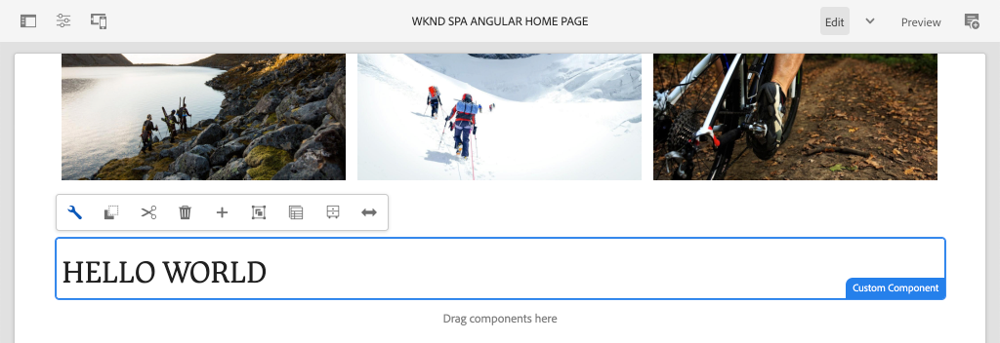

# Criar um componente personalizado {#custom-component}

Saiba como criar um componente personalizado a ser usado com o Editor de SPA de AEM. Saiba como desenvolver caixas de diálogo do autor e Modelos do Sling para estender o modelo JSON para preencher um componente personalizado.

## Objetivo

1. Entenda a função dos Modelos do Sling em manipular a API de modelo JSON fornecida pelo AEM.
2. Entenda como criar novas caixas de diálogo do componente AEM.
3. Saiba como criar um Componente de AEM **personalizado** que será compatível com a estrutura do editor de SPA.

## O que você vai criar

O foco dos capítulos anteriores era desenvolver componentes SPA e mapeá-los para *componentes principais AEM existentes*. Este capítulo se concentrará em como criar e estender *novos* componentes de AEM e manipular o modelo JSON servido por AEM.

Um simples `Custom Component` ilustra as etapas necessárias para criar um novo componente de AEM.



## Pré-requisitos

Revise as ferramentas e instruções necessárias para configurar um [ambiente de desenvolvimento local](overview.md#local-dev-environment).

### Obter o código

1. Baixe o ponto de partida para este tutorial via Git:

   ```shell
   $ git clone git@github.com:adobe/aem-guides-wknd-spa.git
   $ cd aem-guides-wknd-spa
   $ git checkout Angular/custom-component-start
   ```

2. Implante a base de código em uma instância de AEM local usando o Maven:

   ```shell
   $ mvn clean install -PautoInstallSinglePackage
   ```

   Se estiver usando [AEM 6.x](overview.md#compatibility) adicione o perfil `classic`:

   ```shell
   $ mvn clean install -PautoInstallSinglePackage -Pclassic
   ```

3. Instale o pacote concluído para o site de referência tradicional [WKND](https://github.com/adobe/aem-guides-wknd/releases/latest). As imagens fornecidas pelo [site de referência WKND](https://github.com/adobe/aem-guides-wknd/releases/latest) serão reutilizadas no SPA WKND. O pacote pode ser instalado usando [AEM Gerenciador de Pacotes](http://localhost:4502/crx/packmgr/index.jsp).

   

Você sempre pode visualizar o código concluído em [GitHub](https://github.com/adobe/aem-guides-wknd-spa/tree/Angular/custom-component-solution) ou verificar o código localmente ao alternar para a ramificação `Angular/custom-component-solution`.

## Definir o componente AEM

Um componente AEM é definido como um nó e propriedades. No projeto, esses nós e propriedades são representados como arquivos XML no módulo `ui.apps`. Em seguida, crie o componente AEM no módulo `ui.apps`.

>[!NOTE]
>
> Uma atualização rápida das [noções básicas dos componentes AEM pode ser útil](https://experienceleague.adobe.com/docs/experience-manager-learn/getting-started-wknd-tutorial-develop/project-archetype/component-basics.html).

1. No IDE de sua escolha, abra a pasta `ui.apps` .
2. Navegue até `ui.apps/src/main/content/jcr_root/apps/wknd-spa-angular/components` e crie uma nova pasta chamada `custom-component`.
3. Crie um novo arquivo chamado `.content.xml` abaixo da pasta `custom-component`. Preencha o `custom-component/.content.xml` com o seguinte:

   ```xml
   <?xml version="1.0" encoding="UTF-8"?>
   <jcr:root xmlns:sling="http://sling.apache.org/jcr/sling/1.0" xmlns:cq="http://www.day.com/jcr/cq/1.0" xmlns:jcr="http://www.jcp.org/jcr/1.0"
       jcr:primaryType="cq:Component"
       jcr:title="Custom Component"
       componentGroup="WKND SPA Angular - Content"/>
   ```

   

   `jcr:primaryType="cq:Component"` - identifica que este nó será um componente AEM.

   `jcr:title` é o valor que será exibido para Autores de conteúdo e o  `componentGroup` determina o agrupamento de componentes na interface do usuário de criação.

4. Abaixo da pasta `custom-component`, crie outra pasta chamada `_cq_dialog`.
5. Abaixo da pasta `_cq_dialog` crie um novo arquivo chamado `.content.xml` e preencha com o seguinte:

   ```xml
   <?xml version="1.0" encoding="UTF-8"?>
   <jcr:root xmlns:sling="http://sling.apache.org/jcr/sling/1.0" xmlns:granite="http://www.adobe.com/jcr/granite/1.0" xmlns:cq="http://www.day.com/jcr/cq/1.0" xmlns:jcr="http://www.jcp.org/jcr/1.0" xmlns:nt="http://www.jcp.org/jcr/nt/1.0"
       jcr:primaryType="nt:unstructured"
       jcr:title="Custom Component"
       sling:resourceType="cq/gui/components/authoring/dialog">
       <content
           jcr:primaryType="nt:unstructured"
           sling:resourceType="granite/ui/components/coral/foundation/container">
           <items jcr:primaryType="nt:unstructured">
               <tabs
                   jcr:primaryType="nt:unstructured"
                   sling:resourceType="granite/ui/components/coral/foundation/tabs"
                   maximized="{Boolean}true">
                   <items jcr:primaryType="nt:unstructured">
                       <properties
                           jcr:primaryType="nt:unstructured"
                           jcr:title="Properties"
                           sling:resourceType="granite/ui/components/coral/foundation/container"
                           margin="{Boolean}true">
                           <items jcr:primaryType="nt:unstructured">
                               <columns
                                   jcr:primaryType="nt:unstructured"
                                   sling:resourceType="granite/ui/components/coral/foundation/fixedcolumns"
                                   margin="{Boolean}true">
                                   <items jcr:primaryType="nt:unstructured">
                                       <column
                                           jcr:primaryType="nt:unstructured"
                                           sling:resourceType="granite/ui/components/coral/foundation/container">
                                           <items jcr:primaryType="nt:unstructured">
                                               <message
                                                   jcr:primaryType="nt:unstructured"
                                                   sling:resourceType="granite/ui/components/coral/foundation/form/textfield"
                                                   fieldDescription="The text to display on the component."
                                                   fieldLabel="Message"
                                                   name="./message"/>
                                           </items>
                                       </column>
                                   </items>
                               </columns>
                           </items>
                       </properties>
                   </items>
               </tabs>
           </items>
       </content>
   </jcr:root>
   ```

   

   O arquivo XML acima gera uma caixa de diálogo muito simples para o `Custom Component`. A parte crítica do arquivo é o nó interno `<message>`. Essa caixa de diálogo conterá um `textfield` simples chamado `Message` e manterá o valor do campo de texto em uma propriedade chamada `message`.

   Um Modelo do Sling será criado ao lado de expor o valor da propriedade `message` por meio do modelo JSON.

   >[!NOTE]
   >
   > Você pode visualizar muito mais [exemplos de caixas de diálogo ao visualizar as definições dos Componentes principais](https://github.com/adobe/aem-core-wcm-components/tree/master/content/src/content/jcr_root/apps/core/wcm/components). Também é possível exibir campos de formulário adicionais, como `select`, `textarea`, `pathfield`, disponíveis abaixo de `/libs/granite/ui/components/coral/foundation/form` em [CRXDE-Lite](http://localhost:4502/crx/de/index.jsp#/libs/granite/ui/components/coral/foundation/form).

   Com um componente de AEM tradicional, um script [HTL](https://experienceleague.adobe.com/docs/experience-manager-htl/using/overview.html?lang=pt-BR) normalmente é necessário. Como o SPA renderizará o componente, nenhum script HTL é necessário.

## Criar o Modelo do Sling

Os Modelos do Sling são objetos Java &quot;POJO&quot; (Plain Old Java Objects) orientados por anotações que facilitam o mapeamento de dados do JCR para variáveis Java. [O Sling ](https://experienceleague.adobe.com/docs/experience-manager-learn/getting-started-wknd-tutorial-develop/project-archetype/component-basics.html#sling-models) Modelstypicamente funciona para encapsular a lógica de negócios complexa do lado do servidor para componentes do AEM.

No contexto do Editor de SPA, os Modelos do Sling expõem o conteúdo de um componente por meio do modelo JSON por meio de um recurso usando o [Exportador de Modelo do Sling](https://experienceleague.adobe.com/docs/experience-manager-learn/foundation/development/develop-sling-model-exporter.html).

1. No IDE de sua escolha, abra o módulo `core`. `CustomComponent.java` e já  `CustomComponentImpl.java` foram criadas e eliminadas como parte do código inicial do capítulo.

   >[!NOTE]
   >
   > Se estiver usando o Visual Studio Code IDE, pode ser útil instalar [extensões para Java](https://code.visualstudio.com/docs/java/extensions).

2. Abra a interface Java `CustomComponent.java` em `core/src/main/java/com/adobe/aem/guides/wknd/spa/angular/core/models/CustomComponent.java`:

   

   Essa é a interface Java que será implementada pelo Modelo do Sling.

3. Atualize `CustomComponent.java` para estender a interface `ComponentExporter`:

   ```java
   package com.adobe.aem.guides.wknd.spa.angular.core.models;
   import com.adobe.cq.export.json.ComponentExporter;
   
   public interface CustomComponent extends ComponentExporter {
   
       public String getMessage();
   
   }
   ```

   A implementação da interface `ComponentExporter` é um requisito para que o Modelo do Sling seja selecionado automaticamente pela API do modelo JSON.

   A interface `CustomComponent` inclui um único método getter `getMessage()`. Esse é o método que exporá o valor da caixa de diálogo do autor por meio do modelo JSON. Somente métodos getter com parâmetros vazios `()` serão exportados no modelo JSON.

4. Abra `CustomComponentImpl.java` em `core/src/main/java/com/adobe/aem/guides/wknd/spa/angular/core/models/impl/CustomComponentImpl.java`.

   Esta é a implementação da interface `CustomComponent`. A anotação `@Model` identifica a classe Java como um Modelo do Sling. A anotação `@Exporter` permite que a classe Java seja serializada e exportada por meio do Exportador de Modelo do Sling.

5. Atualize a variável estática `RESOURCE_TYPE` para apontar para o componente AEM `wknd-spa-angular/components/custom-component` criado no exercício anterior.

   ```java
   static final String RESOURCE_TYPE = "wknd-spa-angular/components/custom-component";
   ```

   O tipo de recurso do componente é o que vinculará o Modelo do Sling ao componente AEM e será mapeado ao componente do Angular.

6. Adicione o método `getExportedType()` à classe `CustomComponentImpl` para retornar o tipo de recurso do componente:

   ```java
   @Override
   public String getExportedType() {
       return CustomComponentImpl.RESOURCE_TYPE;
   }
   ```

   Esse método é necessário ao implementar a interface `ComponentExporter` e exporá o tipo de recurso que permite o mapeamento para o componente de Angular.

7. Atualize o método `getMessage()` para retornar o valor da propriedade `message` mantida pela caixa de diálogo do autor. Use a anotação `@ValueMap` para mapear o valor JCR `message` para uma variável Java:

   ```java
   import org.apache.commons.lang3.StringUtils;
   ...
   
   @ValueMapValue
   private String message;
   
   @Override
   public String getMessage() {
       return StringUtils.isNotBlank(message) ? message.toUpperCase() : null;
   }
   ```

   Alguns outros termos de &quot;lógica comercial&quot; são adicionados para retornar o valor da mensagem em maiúsculas. Isso nos permitirá ver a diferença entre o valor bruto armazenado pela caixa de diálogo do autor e o valor exposto pelo Modelo do Sling.

   >[!NOTE]
   >
   > Você pode visualizar o [CustomComponentImpl.java concluído aqui](https://github.com/adobe/aem-guides-wknd-spa/blob/Angular/custom-component-solution/core/src/main/java/com/adobe/aem/guides/wknd/spa/angular/core/models/impl/CustomComponentImpl.java).

## Atualizar o componente do Angular

O código de Angular do Componente personalizado já foi criado. Em seguida, faça algumas atualizações para mapear o componente Angular para o componente AEM.

1. No módulo `ui.frontend`, abra o arquivo `ui.frontend/src/app/components/custom/custom.component.ts`
2. Observe a linha `@Input() message: string;`. Espera-se que o valor em maiúsculas transformado seja mapeado para essa variável.
3. Importe o objeto `MapTo` do SDK JS do Editor de SPA AEM e use-o para mapear para o componente AEM:

   ```diff
   + import {MapTo} from '@adobe/cq-angular-editable-components';
   
    ...
    export class CustomComponent implements OnInit {
        ...
    }
   
   + MapTo('wknd-spa-angular/components/custom-component')(CustomComponent, CustomEditConfig);
   ```

4. Abra `cutom.component.html` e observe que o valor de `{{message}}` será exibido no lado de uma tag `<h2>`.
5. Abra `custom.component.css` e adicione a seguinte regra:

   ```css
   :host-context {
       display: block;
   }
   ```

   Para que o Espaço reservado do Editor de AEM seja exibido corretamente quando o componente estiver vazio, o `:host-context` ou outro `<div>` precisa ser definido como `display: block;`.

6. Implante todas as atualizações em um ambiente de AEM local a partir da raiz do diretório do projeto, usando suas habilidades Maven:

   ```shell
   $ cd aem-guides-wknd-spa
   $ mvn clean install -PautoInstallSinglePackage
   ```

## Atualizar a Política de Modelo

Em seguida, navegue até AEM para verificar as atualizações e permitir que `Custom Component` seja adicionado ao SPA.

1. Verifique o registro do novo Modelo do Sling navegando até [http://localhost:4502/system/console/status-slingmodels](http://localhost:4502/system/console/status-slingmodels).

   ```plain
   com.adobe.aem.guides.wknd.spa.angular.core.models.impl.CustomComponentImpl - wknd-spa-angular/components/custom-component
   
   com.adobe.aem.guides.wknd.spa.angular.core.models.impl.CustomComponentImpl exports 'wknd-spa-angular/components/custom-component' with selector 'model' and extension '[Ljava.lang.String;@6fb4a693' with exporter 'jackson'
   ```

   Você deve ver as duas linhas acima que indicam que `CustomComponentImpl` está associado ao componente `wknd-spa-angular/components/custom-component` e que está registrado por meio do Exportador de Modelo do Sling.

2. Navegue até o Modelo de página de SPA em [http://localhost:4502/editor.html/conf/wknd-spa-angular/settings/wcm/templates/spa-page-template/structure.html](http://localhost:4502/editor.html/conf/wknd-spa-angular/settings/wcm/templates/spa-page-template/structure.html).
3. Atualize a política do Contêiner de layout para adicionar o novo `Custom Component` como um componente permitido:

   

   Salve as alterações na política e observe o `Custom Component` como um componente permitido:

   

## Crie o componente personalizado

Em seguida, crie o `Custom Component` usando o Editor de SPA AEM.

1. Navegue até [http://localhost:4502/editor.html/content/wknd-spa-angular/us/en/home.html](http://localhost:4502/editor.html/content/wknd-spa-angular/us/en/home.html).
2. No modo `Edit`, adicione o `Custom Component` ao `Layout Container`:

   

3. Abra a caixa de diálogo do componente e insira uma mensagem que contenha algumas letras minúsculas.

   

   Esta é a caixa de diálogo que foi criada com base no arquivo XML anterior no capítulo.

4. Salve as alterações. Observe que a mensagem exibida está em todas as letras maiúsculas e minúsculas.

   

5. Visualize o modelo JSON navegando até [http://localhost:4502/content/wknd-spa-angular/us/en.model.json](http://localhost:4502/content/wknd-spa-angular/us/en.model.json). Pesquisar `wknd-spa-angular/components/custom-component`:

   ```json
   "custom_component_208183317": {
       "message": "HELLO WORLD",
       ":type": "wknd-spa-angular/components/custom-component"
   }
   ```

   Observe que o valor JSON é definido como todas as letras maiúsculas com base na lógica adicionada ao Modelo do Sling.

## Parabéns! {#congratulations}

Parabéns, você aprendeu a criar um componente de AEM personalizado e como os Modelos e diálogos do Sling funcionam com o modelo JSON.

Você sempre pode visualizar o código concluído em [GitHub](https://github.com/adobe/aem-guides-wknd-spa/tree/Angular/custom-component-solution) ou verificar o código localmente ao alternar para a ramificação `Angular/custom-component-solution`.

### Próximas etapas {#next-steps}

[Estender um componente principal](extend-component.md)  - saiba como estender um componente principal existente para ser usado com o editor de SPA do AEM. Entender como adicionar propriedades e conteúdo a um componente existente é uma técnica avançada para expandir os recursos de uma implementação do Editor de SPA AEM.
