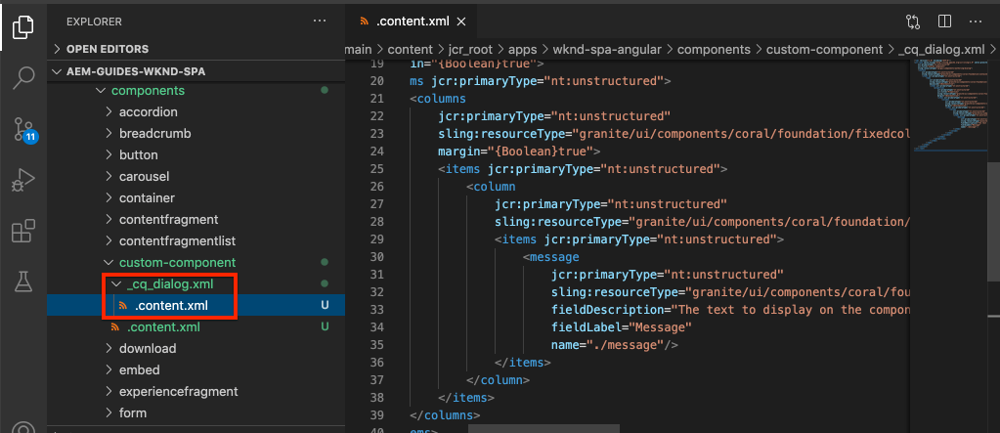

# Criar um componente personalizado {#custom-component}

Saiba como criar um componente personalizado a ser usado com o Editor de SPA AEM. Saiba como desenvolver caixas de diálogo de criação e Modelos Sling para estender o modelo JSON e preencher um componente personalizado.

## Objetivo

1. Entenda a função dos Modelos do Sling na manipulação da API do modelo JSON fornecida pelo AEM.
2. Saiba como criar caixas de diálogo de componente do AEM.
3. Saiba como criar um **personalizado** Componente de AEM compatível com a estrutura do editor de SPA.

## O que você vai criar

O foco dos capítulos anteriores era desenvolver componentes do SPA e mapeá-los para *existente* Componentes principais do AEM. Este capítulo se concentra em como criar e estender *novo* Componentes do AEM e manipular o modelo JSON distribuído pelo AEM.

Um simples `Custom Component` A ilustra as etapas necessárias para criar um novo componente AEM.


## Pré-requisitos

Analisar as ferramentas e instruções necessárias para a configuração de um [ambiente de desenvolvimento local](overview.md#local-dev-environment).

### Obter o código

1. Baixe o ponto de partida para este tutorial pelo Git:

   ```shell
   $ git clone git@github.com:adobe/aem-guides-wknd-spa.git
   $ cd aem-guides-wknd-spa
   $ git checkout Angular/custom-component-start
   ```

2. Implante a base de código em uma instância de AEM local usando Maven:

   ```shell
   $ mvn clean install -PautoInstallSinglePackage
   ```

   Se estiver usando [AEM 6.x](overview.md#compatibility) adicione o `classic` perfil:

   ```shell
   $ mvn clean install -PautoInstallSinglePackage -Pclassic
   ```

3. Instale o pacote concluído para o tradicional [Site de referência da WKND](https://github.com/adobe/aem-guides-wknd/releases/latest). As imagens fornecidas por [Site de referência da WKND](https://github.com/adobe/aem-guides-wknd/releases/latest) são reutilizados no SPA WKND. O pacote pode ser instalado usando [Gerenciador de pacotes AEM](http://localhost:4502/crx/packmgr/index.jsp).

   

Você sempre pode exibir o código concluído em [GitHub](https://github.com/adobe/aem-guides-wknd-spa/tree/Angular/custom-component-solution) ou confira o código localmente alternando para a ramificação `Angular/custom-component-solution`.

## Definir o componente AEM

Um componente AEM é definido como um nó e propriedades. No projeto, esses nós e propriedades são representados como arquivos XML na variável `ui.apps` módulo. Em seguida, crie o componente AEM no `ui.apps` módulo.

>[!NOTE]
>
> Uma atualização rápida no [as noções básicas dos componentes do AEM podem ser úteis](https://experienceleague.adobe.com/docs/experience-manager-learn/getting-started-wknd-tutorial-develop/project-archetype/component-basics.html).

1. Abra o `ui.apps` no IDE de sua escolha.
2. Navegue até `ui.apps/src/main/content/jcr_root/apps/wknd-spa-angular/components` e crie uma pasta chamada `custom-component`.
3. Crie um arquivo chamado `.content.xml` abaixo de `custom-component` pasta. Preencha o `custom-component/.content.xml` com o seguinte:

   ```xml
   <?xml version="1.0" encoding="UTF-8"?>
   <jcr:root xmlns:sling="http://sling.apache.org/jcr/sling/1.0" xmlns:cq="http://www.day.com/jcr/cq/1.0" xmlns:jcr="http://www.jcp.org/jcr/1.0"
       jcr:primaryType="cq:Component"
       jcr:title="Custom Component"
       componentGroup="WKND SPA Angular - Content"/>
   ```

   

   `jcr:primaryType="cq:Component"` - identifica que este nó é um componente AEM.

   `jcr:title` é o valor exibido para os Autores de conteúdo e a `componentGroup` determina o agrupamento de componentes na interface de criação.

4. Abaixo de `custom-component` , crie outra pasta chamada `_cq_dialog`.
5. Abaixo de `_cq_dialog` pasta criar um arquivo chamado `.content.xml` e preencha-o com o seguinte:

   ```xml
   <?xml version="1.0" encoding="UTF-8"?>
   <jcr:root xmlns:sling="http://sling.apache.org/jcr/sling/1.0" xmlns:granite="http://www.adobe.com/jcr/granite/1.0" xmlns:cq="http://www.day.com/jcr/cq/1.0" xmlns:jcr="http://www.jcp.org/jcr/1.0" xmlns:nt="http://www.jcp.org/jcr/nt/1.0"
       jcr:primaryType="nt:unstructured"
       jcr:title="Custom Component"
       sling:resourceType="cq/gui/components/authoring/dialog">
       <content
           jcr:primaryType="nt:unstructured"
           sling:resourceType="granite/ui/components/coral/foundation/container">
           <items jcr:primaryType="nt:unstructured">
               <tabs
                   jcr:primaryType="nt:unstructured"
                   sling:resourceType="granite/ui/components/coral/foundation/tabs"
                   maximized="{Boolean}true">
                   <items jcr:primaryType="nt:unstructured">
                       <properties
                           jcr:primaryType="nt:unstructured"
                           jcr:title="Properties"
                           sling:resourceType="granite/ui/components/coral/foundation/container"
                           margin="{Boolean}true">
                           <items jcr:primaryType="nt:unstructured">
                               <columns
                                   jcr:primaryType="nt:unstructured"
                                   sling:resourceType="granite/ui/components/coral/foundation/fixedcolumns"
                                   margin="{Boolean}true">
                                   <items jcr:primaryType="nt:unstructured">
                                       <column
                                           jcr:primaryType="nt:unstructured"
                                           sling:resourceType="granite/ui/components/coral/foundation/container">
                                           <items jcr:primaryType="nt:unstructured">
                                               <message
                                                   jcr:primaryType="nt:unstructured"
                                                   sling:resourceType="granite/ui/components/coral/foundation/form/textfield"
                                                   fieldDescription="The text to display on the component."
                                                   fieldLabel="Message"
                                                   name="./message"/>
                                           </items>
                                       </column>
                                   </items>
                               </columns>
                           </items>
                       </properties>
                   </items>
               </tabs>
           </items>
       </content>
   </jcr:root>
   ```

   

   O arquivo XML acima gera uma caixa de diálogo simples para o `Custom Component`. A parte crítica do arquivo é a parte interna `<message>` nó. Esta caixa de diálogo contém uma `textfield` nomeado `Message` e persistir o valor do campo de texto em uma propriedade chamada `message`.

   Um modelo Sling é criado ao lado do para expor o valor do `message` propriedade por meio do modelo JSON.

   >[!NOTE]
   >
   > Você pode ver muito mais [exemplos de caixas de diálogo exibindo as definições dos Componentes principais](https://github.com/adobe/aem-core-wcm-components/tree/master/content/src/content/jcr_root/apps/core/wcm/components). Também é possível exibir campos de formulário adicionais, como `select`, `textarea`, `pathfield`, disponível abaixo de `/libs/granite/ui/components/coral/foundation/form` in [CRXDE-Lite](http://localhost:4502/crx/de/index.jsp#/libs/granite/ui/components/coral/foundation/form).

   Com um componente AEM tradicional, um [HTL](https://experienceleague.adobe.com/docs/experience-manager-htl/content/overview.html?lang=pt-BR) normalmente é necessário. Como o SPA renderiza o componente, nenhum script HTL é necessário.

## Criar o modelo do Sling

Os Modelos do Sling são objetos POJO (Plain Old Java™ Objects) do Java™ orientados por anotações que facilitam o mapeamento de dados do JCR para as variáveis do Java™. [Modelos Sling](https://experienceleague.adobe.com/docs/experience-manager-learn/getting-started-wknd-tutorial-develop/project-archetype/component-basics.html#sling-models) geralmente funcionam para encapsular uma lógica comercial complexa do lado do servidor para componentes AEM.

No contexto do Editor de SPA, os Modelos Sling expõem o conteúdo de um componente por meio do modelo JSON por meio de um recurso que usa o [Exportador de modelo Sling](https://experienceleague.adobe.com/docs/experience-manager-learn/foundation/development/develop-sling-model-exporter.html?lang=pt-BR).

1. No IDE de sua escolha, abra o `core` módulo. `CustomComponent.java` e `CustomComponentImpl.java` já foram criadas e compactadas como parte do código inicial do capítulo.

   >[!NOTE]
   >
   > Se estiver usando o Visual Studio Code IDE, pode ser útil instalar [extensões para Java™](https://code.visualstudio.com/docs/java/extensions).

2. Abra a interface Java™ `CustomComponent.java` em `core/src/main/java/com/adobe/aem/guides/wknd/spa/angular/core/models/CustomComponent.java`:

   

   Essa é a interface Java™ implementada pelo Modelo Sling.

3. Atualizar `CustomComponent.java` para que estenda a `ComponentExporter` interface:

   ```java
   package com.adobe.aem.guides.wknd.spa.angular.core.models;
   import com.adobe.cq.export.json.ComponentExporter;
   
   public interface CustomComponent extends ComponentExporter {
   
       public String getMessage();
   
   }
   ```

   A implementação da `ComponentExporter` é um requisito para que o Modelo Sling seja selecionado automaticamente pela API do modelo JSON.

   A variável `CustomComponent` a interface inclui um único método getter `getMessage()`. Esse é o método que expõe o valor da caixa de diálogo do autor por meio do modelo JSON. Somente métodos Getter com parâmetros vazios `()` são exportados no modelo JSON.

4. Abertura `CustomComponentImpl.java` em `core/src/main/java/com/adobe/aem/guides/wknd/spa/angular/core/models/impl/CustomComponentImpl.java`.

   Trata-se da implementação do `CustomComponent` interface. A variável `@Model` A anotação identifica a classe Java™ como um Modelo Sling. A variável `@Exporter` A anotação permite que a classe Java™ seja serializada e exportada por meio do Exportador de modelo do Sling.

5. Atualizar a variável estática `RESOURCE_TYPE` para apontar para o componente AEM `wknd-spa-angular/components/custom-component` criado no exercício anterior.

   ```java
   static final String RESOURCE_TYPE = "wknd-spa-angular/components/custom-component";
   ```

   O tipo de recurso do componente é o que vincula o Modelo Sling ao componente AEM e, por fim, mapeia para o componente Angular.

6. Adicione o `getExportedType()` para o `CustomComponentImpl` classe para retornar o tipo de recurso do componente:

   ```java
   @Override
   public String getExportedType() {
       return CustomComponentImpl.RESOURCE_TYPE;
   }
   ```

   Esse método é necessário ao implementar a `ComponentExporter` e expõe o tipo de recurso que permite o mapeamento para o componente de Angular.

7. Atualize o `getMessage()` método para retornar o valor de `message` propriedade mantida pela caixa de diálogo do autor. Use o `@ValueMap` a anotação é mapear o valor JCR `message` para uma variável Java™:

   ```java
   import org.apache.commons.lang3.StringUtils;
   ...
   
   @ValueMapValue
   private String message;
   
   @Override
   public String getMessage() {
       return StringUtils.isNotBlank(message) ? message.toUpperCase() : null;
   }
   ```

   Alguma &quot;lógica de negócios&quot; adicional é adicionada para retornar o valor da mensagem como maiúsculas. Isso nos permite ver a diferença entre o valor bruto armazenado pela caixa de diálogo do autor e o valor exposto pelo Modelo do Sling.

   >[!NOTE]
   >
   > É possível exibir a [CustomComponentImpl.java concluído aqui](https://github.com/adobe/aem-guides-wknd-spa/blob/Angular/custom-component-solution/core/src/main/java/com/adobe/aem/guides/wknd/spa/angular/core/models/impl/CustomComponentImpl.java).

## Atualizar o componente de Angular

O código de Angular do componente personalizado já foi criado. Em seguida, faça algumas atualizações para mapear o componente Angular para o componente AEM.

1. No `ui.frontend` módulo abra o arquivo `ui.frontend/src/app/components/custom/custom.component.ts`
2. Observe a `@Input() message: string;` linha. Espera-se que o valor em maiúsculas transformado seja mapeado para essa variável.
3. Importe o `MapTo` do SDK JS do Editor SPA AEM e use-o para mapear para o componente AEM:

   ```diff
   + import {MapTo} from '@adobe/cq-angular-editable-components';
   
    ...
    export class CustomComponent implements OnInit {
        ...
    }
   
   + MapTo('wknd-spa-angular/components/custom-component')(CustomComponent, CustomEditConfig);
   ```

4. Abertura `cutom.component.html` e observe que o valor de `{{message}}` é exibido ao lado de um `<h2>` tag.
5. Abertura `custom.component.css` e adicione a seguinte regra:

   ```css
   :host-context {
       display: block;
   }
   ```

   Para que o marcador de posição do editor de AEM seja exibido corretamente, quando o componente estiver vazio, o `:host-context` ou outro `<div>` precisa ser definido como `display: block;`.

6. Implante as atualizações em um ambiente AEM local da raiz do diretório do projeto, usando suas habilidades em Maven:

   ```shell
   $ cd aem-guides-wknd-spa
   $ mvn clean install -PautoInstallSinglePackage
   ```

## Atualizar a política do modelo

Em seguida, acesse AEM para verificar as atualizações e permitir a `Custom Component` para ser adicionado ao SPA.

1. Verifique o registro do novo Modelo do Sling navegando até [http://localhost:4502/system/console/status-slingmodels](http://localhost:4502/system/console/status-slingmodels).

   ```plain
   com.adobe.aem.guides.wknd.spa.angular.core.models.impl.CustomComponentImpl - wknd-spa-angular/components/custom-component
   
   com.adobe.aem.guides.wknd.spa.angular.core.models.impl.CustomComponentImpl exports 'wknd-spa-angular/components/custom-component' with selector 'model' and extension '[Ljava.lang.String;@6fb4a693' with exporter 'jackson'
   ```

   Você deve ver as duas linhas acima que indicam a `CustomComponentImpl` está associado à `wknd-spa-angular/components/custom-component` e que está registrado por meio do Exportador de Modelo Sling.

2. Navegue até o modelo de página SPA em [http://localhost:4502/editor.html/conf/wknd-spa-angular/settings/wcm/templates/spa-page-template/structure.html](http://localhost:4502/editor.html/conf/wknd-spa-angular/settings/wcm/templates/spa-page-template/structure.html).
3. Atualize a política do Contêiner de layout para adicionar o novo `Custom Component` como um componente permitido:

   

   Salve as alterações na política e observe as `Custom Component` como um componente permitido:

   

## Criar o componente personalizado

Em seguida, crie o `Custom Component` uso do editor SPA AEM.

1. Navegue até [http://localhost:4502/editor.html/content/wknd-spa-angular/us/en/home.html](http://localhost:4502/editor.html/content/wknd-spa-angular/us/en/home.html).
2. Entrada `Edit` , adicione o `Custom Component` para o `Layout Container`:

   

3. Abra a caixa de diálogo do componente e insira uma mensagem que contenha algumas letras minúsculas.

   

   Esta é a caixa de diálogo que foi criada com base no arquivo XML mencionado anteriormente no capítulo.

4. Salve as alterações. Observe que a mensagem exibida está em maiúsculas.

   

5. Visualize o modelo JSON navegando até [http://localhost:4502/content/wknd-spa-angular/us/en.model.json](http://localhost:4502/content/wknd-spa-angular/us/en.model.json). Pesquisar por `wknd-spa-angular/components/custom-component`:

   ```json
   "custom_component_208183317": {
       "message": "HELLO WORLD",
       ":type": "wknd-spa-angular/components/custom-component"
   }
   ```

   Observe que o valor JSON está definido como todas as letras maiúsculas com base na lógica adicionada ao Modelo Sling.

## Parabéns. {#congratulations}

Parabéns, você aprendeu a criar um componente AEM personalizado e como os Modelos e caixas de diálogo do Sling funcionam com o modelo JSON.

Você sempre pode exibir o código concluído em [GitHub](https://github.com/adobe/aem-guides-wknd-spa/tree/Angular/custom-component-solution) ou confira o código localmente alternando para a ramificação `Angular/custom-component-solution`.

### Próximas etapas {#next-steps}

[Estender um Componente principal](extend-component.md) - Saiba como estender um Componente principal existente para ser usado com o Editor de SPA AEM. AEM Entender como adicionar propriedades e conteúdo a um componente existente é uma técnica poderosa para expandir os recursos de uma implementação do Editor de SPA.
