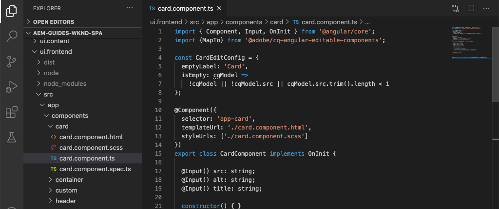

# Estender um Componente principal {#extend-component}

Saiba como estender um Componente principal existente para ser usado com o Editor SPA do AEM. Entender como estender um componente existente é uma técnica poderosa para personalizar e expandir os recursos de uma implementação do Editor SPA do AEM.

## Objetivo

1. Estender um Componente principal existente com propriedades e conteúdo adicionais.
2. Entenda o básico da Herança de componentes com o uso de `sling:resourceSuperType`.
3. Saiba como usar o [Padrão de delegação](https://github.com/adobe/aem-core-wcm-components/wiki/Delegation-Pattern-for-Sling-Models) para Modelos do Sling para reutilizar a lógica e a funcionalidade existentes.

## O que você vai criar

Neste capítulo, um novo componente `Card` é criado. O componente `Card` estende o [Componente principal da imagem](https://experienceleague.adobe.com/docs/experience-manager-core-components/using/components/image.html?lang=pt-BR) adicionando campos de conteúdo adicionais, como um Título e um botão de Chamada para Ação, para executar a função de um teaser para outro conteúdo no SPA.


>[!NOTE]
>
> Em uma implementação real, pode ser mais apropriado simplesmente usar o [Componente de Teaser](https://experienceleague.adobe.com/docs/experience-manager-core-components/using/components/teaser.html?lang=pt-BR) do que estender o [Componente Principal da Imagem](https://experienceleague.adobe.com/docs/experience-manager-core-components/using/components/image.html?lang=pt-BR) para criar um componente `Card`, dependendo dos requisitos do projeto. É sempre recomendável usar [Componentes principais](https://experienceleague.adobe.com/docs/experience-manager-core-components/using/introduction.html?lang=pt-BR) diretamente quando possível.

## Pré-requisitos

Revise as ferramentas e instruções necessárias para configurar um [ambiente de desenvolvimento local](overview.md#local-dev-environment).

### Obter o código

1. Baixe o ponto de partida para este tutorial pelo Git:

   ```shell
   $ git clone git@github.com:adobe/aem-guides-wknd-spa.git
   $ cd aem-guides-wknd-spa
   $ git checkout Angular/extend-component-start
   ```

2. Implante a base de código em uma instância do AEM local usando Maven:

   ```shell
   $ mvn clean install -PautoInstallSinglePackage
   ```

   Se estiver usando o [AEM 6.x](overview.md#compatibility), adicione o perfil `classic`:

   ```shell
   $ mvn clean install -PautoInstallSinglePackage -Pclassic
   ```

3. Instale o pacote concluído para o [site de referência WKND](https://github.com/adobe/aem-guides-wknd/releases/tag/aem-guides-wknd-2.1.0) tradicional. As imagens fornecidas pelo [site de referência WKND](https://github.com/adobe/aem-guides-wknd/releases/latest) são reutilizadas no SPA do WKND. O pacote pode ser instalado usando o [Gerenciador de Pacotes](http://localhost:4502/crx/packmgr/index.jsp) da AEM.

    do Gerenciador de Pacotes

Você sempre pode exibir o código concluído em [GitHub](https://github.com/adobe/aem-guides-wknd-spa/tree/Angular/extend-component-solution) ou conferir o código localmente alternando para a ramificação `Angular/extend-component-solution`.

## Inspecionar implementação inicial da placa

Um componente Cartão inicial foi fornecido pelo código inicial do capítulo. Inspecione o ponto de partida para a implementação da placa.

1. No IDE de sua escolha, abra o módulo `ui.apps`.
2. Navegue até `ui.apps/src/main/content/jcr_root/apps/wknd-spa-angular/components/card` e exiba o arquivo `.content.xml`.

   

   ```xml
   <?xml version="1.0" encoding="UTF-8"?>
   <jcr:root xmlns:sling="http://sling.apache.org/jcr/sling/1.0" xmlns:cq="http://www.day.com/jcr/cq/1.0" xmlns:jcr="http://www.jcp.org/jcr/1.0"
       jcr:primaryType="cq:Component"
       jcr:title="Card"
       sling:resourceSuperType="wknd-spa-angular/components/image"
       componentGroup="WKND SPA Angular - Content"/>
   ```

   A propriedade `sling:resourceSuperType` aponta para `wknd-spa-angular/components/image`, indicando que o componente `Card` herda a funcionalidade do componente de Imagem SPA WKND.

3. Inspecione o arquivo `ui.apps/src/main/content/jcr_root/apps/wknd-spa-angular/components/image/.content.xml`:

   ```xml
   <?xml version="1.0" encoding="UTF-8"?>
   <jcr:root xmlns:sling="http://sling.apache.org/jcr/sling/1.0" xmlns:cq="http://www.day.com/jcr/cq/1.0" xmlns:jcr="http://www.jcp.org/jcr/1.0"
       jcr:primaryType="cq:Component"
       jcr:title="Image"
       sling:resourceSuperType="core/wcm/components/image/v2/image"
       componentGroup="WKND SPA Angular - Content"/>
   ```

   Observe que `sling:resourceSuperType` aponta para `core/wcm/components/image/v2/image`. Isso indica que o componente de Imagem SPA do WKND herda a funcionalidade da Imagem do componente principal.

   Também conhecido como [Padrão de proxy](https://experienceleague.adobe.com/docs/experience-manager-core-components/using/developing/guidelines.html?lang=pt-BR#proxy-component-pattern), a herança de recursos do Sling é um padrão de design avançado que permite que os componentes secundários herdem funcionalidade e estendam/substituam o comportamento quando desejado. A herança do Sling oferece suporte a vários níveis de herança, de modo que, por fim, o novo componente `Card` herda a funcionalidade da Imagem do componente principal.

   Muitas equipes de desenvolvimento se esforçam para ser D.R.Y. (não se repita). A herança do Sling torna isso possível com o AEM.

4. Abaixo da pasta `card`, abra o arquivo `_cq_dialog/.content.xml`.

   Este arquivo é a definição de Caixa de Diálogo de Componente para o componente `Card`. Se estiver usando a herança do Sling, é possível usar os recursos do [Sling Resource Merger](https://experienceleague.adobe.com/docs/experience-manager-65/developing/platform/sling-resource-merger.html?lang=pt-BR) para substituir ou estender partes da caixa de diálogo. Neste exemplo, uma nova guia foi adicionada à caixa de diálogo para capturar dados adicionais de um autor para preencher o componente Cartão.

   Propriedades como `sling:orderBefore` permitem que um desenvolvedor escolha onde inserir novas guias ou campos de formulário. Nesse caso, a guia `Text` é inserida antes da guia `asset`. Para usar totalmente o Sling Resource Merger, é importante conhecer a estrutura original do nó de diálogo da [caixa de diálogo do componente de Imagem](https://github.com/adobe/aem-core-wcm-components/blob/master/content/src/content/jcr_root/apps/core/wcm/components/image/v2/image/_cq_dialog/.content.xml).

5. Abaixo da pasta `card`, abra o arquivo `_cq_editConfig.xml`. Esse arquivo determina o comportamento de arrastar e soltar na interface de criação do AEM. Ao estender o componente de Imagem, é importante que o tipo de recurso corresponda ao próprio componente. Revise o nó `<parameters>`:

   ```xml
   <parameters
       jcr:primaryType="nt:unstructured"
       sling:resourceType="wknd-spa-angular/components/card"
       imageCrop=""
       imageMap=""
       imageRotate=""/>
   ```

   A maioria dos componentes não requer um `cq:editConfig`. A Imagem e os descendentes secundários do componente de Imagem são exceções.

6. No IDE, alterne para o módulo `ui.frontend`, navegando para `ui.frontend/src/app/components/card`:

   

7. Inspecione o arquivo `card.component.ts`.

   O componente já foi esvaziado para mapear para o Componente `Card` do AEM usando a função `MapTo` padrão.

   ```js
   MapTo('wknd-spa-angular/components/card')(CardComponent, CardEditConfig);
   ```

   Revise os três parâmetros `@Input` na classe para `src`, `alt` e `title`. Esses são valores JSON esperados do componente AEM que são mapeados para o componente Angular.

8. Abra o arquivo `card.component.html`:

   ```html
   <div class="card"  *ngIf="hasContent">
       <app-image class="card__image" [src]="src" [alt]="alt" [title]="title"></app-image>
   </div>
   ```

   Neste exemplo, optamos por reutilizar o componente de Imagem do Angular existente `app-image` simplesmente passando os parâmetros `@Input` de `card.component.ts`. Posteriormente no tutorial, propriedades adicionais são adicionadas e exibidas.

## Atualizar a política do modelo

Com esta implementação inicial `Card`, analise a funcionalidade no Editor SPA do AEM. Para ver o componente `Card` inicial, é necessário atualizar a diretiva Modelo.

1. Implante o código inicial em uma instância local do AEM, se você ainda não tiver:

   ```shell
   $ cd aem-guides-wknd-spa
   $ mvn clean install -PautoInstallSinglePackage
   ```

2. Navegue até o Modelo de página do SPA em [http://localhost:4502/editor.html/conf/wknd-spa-angular/settings/wcm/templates/spa-page-template/structure.html](http://localhost:4502/editor.html/conf/wknd-spa-angular/settings/wcm/templates/spa-page-template/structure.html).
3. Atualize a política do Contêiner de Layout para adicionar o novo componente `Card` como um componente permitido:

   

   Salve as alterações na política e observe o componente `Card` como um componente permitido:

   

## Componente Cartão inicial do autor

Em seguida, crie o componente `Card` usando o Editor SPA do AEM.

1. Navegue até [http://localhost:4502/editor.html/content/wknd-spa-angular/us/en/home.html](http://localhost:4502/editor.html/content/wknd-spa-angular/us/en/home.html).
2. No modo `Edit`, adicione o componente `Card` a `Layout Container`:

   

3. Arraste e solte uma imagem do Localizador de ativos no componente `Card`:

   

4. Abra a caixa de diálogo do componente `Card` e observe a adição de uma guia **Texto**.
5. Insira os seguintes valores na guia **Texto**:

   

   **Caminho do cartão** - escolha uma página abaixo da página inicial do SPA.

   **Texto Do CTA** - &quot;Leia Mais&quot;

   **Título do cartão** - deixe em branco

   **Obter título da página vinculada** - marque a caixa de seleção para indicar verdadeiro.

6. Atualize a guia **Metadados do ativo** para adicionar valores para **Texto alternativo** e **Legenda**.

   No momento, nenhuma alteração adicional é exibida após a atualização da caixa de diálogo. Para expor os novos campos ao componente do Angular, precisamos atualizar o Modelo Sling do componente `Card`.

7. Abra uma nova guia e navegue até [CRXDE-Lite](http://localhost:4502/crx/de/index.jsp#/content/wknd-spa-angular/us/en/home/jcr%3Acontent/root/responsivegrid/card). Inspecione os nós de conteúdo abaixo de `/content/wknd-spa-angular/us/en/home/jcr:content/root/responsivegrid` para localizar o conteúdo do componente `Card`.

   

   Observe que as propriedades `cardPath`, `ctaText`, `titleFromPage` são mantidas pela caixa de diálogo.

## Atualizar modelo Sling do cartão

Para expor os valores da caixa de diálogo do componente para o componente Angular, precisamos atualizar o Modelo do Sling que preenche o JSON para o componente `Card`. Também temos a oportunidade de implementar duas partes da lógica de negócios:

* Se `titleFromPage` for **true**, retorna o título da página especificada por `cardPath`; caso contrário, retorna o valor de textfield `cardTitle`.
* Retorna a data da última modificação da página especificada por `cardPath`.

Retorne ao IDE de sua escolha e abra o módulo `core`.

1. Abra o arquivo `Card.java` em `core/src/main/java/com/adobe/aem/guides/wknd/spa/angular/core/models/Card.java`.

   Observe que a interface `Card` estende atualmente `com.adobe.cq.wcm.core.components.models.Image` e, portanto, herda os métodos da interface `Image`. A interface `Image` já estende a interface `ComponentExporter`, o que permite que o Modelo Sling seja exportado como JSON e mapeado pelo editor de SPA. Portanto, não precisamos estender explicitamente a interface `ComponentExporter` como fizemos no [capítulo Componente personalizado](custom-component.md).

2. Adicione os seguintes métodos à interface:

   ```java
   @ProviderType
   public interface Card extends Image {
   
       /***
       * The URL to populate the CTA button as part of the card.
       * The link should be based on the cardPath property that points to a page.
       * @return String URL
       */
       public String getCtaLinkURL();
   
       /***
       * The text to display on the CTA button of the card.
       * @return String CTA text
       */
       public String getCtaText();
   
   
   
       /***
       * The date to be displayed as part of the card.
       * This is based on the last modified date of the page specified by the cardPath
       * @return
       */
       public Calendar getCardLastModified();
   
   
       /**
       * Return the title of the page specified by cardPath if `titleFromPage` is set to true.
       * Otherwise return the value of `cardTitle`
       * @return
       */
       public String getCardTitle();
   }
   ```

   Esses métodos são expostos por meio da API do modelo JSON e passados para o componente Angular.

3. Abrir `CardImpl.java`. Esta é a implementação da interface `Card.java`. Esta implementação foi parcialmente removida para acelerar o tutorial.  Observe o uso das anotações `@Model` e `@Exporter` para garantir que o Modelo do Sling possa ser serializado como JSON por meio do Exportador de modelos do Sling.

   `CardImpl.java` também usa o [padrão de Delegação para Modelos Sling](https://github.com/adobe/aem-core-wcm-components/wiki/Delegation-Pattern-for-Sling-Models) para evitar a regravação da lógica do Componente principal de imagem.

4. Observe as seguintes linhas:

   ```java
   @Self
   @Via(type = ResourceSuperType.class)
   private Image image;
   ```

   A anotação acima instancia um objeto de Imagem chamado `image` com base na herança `sling:resourceSuperType` do componente `Card`.

   ```java
   @Override
   public String getSrc() {
       return null != image ? image.getSrc() : null;
   }
   ```

   Portanto, é possível simplesmente usar o objeto `image` para implementar métodos definidos pela interface `Image`, sem precisar gravar a lógica. Esta técnica é usada para `getSrc()`, `getAlt()` e `getTitle()`.

5. Em seguida, implemente o método `initModel()` para iniciar uma variável privada `cardPage` com base no valor de `cardPath`

   ```java
   @PostConstruct
   public void initModel() {
       if(StringUtils.isNotBlank(cardPath) && pageManager != null) {
           cardPage = pageManager.getPage(this.cardPath);
       }
   }
   ```

   O `@PostConstruct initModel()` é chamado quando o Modelo Sling é inicializado, portanto, é uma boa oportunidade para inicializar objetos que podem ser usados por outros métodos no modelo. `pageManager` é um dos vários [objetos globais com suporte de Java™](https://experienceleague.adobe.com/docs/experience-manager-htl/content/global-objects.html?lang=pt-BR) disponibilizados para Modelos Sling através da anotação `@ScriptVariable`. O método [getPage](https://developer.adobe.com/experience-manager/reference-materials/cloud-service/javadoc/com/day/cq/wcm/api/PageManager.html) pega um caminho e retorna um objeto AEM [Page](https://developer.adobe.com/experience-manager/reference-materials/cloud-service/javadoc/com/day/cq/wcm/api/Page.html) ou é nulo se o caminho não apontar para uma página válida.

   Isso inicializa a variável `cardPage`, que é usada por outros novos métodos para retornar dados sobre a página vinculada subjacente.

6. Revise as variáveis globais já mapeadas para as propriedades JCR salvas na caixa de diálogo do autor. A anotação `@ValueMapValue` é usada para executar o mapeamento automaticamente.

   ```java
   @ValueMapValue
   private String cardPath;
   
   @ValueMapValue
   private String ctaText;
   
   @ValueMapValue
   private boolean titleFromPage;
   
   @ValueMapValue
   private String cardTitle;
   ```

   Essas variáveis são usadas para implementar os métodos adicionais para a interface `Card.java`.

7. Implementar os métodos adicionais definidos na interface `Card.java`:

   ```java
   @Override
   public String getCtaLinkURL() {
       if(cardPage != null) {
           return cardPage.getPath() + ".html";
       }
       return null;
   }
   
   @Override
   public String getCtaText() {
       return ctaText;
   }
   
   @Override
   public Calendar getCardLastModified() {
      if(cardPage != null) {
          return cardPage.getLastModified();
      }
      return null;
   }
   
   @Override
   public String getCardTitle() {
       if(titleFromPage) {
           return cardPage != null ? cardPage.getTitle() : null;
       }
       return cardTitle;
   }
   ```

   >[!NOTE]
   >
   > Você pode exibir o [CardImpl.java concluído aqui](https://github.com/adobe/aem-guides-wknd-spa/blob/Angular/extend-component-solution/core/src/main/java/com/adobe/aem/guides/wknd/spa/angular/core/models/impl/CardImpl.java).

8. Abra uma janela de terminal e implante apenas as atualizações para o módulo `core` usando o perfil Maven `autoInstallBundle` do diretório `core`.

   ```shell
   $ cd core/
   $ mvn clean install -PautoInstallBundle
   ```

   Se estiver usando o [AEM 6.x](overview.md#compatibility), adicione o perfil `classic`.

9. Exiba a resposta do modelo JSON em: [http://localhost:4502/content/wknd-spa-angular/us/en.model.json](http://localhost:4502/content/wknd-spa-angular/us/en.model.json) e pesquise por `wknd-spa-angular/components/card`:

   ```json
   "card": {
       "ctaText": "Read More",
       "cardTitle": "Page 1",
       "title": "Woman chillaxing with river views in Australian bushland",
       "src": "/content/wknd-spa-angular/us/en/home/_jcr_content/root/responsivegrid/card.coreimg.jpeg/1595190732886/adobestock-216674449.jpeg",
       "alt": "Female sitting on a large rock relaxing in afternoon dappled light the Australian bushland with views over the river",
       "cardLastModified": 1591360492414,
       "ctaLinkURL": "/content/wknd-spa-angular/us/en/home/page-1.html",
       ":type": "wknd-spa-angular/components/card"
   }
   ```

   Observe que o modelo JSON é atualizado com pares de chave/valor adicionais após a atualização dos métodos no Modelo Sling `CardImpl`.

## Atualizar componente do Angular

Agora que o modelo JSON foi preenchido com novas propriedades para `ctaLinkURL`, `ctaText`, `cardTitle` e `cardLastModified`, podemos atualizar o componente Angular para exibi-las.

1. Retorne ao IDE e abra o módulo `ui.frontend`. Como opção, inicie o servidor de desenvolvimento do webpack a partir de uma nova janela do terminal para ver as alterações em tempo real:

   ```shell
   $ cd ui.frontend
   $ npm install
   $ npm start
   ```

2. Abrir `card.component.ts` em `ui.frontend/src/app/components/card/card.component.ts`. Adicionar as `@Input` anotações adicionais para capturar o novo modelo:

   ```diff
   export class CardComponent implements OnInit {
   
        @Input() src: string;
        @Input() alt: string;
        @Input() title: string;
   +    @Input() cardTitle: string;
   +    @Input() cardLastModified: number;
   +    @Input() ctaLinkURL: string;
   +    @Input() ctaText: string;
   ```

3. Adicione métodos para verificar se a Chamada para Ação está pronta e para retornar uma cadeia de caracteres de data/hora com base na entrada `cardLastModified`:

   ```js
   export class CardComponent implements OnInit {
       ...
       get hasCTA(): boolean {
           return this.ctaLinkURL && this.ctaLinkURL.trim().length > 0 && this.ctaText && this.ctaText.trim().length > 0;
       }
   
       get lastModifiedDate(): string {
           const lastModifiedDate = this.cardLastModified ? new Date(this.cardLastModified) : null;
   
           if (lastModifiedDate) {
           return lastModifiedDate.toLocaleDateString();
           }
           return null;
       }
       ...
   }
   ```

4. Abra `card.component.html` e adicione a seguinte marcação para exibir o título, o plano de ação e a data da última modificação:

   ```html
   <div class="card"  *ngIf="hasContent">
       <app-image class="card__image" [src]="src" [alt]="alt" [title]="title"></app-image>
       <div class="card__content">
           <h2 class="card__title">
               {{cardTitle}}
               <span class="card__lastmod" *ngIf="lastModifiedDate">{{lastModifiedDate}}</span>
           </h2>
           <div class="card__action-container" *ngIf="hasCTA">
               <a [routerLink]="ctaLinkURL" class="card__action-link" [title]="ctaText">
                   {{ctaText}}
               </a>
           </div>
       </div>
   </div>
   ```

   As regras de acesso já foram adicionadas em `card.component.scss` para estilizar o título, o plano de ação e a data da última modificação.

   >[!NOTE]
   >
   > Você pode exibir o [código do componente do cartão do Angular concluído aqui](https://github.com/adobe/aem-guides-wknd-spa/tree/Angular/extend-component-solution/ui.frontend/src/app/components/card).

5. Implante as alterações completas no AEM a partir da raiz do projeto usando o Maven:

   ```shell
   $ cd aem-guides-wknd-spa
   $ mvn clean install -PautoInstallSinglePackage
   ```

6. Navegue até [http://localhost:4502/editor.html/content/wknd-spa-angular/us/en/home.html](http://localhost:4502/editor.html/content/wknd-spa-angular/us/en/home.html) para ver o componente atualizado:

   

7. Você deve ser capaz de recriar o conteúdo existente para criar uma página semelhante ao seguinte:

   

## Parabéns. {#congratulations}

Parabéns, você aprendeu a estender um componente do AEM e como os Modelos e caixas de diálogo do Sling funcionam com o modelo JSON.

Você sempre pode exibir o código concluído em [GitHub](https://github.com/adobe/aem-guides-wknd-spa/tree/Angular/extend-component-solution) ou conferir o código localmente alternando para a ramificação `Angular/extend-component-solution`.
