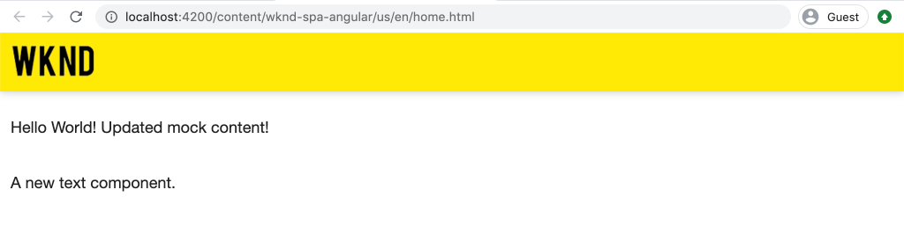

# Integrar um SPA {#integrate-spa}

{{spa-editor-deprecation}}

Entenda como o código-fonte de um Aplicativo de página única (SPA) escrito no Angular pode ser integrado a um projeto do Adobe Experience Manager (AEM). Saiba como usar ferramentas de front-end modernas, como um servidor de desenvolvimento de webpack, para desenvolver rapidamente o SPA em relação à API do modelo JSON do AEM.

## Objetivo

1. Entenda como o projeto de SPA é integrado ao AEM com bibliotecas do lado do cliente.
2. Saiba como usar um servidor de desenvolvimento local para desenvolvimento front-end dedicado.
3. Explore o uso de um **proxy** e de um arquivo estático **mock** para desenvolvimento em relação à API do modelo JSON do AEM

## O que você vai criar

Este capítulo adicionará um componente `Header` simples ao SPA. No processo de criação desse componente estático `Header`, várias abordagens para o desenvolvimento de SPA do AEM são usadas.


*O SPA foi estendido para adicionar um componente `Header` estático*

## Pré-requisitos

Revise as ferramentas e instruções necessárias para configurar um [ambiente de desenvolvimento local](overview.md#local-dev-environment).

### Obter o código

1. Baixe o ponto de partida para este tutorial pelo Git:

   ```shell
   $ git clone git@github.com:adobe/aem-guides-wknd-spa.git
   $ cd aem-guides-wknd-spa
   $ git checkout Angular/integrate-spa-start
   ```

2. Implante a base de código em uma instância do AEM local usando Maven:

   ```shell
   $ mvn clean install -PautoInstallSinglePackage
   ```

   Se estiver usando o [AEM 6.x](overview.md#compatibility), adicione o perfil `classic`:

   ```shell
   $ mvn clean install -PautoInstallSinglePackage -Pclassic
   ```

Você sempre pode exibir o código concluído em [GitHub](https://github.com/adobe/aem-guides-wknd-spa/tree/Angular/integrate-spa-solution) ou verificar o código localmente alternando para a ramificação `Angular/integrate-spa-solution`.

## Abordagem de integração {#integration-approach}

Dois módulos foram criados como parte do projeto AEM: `ui.apps` e `ui.frontend`.

O módulo `ui.frontend` é um projeto [webpack](https://webpack.js.org/) que contém todo o código-fonte do SPA. A maioria do desenvolvimento e teste de SPA é feita no projeto webpack. Quando uma build de produção é acionada, o SPA é criado e compilado usando o webpack. Os artefatos compilados (CSS e Javascript) são copiados no módulo `ui.apps` que é então implantado no tempo de execução do AEM.


*Uma descrição detalhada da integração de SPA.*

Informações adicionais sobre a compilação de front-end podem ser [encontradas aqui](https://experienceleague.adobe.com/docs/experience-manager-core-components/using/developing/archetype/uifrontend-angular.html?lang=pt-BR).

## Inspecione a integração de SPA {#inspect-spa-integration}

Em seguida, inspecione o módulo `ui.frontend` para entender o SPA que foi gerado automaticamente pelo [Arquétipo de projeto do AEM](https://experienceleague.adobe.com/docs/experience-manager-core-components/using/developing/archetype/uifrontend-angular.html?lang=pt-BR).

1. No IDE de sua escolha, abra o Projeto AEM para o WKND SPA. Este tutorial usará o [Visual Studio Code IDE](https://experienceleague.adobe.com/docs/experience-manager-learn/cloud-service/local-development-environment-set-up/development-tools.html?lang=pt-BR#microsoft-visual-studio-code).

   

2. Expanda e inspecione a pasta `ui.frontend`. Abrir o arquivo `ui.frontend/package.json`

3. Em `dependencies` você deve ver vários relacionados a `@angular`:

   ```json
   "@angular/animations": "~9.1.11",
   "@angular/common": "~9.1.11",
   "@angular/compiler": "~9.1.11",
   "@angular/core": "~9.1.11",
   "@angular/forms": "~9.1.10",
   "@angular/platform-browser": "~9.1.10",
   "@angular/platform-browser-dynamic": "~9.1.10",
   "@angular/router": "~9.1.10",
   ```

   O módulo `ui.frontend` é um [aplicativo do Angular](https://angular.io) gerado com a [ferramenta da CLI do Angular](https://angular.io/cli) que inclui roteamento.

4. Há também três dependências com o prefixo `@adobe`:

   ```json
   "@adobe/cq-angular-editable-components": "^2.0.2",
   "@adobe/cq-spa-component-mapping": "^1.0.3",
   "@adobe/cq-spa-page-model-manager": "^1.1.3",
   ```

   Os módulos acima compõem o [AEM SPA Editor JS SDK](https://experienceleague.adobe.com/docs/experience-manager-65/developing/headless/spas/spa-blueprint.html?lang=pt-BR) e fornecem a funcionalidade para tornar possível mapear Componentes SPA para Componentes AEM.

5. No arquivo `package.json`, vários `scripts` estão definidos:

   ```json
   "scripts": {
       "start": "ng serve --open --proxy-config ./proxy.conf.json",
       "build": "ng lint && ng build && clientlib",
       "build:production": "ng lint && ng build --prod && clientlib",
       "test": "ng test",
       "sync": "aemsync -d -w ../ui.apps/src/main/content"
   }
   ```

   Esses scripts se baseiam em [comandos comuns da CLI do Angular](https://angular.io/cli/build), mas foram ligeiramente modificados para funcionar com o projeto maior do AEM.

   `start` - executa o aplicativo Angular localmente usando um servidor Web local. Ela foi atualizada para usar proxy no conteúdo da instância local do AEM.

   `build` - compila o aplicativo Angular para distribuição de produção. A adição de `&& clientlib` é responsável por copiar o SPA compilado no módulo `ui.apps` como uma biblioteca do lado do cliente durante uma compilação. O módulo npm [aem-clientlib-generator](https://github.com/wcm-io-frontend/aem-clientlib-generator) é usado para facilitar isso.

   Mais detalhes sobre os scripts disponíveis podem ser encontrados [aqui](https://experienceleague.adobe.com/docs/experience-manager-core-components/using/developing/archetype/uifrontend-angular.html?lang=pt-BR).

6. Inspecione o arquivo `ui.frontend/clientlib.config.js`. Este arquivo de configuração é usado por [aem-clientlib-generator](https://github.com/wcm-io-frontend/aem-clientlib-generator#clientlibconfigjs) para determinar como gerar a biblioteca do cliente.

7. Inspecione o arquivo `ui.frontend/pom.xml`. Este arquivo transforma a pasta `ui.frontend` em um [módulo Maven](https://maven.apache.org/guides/mini/guide-multiple-modules.html). O arquivo `pom.xml` foi atualizado para usar o [frontend-maven-plugin](https://github.com/eirslett/frontend-maven-plugin) para **testar** e **compilar** o SPA durante uma compilação Maven.

8. Inspecionar o arquivo `app.component.ts` em `ui.frontend/src/app/app.component.ts`:

   ```js
   import { Constants } from '@adobe/cq-angular-editable-components';
   import { ModelManager } from '@adobe/cq-spa-page-model-manager';
   import { Component } from '@angular/core';
   
   @Component({
   selector: '#spa-root', // tslint:disable-line
   styleUrls: ['./app.component.css'],
   templateUrl: './app.component.html'
   })
   export class AppComponent {
       ...
   
       constructor() {
           ModelManager.initialize().then(this.updateData);
       }
   
       private updateData = pageModel => {
           this.path = pageModel[Constants.PATH_PROP];
           this.items = pageModel[Constants.ITEMS_PROP];
           this.itemsOrder = pageModel[Constants.ITEMS_ORDER_PROP];
       }
   }
   ```

   `app.component.js` é o ponto de entrada do SPA. `ModelManager` é fornecido pelo AEM SPA Editor JS SDK. Ele é responsável por chamar e injetar o `pageModel` (o conteúdo JSON) no aplicativo.

## Adicionar um componente de cabeçalho {#header-component}

Em seguida, adicione um novo componente ao SPA e implante as alterações em uma instância local do AEM para ver a integração.

1. Abra uma nova janela de terminal e navegue até a pasta `ui.frontend`:

   ```shell
   $ cd aem-guides-wknd-spa/ui.frontend
   ```

2. Instalar [CLI do Angular](https://angular.io/cli#installing-angular-cli) globalmente. Usado para gerar componentes do Angular, bem como para compilar e servir o aplicativo do Angular através do comando **ng**.

   ```shell
   $ npm install -g @angular/cli
   ```

   >[!CAUTION]
   >
   > A versão de **@angular/cli** usada por este projeto é **9.1.7**. É recomendável manter as versões da CLI do Angular em sincronia.

3. Crie um novo componente `Header` executando o comando `ng generate component` da Angular CLI na pasta `ui.frontend`.

   ```shell
   $ ng generate component components/header
   
   CREATE src/app/components/header/header.component.css (0 bytes)
   CREATE src/app/components/header/header.component.html (21 bytes)
   CREATE src/app/components/header/header.component.spec.ts (628 bytes)
   CREATE src/app/components/header/header.component.ts (269 bytes)
   UPDATE src/app/app.module.ts (1809 bytes)
   ```

   Isso criará um esqueleto para o novo componente de Cabeçalho do Angular em `ui.frontend/src/app/components/header`.

4. Abra o projeto `aem-guides-wknd-spa` no IDE de sua escolha. Navegue até a pasta `ui.frontend/src/app/components/header`.

   

5. Abra o arquivo `header.component.html` e substitua o conteúdo pelo seguinte:

   ```html
   <!--/* header.component.html */-->
   <header className="header">
       <div className="header-container">
           <h1>WKND</h1>
       </div>
   </header>
   ```

   Observe que esse exibe conteúdo estático, portanto, esse componente do Angular não requer ajustes no `header.component.ts` gerado por padrão.

6. Abra o arquivo **app.component.html** em `ui.frontend/src/app/app.component.html`. Adicionar o `app-header`:

   ```html
   <app-header></app-header>
   <router-outlet></router-outlet>
   ```

   Isso incluirá o componente `header` acima de todo o conteúdo da página.

7. Abra um novo terminal, navegue até a pasta `ui.frontend` e execute o comando `npm run build`:

   ```shell
   $ cd ui.frontend
   $ npm run build
   
   Linting "angular-app"...
   All files pass linting.
   Generating ES5 bundles for differential loading...
   ES5 bundle generation complete.
   ```

8. Navegue até a pasta `ui.apps`. Abaixo de `ui.apps/src/main/content/jcr_root/apps/wknd-spa-angular/clientlibs/clientlib-angular` você deve ver que os arquivos SPA compilados foram copiados da pasta `ui.frontend/build`.

   

9. Retorne ao terminal e navegue até a pasta `ui.apps`. Execute o seguinte comando Maven:

   ```shell
   $ cd ../ui.apps
   $ mvn clean install -PautoInstallPackage
   ...
   [INFO] ------------------------------------------------------------------------
   [INFO] BUILD SUCCESS
   [INFO] ------------------------------------------------------------------------
   [INFO] Total time:  9.629 s
   [INFO] Finished at: 2020-05-04T17:48:07-07:00
   [INFO] ------------------------------------------------------------------------
   ```

   Isso implantará o pacote `ui.apps` em uma instância do AEM em execução local.

10. Abra uma guia do navegador e navegue até [http://localhost:4502/editor.html/content/wknd-spa-angular/us/en/home.html](http://localhost:4502/editor.html/content/wknd-spa-angular/us/en/home.html). Agora você deve ver o conteúdo do componente `Header` sendo exibido no SPA.

   

   As etapas **7-9** são executadas automaticamente ao acionar uma compilação Maven da raiz do projeto (ou seja, `mvn clean install -PautoInstallSinglePackage`). Agora você deve entender as noções básicas da integração entre o SPA e as bibliotecas do lado do cliente do AEM. Observe que você ainda pode editar e adicionar `Text` componentes no AEM, no entanto, o componente `Header` não é editável.

## Servidor de desenvolvimento do Webpack - Criar proxy para a API JSON {#proxy-json}

Como visto nos exercícios anteriores, executar um build e sincronizar a biblioteca do cliente com uma instância local do AEM leva alguns minutos. Isso é aceitável para o teste final, mas não é ideal para a maioria do desenvolvimento de SPA.

Um [servidor de desenvolvimento de webpack](https://webpack.js.org/configuration/dev-server/) pode ser usado para desenvolver rapidamente o SPA. O SPA é orientado por um modelo JSON gerado pelo AEM. Neste exercício, o conteúdo JSON de uma instância do AEM em execução é **encaminhado por proxy** para o servidor de desenvolvimento configurado pelo [projeto do Angular](https://angular.io/guide/build).

1. Retorne ao IDE e abra o arquivo **proxy.conf.json** em `ui.frontend/proxy.conf.json`.

   ```json
   [
       {
           "context": [
                       "/content/**/*.(jpg|jpeg|png|model.json)",
                       "/etc.clientlibs/**/*"
                   ],
           "target": "http://localhost:4502",
           "auth": "admin:admin",
           "logLevel": "debug"
       }
   ]
   ```

   O [aplicativo Angular](https://angular.io/guide/build#proxying-to-a-backend-server) fornece um mecanismo fácil para solicitações de API de proxy. Os padrões especificados em `context` devem ser encaminhados por proxy através de `localhost:4502`, a inicialização rápida do AEM local.

2. Abra o arquivo **index.html** em `ui.frontend/src/index.html`. Esse é o arquivo raiz do HTML usado pelo servidor dev.

   Observe que há uma entrada para `base href="/"`. A [marca de base](https://angular.io/guide/deployment#the-base-tag) é crítica para o aplicativo resolver URLs relativas.

   ```html
   <base href="/">
   ```

3. Abra uma janela de terminal e navegue até a pasta `ui.frontend`. Execute o comando `npm start`:

   ```shell
   $ cd ui.frontend
   $ npm start
   
   > wknd-spa-angular@0.1.0 start /Users/dgordon/Documents/code/aem-guides-wknd-spa/ui.frontend
   > ng serve --open --proxy-config ./proxy.conf.json
   
   10% building 3/3 modules 0 active[HPM] Proxy created: [ '/content/**/*.(jpg|jpeg|png|model.json)', '/etc.clientlibs/**/*' ]  ->  http://localhost:4502
   [HPM] Subscribed to http-proxy events:  [ 'error', 'close' ]
   ℹ ｢wds｣: Project is running at http://localhost:4200/webpack-dev-server/
   ℹ ｢wds｣: webpack output is served from /
   ℹ ｢wds｣: 404s will fallback to //index.html
   ```

4. Abra uma nova guia do navegador (se ainda não estiver aberta) e navegue até [http://localhost:4200/content/wknd-spa-angular/us/en/home.html](http://localhost:4200/content/wknd-spa-angular/us/en/home.html).

   

   Você deve ver o mesmo conteúdo que no AEM, mas sem nenhum dos recursos de criação ativados.

5. Retorne ao IDE e crie uma nova pasta chamada `img` em `ui.frontend/src/assets`.
6. Baixe e adicione o seguinte logotipo WKND à pasta `img`:

   

7. Abra **header.component.html** em `ui.frontend/src/app/components/header/header.component.html` e inclua o logotipo:

   ```html
   <header class="header">
       <div class="header-container">
           <div class="logo">
               
           </div>
       </div>
   </header>
   ```

   Salve as alterações em **header.component.html**.

8. Retorne ao navegador. Você deve ver imediatamente as alterações no aplicativo refletidas.

   

   Você pode continuar a fazer atualizações de conteúdo no **AEM** e vê-las refletidas no **servidor de desenvolvimento do webpack**, pois estamos usando o proxy para o conteúdo. Observe que as alterações de conteúdo só são visíveis no **servidor de desenvolvimento do webpack**.

9. Pare o servidor Web local com `ctrl+c` no terminal.

## Servidor de desenvolvimento Webpack - API JSON fictícia {#mock-json}

Outra abordagem para o desenvolvimento rápido é usar um arquivo JSON estático para agir como o modelo JSON. Ao &quot;zombar&quot; o JSON, removemos a dependência em uma instância do AEM local. Ele também permite que um desenvolvedor de front-end atualize o modelo JSON para testar a funcionalidade e direcionar alterações na API JSON, que seria implementada posteriormente por um desenvolvedor de back-end.

A configuração inicial do JSON de modelo **requer uma instância do AEM local**.

1. No navegador, navegue até [http://localhost:4502/content/wknd-spa-angular/us/en.model.json](http://localhost:4502/content/wknd-spa-angular/us/en.model.json).

   Este é o JSON exportado pelo AEM que está direcionando o aplicativo. Copie a saída JSON.

2. Retorne ao IDE, navegue até `ui.frontend/src` e adicione novas pastas chamadas **mocks** e **json** para corresponder à seguinte estrutura de pastas:

   ```plain
   |-- ui.frontend
       |-- src
           |-- mocks
               |-- json
   ```

3. Crie um novo arquivo chamado **en.model.json** abaixo de `ui.frontend/public/mocks/json`. Cole a saída JSON da **Etapa 1** aqui.

   

4. Crie um novo arquivo **proxy.mock.conf.json** abaixo de `ui.frontend`. Preencha o arquivo com o seguinte:

   ```json
   [
       {
       "context": [
           "/content/**/*.model.json"
       ],
       "pathRewrite": { "^/content/wknd-spa-angular/us" : "/mocks/json"} ,
       "target": "http://localhost:4200",
       "logLevel": "debug"
       }
   ]
   ```

   Essa configuração de proxy regravará solicitações que começam com `/content/wknd-spa-angular/us` com `/mocks/json` e servem o arquivo JSON estático correspondente, por exemplo:

   ```plain
   /content/wknd-spa-angular/us/en.model.json -> /mocks/json/en.model.json
   ```

5. Abra o arquivo **angular.json**. Adicione uma nova configuração **dev** com uma matriz atualizada **assets** para fazer referência à pasta **mocks** criada.

   ```json
    "dev": {
             "assets": [
               "src/mocks",
               "src/assets",
               "src/favicon.ico",
               "src/logo192.png",
               "src/logo512.png",
               "src/manifest.json"
             ]
       },
   ```

   

   A criação de uma configuração **dev** dedicada garante que a pasta **mocks** seja usada somente durante o desenvolvimento e nunca seja implantada no AEM em uma compilação de produção.

6. No arquivo **angular.json**, atualize em seguida a configuração **browserTarget** para usar a nova configuração **dev**:

   ```diff
     ...
     "serve": {
         "builder": "@angular-devkit/build-angular:dev-server",
         "options": {
   +       "browserTarget": "angular-app:build:dev"
   -       "browserTarget": "angular-app:build"
         },
     ...
   ```

   

7. Abra o arquivo `ui.frontend/package.json` e adicione um novo comando **start:mock** para fazer referência ao arquivo **proxy.mock.conf.json**.

   ```diff
       "scripts": {
           "start": "ng serve --open --proxy-config ./proxy.conf.json",
   +       "start:mock": "ng serve --open --proxy-config ./proxy.mock.conf.json",
           "build": "ng lint && ng build && clientlib",
           "build:production": "ng lint && ng build --prod && clientlib",
           "test": "ng test",
           "sync": "aemsync -d -w ../ui.apps/src/main/content"
       }
   ```

   Adicionar um novo comando facilita a alternância entre as configurações de proxy.

8. Se estiver em execução, pare o **servidor de desenvolvimento do webpack**. Inicie o **servidor de desenvolvimento do webpack** usando o script **start:mock**:

   ```shell
   $ npm run start:mock
   
   > wknd-spa-angular@0.1.0 start:mock /Users/dgordon/Documents/code/aem-guides-wknd-spa/ui.frontend
   > ng serve --open --proxy-config ./proxy.mock.conf.json
   ```

   Navegue até [http://localhost:4200/content/wknd-spa-angular/us/en/home.html](http://localhost:4200/content/wknd-spa-angular/us/en/home.html) e você deverá ver o mesmo SPA, mas o conteúdo agora está sendo extraído do arquivo JSON **mock**.

9. Faça uma pequena alteração no arquivo **en.model.json** criado anteriormente. O conteúdo atualizado deve ser refletido imediatamente no **servidor de desenvolvimento do webpack**.

   

   Ser capaz de manipular o modelo JSON e ver os efeitos em um SPA em tempo real pode ajudar um desenvolvedor a entender a API do modelo JSON. Também permite que o desenvolvimento de front-end e back-end ocorra em paralelo.

## Adicionar Estilos com Sass

Em seguida, alguns estilos atualizados são adicionados ao projeto. Este projeto adicionará suporte a [Sass](https://sass-lang.com/) para alguns recursos úteis, como variáveis.

1. Abra uma janela de terminal e pare o **servidor de desenvolvimento de webpack**, se iniciado. Na pasta `ui.frontend`, digite o seguinte comando para atualizar o aplicativo Angular para processar arquivos **.scss**.

   ```shell
   $ cd ui.frontend
   $ ng config schematics.@schematics/angular:component.styleext scss
   ```

   Isso atualizará o arquivo `angular.json` com uma nova entrada na parte inferior do arquivo:

   ```json
   "schematics": {
       "@schematics/angular:component": {
       "styleext": "scss"
       }
   }
   ```

2. Instale `normalize-scss` para normalizar os estilos nos navegadores:

   ```shell
   $ npm install normalize-scss --save
   ```

3. Retorne ao IDE e abaixo de `ui.frontend/src` crie uma nova pasta chamada `styles`.
4. Crie um novo arquivo abaixo de `ui.frontend/src/styles` chamado `_variables.scss` e preencha-o com as seguintes variáveis:

   ```scss
   //_variables.scss
   
   //== Colors
   //
   //## Gray and brand colors for use across theme.
   
   $black:                  #202020;
   $gray:                   #696969;
   $gray-light:             #EBEBEB;
   $gray-lighter:           #F7F7F7;
   $white:                  #FFFFFF;
   $yellow:                 #FFEA00;
   $blue:                   #0045FF;
   
   
   //== Typography
   //
   //## Font, line-height, and color for body text, headings, and more.
   
   $font-family-sans-serif:  "Helvetica Neue", Helvetica, Arial, sans-serif;
   $font-family-serif:       Georgia, "Times New Roman", Times, serif;
   $font-family-base:        $font-family-sans-serif;
   $font-size-base:          18px;
   
   $line-height-base:        1.5;
   $line-height-computed:    floor(($font-size-base * $line-height-base));
   
   // Functional Colors
   $brand-primary:             $yellow;
   $body-bg:                   $white;
   $text-color:                $black;
   $text-color-inverse:        $gray-light;
   $link-color:                $blue;
   
   //Layout
   $max-width: 1024px;
   $header-height: 75px;
   
   // Spacing
   $gutter-padding: 12px;
   ```

5. Renomeie a extensão do arquivo **estilos.css** em `ui.frontend/src/styles.css` para **estilos.scss**. Substitua o conteúdo pelo seguinte:

   ```scss
   /* styles.scss * /
   
   /* Normalize */
   @import '~normalize-scss/sass/normalize';
   
   @import './styles/variables';
   
   body {
       background-color: $body-bg;
       font-family: $font-family-base;
       margin: 0;
       padding: 0;
       font-size: $font-size-base;
       text-align: left;
       color: $text-color;
       line-height: $line-height-base;
   }
   
   body.page {
       max-width: $max-width;
       margin: 0 auto;
       padding: $gutter-padding;
       padding-top: $header-height;
   }
   ```

6. Atualize **angular.json** e renomeie todas as referências a **style.css** com **estilos.scss**. Deve haver 3 referências.

   ```diff
     "styles": [
   -    "src/styles.css"
   +    "src/styles.scss"
      ],
   ```

## Atualizar estilos de cabeçalho

Em seguida, adicione alguns estilos específicos da marca ao componente **Cabeçalho** usando o Sass.

1. Inicie o **servidor de desenvolvimento do webpack** para ver os estilos atualizados em tempo real:

   ```shell
   $ npm run start:mock
   ```

2. Em `ui.frontend/src/app/components/header`, renomeie **header.component.css** para **header.component.scss**. Preencha o arquivo com o seguinte:

   ```scss
   @import "~src/styles/variables";
   
   .header {
       width: 100%;
       position: fixed;
       top: 0;
       left:0;
       z-index: 99;
       background-color: $brand-primary;
       box-shadow: 0px 0px 10px 0px rgba(0, 0, 0, 0.24);
   }
   
   .header-container {
       display: flex;
       max-width: $max-width;
       margin: 0 auto;
       padding-left: $gutter-padding;
       padding-right: $gutter-padding;
   }
   
   .logo {
       z-index: 100;
       display: flex;
       padding-top: $gutter-padding;
       padding-bottom: $gutter-padding;
   }
   
   .logo-img {
       width: 100px;
   }
   ```

3. Atualize **header.component.ts** para fazer referência a **header.component.scss**:

   ```diff
   ...
     @Component({
       selector: 'app-header',
       templateUrl: './header.component.html',
   -   styleUrls: ['./header.component.css']
   +   styleUrls: ['./header.component.scss']
     })
   ...
   ```

4. Retorne ao navegador e ao **servidor de desenvolvimento do webpack**:

   

   Agora você deve ver os estilos atualizados adicionados ao componente **Cabeçalho**.

## Implantar atualizações de SPA no AEM

As alterações feitas no **Cabeçalho** atualmente só são visíveis por meio do **servidor de desenvolvimento do webpack**. Implante o SPA atualizado no AEM para ver as alterações.

1. Pare o **servidor de desenvolvimento do webpack**.
2. Navegue até a raiz do projeto `/aem-guides-wknd-spa` e implante o projeto no AEM usando Maven:

   ```shell
   $ cd ..
   $ mvn clean install -PautoInstallSinglePackage
   ```

3. Navegue até [http://localhost:4502/editor.html/content/wknd-spa-angular/us/en/home.html](http://localhost:4502/editor.html/content/wknd-spa-angular/us/en/home.html). Você deve ver o **Cabeçalho** atualizado com o logotipo e os estilos aplicados:

   

   Agora que o SPA atualizado está no AEM, a criação pode continuar.

## Parabéns! {#congratulations}

Parabéns, você atualizou o SPA e explorou a integração com o AEM! Agora você conhece duas abordagens diferentes para desenvolver o SPA em relação à API do modelo JSON do AEM usando um **servidor de desenvolvimento de webpack**.

Você sempre pode exibir o código concluído em [GitHub](https://github.com/adobe/aem-guides-wknd-spa/tree/Angular/integrate-spa-solution) ou verificar o código localmente alternando para a ramificação `Angular/integrate-spa-solution`.

### Próximas etapas {#next-steps}

[Mapear componentes de SPA para componentes do AEM](map-components.md) - Saiba como mapear componentes do Angular para componentes do Adobe Experience Manager (AEM) com o AEM SPA Editor JS SDK. O mapeamento de componentes permite que os autores façam atualizações dinâmicas em componentes SPA no Editor SPA do AEM, de modo semelhante à criação tradicional no AEM.
