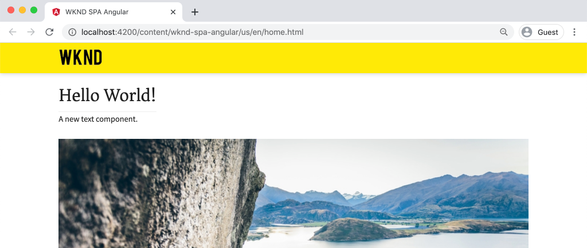
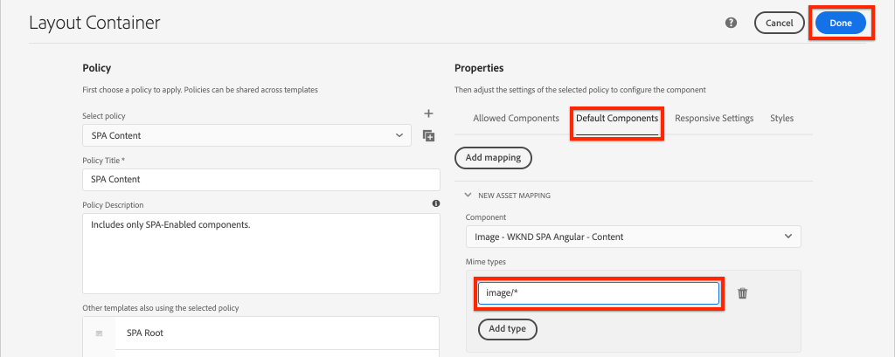
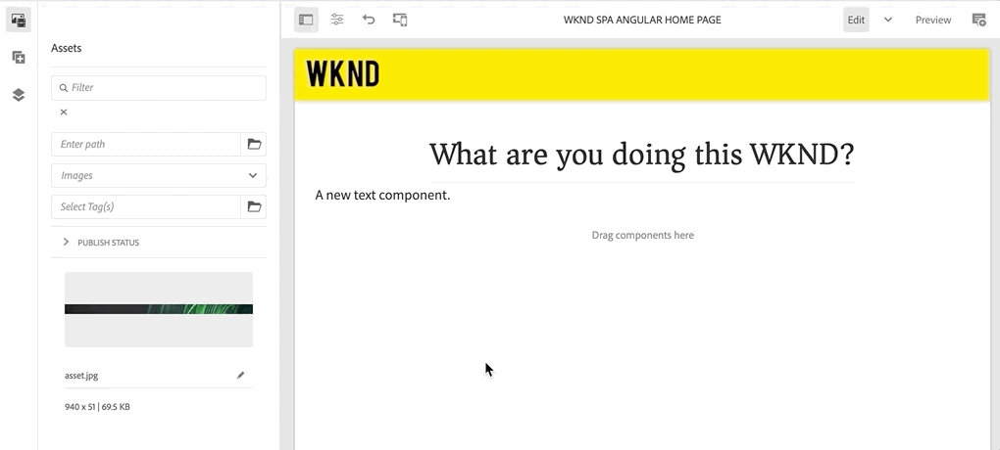

# Mapear componentes SPA para AEM componentes {#map-components}

Saiba como mapear componentes do Angular para componentes do Adobe Experience Manager (AEM) com o SDK JS do AEM SPA Editor. O mapeamento de componentes permite que os usuários façam atualizações dinâmicas em componentes SPA no Editor de SPA de AEM, de forma semelhante à criação tradicional de AEM.

Este capítulo aprofunda a API do modelo JSON do AEM e como o conteúdo JSON exposto por um componente AEM pode ser inserido automaticamente em um componente do Angular como props.

## Objetivo

1. Saiba como mapear componentes AEM para SPA componentes.
2. Entender a diferença entre **Contêiner** componentes e **Conteúdo** componentes.
3. Crie um novo componente de Angular que mapeie para um componente de AEM existente.

## O que você vai criar

Este capítulo verificará como o `Text` SPA componente é mapeado para a AEM `Text`componente. Um novo `Image` SPA componente é criado e pode ser usado no SPA e criado no AEM. Recursos prontos para uso do **Contêiner de layout** e **Editor de modelos** as políticas serão também utilizadas para criar uma visão um pouco mais variada em termos de aparência.


## Pré-requisitos

Revise as ferramentas necessárias e as instruções para configurar um [ambiente de desenvolvimento local](overview.md#local-dev-environment).

### Obter o código

1. Baixe o ponto de partida para este tutorial via Git:

   ```shell
   $ git clone git@github.com:adobe/aem-guides-wknd-spa.git
   $ cd aem-guides-wknd-spa
   $ git checkout Angular/map-components-start
   ```

2. Implante a base de código em uma instância de AEM local usando o Maven:

   ```shell
   $ mvn clean install -PautoInstallSinglePackage
   ```

   Se estiver usando [AEM 6.x](overview.md#compatibility) adicione o `classic` perfil:

   ```shell
   $ mvn clean install -PautoInstallSinglePackage -Pclassic
   ```

Você sempre pode exibir o código concluído em [GitHub](https://github.com/adobe/aem-guides-wknd-spa/tree/Angular/map-components-solution) ou verifique o código localmente, alternando para a ramificação `Angular/map-components-solution`.

## Abordagem de mapeamento

O conceito básico é mapear um Componente de SPA para um Componente de AEM. AEM componentes, executar o lado do servidor e exportar conteúdo como parte da API do modelo JSON. O conteúdo JSON é consumido pelo SPA, executando no lado do cliente no navegador. Um mapeamento 1:1 entre SPA componentes e um componente AEM é criado.


*Visão geral de alto nível do mapeamento de um componente de AEM para um componente de Angular*

## Inspect o componente de texto

O [Arquétipo de projeto AEM](https://github.com/adobe/aem-project-archetype) fornece uma `Text` componente mapeado para o AEM [Componente de texto](https://experienceleague.adobe.com/docs/experience-manager-core-components/using/components/text.html). Este é um exemplo de um **conteúdo** componente, na medida em que renderiza *conteúdo* de AEM.

Vamos ver como o componente funciona.

### Inspect o modelo JSON

1. Antes de entrar no código SPA, é importante entender o modelo JSON que AEM fornece. Navegue até o [Biblioteca de componentes principais](https://www.aemcomponents.dev/content/core-components-examples/library/core-content/text.html) e visualize a página do componente de Texto . A Biblioteca de componentes principais fornece exemplos de todos os componentes principais do AEM.
2. Selecione o **JSON** para um dos exemplos:

   

   Você deve ver três propriedades: `text`, `richText`e `:type`.

   `:type` é uma propriedade reservada que lista a variável `sling:resourceType` (ou caminho) do Componente de AEM. O valor de `:type` é o que é usado para mapear o componente AEM para o componente SPA.

   `text` e `richText` são propriedades adicionais expostas ao componente SPA.

### Inspect o componente de texto

1. Abra um novo terminal e navegue até o `ui.frontend` pasta dentro do projeto. Executar `npm install` e depois `npm start` para iniciar o **servidor de desenvolvimento de webpack**:

   ```shell
   $ cd ui.frontend
   $ npm run start:mock
   ```

   O `ui.frontend` está configurado para usar o [modelo JSON de modelo](./integrate-spa.md#mock-json).

2. Você deve ver uma nova janela de navegador aberta para [http://localhost:4200/content/wknd-spa-angular/us/en/home.html](http://localhost:4200/content/wknd-spa-angular/us/en/home.html)

   

3. No IDE de sua escolha, abra o AEM Project para a SPA WKND. Expanda o `ui.frontend` e abra o arquivo **text.component.ts** under `ui.frontend/src/app/components/text/text.component.ts`:

   

4. A primeira área a ser inspecionada é a `class TextComponent` na ~linha 35:

   ```js
   export class TextComponent {
       @Input() richText: boolean;
       @Input() text: string;
       @Input() itemName: string;
   
       @HostBinding('innerHtml') get content() {
           return this.richText
           ? this.sanitizer.bypassSecurityTrustHtml(this.text)
           : this.text;
       }
       @HostBinding('attr.data-rte-editelement') editAttribute = true;
   
       constructor(private sanitizer: DomSanitizer) {}
   }
   ```

   [@Input()](https://angular.io/api/core/Input) decorador é usado para declarar campos que são definidos pelos valores do por meio do objeto JSON mapeado, revisado anteriormente.

   `@HostBinding('innerHtml') get content()` é um método que expõe o conteúdo do texto criado do valor de `this.text`. No caso de o conteúdo ser rich text (determinado pela variável `this.richText` sinalizador) a segurança interna do Angular é ignorada. Angular [DomSanitizer](https://angular.io/api/platform-browser/DomSanitizer) é usada para &quot;depurar&quot; o HTML bruto e evitar vulnerabilidades de script entre sites. O método está vinculado ao `innerHtml` usando a [@HostBinding](https://angular.io/api/core/HostBinding) decorador.

5. Em seguida, inspecione o `TextEditConfig` na ~linha 24:

   ```js
   const TextEditConfig = {
       emptyLabel: 'Text',
       isEmpty: cqModel =>
           !cqModel || !cqModel.text || cqModel.text.trim().length < 1
   };
   ```

   O código acima é responsável por determinar quando renderizar o espaço reservado no ambiente de criação do AEM. Se a variável `isEmpty` retornos de método **true** em seguida, o espaço reservado é renderizado.

6. Por fim, dê uma olhada no `MapTo` chame em ~line 53:

   ```js
   MapTo('wknd-spa-angular/components/text')(TextComponent, TextEditConfig );
   ```

   **MapTo** é fornecido pelo AEM Editor JS SDK (`@adobe/cq-angular-editable-components`). O caminho `wknd-spa-angular/components/text` representa a variável `sling:resourceType` do componente AEM. Esse caminho é correspondido com a variável `:type` exposto pelo modelo JSON observado anteriormente. **MapTo** analisa a resposta do modelo JSON e transmite os valores corretos para o `@Input()` variáveis do componente de SPA.

   Você pode encontrar o AEM `Text` definição de componente em `ui.apps/src/main/content/jcr_root/apps/wknd-spa-angular/components/text`.

7. Experimente modificando o **en.model.json** arquivo em `ui.frontend/src/mocks/json/en.model.json`.

   Em ~line 62, atualize o primeiro `Text` para usar um **`H1`** e **`u`** tags:

   ```json
       "text": {
           "text": "<h1><u>Hello World!</u></h1>",
           "richText": true,
           ":type": "wknd-spa-angular/components/text"
       }
   ```

   Retorne ao navegador para ver os efeitos oferecidos pelo **servidor de desenvolvimento de webpack**:

   

   Tente alternar a `richText` propriedade entre **true** / **false** para ver a lógica de renderização em ação.

8. Inspect **text.component.html** at `ui.frontend/src/app/components/text/text.component.html`.

   Este arquivo está vazio, pois todo o conteúdo do componente é definido pela variável `innerHTML` propriedade.

9. A Inspect **app.module.ts** at `ui.frontend/src/app/app.module.ts`.

   ```js
   @NgModule({
   imports: [
       BrowserModule,
       SpaAngularEditableComponentsModule,
       AppRoutingModule
   ],
   providers: [ModelManagerService, { provide: APP_BASE_HREF, useValue: '/' }],
   declarations: [AppComponent, TextComponent, PageComponent, HeaderComponent],
   entryComponents: [TextComponent, PageComponent],
   bootstrap: [AppComponent]
   })
   export class AppModule {}
   ```

   O **TextComponent** não está explicitamente incluído, mas sim dinamicamente via **AEMResponsiveGridComponent** fornecido pelo AEM Editor JS SDK. Portanto, deve ser listado no **app.module.ts**&#39; [entryComponents](https://angular.io/guide/entry-components) matriz.

## Criar o componente de imagem

Em seguida, crie um `Image` Componente Angular que é mapeado para o AEM [Componente de imagem](https://experienceleague.adobe.com/docs/experience-manager-core-components/using/components/image.html). O `Image` é outro exemplo de um **conteúdo** componente.

### Inspect no JSON

Antes de saltar para o código SPA, inspecione o modelo JSON fornecido pelo AEM.

1. Navegue até o [Exemplos de imagem na biblioteca do Componente principal](https://www.aemcomponents.dev/content/core-components-examples/library/core-content/image.html).

   

   Propriedades de `src`, `alt`e `title` são usados para preencher a SPA `Image` componente.

   >[!NOTE]
   >
   > Há outras propriedades de imagem expostas (`lazyEnabled`, `widths`) que permitem que um desenvolvedor crie um componente adaptável e de carregamento lento. O componente criado neste tutorial é simples e faz **not** use essas propriedades avançadas.

2. Retorne ao IDE e abra o `en.model.json` at `ui.frontend/src/mocks/json/en.model.json`. Como esse é um novo componente para nosso projeto, precisamos &quot;zombar&quot; o JSON da imagem.

   Em ~line 70, adicione uma entrada JSON para a `image` modelo (não se esqueça da vírgula à direita) `,` depois do segundo `text_386303036`) e atualize o `:itemsOrder` matriz.

   ```json
   ...
   ":items": {
               ...
               "text_386303036": {
                   "text": "<p>A new text component.</p>\r\n",
                   "richText": true,
                   ":type": "wknd-spa-angular/components/text"
                   },
               "image": {
                   "alt": "Rock Climber in New Zealand",
                   "title": "Rock Climber in New Zealand",
                   "src": "/mocks/images/adobestock-140634652.jpeg",
                   ":type": "wknd-spa-angular/components/image"
               }
           },
           ":itemsOrder": [
               "text",
               "text_386303036",
               "image"
           ],
   ```

   O projeto inclui uma imagem de amostra em `/mock-content/adobestock-140634652.jpeg` que é usado com o **servidor de desenvolvimento de webpack**.

   Você pode visualizar o [en.model.json aqui](https://github.com/adobe/aem-guides-wknd-spa/blob/Angular/map-components-solution/ui.frontend/src/mocks/json/en.model.json).

3. Adicione uma foto de estoque para ser exibida pelo componente.

   Crie uma nova pasta chamada **imagens** debaixo `ui.frontend/src/mocks`. Baixar [adobe-140634652.jpeg](assets/map-components/adobestock-140634652.jpeg) e coloque-o no **imagens** pasta. Você pode usar sua própria imagem, se desejar.

### Implementar o componente Imagem

1. Pare o **servidor de desenvolvimento de webpack** se iniciado.
2. Crie um novo componente de Imagem executando a CLI do Angular `ng generate component` comando de dentro `ui.frontend` pasta:

   ```shell
   $ ng generate component components/image
   ```

3. No IDE, abra **image.component.ts** at `ui.frontend/src/app/components/image/image.component.ts` e atualizar como segue:

   ```js
   import {Component, Input, OnInit} from '@angular/core';
   import {MapTo} from '@adobe/cq-angular-editable-components';
   
   const ImageEditConfig = {
   emptyLabel: 'Image',
   isEmpty: cqModel =>
       !cqModel || !cqModel.src || cqModel.src.trim().length < 1
   };
   
   @Component({
   selector: 'app-image',
   templateUrl: './image.component.html',
   styleUrls: ['./image.component.scss']
   })
   export class ImageComponent implements OnInit {
   
   @Input() src: string;
   @Input() alt: string;
   @Input() title: string;
   
   constructor() { }
   
   get hasImage() {
       return this.src && this.src.trim().length > 0;
   }
   
   ngOnInit() { }
   }
   
   MapTo('wknd-spa-angular/components/image')(ImageComponent, ImageEditConfig);
   ```

   `ImageEditConfig` é a configuração para determinar se o espaço reservado do autor deve ser renderizado no AEM, com base em se a variável `src` é preenchida.

   `@Input()` de `src`, `alt`e `title` são as propriedades mapeadas da API JSON.

   `hasImage()` é um método que determinará se a imagem deve ser renderizada.

   `MapTo` mapeia o componente SPA para o componente AEM localizado em `ui.apps/src/main/content/jcr_root/apps/wknd-spa-angular/components/image`.

4. Abrir **image.component.html** e atualizá-lo da seguinte maneira:

   ```html
   <ng-container *ngIf="hasImage">
       
   </ng-container>
   ```

   Isso renderizará o `` elemento if `hasImage` devoluções **true**.

5. Abrir **image.component.scss** e atualizá-lo da seguinte maneira:

   ```scss
   :host-context {
       display: block;
   }
   
   .image {
       margin: 1rem 0;
       width: 100%;
       border: 0;
   }
   ```

   >[!NOTE]
   >
   > O `:host-context` regra é **crítico** para que o espaço reservado do editor de SPA AEM funcione corretamente. Todos os componentes de SPA que devem ser criados no editor de páginas de AEM precisarão dessa regra no mínimo.

6. Abrir `app.module.ts` e adicione o `ImageComponent` para `entryComponents` array:

   ```js
   entryComponents: [TextComponent, PageComponent, ImageComponent],
   ```

   Como a `TextComponent`, o `ImageComponent` é carregado dinamicamente e deve ser incluído na variável `entryComponents` matriz.

7. Inicie o **servidor de desenvolvimento de webpack** para ver o `ImageComponent` renderizar.

   ```shell
   $ npm run start:mock
   ```

   

   *Imagem adicionada ao SPA*

   >[!NOTE]
   >
   > **Desafio extra**: Implemente um novo método para exibir o valor de `title` como uma legenda abaixo da imagem.

## Atualizar políticas no AEM

O `ImageComponent` componente é visível somente no **servidor de desenvolvimento de webpack**. Em seguida, implante o SPA atualizado para AEM e atualize as políticas do template.

1. Pare o **servidor de desenvolvimento de webpack** e da **root** do projeto, implante as alterações no AEM usando suas habilidades Maven:

   ```shell
   $ cd aem-guides-wknd-spa
   $ mvn clean install -PautoInstallSinglePackage
   ```

2. Na tela inicial AEM, acesse **[!UICONTROL Ferramentas]** > **[!UICONTROL Modelos]** > **[Angular SPA WKND](http://localhost:4502/libs/wcm/core/content/sites/templates.html/conf/wknd-spa-angular)**.

   Selecione e edite o **Página SPA**:

   

3. Selecione o **Contêiner de layout** e clique nele **política** ícone para editar a política:

   

4. Em **Componentes permitidos** > **Angular SPA WKND - Conteúdo** > marque a opção **Imagem** componente:

   

   Em **Componentes padrão** > **Adicionar mapeamento** e escolha a **Imagem - Angular SPA WKND - Conteúdo** componente:

   

   Insira um **tipo mime** de `image/*`.

   Clique em **Concluído** para salvar as atualizações de política.

5. No **Contêiner de layout** clique no botão **política** ícone para o **Texto** componente:

   

   Crie uma nova política chamada **Texto SPA WKND**. Em **Plug-ins** > **Formatação** > marque todas as caixas para ativar opções adicionais de formatação:

   

   Em **Plug-ins** > **Estilos de parágrafo** > marque a caixa para **Ativar estilos de parágrafo**:

   

   Clique em **Concluído** para salvar a atualização da política.

6. Navegue até o **Página inicial** [http://localhost:4502/editor.html/content/wknd-spa-angular/us/en/home.html](http://localhost:4502/editor.html/content/wknd-spa-angular/us/en/home.html).

   Também é possível editar a variável `Text` e adicionar estilos de parágrafo adicionais em **tela cheia** modo.

   

7. Você também deve ser capaz de arrastar e soltar uma imagem da **Localizador de ativos**:

   

8. Adicionar suas próprias imagens via [AEM Assets](http://localhost:4502/assets.html/content/dam) ou instale a base de código finalizada para o padrão [Site de referência WKND](https://github.com/adobe/aem-guides-wknd/releases/latest). O [Site de referência WKND](https://github.com/adobe/aem-guides-wknd/releases/latest) O inclui muitas imagens que podem ser reutilizadas no SPA WKND. O pacote pode ser instalado usando [Gerenciador de pacotes de AEM](http://localhost:4502/crx/packmgr/index.jsp).

   

## Inspect no Contêiner de layout

Suporte para **Contêiner de layout** O é fornecido automaticamente pelo SDK do Editor SPA AEM. O **Contêiner de layout**, conforme indicado pelo nome, é uma **container** componente. Componentes do contêiner são componentes que aceitam estruturas JSON que representam *other* e os instancie dinamicamente.

Vamos inspecionar o Contêiner de layout ainda mais.

1. No IDE, abra **responsive-grid.component.ts** at `ui.frontend/src/app/components/responsive-grid`:

   ```js
   import { AEMResponsiveGridComponent,MapTo } from '@adobe/cq-angular-editable-components';
   
   MapTo('wcm/foundation/components/responsivegrid')(AEMResponsiveGridComponent);
   ```

   O `AEMResponsiveGridComponent` é implementado como parte do SDK do Editor de SPA do AEM e está incluído no projeto por meio de `import-components`.

2. Em um navegador, acesse [http://localhost:4502/content/wknd-spa-angular/us/en.model.json](http://localhost:4502/content/wknd-spa-angular/us/en.model.json)

   

   O **Contêiner de layout** tem um `sling:resourceType` de `wcm/foundation/components/responsivegrid` e é reconhecida pelo Editor de SPA usando o `:type` propriedade, exatamente como a variável `Text` e `Image` componentes.

   Os mesmos recursos de redimensionar um componente usando [Modo de layout](https://experienceleague.adobe.com/docs/experience-manager-65/authoring/siteandpage/responsive-layout.html#defining-layouts-layout-mode) estão disponíveis com o Editor de SPA.

3. Retornar para [http://localhost:4502/editor.html/content/wknd-spa-angular/us/en/home.html](http://localhost:4502/editor.html/content/wknd-spa-angular/us/en/home.html). Adicionar mais **Imagem** e tente redimensioná-los usando o **Layout** opção:

   

4. Reabra o modelo JSON [http://localhost:4502/content/wknd-spa-angular/us/en.model.json](http://localhost:4502/content/wknd-spa-angular/us/en.model.json) e observe os `columnClassNames` como parte do JSON:

   

   O nome da classe `aem-GridColumn--default--4` indica que o componente deve ter 4 colunas de largura com base em uma grade de 12 colunas. Mais detalhes sobre o [grade responsiva pode ser encontrada aqui](https://adobe-marketing-cloud.github.io/aem-responsivegrid/).

5. Retorne ao IDE e no `ui.apps` existe uma biblioteca do lado do cliente definida em `ui.apps/src/main/content/jcr_root/apps/wknd-spa-angular/clientlibs/clientlib-grid`. Abra o arquivo `less/grid.less`.

   Esse arquivo determina os pontos de interrupção (`default`, `tablet`e `phone`) usado pela **Contêiner de layout**. Este arquivo deve ser personalizado de acordo com as especificações do projeto. Atualmente, os pontos de interrupção estão definidos como `1200px` e `650px`.

6. Você deve ser capaz de usar os recursos responsivos e as políticas de rich text atualizadas do `Text` componente para criar uma exibição como a seguinte:

   

## Parabéns.  {#congratulations}

Parabéns, você aprendeu a mapear componentes SPA para AEM componentes e implementou um novo `Image` componente. Você também tem a oportunidade de explorar os recursos responsivos da **Contêiner de layout**.

Você sempre pode exibir o código concluído em [GitHub](https://github.com/adobe/aem-guides-wknd-spa/tree/Angular/map-components-solution) ou verifique o código localmente, alternando para a ramificação `Angular/map-components-solution`.

### Próximas etapas {#next-steps}

[Navegação e Roteamento](navigation-routing.md) - Saiba como várias exibições no SPA podem ser compatíveis com o mapeamento para AEM páginas com o SDK do Editor SPA. A navegação dinâmica é implementada usando o Roteador de Angular e adicionada a um componente Cabeçalho existente.

## Bônus - Persistir configurações no controle de origem {#bonus}

Em muitos casos, especialmente no início de um projeto AEM, é valioso manter configurações, como modelos e políticas de conteúdo relacionadas, para o controle de origem. Isso garante que todos os desenvolvedores estejam trabalhando com o mesmo conjunto de conteúdo e configurações e pode garantir uma consistência adicional entre os ambientes. Quando um projeto atinge um determinado nível de maturidade, a prática de gerenciar modelos pode ser transferida para um grupo especial de usuários avançados.

As próximas etapas serão executadas usando o Visual Studio Code IDE e [Sincronização AEM VSCode](https://marketplace.visualstudio.com/items?itemName=yamato-ltd.vscode-aem-sync) mas pode estar fazendo uso de qualquer ferramenta e de qualquer IDE que você tenha configurado para **pull** ou **importar** conteúdo de uma instância local do AEM.

1. No Visual Studio Code IDE, certifique-se de ter **Sincronização AEM VSCode** instalado por meio da extensão do Marketplace:

   

2. Expanda o **ui.content** no explorador de projetos e navegue até `/conf/wknd-spa-angular/settings/wcm/templates`.

3. **Clique com o botão direito** o `templates` e selecione **Importar de AEM Server**:

   

4. Repita as etapas para importar conteúdo, mas selecione o **políticas** pasta localizada em `/conf/wknd-spa-angular/settings/wcm/policies`.

5. A Inspect `filter.xml` arquivo localizado em `ui.content/src/main/content/META-INF/vault/filter.xml`.

   ```xml
   <!--ui.content filter.xml-->
   <?xml version="1.0" encoding="UTF-8"?>
    <workspaceFilter version="1.0">
        <filter root="/conf/wknd-spa-angular" mode="merge"/>
        <filter root="/content/wknd-spa-angular" mode="merge"/>
        <filter root="/content/dam/wknd-spa-angular" mode="merge"/>
        <filter root="/content/experience-fragments/wknd-spa-angular" mode="merge"/>
    </workspaceFilter>
   ```

   O `filter.xml` é responsável por identificar os caminhos dos nós instalados com o pacote. Observe que `mode="merge"` em cada um dos filtros que indica que o conteúdo existente não será modificado, somente o novo conteúdo será adicionado. Como os autores de conteúdo podem estar atualizando esses caminhos, é importante que uma implantação de código faça isso **not** substituir conteúdo. Consulte a [Documentação do FileVault](https://jackrabbit.apache.org/filevault/filter.html) para obter mais detalhes sobre como trabalhar com elementos de filtro.

   Comparar `ui.content/src/main/content/META-INF/vault/filter.xml` e `ui.apps/src/main/content/META-INF/vault/filter.xml` para entender os diferentes nós gerenciados por cada módulo.
