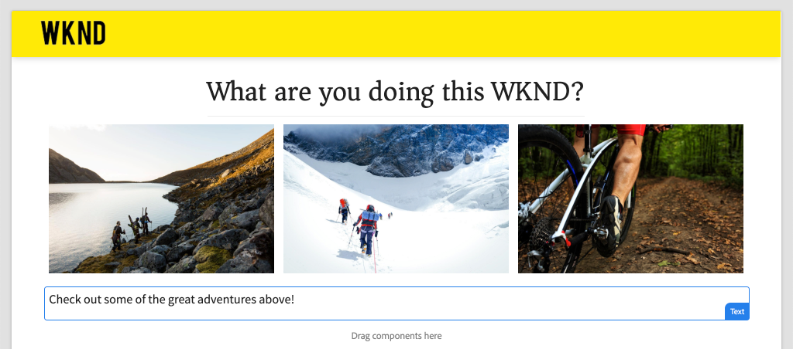

# Mapear componentes do SPA para componentes do AEM {#map-components}

Saiba como mapear componentes do Angular para componentes do Adobe Experience Manager (AEM AEM SPA) com o SDK JS do editor do. O mapeamento de componentes permite que os usuários façam atualizações dinâmicas nos componentes do SPA no editor SPA AEM, de forma semelhante à criação tradicional do AEM.

Este capítulo detalha a API do modelo JSON do AEM e mostra como o conteúdo JSON exposto por um componente AEM pode ser injetado automaticamente em um componente do Angular como props.

## Objetivo

1. Saiba como mapear componentes de AEM para componentes de SPA.
2. Entenda a diferença entre **Container** componentes e **Conteúdo** componentes.
3. Crie um novo componente do Angular que mapeie para um componente AEM existente.

## O que você vai criar

Este capítulo verificará como as `Text` O componente SPA é mapeado para o AEM `Text`componente. Um novo `Image` É criado um componente SPA que pode ser usado no SPA e criado no AEM. Recursos prontos para uso do **Contêiner de layout** e **Editor de modelo** as políticas também serão usadas para criar uma visão um pouco mais variada na aparência.



## Pré-requisitos

Analisar as ferramentas e instruções necessárias para a configuração de um [ambiente de desenvolvimento local](overview.md#local-dev-environment).

### Obter o código

1. Baixe o ponto de partida para este tutorial pelo Git:

   ```shell
   $ git clone git@github.com:adobe/aem-guides-wknd-spa.git
   $ cd aem-guides-wknd-spa
   $ git checkout Angular/map-components-start
   ```

2. Implante a base de código em uma instância de AEM local usando Maven:

   ```shell
   $ mvn clean install -PautoInstallSinglePackage
   ```

   Se estiver usando [AEM 6.x](overview.md#compatibility) adicione o `classic` perfil:

   ```shell
   $ mvn clean install -PautoInstallSinglePackage -Pclassic
   ```

Você sempre pode exibir o código concluído em [GitHub](https://github.com/adobe/aem-guides-wknd-spa/tree/Angular/map-components-solution) ou verifique o código localmente alternando para a ramificação `Angular/map-components-solution`.

## Abordagem de mapeamento

O conceito básico é mapear um componente SPA para um componente AEM. Componentes do AEM, executar no lado do servidor, exportar conteúdo como parte da API do modelo JSON. O conteúdo JSON é consumido pelo SPA, executando no lado do cliente no navegador. Um mapeamento 1:1 entre componentes SPA e um componente AEM é criado.


*Visão geral de alto nível do mapeamento de um componente AEM para um componente de Angular*

## Inspect, o componente de Texto

A variável [Arquétipo de projeto AEM](https://github.com/adobe/aem-project-archetype) fornece uma `Text` componente mapeado para o AEM [Componente de texto](https://experienceleague.adobe.com/docs/experience-manager-core-components/using/components/text.html). Este é um exemplo de **conteúdo** componente, na medida em que *conteúdo* do AEM.

Vamos ver como o componente funciona.

### Inspect e o modelo JSON

1. Antes de pular para o código SPA, é importante entender o modelo JSON que o AEM fornece. Navegue até a [Biblioteca de componentes principais](https://www.aemcomponents.dev/content/core-components-examples/library/core-content/text.html) e visualize a página do componente de Texto. A Biblioteca de componentes principais fornece exemplos de todos os componentes principais AEM.
2. Selecione o **JSON** para um dos exemplos:

   

   Você deve ver três propriedades: `text`, `richText`, e `:type`.

   `:type` é uma propriedade reservada que lista as `sling:resourceType` (ou caminho) do componente AEM. O valor de `:type` é usado para mapear o componente AEM para o componente SPA.

   `text` e `richText` são propriedades adicionais expostas ao componente SPA.

### Inspect, o componente de Texto

1. Abra um novo terminal e acesse a página `ui.frontend` pasta dentro do projeto. Executar `npm install` e depois `npm start` para iniciar o **servidor de desenvolvimento do webpack**:

   ```shell
   $ cd ui.frontend
   $ npm run start:mock
   ```

   A variável `ui.frontend` O módulo está configurado para usar o [modelo JSON simulado](./integrate-spa.md#mock-json).

2. Você deve ver uma nova janela do navegador aberta para [http://localhost:4200/content/wknd-spa-angular/us/en/home.html](http://localhost:4200/content/wknd-spa-angular/us/en/home.html)

   

3. No IDE de sua escolha, abra o projeto AEM para o SPA WKND. Expanda a `ui.frontend` e abra o arquivo **text.component.ts** em `ui.frontend/src/app/components/text/text.component.ts`:

   

4. A primeira área a ser inspecionada é a `class TextComponent` em ~linha 35:

   ```js
   export class TextComponent {
       @Input() richText: boolean;
       @Input() text: string;
       @Input() itemName: string;
   
       @HostBinding('innerHtml') get content() {
           return this.richText
           ? this.sanitizer.bypassSecurityTrustHtml(this.text)
           : this.text;
       }
       @HostBinding('attr.data-rte-editelement') editAttribute = true;
   
       constructor(private sanitizer: DomSanitizer) {}
   }
   ```

   [@Input()](https://angular.io/api/core/Input) o decorador é usado para declarar campos cujos valores são definidos por meio do objeto JSON mapeado, revisado anteriormente.

   `@HostBinding('innerHtml') get content()` é um método que expõe o conteúdo do texto criado a partir do valor de `this.text`. No caso de o conteúdo ser rich text (determinado pelo parâmetro `this.richText` sinalizador) a segurança interna do Angular é ignorada. Angular [DomSanitizer](https://angular.io/api/platform-browser/DomSanitizer) O é usado para &quot;movimentar&quot; o HTML bruto e evitar vulnerabilidades de Criação de script entre sites. O método está vinculado à variável `innerHtml` propriedade usando o [@HostBinding](https://angular.io/api/core/HostBinding) decorador.

5. Em seguida, inspecione o `TextEditConfig` em ~linha 24:

   ```js
   const TextEditConfig = {
       emptyLabel: 'Text',
       isEmpty: cqModel =>
           !cqModel || !cqModel.text || cqModel.text.trim().length < 1
   };
   ```

   O código acima é responsável por determinar quando renderizar o espaço reservado no ambiente do autor do AEM. Se a variável `isEmpty` o método retorna **true** em seguida, o espaço reservado é renderizado.

6. Por fim, dê uma olhada no `MapTo` chame em ~linha 53:

   ```js
   MapTo('wknd-spa-angular/components/text')(TextComponent, TextEditConfig );
   ```

   **MapTo** é fornecido pelo SPA Editor de JS SDK do AEM (`@adobe/cq-angular-editable-components`). O caminho `wknd-spa-angular/components/text` representa o `sling:resourceType` componente AEM. Esse caminho é compatível com o `:type` exposto pelo modelo JSON observado anteriormente. **MapTo** O analisa a resposta do modelo JSON e transmite os valores corretos para o `@Input()` variáveis do componente SPA.

   Você pode encontrar o AEM `Text` definição de componente em `ui.apps/src/main/content/jcr_root/apps/wknd-spa-angular/components/text`.

7. Experimente modificando o **en.model.json** arquivo em `ui.frontend/src/mocks/json/en.model.json`.

   Em ~line 62 atualize a primeira `Text` valor para usar um **`H1`** e **`u`** tags:

   ```json
       "text": {
           "text": "<h1><u>Hello World!</u></h1>",
           "richText": true,
           ":type": "wknd-spa-angular/components/text"
       }
   ```

   Retorne ao navegador para ver os efeitos da **servidor de desenvolvimento do webpack**:

   

   Tente alternar a variável `richText` propriedade entre **true** / **false** para ver a lógica de renderização em ação.

8. Inspect **text.component.html** em `ui.frontend/src/app/components/text/text.component.html`.

   Este arquivo está vazio porque todo o conteúdo do componente é definido pelo `innerHTML` propriedade.

9. INSPECT o **app.module.ts** em `ui.frontend/src/app/app.module.ts`.

   ```js
   @NgModule({
   imports: [
       BrowserModule,
       SpaAngularEditableComponentsModule,
       AppRoutingModule
   ],
   providers: [ModelManagerService, { provide: APP_BASE_HREF, useValue: '/' }],
   declarations: [AppComponent, TextComponent, PageComponent, HeaderComponent],
   entryComponents: [TextComponent, PageComponent],
   bootstrap: [AppComponent]
   })
   export class AppModule {}
   ```

   A variável **ComponenteTexto** não está explicitamente incluído, mas de forma dinâmica através de **AEMResponsiveGridComponent** AEM fornecido pelo SDK JS do Editor SPA. Portanto, deve ser listado no **app.module.ts**&#39; [entryComponents](https://angular.io/guide/entry-components) matriz.

## Criar o componente de Imagem

Em seguida, crie um `Image` Componente do Angular que é mapeado para o AEM [Componente de imagem](https://experienceleague.adobe.com/docs/experience-manager-core-components/using/components/image.html?lang=pt-BR). A variável `Image` componente é outro exemplo de um **conteúdo** componente.

### Inspect, o JSON

Antes de pular para o código SPA, inspecione o modelo JSON fornecido pelo AEM.

1. Navegue até a [Exemplos de imagem na biblioteca de Componentes principais](https://www.aemcomponents.dev/content/core-components-examples/library/core-content/image.html).

   

   Propriedades de `src`, `alt`, e `title` são usados para preencher o SPA `Image` componente.

   >[!NOTE]
   >
   > Há outras propriedades de imagem expostas (`lazyEnabled`, `widths`) que permitem ao desenvolvedor criar um componente adaptável e de carregamento lento. O componente criado neste tutorial é simples e **não** use essas propriedades avançadas.

2. Retorne ao IDE e abra o `en.model.json` em `ui.frontend/src/mocks/json/en.model.json`. Como este é um componente novo para o nosso projeto, precisamos &quot;simular&quot; o JSON de imagem.

   Em ~line 70, adicione uma entrada JSON para a variável `image` modelo (não se esqueça da vírgula à direita `,` após o segundo `text_386303036`) e atualiza o `:itemsOrder` matriz.

   ```json
   ...
   ":items": {
               ...
               "text_386303036": {
                   "text": "<p>A new text component.</p>\r\n",
                   "richText": true,
                   ":type": "wknd-spa-angular/components/text"
                   },
               "image": {
                   "alt": "Rock Climber in New Zealand",
                   "title": "Rock Climber in New Zealand",
                   "src": "/mocks/images/adobestock-140634652.jpeg",
                   ":type": "wknd-spa-angular/components/image"
               }
           },
           ":itemsOrder": [
               "text",
               "text_386303036",
               "image"
           ],
   ```

   O projeto inclui uma imagem de amostra em `/mock-content/adobestock-140634652.jpeg` que é usado com o **servidor de desenvolvimento do webpack**.

   Você pode visualizar o [en.model.json aqui](https://github.com/adobe/aem-guides-wknd-spa/blob/Angular/map-components-solution/ui.frontend/src/mocks/json/en.model.json).

3. Adicione uma foto do estoque a ser exibida pelo componente.

   Crie uma nova pasta chamada **imagens** debaixo `ui.frontend/src/mocks`. Baixar [adobestock-140634652.jpeg](assets/map-components/adobestock-140634652.jpeg) e coloque-o no recém-criado **imagens** pasta. Você pode usar sua própria imagem, se desejar.

### Implementar o componente de Imagem

1. Interrompa o **servidor de desenvolvimento do webpack** se iniciado.
2. Crie um novo componente de Imagem executando a CLI do Angular `ng generate component` comando de dentro do `ui.frontend` pasta:

   ```shell
   $ ng generate component components/image
   ```

3. No IDE, abra **image.component.ts** em `ui.frontend/src/app/components/image/image.component.ts` e atualize da seguinte maneira:

   ```js
   import {Component, Input, OnInit} from '@angular/core';
   import {MapTo} from '@adobe/cq-angular-editable-components';
   
   const ImageEditConfig = {
   emptyLabel: 'Image',
   isEmpty: cqModel =>
       !cqModel || !cqModel.src || cqModel.src.trim().length < 1
   };
   
   @Component({
   selector: 'app-image',
   templateUrl: './image.component.html',
   styleUrls: ['./image.component.scss']
   })
   export class ImageComponent implements OnInit {
   
   @Input() src: string;
   @Input() alt: string;
   @Input() title: string;
   
   constructor() { }
   
   get hasImage() {
       return this.src && this.src.trim().length > 0;
   }
   
   ngOnInit() { }
   }
   
   MapTo('wknd-spa-angular/components/image')(ImageComponent, ImageEditConfig);
   ```

   `ImageEditConfig` é a configuração para determinar se o espaço reservado do autor deve ser renderizado no AEM, com base no fato de `src` é preenchida.

   `@Input()` de `src`, `alt`, e `title` são as propriedades mapeadas da API JSON.

   `hasImage()` é um método que determinará se a imagem deve ser renderizada.

   `MapTo` mapeia o componente SPA para o componente AEM localizado em `ui.apps/src/main/content/jcr_root/apps/wknd-spa-angular/components/image`.

4. Abertura **image.component.html** e atualizá-la da seguinte maneira:

   ```html
   <ng-container *ngIf="hasImage">
       
   </ng-container>
   ```

   Isso renderizará a `` element if `hasImage` devoluções **true**.

5. Abertura **image.component.scss** e atualizá-la da seguinte maneira:

   ```scss
   :host-context {
       display: block;
   }
   
   .image {
       margin: 1rem 0;
       width: 100%;
       border: 0;
   }
   ```

   >[!NOTE]
   >
   > A variável `:host-context` a regra é **crítico** AEM para que o espaço reservado do editor SPA funcione corretamente. Todos os componentes do SPA que devem ser criados no editor de página do AEM precisarão dessa regra no mínimo.

6. Abertura `app.module.ts` e adicione o `ImageComponent` para o `entryComponents` matriz:

   ```js
   entryComponents: [TextComponent, PageComponent, ImageComponent],
   ```

   Como o `TextComponent`, o `ImageComponent` é carregado dinamicamente e deve ser incluído na variável `entryComponents` matriz.

7. Inicie o **servidor de desenvolvimento do webpack** para ver o `ImageComponent` renderizar.

   ```shell
   $ npm run start:mock
   ```

   

   *Imagem adicionada ao SPA*

   >[!NOTE]
   >
   > **Desafio extra**: implemente um novo método para exibir o valor de `title` como uma legenda abaixo da imagem.

## Atualizar políticas no AEM

A variável `ImageComponent` O componente só é visível no **servidor de desenvolvimento do webpack**. SPA Em seguida, implante o AEM atualizado e atualize as políticas do template.

1. Interrompa o **servidor de desenvolvimento do webpack** e do **raiz** do projeto, implante as alterações no AEM usando suas habilidades em Maven:

   ```shell
   $ cd aem-guides-wknd-spa
   $ mvn clean install -PautoInstallSinglePackage
   ```

2. Na tela inicial do AEM, acesse **[!UICONTROL Ferramentas]** > **[!UICONTROL Modelos]** > **[ANGULAR SPA WKND](http://localhost:4502/libs/wcm/core/content/sites/templates.html/conf/wknd-spa-angular)**.

   Selecione e edite o **Página SPA**:

   

3. Selecione o **Contêiner de layout** e clique em **política** ícone para editar a política:

   

4. Em **Componentes permitidos** > **Angular SPA WKND - Conteúdo** > verifique a **Imagem** componente:

   

   Em **Componentes padrão** > **Adicionar mapeamento** e escolha o **Imagem - Angular SPA WKND - Conteúdo** componente:

   

   Insira um **tipo mime** de `image/*`.

   Clique em **Concluído** para salvar as atualizações de política.

5. No **Contêiner de layout** clique em **política** ícone para a variável **Texto** componente:

   

   Crie uma nova política chamada **Texto SPA WKND**. Em **Plug-ins** > **Formatação** > marque todas as caixas para ativar opções adicionais de formatação:

   

   Em **Plug-ins** > **Estilos de parágrafo** > marque a caixa para **Ativar estilos de parágrafo**:

   

   Clique em **Concluído** para salvar a atualização de política.

6. Navegue até a **Página inicial** [http://localhost:4502/editor.html/content/wknd-spa-angular/us/en/home.html](http://localhost:4502/editor.html/content/wknd-spa-angular/us/en/home.html).

   Também é possível editar a variável `Text` e adicionar outros estilos de parágrafo em **tela cheia** modo.

   

7. Também é possível arrastar e soltar uma imagem da tag **Localizador de ativos**:

   

8. Adicione suas próprias imagens pelo [AEM Assets](http://localhost:4502/assets.html/content/dam) ou instale a base de código concluída para o padrão [Site de referência da WKND](https://github.com/adobe/aem-guides-wknd/releases/latest). A variável [Site de referência da WKND](https://github.com/adobe/aem-guides-wknd/releases/latest) O inclui muitas imagens que podem ser reutilizadas no SPA WKND. O pacote pode ser instalado usando [Gerenciador de pacotes AEM](http://localhost:4502/crx/packmgr/index.jsp).

   

## Inspect o contêiner de layout

Suporte para o **Contêiner de layout** O é fornecido automaticamente pelo SDK do editor SPA AEM. A variável **Contêiner de layout**, conforme indicado pelo nome, é um **container** componente. Componentes de contêiner são componentes que aceitam estruturas JSON que representam *outro* componentes e instanciá-los dinamicamente.

Vamos analisar mais detalhadamente o Contêiner de layout.

1. No IDE, abra **responsive-grid.component.ts** em `ui.frontend/src/app/components/responsive-grid`:

   ```js
   import { AEMResponsiveGridComponent,MapTo } from '@adobe/cq-angular-editable-components';
   
   MapTo('wcm/foundation/components/responsivegrid')(AEMResponsiveGridComponent);
   ```

   A variável `AEMResponsiveGridComponent` AEM é implementado como parte do SPA Editor SDK e está incluído no projeto via `import-components`.

2. Em um navegador, navegue até [http://localhost:4502/content/wknd-spa-angular/us/en.model.json](http://localhost:4502/content/wknd-spa-angular/us/en.model.json)

   

   A variável **Contêiner de layout** O componente tem um `sling:resourceType` de `wcm/foundation/components/responsivegrid` e é reconhecido pelo Editor de SPA com o `:type` propriedade, exatamente como a `Text` e `Image` componentes.

   Os mesmos recursos de redimensionamento de um componente usando [Modo de layout](https://experienceleague.adobe.com/docs/experience-manager-65/authoring/siteandpage/responsive-layout.html#defining-layouts-layout-mode) estão disponíveis com o Editor de SPA.

3. Retornar para [http://localhost:4502/editor.html/content/wknd-spa-angular/us/en/home.html](http://localhost:4502/editor.html/content/wknd-spa-angular/us/en/home.html). Adicionar adicional **Imagem** componentes e tente redimensioná-los usando o **Layout** opção:

   

4. Reabra o modelo JSON [http://localhost:4502/content/wknd-spa-angular/us/en.model.json](http://localhost:4502/content/wknd-spa-angular/us/en.model.json) e observe as `columnClassNames` como parte do JSON:

   

   O nome da classe `aem-GridColumn--default--4` indica que o componente deve ter 4 colunas de largura com base em uma grade de 12 colunas. Mais detalhes sobre o [a grade responsiva pode ser encontrada aqui](https://adobe-marketing-cloud.github.io/aem-responsivegrid/).

5. Retorne ao IDE e no `ui.apps` há uma biblioteca do lado do cliente definida em `ui.apps/src/main/content/jcr_root/apps/wknd-spa-angular/clientlibs/clientlib-grid`. Abra o arquivo `less/grid.less`.

   Esse arquivo determina os pontos de interrupção (`default`, `tablet`, e `phone`) usado pelo **Contêiner de layout**. Este arquivo deve ser personalizado de acordo com as especificações do projeto. No momento, os pontos de interrupção estão definidos como `1200px` e `650px`.

6. Você deve poder usar os recursos responsivos e as políticas de rich text atualizadas do `Text` para criar uma exibição como a seguinte:

   

## Parabéns. {#congratulations}

Parabéns, você aprendeu a mapear componentes do SPA para componentes do AEM e implementou um novo `Image` componente. Você também tem a chance de explorar os recursos responsivos do **Contêiner de layout**.

Você sempre pode exibir o código concluído em [GitHub](https://github.com/adobe/aem-guides-wknd-spa/tree/Angular/map-components-solution) ou verifique o código localmente alternando para a ramificação `Angular/map-components-solution`.

### Próximas etapas {#next-steps}

[Navegação e Roteamento](navigation-routing.md) - Saiba como várias exibições no SPA podem ser compatíveis com o mapeamento para páginas AEM com o SDK do Editor de SPA. A navegação dinâmica é implementada usando o Angular Router e adicionada a um componente Header existente.

## Bônus - Configurações persistentes para o controle de origem {#bonus}

Em muitos casos, especialmente no início de um projeto AEM, é valioso manter as configurações, como modelos e políticas de conteúdo relacionadas, no controle de origem. Isso garante que todos os desenvolvedores trabalhem com o mesmo conjunto de conteúdo e configurações e possa garantir consistência adicional entre os ambientes. Quando um projeto atinge um determinado nível de maturidade, a prática de gerenciar modelos pode ser transferida para um grupo especial de usuários avançados.

As próximas etapas ocorrerão usando o Visual Studio Code IDE e [Sincronização VSCode com AEM](https://marketplace.visualstudio.com/items?itemName=yamato-ltd.vscode-aem-sync) mas pode estar usando qualquer ferramenta e qualquer IDE que você tenha configurado para **obter** ou **importar** conteúdo de uma instância local do AEM.

1. No Visual Studio Code IDE, certifique-se de que tenha **Sincronização VSCode com AEM** instalado pela extensão do Marketplace:

   

2. Expanda a **ui.content** módulo no Gerenciador de projetos e navegue até `/conf/wknd-spa-angular/settings/wcm/templates`.

3. **Clique com o botão direito** o `templates` e selecione **Importar do servidor AEM**:

   

4. Repita as etapas para importar conteúdo, mas selecione a variável **políticas** pasta localizada em `/conf/wknd-spa-angular/settings/wcm/policies`.

5. INSPECT o `filter.xml` arquivo localizado em `ui.content/src/main/content/META-INF/vault/filter.xml`.

   ```xml
   <!--ui.content filter.xml-->
   <?xml version="1.0" encoding="UTF-8"?>
    <workspaceFilter version="1.0">
        <filter root="/conf/wknd-spa-angular" mode="merge"/>
        <filter root="/content/wknd-spa-angular" mode="merge"/>
        <filter root="/content/dam/wknd-spa-angular" mode="merge"/>
        <filter root="/content/experience-fragments/wknd-spa-angular" mode="merge"/>
    </workspaceFilter>
   ```

   A variável `filter.xml` O arquivo é responsável por identificar os caminhos dos nós instalados com o pacote. Observe a `mode="merge"` em cada filtro que indica que o conteúdo existente não será modificado, somente o novo conteúdo será adicionado. Como os autores de conteúdo podem estar atualizando esses caminhos, é importante que uma implantação de código **não** substituir conteúdo. Consulte a [Documentação do FileVault](https://jackrabbit.apache.org/filevault/filter.html) para obter mais detalhes sobre como trabalhar com elementos de filtro.

   Comparar `ui.content/src/main/content/META-INF/vault/filter.xml` e `ui.apps/src/main/content/META-INF/vault/filter.xml` para entender os diferentes nós gerenciados por cada módulo.
