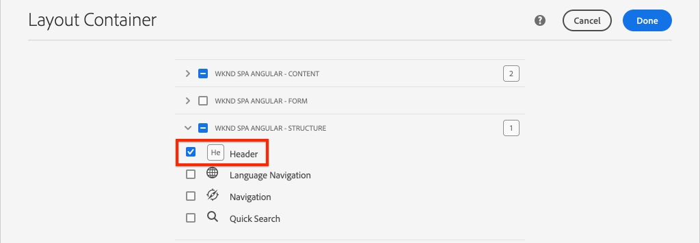
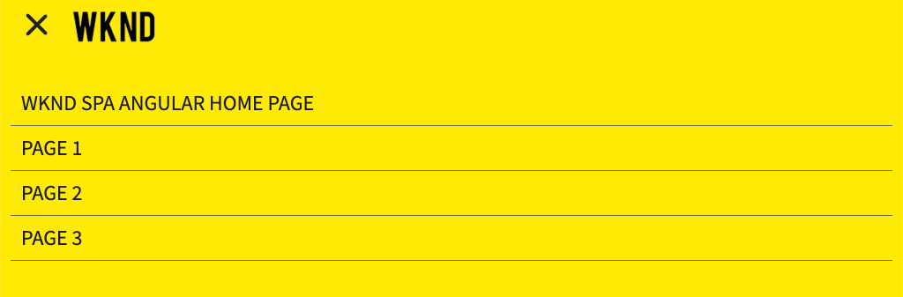

# Adicionar navegação e roteamento {#navigation-routing}

Saiba como várias exibições no SPA são compatíveis com o uso de Páginas AEM e do SDK do Editor SPA. A navegação dinâmica é implementada usando rotas Angular e adicionada a um componente Cabeçalho existente.

## Objetivo

1. Entenda as opções de roteamento do modelo de SPA disponíveis ao usar o Editor de SPA.
2. Saiba como usar [Roteamento de angular](https://angular.io/guide/router) para navegar entre diferentes visualizações do SPA.
3. Implemente uma navegação dinâmica orientada pela hierarquia de página de AEM.

## O que você vai criar

Este capítulo adiciona um menu de navegação a um `Header` componente. O menu de navegação é orientado pela hierarquia de página de AEM e usa o modelo JSON fornecido pela variável [Componente principal de navegação](https://experienceleague.adobe.com/docs/experience-manager-core-components/using/components/navigation.html).


## Pré-requisitos

Revise as ferramentas necessárias e as instruções para configurar um [ambiente de desenvolvimento local](overview.md#local-dev-environment).

### Obter o código

1. Baixe o ponto de partida para este tutorial via Git:

   ```shell
   $ git clone git@github.com:adobe/aem-guides-wknd-spa.git
   $ cd aem-guides-wknd-spa
   $ git checkout Angular/navigation-routing-start
   ```

2. Implante a base de código em uma instância de AEM local usando o Maven:

   ```shell
   $ mvn clean install -PautoInstallSinglePackage
   ```

   Se estiver usando [AEM 6.x](overview.md#compatibility) adicione o `classic` perfil:

   ```shell
   $ mvn clean install -PautoInstallSinglePackage -Pclassic
   ```

3. Instale o pacote concluído para o pacote tradicional [Site de referência WKND](https://github.com/adobe/aem-guides-wknd/releases/latest). As imagens fornecidas por [Site de referência WKND](https://github.com/adobe/aem-guides-wknd/releases/latest) são reutilizadas no SPA WKND. O pacote pode ser instalado usando [Gerenciador de pacotes de AEM](http://localhost:4502/crx/packmgr/index.jsp).

   

Você sempre pode exibir o código concluído em [GitHub](https://github.com/adobe/aem-guides-wknd-spa/tree/Angular/navigation-routing-solution) ou verifique o código localmente, alternando para a ramificação `Angular/navigation-routing-solution`.

## Atualizações do Inspect HeaderComponent {#inspect-header}

Em capítulos anteriores, o `HeaderComponent` componente foi adicionado como um componente de Angular puro incluído por `app.component.html`. Neste capítulo, a variável `HeaderComponent` é removido do aplicativo e adicionado por meio do [Editor de modelos](https://experienceleague.adobe.com/docs/experience-manager-learn/sites/page-authoring/template-editor-feature-video-use.html?lang=pt-BR). Isso permite que os usuários configurem o menu de navegação da variável `HeaderComponent` no AEM.

>[!NOTE]
>
> Várias atualizações de CSS e JavaScript já foram feitas na base de código para iniciar este capítulo. Para se concentrar nos conceitos principais, não **all** das alterações de código são discutidas. Você pode visualizar as alterações completas [here](https://github.com/adobe/aem-guides-wknd-spa/compare/Angular/map-components-solution...Angular/navigation-routing-start).

1. No IDE de sua escolha, abra o SPA projeto inicial para este capítulo.
2. Abaixo da `ui.frontend` o módulo inspeciona o arquivo `header.component.ts` em: `ui.frontend/src/app/components/header/header.component.ts`.

   Várias atualizações foram feitas, incluindo a adição de um `HeaderEditConfig` e `MapTo` para permitir que o componente seja mapeado para um componente AEM `wknd-spa-angular/components/header`.

   ```js
   /* header.component.ts */
   ...
   const HeaderEditConfig = {
       ...
   };
   
   @Component({
   selector: 'app-header',
   templateUrl: './header.component.html',
   styleUrls: ['./header.component.scss']
   })
   export class HeaderComponent implements OnInit {
   @Input() items: object[];
       ...
   }
   ...
   MapTo('wknd-spa-angular/components/header')(withRouter(Header), HeaderEditConfig);
   ```

   Observe que `@Input()` anotação para `items`. `items` conterá uma matriz de objetos de navegação passados do AEM.

3. No `ui.apps` o módulo inspeciona a definição do componente do AEM `Header` componente: `ui.apps/src/main/content/jcr_root/apps/wknd-spa-angular/components/header/.content.xml`:

   ```xml
   <?xml version="1.0" encoding="UTF-8"?>
   <jcr:root xmlns:sling="http://sling.apache.org/jcr/sling/1.0" xmlns:cq="http://www.day.com/jcr/cq/1.0"
       xmlns:jcr="http://www.jcp.org/jcr/1.0"
       jcr:primaryType="cq:Component"
       jcr:title="Header"
       sling:resourceSuperType="wknd-spa-angular/components/navigation"
       componentGroup="WKND SPA Angular - Structure"/>
   ```

   O AEM `Header` herdará toda a funcionalidade do [Componente principal de navegação](https://experienceleague.adobe.com/docs/experience-manager-core-components/using/components/navigation.html) através da `sling:resourceSuperType` propriedade.

## Adicionar o HeaderComponent ao modelo de SPA {#add-header-template}

1. Abra um navegador e faça logon no AEM, [http://localhost:4502/](http://localhost:4502/). A base de código inicial já deve ser implantada.
2. Navegue até o **[!UICONTROL Modelo de página SPA]**: [http://localhost:4502/editor.html/conf/wknd-spa-angular/settings/wcm/templates/spa-page-template/structure.html](http://localhost:4502/editor.html/conf/wknd-spa-angular/settings/wcm/templates/spa-page-template/structure.html).
3. Selecione o mais externo **[!UICONTROL Contêiner de layout raiz]** e clique em **[!UICONTROL Política]** ícone . Tenha cuidado **not** para selecionar o **[!UICONTROL Contêiner de layout]** desbloqueado para criação.

   

4. Copie a política atual e crie uma nova política chamada **[!UICONTROL Estrutura SPA]**:

   

   Em **[!UICONTROL Componentes permitidos]** > **[!UICONTROL Geral]** > selecione o **[!UICONTROL Contêiner de layout]** componente.

   Em **[!UICONTROL Componentes permitidos]** > **[!UICONTROL Angular SPA WKND - ESTRUTURA]** > selecione o **[!UICONTROL Cabeçalho]** componente:

   

   Em **[!UICONTROL Componentes permitidos]** > **[!UICONTROL Angular SPA WKND - Conteúdo]** > selecione o **[!UICONTROL Imagem]** e **[!UICONTROL Texto]** componentes. Você deve ter quatro componentes totais selecionados.

   Clique em **[!UICONTROL Concluído]** para salvar as alterações.

5. **Atualize a página.** Adicione o **[!UICONTROL Cabeçalho]** componente acima do desbloqueado **[!UICONTROL Contêiner de layout]**:

   

6. Selecione o **[!UICONTROL Cabeçalho]** e clique em seu **Política** ícone para editar a política.

   

7. Crie uma nova política com uma **[!UICONTROL Título da política]** de **&quot;Cabeçalho SPA WKND&quot;**.

   Em **[!UICONTROL Propriedades]**:

   * Defina as **[!UICONTROL Raiz de navegação]** para `/content/wknd-spa-angular/us/en`.
   * Defina as **[!UICONTROL Excluir níveis raiz]** para **1**.
   * Desmarcar **[!UICONTROL Coletar todas as páginas secundárias]**.
   * Defina as **[!UICONTROL Profundidade da estrutura de navegação]** para **3**.

   

   Isso coletará os 2 níveis de navegação abaixo `/content/wknd-spa-angular/us/en`.

8. Depois de salvar as alterações, você deve ver o campo preenchido `Header` como parte do modelo:

   

## Criar páginas secundárias

Em seguida, crie páginas adicionais no AEM que servirão como visualizações diferentes no SPA. Inspecionaremos também a estrutura hierárquica do modelo JSON fornecido pelo AEM.

1. Navegue até o **Sites** console: [http://localhost:4502/sites.html/content/wknd-spa-angular/us/en/home](http://localhost:4502/sites.html/content/wknd-spa-angular/us/en/home). Selecione o **Página inicial do Angular WKND SPA** e clique em **[!UICONTROL Criar]** > **[!UICONTROL Página]**:

   

2. Em **[!UICONTROL Modelo]** select **[!UICONTROL Página SPA]**. Em **[!UICONTROL Propriedades]** enter **&quot;Página 1&quot;** para **[!UICONTROL Título]** e **&quot;page-1&quot;** como o nome.

   

   Clique em **[!UICONTROL Criar]** e, na janela pop-up, clique em **[!UICONTROL Abrir]** para abrir a página no Editor de SPA de AEM.

3. Adicione um novo **[!UICONTROL Texto]** para o componente principal **[!UICONTROL Contêiner de layout]**. Edite o componente e insira o texto: **&quot;Página 1&quot;** usando o RTE e o **H1** elemento (será necessário entrar no modo de tela cheia para alterar os elementos de parágrafo)

   

   Você pode adicionar conteúdo adicional, como uma imagem.

4. Retorne ao console AEM Sites e repita as etapas acima, criando uma segunda página com o nome **&quot;Página 2&quot;** como um irmão de **Página 1**. Adicionar conteúdo a **Página 2** para ser facilmente identificado.
5. Por fim, crie uma terceira página, **&quot;Página 3&quot;** mas como um **criança** de **Página 2**. Depois de concluída, a hierarquia do site deve ser semelhante ao seguinte:

   

6. Em uma nova guia, abra a API do modelo JSON fornecida pelo AEM: [http://localhost:4502/content/wknd-spa-angular/us/en.model.json](http://localhost:4502/content/wknd-spa-angular/us/en.model.json). Esse conteúdo JSON é solicitado quando o SPA é carregado pela primeira vez. A estrutura externa tem a seguinte aparência:

   ```json
   {
   "language": "en",
   "title": "en",
   "templateName": "spa-app-template",
   "designPath": "/libs/settings/wcm/designs/default",
   "cssClassNames": "spa page basicpage",
   ":type": "wknd-spa-angular/components/spa",
   ":items": {},
   ":itemsOrder": [],
   ":hierarchyType": "page",
   ":path": "/content/wknd-spa-angular/us/en",
   ":children": {
       "/content/wknd-spa-angular/us/en/home": {},
       "/content/wknd-spa-angular/us/en/home/page-1": {},
       "/content/wknd-spa-angular/us/en/home/page-2": {},
       "/content/wknd-spa-angular/us/en/home/page-2/page-3": {}
       }
   }
   ```

   Em `:children` você deve ver uma entrada para cada página criada. O conteúdo de todas as páginas está nesta solicitação JSON inicial. Uma vez que o roteamento de navegação é implementado, as exibições subsequentes do SPA são carregadas rapidamente, já que o conteúdo já está disponível no lado do cliente.

   Não é recomendável carregar **TODAS** do conteúdo de um SPA na solicitação JSON inicial, pois isso diminuiria o carregamento da página inicial. Em seguida, vamos examinar como a profundidade da hierarquia das páginas é coletada.

7. Navegue até o **Raiz SPA** modelo em: [http://localhost:4502/editor.html/conf/wknd-spa-angular/settings/wcm/templates/spa-app-template/structure.html](http://localhost:4502/editor.html/conf/wknd-spa-angular/settings/wcm/templates/spa-app-template/structure.html).

   Clique no botão **[!UICONTROL Menu de propriedades da página]** > **[!UICONTROL Política da página]**:

   

8. O **Raiz SPA** O modelo tem um extra **[!UICONTROL Estrutura Hierárquica]** para controlar o conteúdo JSON coletado. O **[!UICONTROL Profundidade da estrutura]** determina o quão profundo na hierarquia do site coletar páginas secundárias abaixo do **root**. Também é possível usar a variável **[!UICONTROL Padrões da estrutura]** para filtrar páginas adicionais com base em uma expressão regular.

   Atualize o **[!UICONTROL Profundidade da estrutura]** para **&quot;2&quot;**:

   

   Clique em **[!UICONTROL Concluído]** para salvar as alterações na política.

9. Reabra o modelo JSON [http://localhost:4502/content/wknd-spa-angular/us/en.model.json](http://localhost:4502/content/wknd-spa-angular/us/en.model.json).

   ```json
   {
   "language": "en",
   "title": "en",
   "templateName": "spa-app-template",
   "designPath": "/libs/settings/wcm/designs/default",
   "cssClassNames": "spa page basicpage",
   ":type": "wknd-spa-angular/components/spa",
   ":items": {},
   ":itemsOrder": [],
   ":hierarchyType": "page",
   ":path": "/content/wknd-spa-angular/us/en",
   ":children": {
       "/content/wknd-spa-angular/us/en/home": {},
       "/content/wknd-spa-angular/us/en/home/page-1": {},
       "/content/wknd-spa-angular/us/en/home/page-2": {}
       }
   }
   ```

   Observe que a variável **Página 3** O caminho foi removido: `/content/wknd-spa-angular/us/en/home/page-2/page-3` no modelo JSON inicial.

   Posteriormente, observaremos como o SDK do Editor de SPA AEM pode carregar dinamicamente conteúdo adicional.

## Implementar a navegação

Em seguida, implemente o menu de navegação com um novo `NavigationComponent`. Podemos adicionar o código diretamente em `header.component.html` mas uma prática melhor é evitar componentes grandes. Em vez disso, implemente uma `NavigationComponent` que poderá ser reutilizada posteriormente.

1. Revise o JSON exposto pelo AEM `Header` componente em [http://localhost:4502/content/wknd-spa-angular/us/en.model.json](http://localhost:4502/content/wknd-spa-angular/us/en.model.json):

   ```json
   ...
   "header": {
       "items": [
       {
       "level": 0,
       "active": true,
       "path": "/content/wknd-spa-angular/us/en/home",
       "description": null,
       "url": "/content/wknd-spa-angular/us/en/home.html",
       "lastModified": 1589062597083,
       "title": "WKND SPA Angular Home Page",
       "children": [
               {
               "children": [],
               "level": 1,
               "active": false,
               "path": "/content/wknd-spa-angular/us/en/home/page-1",
               "description": null,
               "url": "/content/wknd-spa-angular/us/en/home/page-1.html",
               "lastModified": 1589429385100,
               "title": "Page 1"
               },
               {
               "level": 1,
               "active": true,
               "path": "/content/wknd-spa-angular/us/en/home/page-2",
               "description": null,
               "url": "/content/wknd-spa-angular/us/en/home/page-2.html",
               "lastModified": 1589429603507,
               "title": "Page 2",
               "children": [
                   {
                   "children": [],
                   "level": 2,
                   "active": false,
                   "path": "/content/wknd-spa-angular/us/en/home/page-2/page-3",
                   "description": null,
                   "url": "/content/wknd-spa-angular/us/en/home/page-2/page-3.html",
                   "lastModified": 1589430413831,
                   "title": "Page 3"
                   }
               ],
               }
           ]
           }
       ],
   ":type": "wknd-spa-angular/components/header"
   ```

   A natureza hierárquica das páginas de AEM é modelada no JSON que pode ser usado para preencher um menu de navegação. Lembre-se que a variável `Header` herda toda a funcionalidade do [Componente principal de navegação](https://www.aemcomponents.dev/content/core-components-examples/library/core-structure/navigation.html) e o conteúdo exposto por meio do JSON é mapeado automaticamente para o Angular `@Input` anotação.

2. Abra uma nova janela de terminal e navegue até a `ui.frontend` pasta do projeto SPA. Crie um novo `NavigationComponent` usando a ferramenta Angular CLI:

   ```shell
   $ cd ui.frontend
   $ ng generate component components/navigation
   CREATE src/app/components/navigation/navigation.component.scss (0 bytes)
   CREATE src/app/components/navigation/navigation.component.html (25 bytes)
   CREATE src/app/components/navigation/navigation.component.spec.ts (656 bytes)
   CREATE src/app/components/navigation/navigation.component.ts (286 bytes)
   UPDATE src/app/app.module.ts (2032 bytes)
   ```

3. Em seguida, crie uma classe chamada `NavigationLink` uso da CLI do Angular no `components/navigation` diretório:

   ```shell
   $ cd src/app/components/navigation/
   $ ng generate class NavigationLink
   CREATE src/app/components/navigation/navigation-link.spec.ts (187 bytes)
   CREATE src/app/components/navigation/navigation-link.ts (32 bytes)
   ```

4. Retorne ao IDE de sua escolha e abra o arquivo em `navigation-link.ts` at `/src/app/components/navigation/navigation-link.ts`.

   

5. Preencher `navigation-link.ts` com o seguinte:

   ```js
   export class NavigationLink {
   
       title: string;
       path: string;
       url: string;
       level: number;
       children: NavigationLink[];
       active: boolean;
   
       constructor(data) {
           this.path = data.path;
           this.title = data.title;
           this.url = data.url;
           this.level = data.level;
           this.active = data.active;
           this.children = data.children.map( item => {
               return new NavigationLink(item);
           });
       }
   }
   ```

   Esta é uma classe simples para representar um link de navegação individual. No construtor de classe esperamos `data` para ser o objeto JSON transmitido da AEM. Essa classe é usada em `NavigationComponent` e `HeaderComponent` para preencher facilmente a estrutura de navegação.

   Nenhuma transformação de dados é executada, essa classe é criada primariamente para digitar fortemente o modelo JSON. Observe que `this.children` é digitado como `NavigationLink[]` e que o construtor cria recursivamente novos `NavigationLink` objetos para cada um dos itens no `children` matriz. Lembre-se do modelo JSON para a `Header` é hierárquica.

6. Abra o arquivo `navigation-link.spec.ts`. Este é o arquivo de teste para a variável `NavigationLink` classe . Atualize com o seguinte:

   ```js
   import { NavigationLink } from './navigation-link';
   
   describe('NavigationLink', () => {
       it('should create an instance', () => {
           const data = {
               children: [],
               level: 1,
               active: false,
               path: '/content/wknd-spa-angular/us/en/home/page-1',
               description: null,
               url: '/content/wknd-spa-angular/us/en/home/page-1.html',
               lastModified: 1589429385100,
               title: 'Page 1'
           };
           expect(new NavigationLink(data)).toBeTruthy();
       });
   });
   ```

   Observe que `const data` segue o mesmo modelo JSON inspecionado anteriormente para um único link. Isso está longe de ser um teste de unidade robusto, no entanto deve ser suficiente para testar o construtor de `NavigationLink`.

7. Abra o arquivo `navigation.component.ts`. Atualize com o seguinte:

   ```js
   import { Component, OnInit, Input } from '@angular/core';
   import { NavigationLink } from './navigation-link';
   
   @Component({
   selector: 'app-navigation',
   templateUrl: './navigation.component.html',
   styleUrls: ['./navigation.component.scss']
   })
   export class NavigationComponent implements OnInit {
   
       @Input() items: object[];
   
       constructor() { }
   
       get navigationLinks(): NavigationLink[] {
   
           if (this.items && this.items.length > 0) {
               return this.items.map(item => {
                   return new NavigationLink(item);
               });
           }
   
           return null;
       }
   
       ngOnInit() {}
   
   }
   ```

   `NavigationComponent` espera um `object[]` nomeado `items` este é o modelo JSON do AEM. Essa classe expõe um único método `get navigationLinks()` que retorna uma matriz de `NavigationLink` objetos.

8. Abra o arquivo `navigation.component.html` e atualize com o seguinte:

   ```html
   <ul *ngIf="navigationLinks && navigationLinks.length > 0" class="navigation__group">
       <ng-container *ngTemplateOutlet="recursiveListTmpl; context:{ links: navigationLinks }"></ng-container>
   </ul>
   ```

   Isso gera uma `<ul>` e chama a função `get navigationLinks()` método de `navigation.component.ts`. Um `<ng-container>` é usada para fazer uma chamada para um modelo chamado `recursiveListTmpl` e o transmite `navigationLinks` como uma variável nomeada `links`.

   Adicione o `recursiveListTmpl` próximo:

   ```html
   <ng-template #recursiveListTmpl let-links="links">
       <li *ngFor="let link of links" class="{{'navigation__item navigation__item--' + link.level}}">
           <a [routerLink]="link.url" class="navigation__item-link" [title]="link.title" [attr.aria-current]="link.active">
               {{link.title}}
           </a>
           <ul *ngIf="link.children && link.children.length > 0">
               <ng-container *ngTemplateOutlet="recursiveListTmpl; context:{ links: link.children }"></ng-container>
           </ul>
       </li>
   </ng-template>
   ```

   Aqui, o restante da renderização do link de navegação é implementado. Observe que a variável `link` é do tipo `NavigationLink` e todos os métodos/propriedades criados por essa classe estão disponíveis. [`[routerLink]`](https://angular.io/api/router/RouterLink) é usada em vez de normal `href` atributo. Isso nos permite vincular a rotas específicas no aplicativo, sem uma atualização de página inteira.

   A parte recursiva da navegação também é implementada pela criação de outra `<ul>` se o `link` tem um não vazio `children` matriz.

9. Atualizar `navigation.component.spec.ts` para adicionar suporte para `RouterTestingModule`:

   ```diff
    ...
   + import { RouterTestingModule } from '@angular/router/testing';
    ...
    beforeEach(async(() => {
       TestBed.configureTestingModule({
   +   imports: [ RouterTestingModule ],
       declarations: [ NavigationComponent ]
       })
       .compileComponents();
    }));
    ...
   ```

   Adicionar a `RouterTestingModule` é obrigatório, pois o componente usa `[routerLink]`.

10. Atualizar `navigation.component.scss` para adicionar alguns estilos básicos à `NavigationComponent`:

   ```scss
   @import "~src/styles/variables";
   
   $link-color: $black;
   $link-hover-color: $white;
   $link-background: $black;
   
   :host-context {
       display: block;
       width: 100%;
   }
   
   .navigation__item {
       list-style: none;
   }
   
   .navigation__item-link {
       color: $link-color;
       font-size: $font-size-large;
       text-transform: uppercase;
       padding: $gutter-padding;
       display: flex;
       border-bottom: 1px solid $gray;
   
       &:hover {
           background: $link-background;
           color: $link-hover-color;
       }
   
   }
   ```

## Atualizar o componente de cabeçalho

Agora que a variável `NavigationComponent` foi implementada, a `HeaderComponent` deve ser atualizado para referenciá-lo.

1. Abra um terminal e navegue até o `ui.frontend` no projeto SPA. Inicie o **servidor de desenvolvimento de webpack**:

   ```shell
   $ npm start
   ```

2. Abra uma guia do navegador e navegue até [http://localhost:4200/](http://localhost:4200/).

   O **servidor de desenvolvimento de webpack** deve ser configurado para proxy do modelo JSON de uma instância local do AEM (`ui.frontend/proxy.conf.json`). Isso nos permitirá codificar diretamente no conteúdo criado no AEM do anteriormente no tutorial.

   

   O `HeaderComponent` No momento, o possui a funcionalidade de alternância de menu já implementada. Em seguida, adicione o componente de navegação.

3. Retorne ao IDE de sua escolha e abra o arquivo `header.component.ts` at `ui.frontend/src/app/components/header/header.component.ts`.
4. Atualize o `setHomePage()` para remover a sequência de caracteres codificada e usar as props dinâmicas passadas pelo componente de AEM:

   ```js
   /* header.component.ts */
   import { NavigationLink } from '../navigation/navigation-link';
   ...
    setHomePage() {
       if (this.hasNavigation) {
           const rootNavigationLink: NavigationLink = new NavigationLink(this.items[0]);
           this.isHome = rootNavigationLink.path === this.route.snapshot.data.path;
           this.homePageUrl = rootNavigationLink.url;
       }
   }
   ...
   ```

   Uma nova instância de `NavigationLink` é criado com base em `items[0]`, a raiz do modelo JSON de navegação passado do AEM. `this.route.snapshot.data.path` retorna o caminho da rota de Angular atual. Esse valor é usado para determinar se a rota atual é a **Página inicial**. `this.homePageUrl` é usada para preencher o link de âncora no **logotipo**.

5. Abrir `header.component.html` e substitua o espaço reservado estático para a navegação por uma referência para a `NavigationComponent`:

   ```diff
       <div class="header-navigation">
           <div class="navigation">
   -            Navigation Placeholder
   +           <app-navigation [items]="items"></app-navigation>
           </div>
       </div>
   ```

   `[items]=items` O atributo passa o `@Input() items` do `HeaderComponent` para `NavigationComponent` onde criará a navegação.

6. Abrir `header.component.spec.ts` e adicione uma declaração para a `NavigationComponent`:

   ```diff
       /* header.component.spect.ts */
   +   import { NavigationComponent } from '../navigation/navigation.component';
   
       describe('HeaderComponent', () => {
       let component: HeaderComponent;
       let fixture: ComponentFixture<HeaderComponent>;
   
       beforeEach(async(() => {
           TestBed.configureTestingModule({
           imports: [ RouterTestingModule ],
   +       declarations: [ HeaderComponent, NavigationComponent ]
           })
           .compileComponents();
       }));
   ```

   Como a variável `NavigationComponent` agora é usada como parte do `HeaderComponent` deve ser declarado como parte do banco de ensaio.

7. Salve as alterações em qualquer arquivo aberto e retorne ao **servidor de desenvolvimento de webpack**: [http://localhost:4200/](http://localhost:4200/)

   

   Abra a navegação clicando no botão de alternância do menu e você deverá ver os links de navegação preenchidos. É possível navegar para diferentes exibições do SPA.

## Entender o roteamento de SPA

Agora que a navegação foi implementada, inspecione o roteamento no AEM.

1. No IDE, abra o arquivo `app-routing.module.ts` at `ui.frontend/src/app`.

   ```js
   /* app-routing.module.ts */
   import { AemPageDataResolver, AemPageRouteReuseStrategy } from '@adobe/cq-angular-editable-components';
   import { NgModule } from '@angular/core';
   import { RouteReuseStrategy, RouterModule, Routes, UrlMatchResult, UrlSegment } from '@angular/router';
   import { PageComponent } from './components/page/page.component';
   
   export function AemPageMatcher(url: UrlSegment[]): UrlMatchResult {
       if (url.length) {
           return {
               consumed: url,
               posParams: {
                   path: url[url.length - 1]
               }
           };
       }
   }
   
   const routes: Routes = [
       {
           matcher: AemPageMatcher,
           component: PageComponent,
           resolve: {
               path: AemPageDataResolver
           }
       }
   ];
   @NgModule({
       imports: [RouterModule.forRoot(routes)],
       exports: [RouterModule],
       providers: [
           AemPageDataResolver,
           {
           provide: RouteReuseStrategy,
           useClass: AemPageRouteReuseStrategy
           }
       ]
   })
   export class AppRoutingModule {}
   ```

   O `routes: Routes = [];` O array define as rotas ou os caminhos de navegação para os mapeamentos de componentes do Angular.

   `AemPageMatcher` é um roteador de Angular personalizado [UrlMatcher](https://angular.io/api/router/UrlMatcher), que corresponde a qualquer coisa que &quot;pareça&quot; em uma página no AEM que faz parte deste aplicativo Angular.

   `PageComponent` é o Componente do Angular que representa uma Página no AEM e é usado para renderizar as rotas correspondentes. O `PageComponent` for revisado posteriormente no tutorial.

   `AemPageDataResolver`, fornecido pelo AEM Editor JS SDK, é um [Resolvedor do Roteador do Angular](https://angular.io/api/router/Resolve) usado para transformar a URL da rota, que é o caminho em AEM incluindo a extensão .html, no caminho do recurso em AEM, que é o caminho da página menos a extensão.

   Por exemplo, a variável `AemPageDataResolver` transforma o URL de uma rota de `content/wknd-spa-angular/us/en/home.html` em um caminho de `/content/wknd-spa-angular/us/en/home`. Isso é usado para resolver o conteúdo da página com base no caminho na API do modelo JSON.

   `AemPageRouteReuseStrategy`, fornecido pelo AEM Editor JS SDK, é um [RouteReuseStrategy](https://angular.io/api/router/RouteReuseStrategy) que impeçam a reutilização do `PageComponent` em todas as rotas. Caso contrário, o conteúdo da página &quot;A&quot; pode ser exibido ao navegar até a página &quot;B&quot;.

2. Abra o arquivo `page.component.ts` at `ui.frontend/src/app/components/page/`.

   ```js
   ...
   export class PageComponent {
       items;
       itemsOrder;
       path;
   
       constructor(
           private route: ActivatedRoute,
           private modelManagerService: ModelManagerService
       ) {
           this.modelManagerService
           .getData({ path: this.route.snapshot.data.path })
           .then(data => {
               this.path = data[Constants.PATH_PROP];
               this.items = data[Constants.ITEMS_PROP];
               this.itemsOrder = data[Constants.ITEMS_ORDER_PROP];
           });
       }
   }
   ```

   O `PageComponent` é necessário para processar o JSON recuperado do AEM e é usado como o componente do Angular para renderizar as rotas.

   `ActivatedRoute`, que é fornecido pelo módulo Roteador do Angular, contém o estado que indica qual conteúdo JSON da Página AEM deve ser carregado nesta instância do componente Página do Angular.

   `ModelManagerService`, obtém os dados JSON com base na rota e mapeia os dados para variáveis de classe `path`, `items`, `itemsOrder`. Eles serão passados para o [AEMPageComponent](https://www.npmjs.com/package/@adobe/cq-angular-editable-components#aempagecomponent.md)

3. Abra o arquivo `page.component.html` at `ui.frontend/src/app/components/page/`

   ```html
   <aem-page 
       class="structure-page" 
       [attr.data-cq-page-path]="path" 
       [cqPath]="path" 
       [cqItems]="items" 
       [cqItemsOrder]="itemsOrder">
   </aem-page>
   ```

   `aem-page` inclui a [AEMPageComponent](https://www.npmjs.com/package/@adobe/cq-angular-editable-components#aempagecomponent.md). As variáveis `path`, `items`e `itemsOrder` são passadas para `AEMPageComponent`. O `AemPageComponent`, fornecido por meio do Editor de SPA, os SDKs do JavaScript iterarão sobre esses dados e instanciarão dinamicamente os componentes do Angular com base nos dados JSON, como é visto na variável [Tutorial Mapear componentes](./map-components.md).

   O `PageComponent` na verdade é apenas um proxy para o `AEMPageComponent` e é o `AEMPageComponent` que faz com que a maioria do elevador pesado mapeie corretamente o modelo JSON para os componentes do Angular.

## Inspect o roteamento de SPA no AEM

1. Abra um terminal e pare o **servidor de desenvolvimento de webpack** se iniciado. Navegue até a raiz do projeto e implante o projeto para AEM usando suas habilidades Maven:

   ```shell
   $ cd aem-guides-wknd-spa
   $ mvn clean install -PautoInstallSinglePackage
   ```

   >[!CAUTION]
   >
   > O projeto do Angular tem algumas regras de impressão muito restritas ativadas. Se a build Maven falhar, verifique o erro e procure por **Erros de cliente encontrados nos arquivos listados.**. Corrija quaisquer problemas encontrados pelo link e execute novamente o comando Maven.

2. Navegue até a página inicial do SPA em AEM: [http://localhost:4502/content/wknd-spa-angular/us/en/home.html](http://localhost:4502/content/wknd-spa-angular/us/en/home.html) e abra as ferramentas do desenvolvedor do seu navegador. As capturas de tela abaixo são capturadas pelo navegador Google Chrome.

   Atualize a página e você deve ver uma solicitação XHR para `/content/wknd-spa-angular/us/en.model.json`, que é a raiz SPA. Observe que apenas três páginas filhas são incluídas com base na configuração de profundidade da hierarquia para o modelo Raiz SPA feito anteriormente no tutorial. Isso não inclui **Página 3**.

   

3. Com as ferramentas do desenvolvedor abertas, navegue até **Página 3**:

   

   Observe que uma nova solicitação de XHR é feita para: `/content/wknd-spa-angular/us/en/home/page-2/page-3.model.json`

   

   O Gerenciador de modelos de AEM entende que a variável **Página 3** O conteúdo JSON não está disponível e aciona automaticamente a solicitação XHR adicional.

4. Continue navegando no SPA usando os vários links de navegação. Observe que nenhuma solicitação XHR adicional é feita e que nenhuma atualização de página completa ocorre. Isso agiliza o SPA para o usuário final e reduz solicitações desnecessárias para AEM.

   

5. Experimente com deep links navegando diretamente para: [http://localhost:4502/content/wknd-spa-angular/us/en/home/page-2.html](http://localhost:4502/content/wknd-spa-angular/us/en/home/page-2.html). Observe que o botão Voltar do navegador continua funcionando.

## Parabéns.  {#congratulations}

Parabéns, você aprendeu como várias exibições no SPA podem ser suportadas com o mapeamento para AEM páginas com o SDK do Editor SPA. A navegação dinâmica foi implementada com o uso do roteamento de Angulars e adicionada ao `Header` componente.

Você sempre pode exibir o código concluído em [GitHub](https://github.com/adobe/aem-guides-wknd-spa/tree/Angular/navigation-routing-solution) ou verifique o código localmente, alternando para a ramificação `Angular/navigation-routing-solution`.

### Próximas etapas {#next-steps}

[Criar um componente personalizado](custom-component.md) - Saiba como criar um componente personalizado a ser usado com o Editor de SPA de AEM. Saiba como desenvolver caixas de diálogo do autor e Modelos do Sling para estender o modelo JSON para preencher um componente personalizado.
