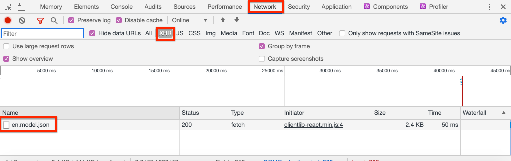

# Criar projeto {#spa-editor-project}

Saiba como gerar um projeto Adobe Experience Manager (AEM) Maven como ponto de partida para um aplicativo React integrado ao AEM SPA Editor.

## Objetivo

1. Gere um projeto habilitado para o Editor de SPA usando o Arquétipo de projeto AEM.
2. Implante o projeto inicial em uma instância local do AEM.

## O que você vai criar {#what-build}

Neste capítulo, um novo projeto de AEM será gerado, com base no [AEM Arquétipo de Projeto](https://github.com/adobe/aem-project-archetype). O projeto de AEM será inicializado com um ponto de partida muito simples para o SPA React.

**O que é um projeto do Maven?** -  [Apache ](https://maven.apache.org/) Mavenis é uma ferramenta de gerenciamento de software para construir projetos. *Todas as implementações do Adobe Experience* Manager usam projetos Maven para criar, gerenciar e implantar código personalizado no AEM.

**O que é um arquétipo Maven?** - Um  [arquétipo ](https://maven.apache.org/archetype/index.html) Maven é um modelo ou padrão para gerar novos projetos. O arquétipo AEM Projeto nos permite gerar um novo projeto com um namespace personalizado e incluir uma estrutura de projeto que segue as práticas recomendadas, acelerando muito nosso projeto.

## Pré-requisitos

Revise as ferramentas e instruções necessárias para configurar um [ambiente de desenvolvimento local](overview.md#local-dev-environment). Certifique-se de que uma nova instância do Adobe Experience Manager, iniciada no modo **author**, esteja em execução localmente.

## Criar o projeto {#create}

>[!NOTE]
>
>Este tutorial usa a versão **27** do arquétipo. É sempre uma prática recomendada usar a versão **mais recente** do arquétipo para gerar um novo projeto.

1. Abra um terminal de linha de comando e insira o seguinte comando Maven:

   ```shell
   mvn -B archetype:generate \
    -D archetypeGroupId=com.adobe.aem \
    -D archetypeArtifactId=aem-project-archetype \
    -D archetypeVersion=27 \
    -D appTitle="WKND SPA React" \
    -D appId="wknd-spa-react" \
    -D artifactId="aem-guides-wknd-spa.react" \
    -D groupId="com.adobe.aem.guides.wkndspa.react" \
    -D frontendModule="react" \
    -D aemVersion="cloud"
   ```

   >[!NOTE]
   >
   > Se o direcionamento AEM 6.5.5+, substitua `aemVersion="cloud"` por `aemVersion="6.5.5"`. Se o target for 6.4.8+, use `aemVersion="6.4.8"`.

   Observe a propriedade `frontendModule=react` . Isso instrui o Arquétipo de projeto do AEM a inicializar o projeto com um [React code base](https://experienceleague.adobe.com/docs/experience-manager-core-components/using/developing/archetype/uifrontend-react.html) inicial a ser usado com o Editor de SPA do AEM. Propriedades como `appTitle`, `appId`, `artifactId` e `groupId` são usadas para identificar o projeto e o propósito.

   Uma lista completa das propriedades disponíveis para configurar um projeto [pode ser encontrada aqui](https://github.com/adobe/aem-project-archetype#available-properties).

1. A seguinte estrutura de pastas e arquivos será gerada pelo arquétipo Maven em seu sistema de arquivos local:

   ```plain
   |--- aem-guides-wknd-spa.react/
       |--- all/
       |--- analyse/
       |--- core/
       |--- ui.apps/
       |--- ui.apps.structure/
       |--- ui.config/
       |--- ui.content/
       |--- ui.frontend/
       |--- ui.tests /
       |--- it.tests/
       |--- dispatcher/
       |--- analyse/
       |--- pom.xml
       |--- README.md
       |--- .gitignore
   ```

   Cada pasta representa um módulo Maven individual. Neste tutorial, trabalharemos principalmente com o módulo `ui.frontend`, que é o aplicativo React. Mais detalhes sobre módulos individuais podem ser encontrados na [AEM documentação do Arquétipo de projeto](https://experienceleague.adobe.com/docs/experience-manager-core-components/using/developing/archetype/overview.html).

## Implantar e criar o projeto

Em seguida, compile, crie e implante o código do projeto em uma instância local do AEM usando o Maven.

1. Verifique se uma instância de AEM está sendo executada localmente na porta **4502**.
1. Na linha de comando, navegue até o diretório do projeto `aem-guides-wknd-spa.react`.

   ```shell
   $ cd aem-guides-wknd-spa.react
   ```

1. Execute o seguinte comando para criar e implantar o projeto inteiro no AEM:

   ```shell
   $ mvn clean install -PautoInstallSinglePackage
   ```

   A build levará cerca de um minuto e deverá terminar com a seguinte mensagem:

   ```shell
   ...
   [INFO] ------------------------------------------------------------------------
   [INFO] Reactor Summary for aem-guides-wknd-spa.react 1.0.0-SNAPSHOT:
   [INFO]
   [INFO] aem-guides-wknd-spa.react .......................... SUCCESS [  0.257 s]
   [INFO] WKND SPA React - Core .............................. SUCCESS [ 12.553 s]
   [INFO] WKND SPA React - UI Frontend ....................... SUCCESS [01:46 min]
   [INFO] WKND SPA React - Repository Structure Package ...... SUCCESS [  1.082 s]
   [INFO] WKND SPA React - UI apps ........................... SUCCESS [  8.237 s]
   [INFO] WKND SPA React - UI content ........................ SUCCESS [  5.633 s]
   [INFO] WKND SPA React - UI config ......................... SUCCESS [  0.234 s]
   [INFO] WKND SPA React - All ............................... SUCCESS [  0.643 s]
   [INFO] WKND SPA React - Integration Tests ................. SUCCESS [ 12.377 s]
   [INFO] WKND SPA React - Dispatcher ........................ SUCCESS [  0.066 s]
   [INFO] WKND SPA React - UI Tests .......................... SUCCESS [  0.074 s]
   [INFO] WKND SPA React - Project Analyser .................. SUCCESS [ 31.287 s]
   [INFO] ------------------------------------------------------------------------
   [INFO] BUILD SUCCESS
   [INFO] ------------------------------------------------------------------------
   ```

   O perfil Maven `autoInstallSinglePackage` compila os módulos individuais do projeto e implanta um único pacote na instância do AEM. Por padrão, esse pacote será implantado em uma instância AEM executada localmente na porta **4502** e com as credenciais de `admin:admin`.

1. Navegue até **Gerenciador de Pacotes** em sua instância de AEM local: [http://localhost:4502/crx/packmgr/index.jsp](http://localhost:4502/crx/packmgr/index.jsp).

1. Você deve ver vários pacotes com o prefixo `aem-guides-wknd-spa.react`.

   

   *Gerenciador de pacotes de AEM*

   Todo o código personalizado necessário para o projeto será agrupado nesses pacotes e instalado no ambiente de AEM.

## Conteúdo do autor

Em seguida, abra o SPA inicial gerado pelo arquétipo e atualize algum conteúdo.

1. Navegue até o console **Sites**: [http://localhost:4502/sites.html/content](http://localhost:4502/sites.html/content).

   O SPA WKND inclui uma estrutura básica de site com um país, idioma e página inicial. Essa hierarquia é baseada nos valores padrão do arquétipo para `language_country` e `isSingleCountryWebsite`. Esses valores podem ser substituídos atualizando as [propriedades disponíveis](https://github.com/adobe/aem-project-archetype#available-properties) ao gerar um projeto.

2. Abra a página **us** > **en** > **WKND SPA React Home Page** selecionando a página e clicando no botão **Edit** na barra de menu:

   

3. Um componente **Text** já foi adicionado à página. Você pode editar esse componente como qualquer outro componente no AEM.

   

4. Adicione um componente **Text** adicional à página.

   Observe que a experiência de criação é semelhante àquela de uma página tradicional do AEM Sites. Atualmente, há um número limitado de componentes disponíveis para serem usados. Mais serão adicionados ao longo do tutorial.

## Inspect o aplicativo de página única

Em seguida, verifique se este é um Aplicativo de página única com o uso das ferramentas de desenvolvedor do seu navegador.

1. No **Editor de página**, clique no botão **Informações da página** > **Exibir como publicado**:

   

   Isso abrirá uma nova guia com o parâmetro de consulta `?wcmmode=disabled` que efetivamente desliga o editor de AEM: [http://localhost:4502/content/wknd-spa-react/us/en/home.html?wcmmode=disabled](http://localhost:4502/content/wknd-spa-react/us/en/home.html?wcmmode=disabled)

2. Visualize a fonte da página e observe que o conteúdo de texto **[!DNL Hello World]** ou qualquer outro conteúdo não foi encontrado. Em vez disso, você deve ver o HTML como segue:

   ```html
   ...
   <body>
       <noscript>You need to enable JavaScript to run this app.</noscript>
       <div id="spa-root"></div>
       <script type="text/javascript" src="/etc.clientlibs/wknd-spa-react/clientlibs/clientlib-react.lc-xxxx-lc.min.js"></script>
   </body>
   ...
   ```

   `clientlib-react.min.js` é o SPA React que é carregado na página e responsável pela renderização do conteúdo.

   No entanto, *de onde o conteúdo vem?*

3. Retorne à guia : [http://localhost:4502/content/wknd-spa-react/us/en/home.html?wcmmode=disabled](http://localhost:4502/content/wknd-spa-react/us/en/home.html?wcmmode=disabled)
4. Abra as ferramentas de desenvolvedor do navegador e inspecione o tráfego de rede da página durante uma atualização. Visualize as solicitações **XHR**:

   

   Deve haver uma solicitação para [http://localhost:4502/content/wknd-spa-react/us/en.model.json](http://localhost:4502/content/wknd-spa-react/us/en.model.json). Ele contém todo o conteúdo, formatado em JSON, que guiará o SPA.

5. Em uma nova guia, abra [http://localhost:4502/content/wknd-spa-react/us/en.model.json](http://localhost:4502/content/wknd-spa-react/us/en.model.json)

   A solicitação `en.model.json` representa o modelo de conteúdo que guiará o aplicativo. Inspect a saída JSON e você deve conseguir encontrar o trecho que representa o(s) componente(s) **[!UICONTROL Text]** .

   ```json
   ...
   ":items": {
       "text": {
           "text": "<p>Hello World! Updated content!</p>\r\n",
           "richText": true,
           ":type": "wknd-spa-react/components/text"
       },
       "text_98796435": {
           "text": "<p>A new text component.</p>\r\n",
           "richText": true,
           ":type": "wknd-spa-react/components/text"
       },
   }
   ...
   ```

   No próximo capítulo, verificaremos como esse conteúdo JSON é mapeado de Componentes AEM para Componentes SPA para formar a base da experiência do Editor de SPA AEM.

   >[!NOTE]
   >
   > Pode ser útil instalar uma extensão do navegador para formatar automaticamente a saída JSON.

## Parabéns! {#congratulations}

Parabéns, você acabou de criar seu primeiro projeto SPA Editor de AEM!

O SPA é muito simples. Nos próximos capítulos, será adicionada mais funcionalidade.

### Próximas etapas {#next-steps}

[Integrar um SPA](integrate-spa.md)  - saiba como o código-fonte SPA é integrado ao Projeto AEM e entenda as ferramentas disponíveis para desenvolver rapidamente o SPA.
