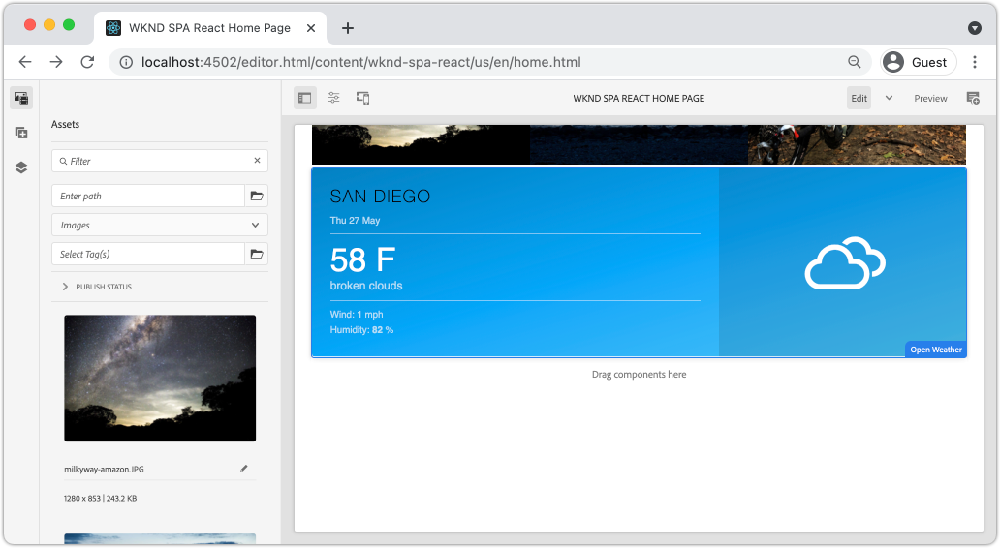

# Criar um componente de clima personalizado {#custom-component}

Saiba como criar um componente de clima personalizado para ser usado com o Editor de SPA AEM. Saiba como desenvolver caixas de diálogo de criação e Modelos Sling para estender o modelo JSON e preencher um componente personalizado. A variável [Abrir API de clima](https://openweathermap.org) e [Componente meteorológico aberto no React](https://www.npmjs.com/package/react-open-weather) são usados.

## Objetivo

1. Entenda a função dos Modelos do Sling na manipulação da API do modelo JSON fornecida pelo AEM.
2. Entenda como criar caixas de diálogo do novo componente AEM.
3. Saiba como criar um **personalizado** Componente de AEM compatível com a estrutura do editor de SPA.

## O que você vai criar

Um componente meteorológico simples é construído. Esse componente pode ser adicionado ao SPA por autores de conteúdo. Usando uma caixa de diálogo AEM, os autores podem definir o local para a exibição do tempo.  A implementação deste componente ilustra as etapas necessárias para criar um novo componente de AEM que seja compatível com a estrutura do Editor de SPA do AEM.


## Pré-requisitos

Analisar as ferramentas e instruções necessárias para a configuração de um [ambiente de desenvolvimento local](overview.md#local-dev-environment). O presente capítulo é uma continuação do [Navegação e Roteamento](navigation-routing.md) No entanto, para acompanhar tudo o que você precisa é de um projeto AEM habilitado para SPA implantado em uma instância do AEM local.

### Abrir chave de API do clima

Uma chave de API de [Tempo aberto](https://openweathermap.org/) é necessário seguir juntamente com o tutorial. [Inscrever-se é gratuito](https://home.openweathermap.org/users/sign_up) para uma quantidade limitada de chamadas de API.

## Definir o componente AEM

Um componente AEM é definido como um nó e propriedades. No projeto, esses nós e propriedades são representados como arquivos XML na variável `ui.apps` módulo. Em seguida, crie o componente AEM no `ui.apps` módulo.

>[!NOTE]
>
> Uma atualização rápida no [as noções básicas dos componentes do AEM podem ser úteis](https://experienceleague.adobe.com/docs/experience-manager-learn/getting-started-wknd-tutorial-develop/project-archetype/component-basics.html).

1. No IDE de sua escolha, abra o `ui.apps` pasta.
2. Navegue até `ui.apps/src/main/content/jcr_root/apps/wknd-spa-react/components` e crie uma nova pasta chamada `open-weather`.
3. Crie um novo arquivo chamado `.content.xml` abaixo de `open-weather` pasta. Preencha o `open-weather/.content.xml` com o seguinte:

   ```xml
   <?xml version="1.0" encoding="UTF-8"?>
   <jcr:root xmlns:sling="http://sling.apache.org/jcr/sling/1.0" xmlns:cq="http://www.day.com/jcr/cq/1.0" xmlns:jcr="http://www.jcp.org/jcr/1.0"
       jcr:primaryType="cq:Component"
       jcr:title="Open Weather"
       componentGroup="WKND SPA React - Content"/>
   ```

   

   `jcr:primaryType="cq:Component"` - identifica que este nó é um componente AEM.

   `jcr:title` é o valor exibido para os Autores de conteúdo e a `componentGroup` determina o agrupamento de componentes na interface de criação.

4. Abaixo de `custom-component` , crie outra pasta chamada `_cq_dialog`.
5. Abaixo de `_cq_dialog` pasta criar um novo arquivo chamado `.content.xml` e preencha-o com o seguinte:

   ```xml
   <?xml version="1.0" encoding="UTF-8"?>
   <jcr:root xmlns:sling="http://sling.apache.org/jcr/sling/1.0" xmlns:granite="http://www.adobe.com/jcr/granite/1.0" xmlns:cq="http://www.day.com/jcr/cq/1.0" xmlns:jcr="http://www.jcp.org/jcr/1.0" xmlns:nt="http://www.jcp.org/jcr/nt/1.0"
       jcr:primaryType="nt:unstructured"
       jcr:title="Open Weather"
       sling:resourceType="cq/gui/components/authoring/dialog">
       <content
           jcr:primaryType="nt:unstructured"
           sling:resourceType="granite/ui/components/coral/foundation/container">
           <items jcr:primaryType="nt:unstructured">
               <tabs
                   jcr:primaryType="nt:unstructured"
                   sling:resourceType="granite/ui/components/coral/foundation/tabs"
                   maximized="{Boolean}true">
                   <items jcr:primaryType="nt:unstructured">
                       <properties
                           jcr:primaryType="nt:unstructured"
                           jcr:title="Properties"
                           sling:resourceType="granite/ui/components/coral/foundation/container"
                           margin="{Boolean}true">
                           <items jcr:primaryType="nt:unstructured">
                               <columns
                                   jcr:primaryType="nt:unstructured"
                                   sling:resourceType="granite/ui/components/coral/foundation/fixedcolumns"
                                   margin="{Boolean}true">
                                   <items jcr:primaryType="nt:unstructured">
                                       <column
                                           jcr:primaryType="nt:unstructured"
                                           sling:resourceType="granite/ui/components/coral/foundation/container">
                                           <items jcr:primaryType="nt:unstructured">
                                               <label
                                                   jcr:primaryType="nt:unstructured"
                                                   sling:resourceType="granite/ui/components/coral/foundation/form/textfield"
                                                   fieldDescription="The label to display for the component"
                                                   fieldLabel="Label"
                                                   name="./label"/>
                                               <lat
                                                   jcr:primaryType="nt:unstructured"
                                                   sling:resourceType="granite/ui/components/coral/foundation/form/numberfield"
                                                   fieldDescription="The latitude of the location."
                                                   fieldLabel="Latitude"
                                                   step="any"
                                                   name="./lat" />
                                               <lon
                                                   jcr:primaryType="nt:unstructured"
                                                   sling:resourceType="granite/ui/components/coral/foundation/form/numberfield"
                                                   fieldDescription="The longitude of the location."
                                                   fieldLabel="Longitude"
                                                   step="any"
                                                   name="./lon"/>
                                           </items>
                                       </column>
                                   </items>
                               </columns>
                           </items>
                       </properties>
                   </items>
               </tabs>
           </items>
       </content>
   </jcr:root>
   ```

   

   O arquivo XML acima gera uma caixa de diálogo muito simples para o `Weather Component`. A parte crítica do arquivo é a parte interna `<label>`, `<lat>` e `<lon>` nós. Esta caixa de diálogo contém dois `numberfield`s e a `textfield` que permite ao usuário configurar o tempo a ser exibido.

   Um modelo Sling é criado ao lado do para expor o valor do `label`,`lat` e `long` propriedades por meio do modelo JSON.

   >[!NOTE]
   >
   > Você pode ver muito mais [exemplos de caixas de diálogo exibindo as definições dos Componentes principais](https://github.com/adobe/aem-core-wcm-components/tree/master/content/src/content/jcr_root/apps/core/wcm/components). Também é possível exibir campos de formulário adicionais, como `select`, `textarea`, `pathfield`, disponível abaixo de `/libs/granite/ui/components/coral/foundation/form` in [CRXDE-Lite](http://localhost:4502/crx/de/index.jsp#/libs/granite/ui/components/coral/foundation/form).

   Com um componente AEM tradicional, um [HTL](https://experienceleague.adobe.com/docs/experience-manager-htl/using/overview.html?lang=pt-BR) normalmente é necessário. Como o SPA renderizará o componente, nenhum script HTL é necessário.

## Criar o modelo do Sling

Os Modelos do Sling são objetos POJO (Plain Old Java Objects) orientados por anotações que facilitam o mapeamento de dados do JCR para variáveis Java. [Modelos Sling](https://experienceleague.adobe.com/docs/experience-manager-learn/getting-started-wknd-tutorial-develop/project-archetype/component-basics.html?lang=en#sling-models) geralmente funcionam para encapsular uma lógica comercial complexa do lado do servidor para componentes AEM.

No contexto do Editor de SPA, os Modelos Sling expõem o conteúdo de um componente por meio do modelo JSON por meio de um recurso que usa o [Exportador de modelo Sling](https://experienceleague.adobe.com/docs/experience-manager-learn/foundation/development/develop-sling-model-exporter.html?lang=pt-BR).

1. No IDE de sua escolha, abra o `core` módulo em `aem-guides-wknd-spa.react/core`.
1. Crie um arquivo com o nome em `OpenWeatherModel.java` em `core/src/main/java/com/adobe/aem/guides/wkndspa/react/core/models`.
1. Preencher `OpenWeatherModel.java` com o seguinte:

   ```java
   package com.adobe.aem.guides.wkndspa.react.core.models;
   
   import com.adobe.cq.export.json.ComponentExporter;
   
   // Sling Models intended to be used with SPA Editor must extend ComponentExporter interface
   public interface OpenWeatherModel extends ComponentExporter {
       public String getLabel();
       public double getLat();
       public double getLon();
   }
   ```

   Esta é a interface Java do nosso componente. Para que nosso Modelo Sling seja compatível com a estrutura do Editor de SPA, ele deve estender a `ComponentExporter` classe.

1. Crie uma pasta chamada `impl` debaixo `core/src/main/java/com/adobe/aem/guides/wkndspa/react/core/models`.
1. Crie um arquivo chamado `OpenWeatherModelImpl.java` debaixo `impl` e preencha com o seguinte:

   ```java
   package com.adobe.aem.guides.wkndspa.react.core.models.impl;
   
   import org.apache.sling.models.annotations.*;
   import org.apache.sling.models.annotations.injectorspecific.ValueMapValue;
   import com.adobe.cq.export.json.ComponentExporter;
   import com.adobe.cq.export.json.ExporterConstants;
   import org.apache.commons.lang3.StringUtils;
   import org.apache.sling.api.SlingHttpServletRequest;
   import com.adobe.aem.guides.wkndspa.react.core.models.OpenWeatherModel;
   
   // Sling Model annotation
   @Model(
       adaptables = SlingHttpServletRequest.class, 
       adapters = { OpenWeatherModel.class, ComponentExporter.class }, 
       resourceType = OpenWeatherModelImpl.RESOURCE_TYPE, 
       defaultInjectionStrategy = DefaultInjectionStrategy.OPTIONAL
   )
   @Exporter( //Exporter annotation that serializes the modoel as JSON
       name = ExporterConstants.SLING_MODEL_EXPORTER_NAME, 
       extensions = ExporterConstants.SLING_MODEL_EXTENSION
   )
   public class OpenWeatherModelImpl implements OpenWeatherModel {
   
       @ValueMapValue
       private String label; //maps variable to jcr property named "label" persisted by Dialog
   
       @ValueMapValue
       private double lat; //maps variable to jcr property named "lat"
   
       @ValueMapValue
       private double lon; //maps variable to jcr property named "lon"
   
       // points to AEM component definition in ui.apps
       static final String RESOURCE_TYPE = "wknd-spa-react/components/open-weather";
   
       // public getter method to expose value of private variable `label`
       // adds additional logic to default the label to "(Default)" if not set.
       @Override
       public String getLabel() {
           return StringUtils.isNotBlank(label) ? label : "(Default)";
       }
   
       // public getter method to expose value of private variable `lat`
       @Override
       public double getLat() {
           return lat;
       }
   
       // public getter method to expose value of private variable `lon`
       @Override
       public double getLon() {
           return lon;
       }
   
       // method required by `ComponentExporter` interface
       // exposes a JSON property named `:type` with a value of `wknd-spa-react/components/open-weather`
       // required to map the JSON export to the SPA component props via the `MapTo`
       @Override
       public String getExportedType() {
           return OpenWeatherModelImpl.RESOURCE_TYPE;
       }
   } 
   ```

   A variável estática `RESOURCE_TYPE` deve apontar para o caminho em `ui.apps` do componente. A variável `getExportedType()` é usado para mapear as propriedades JSON para o componente SPA via `MapTo`. `@ValueMapValue` é uma anotação que lê a propriedade jcr salva pelo diálogo.

## Atualizar o SPA

Em seguida, atualize o código do React para incluir o [Componente meteorológico aberto no React](https://www.npmjs.com/package/react-open-weather) e mapeie-o para o componente AEM criado nas etapas anteriores.

1. Instalar o componente de clima aberto no React como um **npm** dependência:

   ```shell
   $ cd aem-guides-wknd-spa.react/ui.frontend
   $ npm i react-open-weather
   ```

1. Crie uma nova pasta chamada `OpenWeather` em `ui.frontend/src/components/OpenWeather`.
1. Adicionar um arquivo chamado `OpenWeather.js` e preencha-o com o seguinte:

   ```js
   import React from 'react';
   import {MapTo} from '@adobe/aem-react-editable-components';
   import ReactWeather, { useOpenWeather } from 'react-open-weather';
   
   // Open weather API Key
   // For simplicity it is hard coded in the file, ideally this is extracted in to an environment variable
   const API_KEY = 'YOUR_API_KEY';
   
   // Logic to render placeholder or component
   const OpenWeatherEditConfig = {
   
       emptyLabel: 'Weather',
       isEmpty: function(props) {
           return !props || !props.lat || !props.lon || !props.label;
       }
   };
   
   // Wrapper function that includes react-open-weather component
   function ReactWeatherWrapper(props) {
       const { data, isLoading, errorMessage } = useOpenWeather({
           key: API_KEY,
           lat: props.lat, // passed in from AEM JSON
           lon: props.lon, // passed in from AEM JSON
           lang: 'en',
           unit: 'imperial', // values are (metric, standard, imperial)
       });
   
       return (
           <div className="cmp-open-weather">
               <ReactWeather
                   isLoading={isLoading}
                   errorMessage={errorMessage}
                   data={data}
                   lang="en"
                   locationLabel={props.label} // passed in from AEM JSON
                   unitsLabels={{ temperature: 'F', windSpeed: 'mph' }}
                   showForecast={false}
                 />
           </div>
       );
   }
   
   export default function OpenWeather(props) {
   
           // render nothing if component not configured
           if (OpenWeatherEditConfig.isEmpty(props)) {
               return null;
           }
   
           // render ReactWeather component if component configured
           // pass props to ReactWeatherWrapper. These props include the mapped properties from AEM JSON
           return ReactWeatherWrapper(props);
   
   }
   
   // Map OpenWeather to AEM component
   MapTo('wknd-spa-react/components/open-weather')(OpenWeather, OpenWeatherEditConfig);
   ```

1. Atualizar `import-components.js` em `ui.frontend/src/components/import-components.js` para incluir o `OpenWeather` componente:

   ```diff
     // import-component.js
     import './Container/Container';
     import './ExperienceFragment/ExperienceFragment';
   + import './OpenWeather/OpenWeather';
   ```

1. Implante todas as atualizações em um ambiente AEM local da raiz do diretório do projeto, usando suas habilidades em Maven:

   ```shell
   $ cd aem-guides-wknd-spa.react
   $ mvn clean install -PautoInstallSinglePackage
   ```

## Atualizar a política do modelo

Em seguida, acesse AEM para verificar as atualizações e permitir a `OpenWeather` componente a ser adicionado ao SPA.

1. Verifique o registro do novo Modelo do Sling navegando até [http://localhost:4502/system/console/status-slingmodels](http://localhost:4502/system/console/status-slingmodels).

   ```plain
   com.adobe.aem.guides.wkndspa.react.core.models.impl.OpenWeatherModelImpl - wknd-spa-react/components/open-weather
   
   com.adobe.aem.guides.wkndspa.react.core.models.impl.OpenWeatherModelImpl exports 'wknd-spa-react/components/open-weather' with selector 'model' and extension '[Ljava.lang.String;@2fd80fc5' with exporter 'jackson'
   ```

   Você deve ver as duas linhas acima que indicam a `OpenWeatherModelImpl` está associado à `wknd-spa-react/components/open-weather` e que está registrado por meio do Exportador de Modelo Sling.

1. Navegue até o modelo de página SPA em [http://localhost:4502/editor.html/conf/wknd-spa-react/settings/wcm/templates/spa-page-template/structure.html](http://localhost:4502/editor.html/conf/wknd-spa-react/settings/wcm/templates/spa-page-template/structure.html).
1. Atualize a política do Contêiner de layout para adicionar o novo `Open Weather` como um componente permitido:

   

   Salve as alterações na política e observe as `Open Weather` como um componente permitido:

   

## Criar o componente de Tempo aberto

Em seguida, crie o `Open Weather` usando o editor SPA AEM.

1. Navegue até [http://localhost:4502/editor.html/content/wknd-spa-react/us/en/home.html](http://localhost:4502/editor.html/content/wknd-spa-react/us/en/home.html).
1. Entrada `Edit` , adicione o `Open Weather` para o `Layout Container`:

   

1. Abra a caixa de diálogo do componente e insira um **Rótulo**, **Latitude**, e **Longitude**. Por exemplo **San Diego**, **32.7157**, e **-117.1611**. Os números do hemisfério ocidental e do hemisfério sul são representados como números negativos com a API de Tempo Aberto

   

   Esta é a caixa de diálogo que foi criada com base no arquivo XML mencionado anteriormente no capítulo.

1. Salve as alterações. Observe que o tempo para **San Diego** agora é exibido:

   

1. Visualize o modelo JSON navegando até [http://localhost:4502/content/wknd-spa-react/us/en.model.json](http://localhost:4502/content/wknd-spa-react/us/en.model.json). Pesquisar `wknd-spa-react/components/open-weather`:

   ```json
   "open_weather": {
       "label": "San Diego",
       "lat": 32.7157,
       "lon": -117.1611,
       ":type": "wknd-spa-react/components/open-weather"
   }
   ```

   Os valores JSON são gerados pelo Modelo Sling. Esses valores JSON são passados para o componente React como props.

## Parabéns. {#congratulations}

Parabéns, você aprendeu a criar um componente personalizado do AEM para ser usado com o Editor de SPA. Você também aprendeu como caixas de diálogo, propriedades JCR e Modelos Sling interagem para produzir o modelo JSON.

### Próximas etapas {#next-steps}

[Estender um Componente principal](extend-component.md) - Saiba como estender um Componente principal AEM existente para ser usado com o editor do SPA para AEM. AEM Entender como adicionar propriedades e conteúdo a um componente existente é uma técnica poderosa para expandir os recursos de uma implementação do Editor de SPA.
