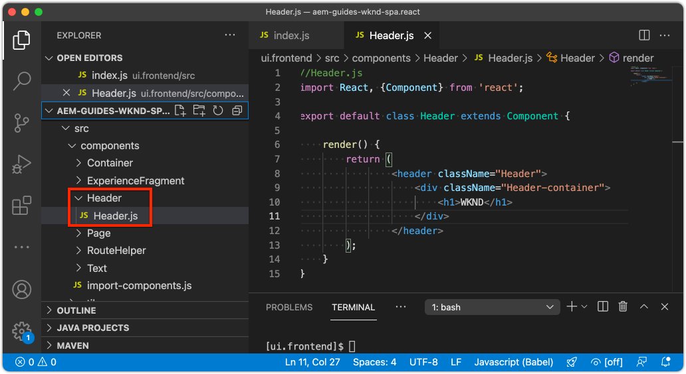

# Integrar a SPA {#developer-workflow}

Entenda como o código-fonte de um Aplicativo de página única (SPA) gravado no React pode ser integrado a um Projeto do Adobe Experience Manager (AEM). Saiba como usar ferramentas de front-end modernas, como um servidor de desenvolvimento de webpack, para desenvolver rapidamente a SPA em relação à API de modelo JSON AEM.

## Objetivo

1. Entenda como o projeto do SPA é integrado ao AEM com bibliotecas do lado do cliente.
2. Saiba como usar um servidor de desenvolvimento de webpack para desenvolvimento front-end dedicado.
3. Explore o uso de um arquivo **proxy** e **mock** estático para desenvolvimento em relação à API de modelo JSON AEM.

## O que você vai criar

Neste capítulo, você fará várias pequenas alterações no SPA para entender como ele é integrado ao AEM.
Este capítulo adicionará um componente simples `Header` ao SPA. No processo de criação desse componente **static** `Header`, várias abordagens AEM desenvolvimento SPA serão usadas.


*O SPA é estendido para adicionar um  `Header` componente estático*

## Pré-requisitos

Revise as ferramentas e instruções necessárias para configurar um [ambiente de desenvolvimento local](overview.md#local-dev-environment). Este capítulo é uma continuação do capítulo [Criar projeto](create-project.md), no entanto, para seguir em frente, tudo o que você precisa é de um projeto AEM habilitado para SPA em funcionamento.

## Abordagem de integração {#integration-approach}

Dois módulos foram criados como parte do projeto AEM: `ui.apps` e `ui.frontend`.

O módulo `ui.frontend` é um projeto [webpack](https://webpack.js.org/) que contém todo o código-fonte SPA. A maior parte do desenvolvimento e teste de SPA será feito no projeto do webpack. Quando uma build de produção é acionada, a SPA é criada e compilada usando o webpack. Os artefatos compilados (CSS e Javascript) são copiados no módulo `ui.apps` que é então implantado no tempo de execução AEM.


*Uma descrição de alto nível da integração do SPA.*

Informações adicionais sobre a build do Front-end podem ser [encontradas aqui](https://experienceleague.adobe.com/docs/experience-manager-core-components/using/developing/archetype/uifrontend-react.html).

## Inspect a integração de SPA {#inspect-spa-integration}

Em seguida, inspecione o módulo `ui.frontend` para entender o SPA que foi gerado automaticamente pelo [AEM arquétipo de projeto](https://experienceleague.adobe.com/docs/experience-manager-core-components/using/developing/archetype/uifrontend-react.html).

1. No IDE de sua escolha, abra o Projeto do AEM. Este tutorial usará o [Visual Studio Code IDE](https://experienceleague.adobe.com/docs/experience-manager-learn/cloud-service/local-development-environment-set-up/development-tools.html#microsoft-visual-studio-code).

   

1. Expanda e inspecione a pasta `ui.frontend`. Abra o arquivo `ui.frontend/package.json`

1. Em `dependencies` você deve ver vários relacionados a `react` incluindo `react-scripts`

   O `ui.frontend` é um aplicativo React com base no [Create React App](https://create-react-app.dev/) ou no CRA para encurtar. A versão `react-scripts` indica qual versão do CRA é usada.

1. Também há várias dependências com o prefixo `@adobe`:

   ```json
   "@adobe/aem-react-editable-components": "~1.1.2",
   "@adobe/aem-spa-component-mapping": "~1.1.0",
   "@adobe/aem-spa-page-model-manager": "~1.3.3",
   "@adobe/aem-core-components-react-base": "1.1.8",
   "@adobe/aem-core-components-react-spa": "1.1.7",
   ```

   Os módulos acima compõem o [AEM Editor JS SDK](https://experienceleague.adobe.com/docs/experience-manager-65/developing/headless/spas/spa-blueprint.html) e fornecem a funcionalidade para possibilitar o mapeamento SPA componentes para AEM componentes.

   Também estão incluídos [AEM Componentes WCM - Implementação React Core](https://github.com/adobe/aem-react-core-wcm-components-base) e [AEM Componentes WCM - Editor Spa - Implementação React Core](https://github.com/adobe/aem-react-core-wcm-components-spa). Esses são um conjunto de componentes reutilizáveis da interface do usuário que são mapeados para componentes prontos para uso AEM. Eles foram projetados para serem usados como estão e com estilo para atender às necessidades do seu projeto.

1. No arquivo `package.json` existem vários `scripts` definidos:

   ```json
   "scripts": {
       "start": "react-scripts start",
       "build": "react-scripts build && clientlib",
       "test": "react-scripts test",
       "eject": "react-scripts eject",
   }
   ```

   Esses são scripts de criação padrão [disponíveis](https://create-react-app.dev/docs/available-scripts) pelo aplicativo Criar reação.

   A única diferença é a adição de `&& clientlib` ao script `build`. Essa instrução extra é responsável pela cópia da SPA compilada no módulo `ui.apps` como uma biblioteca do lado do cliente durante uma build.

   O módulo npm [aem-clientlib-generator](https://github.com/wcm-io-frontend/aem-clientlib-generator) é usado para facilitar isso.

1. Inspect o arquivo `ui.frontend/clientlib.config.js`. Esse arquivo de configuração é usado pelo [aem-clientlib-generator](https://github.com/wcm-io-frontend/aem-clientlib-generator#clientlibconfigjs) para determinar como gerar a biblioteca do cliente.

1. Inspect o arquivo `ui.frontend/pom.xml`. Esse arquivo transforma a pasta `ui.frontend` em um [módulo Maven](http://maven.apache.org/guides/mini/guide-multiple-modules.html). O arquivo `pom.xml` foi atualizado para usar o SPA [frontend-maven-plugin](https://github.com/eirslett/frontend-maven-plugin) para **testar** e **build** durante uma compilação Maven.

1. Inspect o arquivo `index.js` em `ui.frontend/src/index.js`:

   ```js
   //ui.frontend/src/index.js
   ...
   document.addEventListener('DOMContentLoaded', () => {
       ModelManager.initialize().then(pageModel => {
           const history = createBrowserHistory();
           render(
           <Router history={history}>
               <App
               history={history}
               cqChildren={pageModel[Constants.CHILDREN_PROP]}
               cqItems={pageModel[Constants.ITEMS_PROP]}
               cqItemsOrder={pageModel[Constants.ITEMS_ORDER_PROP]}
               cqPath={pageModel[Constants.PATH_PROP]}
               locationPathname={window.location.pathname}
               />
           </Router>,
           document.getElementById('spa-root')
           );
       });
   });
   ```

   `index.js` é o ponto de entrada do SPA. `ModelManager` é fornecido pelo AEM Editor JS SDK. É responsável por chamar e injetar o `pageModel` (o conteúdo JSON) no aplicativo.

1. Inspect o arquivo `import-component.js` em `ui.frontend/src/import-components.js`. Esse arquivo importa os **React Core Components** prontos para uso e os disponibiliza para o projeto. Inspecionaremos o mapeamento do conteúdo AEM para SPA componentes no próximo capítulo.

## Adicionar um componente de SPA estático {#static-spa-component}

Em seguida, adicione um novo componente ao SPA e implante as alterações em uma instância de AEM local. Essa será uma mudança simples, apenas para ilustrar como a SPA é atualizada.

1. No módulo `ui.frontend`, abaixo de `ui.frontend/src/components` crie uma nova pasta chamada `Header`.
1. Crie um arquivo com o nome `Header.js` abaixo da pasta `Header`.

   

1. Preencha `Header.js` com o seguinte:

   ```js
   //Header.js
   import React, {Component} from 'react';
   
   export default class Header extends Component {
   
       render() {
           return (
                   <header className="Header">
                       <div className="Header-container">
                           <h1>WKND</h1>
                       </div>
                   </header>
           );
       }
   }
   ```

   Acima é um componente React padrão que resultará em uma sequência de texto estática.

1. Abra o arquivo `ui.frontend/src/App.js`. Este é o ponto de entrada do aplicativo.
1. Faça as seguintes atualizações em `App.js` para incluir o `Header` estático:

   ```diff
     import { Page, withModel } from '@adobe/aem-react-editable-components';
     import React from 'react';
   + import Header from './components/Header/Header';
   
     // This component is the application entry point
     class App extends Page {
     render() {
         return (
         <div>
   +       <Header />
            {this.childComponents}
            {this.childPages}
        </div>
   ```

1. Abra um novo terminal e navegue até a pasta `ui.frontend` e execute o comando `npm run build`:

   ```shell
   $ cd aem-guides-wknd-spa
   $ cd ui.frontend
   $ npm run build
   ...
   Compiled successfully.
   
   File sizes after gzip:
   
   118.95 KB (-33 B)  build/static/js/2.489f399a.chunk.js
   1.11 KB (+48 B)    build/static/js/main.6cfa5095.chunk.js
   806 B              build/static/js/runtime-main.42b998df.js
   451 B              build/static/css/main.e57bbe8a.chunk.css
   ```

1. Navegue até a pasta `ui.apps`. Abaixo de `ui.apps/src/main/content/jcr_root/apps/wknd-spa-react/clientlibs/clientlib-react` você deve ver os arquivos de SPA compilados que foram copiados da pasta`ui.frontend/build`.

   

1. Retorne ao terminal e navegue até a pasta `ui.apps`. Execute o seguinte comando Maven:

   ```shell
   $ cd ../ui.apps
   $ mvn clean install -PautoInstallPackage
   ...
   [INFO] ------------------------------------------------------------------------
   [INFO] BUILD SUCCESS
   [INFO] ------------------------------------------------------------------------
   [INFO] Total time:  9.629 s
   [INFO] Finished at: 2020-05-04T17:48:07-07:00
   [INFO] ------------------------------------------------------------------------
   ```

   Isso implantará o pacote `ui.apps` em uma instância de execução local do AEM.

1. Abra uma guia do navegador e navegue até [http://localhost:4502/editor.html/content/wknd-spa-react/us/en/home.html](http://localhost:4502/editor.html/content/wknd-spa-react/us/en/home.html). Agora você deve ver o conteúdo do componente `Header` sendo exibido no SPA.

   

   As etapas acima são executadas automaticamente ao acionar uma build Maven da raiz do projeto (ou seja `mvn clean install -PautoInstallSinglePackage`). Agora você deve entender as noções básicas da integração entre o SPA e AEM bibliotecas do lado do cliente. Observe que você ainda pode editar e adicionar `Text` componentes em AEM abaixo do componente estático `Header`.

## Servidor de desenvolvimento de Webpack - Proxy da API JSON {#proxy-json}

Como visto nos exercícios anteriores, a execução de uma build e sincronização da biblioteca do cliente com uma instância local de AEM demora alguns minutos. Isso é aceitável para testes finais, mas não é ideal para a maioria do desenvolvimento SPA.

Um [webpack-dev-server](https://webpack.js.org/configuration/dev-server/) pode ser usado para desenvolver rapidamente o SPA. O SPA é conduzido por um modelo JSON gerado pelo AEM. Neste exercício, o conteúdo JSON de uma instância em execução de AEM será **proxied** no servidor de desenvolvimento.

1. Retorne ao IDE e abra o arquivo `ui.frontend/package.json`.

   Procure uma linha como a seguinte:

   ```json
   "proxy": "http://localhost:4502",
   ```

   O [Criar aplicativo React](https://create-react-app.dev/docs/proxying-api-requests-in-development) fornece um mecanismo fácil para solicitações de API de proxy. Todas as solicitações desconhecidas serão enviadas por proxy por meio de `localhost:4502`, o AEM local quickstart.

1. Abra uma janela de terminal e navegue até a pasta `ui.frontend`. Execute o comando `npm start`:

   ```shell
   $ cd ui.frontend
   $ npm start
   ...
   Compiled successfully!
   
   You can now view wknd-spa-react in the browser.
   
   Local:            http://localhost:3000
   On Your Network:  http://192.168.86.136:3000
   
   Note that the development build is not optimized.
   To create a production build, use npm run build.
   ```

1. Abra uma nova guia do navegador (se ainda não estiver aberta) e navegue até [http://localhost:3000/content/wknd-spa-react/us/en/home.html](http://localhost:3000/content/wknd-spa-react/us/en/home.html).

   

   Você deve ver o mesmo conteúdo da AEM, mas sem qualquer recurso de criação ativado.

   >[!NOTE]
   >
   > Devido aos requisitos de segurança do AEM, você precisará estar conectado à instância de AEM local (http://localhost:4502) no mesmo navegador, mas em uma guia diferente.

1. Retorne ao IDE e crie um arquivo chamado `Header.css` na pasta `src/components/Header`.
1. Preencha o `Header.css` com o seguinte:

   ```css
   .Header {
       background-color: #FFEA00;
       width: 100%;
       position: fixed;
       top: 0;
       left: 0;
       z-index: 99;
       box-shadow: 0px 0px 10px 0px rgba(0, 0, 0, 0.24);
   }
   
   .Header-container {
       display: flex;
       max-width: 1024px;
       margin: 0 auto;
       padding: 12px;
   }
   
   .Header-container h1 {
       letter-spacing: 0;
       font-size: 48px;
   }
   ```

   

1. Abra novamente `Header.js` e adicione a seguinte linha à referência `Header.css`:

   ```diff
     //Header.js
     import React, {Component} from 'react';
   + require('./Header.css');
   ```

   Salve as alterações.

1. Navegue até [http://localhost:3000/content/wknd-spa-react/us/en/home.html](http://localhost:3000/content/wknd-spa-react/us/en/home.html) para ver as alterações de estilo refletidas automaticamente.

1. Abra o arquivo `Page.css` em `ui.frontend/src/components/Page`. Faça as seguintes alterações para corrigir o preenchimento:

   ```css
   .page {
     max-width: 1024px;
     margin: 0 auto;
     padding: 12px;
     padding-top: 50px;
   }
   ```

1. Retorne ao navegador em [http://localhost:3000/content/wknd-spa-react/us/en/home.html](http://localhost:3000/content/wknd-spa-react/us/en/home.html). Você deve ver imediatamente as alterações no aplicativo refletidas.

   

   Você pode continuar fazendo atualizações de conteúdo no AEM e vê-las refletidas no **webpack-dev-server**, já que estamos enviando o conteúdo por proxy.

1. Pare o servidor de desenvolvimento de webpack com `ctrl+c` no terminal.

## Implantar SPA atualizações no AEM

As alterações feitas no `Header` atualmente são visíveis apenas por meio do **webpack-dev-server**. Implante o SPA atualizado para AEM para visualizar as alterações.

1. Navegue até a raiz do projeto (`aem-guides-wknd-spa`) e implante o projeto para AEM usando o Maven:

   ```shell
   $ cd ..
   $ mvn clean install -PautoInstallSinglePackage
   ```

2. Navegue até [http://localhost:4502/editor.html/content/wknd-spa-react/us/en/home.html](http://localhost:4502/editor.html/content/wknd-spa-react/us/en/home.html). Você deve ver o `Header` atualizado e os estilos aplicados.

   

   Agora que o SPA atualizado está em AEM, a criação pode continuar.

## Parabéns! {#congratulations}

Parabéns, você atualizou o SPA e explorou a integração com o AEM! Você sabe como desenvolver o SPA em relação à API do modelo JSON AEM usando um **webpack-dev-server**.

### Próximas etapas {#next-steps}

[Mapear componentes de SPA para AEM componentes](map-components.md)  - saiba como mapear componentes do React para componentes do Adobe Experience Manager (AEM) com o AEM Editor JS SDK. O mapeamento de componentes permite que os usuários façam atualizações dinâmicas em componentes SPA no Editor de SPA de AEM, de forma semelhante à criação tradicional de AEM.

## (Bônus) Servidor de Desenvolvimento de Webpack - API JSON Mock {#mock-json}

Outra abordagem para o desenvolvimento rápido é usar um arquivo JSON estático para agir como o modelo JSON. Ao &quot;zombar&quot; o JSON, removemos a dependência de uma instância de AEM local. Ele também permite que um desenvolvedor de front-end atualize o modelo JSON para testar a funcionalidade e direcionar alterações para a API JSON que seriam implementadas posteriormente por um desenvolvedor de back-end.

A configuração inicial do modelo JSON **requer uma instância de AEM local**.

1. Retorne ao IDE e navegue até `ui.frontend/public` e adicione uma nova pasta chamada `mock-content`.
1. Crie um novo arquivo com o nome `mock.model.json` debaixo de `ui.frontend/public/mock-content`.
1. No navegador, navegue até [http://localhost:4502/content/wknd-spa-react/us/en.model.json](http://localhost:4502/content/wknd-spa-react/us/en.model.json).

   Este é o JSON exportado pelo AEM que está liderando o aplicativo. Copie a saída JSON.

1. Cole a saída JSON da etapa anterior no arquivo `mock.model.json`.

   

1. Abra o arquivo `index.html` em `ui.frontend/public/index.html`. Atualize a propriedade de metadados do modelo de página de AEM para apontar para uma variável `%REACT_APP_PAGE_MODEL_PATH%`:

   ```html
       <!-- AEM page model -->
       <meta
          property="cq:pagemodel_root_url"
          content="%REACT_APP_PAGE_MODEL_PATH%"
       />
   ```

   Usar uma variável para o valor do `cq:pagemodel_root_url` facilitará a alternância entre o proxy e o modelo json de modelo.

1. Abra o arquivo `ui.frontend/.env.development` e faça as seguintes atualizações para comentar o valor anterior de `REACT_APP_PAGE_MODEL_PATH`:

   ```diff
   + PUBLIC_URL=/
   - PUBLIC_URL=/etc.clientlibs/wknd-spa-react/clientlibs/clientlib-react/resources
   
   - REACT_APP_PAGE_MODEL_PATH=/content/wknd-spa-react/us/en.model.json
   + REACT_APP_PAGE_MODEL_PATH=/mock-content/mock.model.json
   
   REACT_APP_ROOT=/content/wknd-spa-react/us/en/home.html
   ```

1. Se estiver em execução no momento, pare o **webpack-dev-server**. Inicie o **webpack-dev-server** do terminal:

   ```shell
   $ cd ui.frontend
   $ npm start
   ```

   Navegue até [http://localhost:3000/content/wknd-spa-react/us/en/home.html](http://localhost:3000/content/wknd-spa-react/us/en/home.html) e você deverá ver o SPA com o mesmo conteúdo usado no json **proxy**.

1. Faça uma pequena alteração no arquivo `mock.model.json` criado anteriormente. Você deve ver o conteúdo atualizado imediatamente refletido no **webpack-dev-server**.

   

Ser capaz de manipular o modelo JSON e ver os efeitos em um SPA ao vivo pode ajudar um desenvolvedor a entender a API do modelo JSON. Também permite que tanto o desenvolvimento front-end quanto o back-end aconteçam em paralelo.

Agora você pode alternar onde consumir o conteúdo JSON, alternando as entradas no arquivo `env.development`:

```plain
# JSON API via proxy to AEM
#REACT_APP_PAGE_MODEL_PATH=/content/wknd-spa-react/us/en.model.json

# JSON API via static mock file
REACT_APP_PAGE_MODEL_PATH=/mock-content/mock.model.json
```
