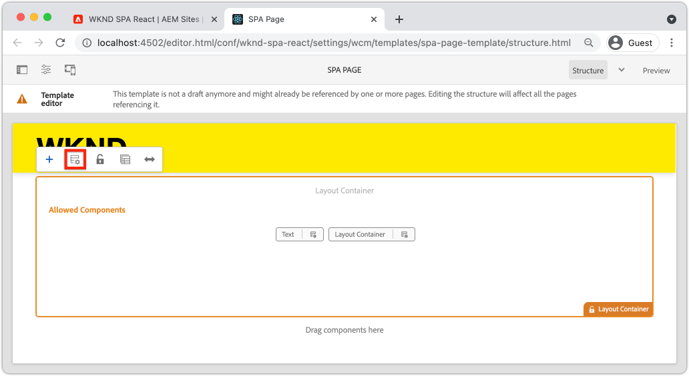
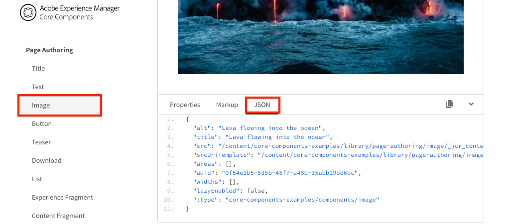

# Mapear componentes SPA para AEM componentes {#map-components}

Saiba como mapear componentes do React para componentes do Adobe Experience Manager (AEM) com o SDK JS do AEM SPA Editor. O mapeamento de componentes permite que os usuários façam atualizações dinâmicas em componentes SPA no Editor de SPA de AEM, de forma semelhante à criação tradicional de AEM.

Este capítulo aprofunda a API do modelo JSON do AEM e como o conteúdo JSON exposto por um componente AEM pode ser inserido automaticamente em um componente React como props.

## Objetivo

1. Saiba como mapear componentes AEM para SPA componentes.
1. Inspect como um componente React usa propriedades dinâmicas transmitidas pela AEM.
1. Saiba como usar imediatamente [Reagir AEM componentes principais](https://github.com/adobe/aem-react-core-wcm-components-examples).

## O que você vai criar

Este capítulo verificará como o componente de SPA `Text` fornecido é mapeado para o componente de AEM `Text`. React Core Components como o componente `Image` SPA será usado no SPA e criado no AEM. Os recursos prontos para uso das políticas **Contêiner de layout** e **Editor de modelo** também serão usados para criar uma exibição que é um pouco mais variada na aparência.


## Pré-requisitos

Revise as ferramentas e instruções necessárias para configurar um [ambiente de desenvolvimento local](overview.md#local-dev-environment). Este capítulo é uma continuação do capítulo [Integrar o SPA](integrate-spa.md), no entanto, para seguir em frente, tudo o que você precisa é de um projeto AEM habilitado para SPA.

## Abordagem de mapeamento

O conceito básico é mapear um Componente de SPA para um Componente de AEM. AEM componentes, executar o lado do servidor e exportar conteúdo como parte da API do modelo JSON. O conteúdo JSON é consumido pelo SPA, executando no lado do cliente no navegador. Um mapeamento 1:1 entre SPA componentes e um componente AEM é criado.


*Visão geral de alto nível do mapeamento de um componente de AEM para um componente de reação*

## Inspect o componente de texto

O [AEM Arquétipo de Projeto](https://github.com/adobe/aem-project-archetype) fornece um componente `Text` que é mapeado para o AEM [Componente de Texto](https://docs.adobe.com/content/help/pt/experience-manager-core-components/using/components/text.html). Este é um exemplo de um componente **content**, na medida em que renderiza *content* de AEM.

Vamos ver como o componente funciona.

### Inspect o modelo JSON

1. Antes de entrar no código SPA, é importante entender o modelo JSON que AEM fornece. Navegue até a [Biblioteca de Componentes Principais](https://www.aemcomponents.dev/content/core-components-examples/library/page-authoring/text.html) e exiba a página do componente de Texto. A Biblioteca de componentes principais fornece exemplos de todos os componentes principais do AEM.
1. Selecione a guia **JSON** para um dos exemplos:

   

   Você deve ver três propriedades: `text`, `richText` e `:type`.

   `:type` é uma propriedade reservada que lista o  `sling:resourceType` (ou caminho) do Componente de AEM. O valor de `:type` é o que é usado para mapear o componente de AEM para o componente de SPA.

   `text` e  `richText` são propriedades adicionais que serão expostas ao componente SPA.

1. Visualize a saída JSON em [http://localhost:4502/content/wknd-spa-react/us/en.model.json](http://localhost:4502/content/wknd-spa-react/us/en.model.json). Você deve encontrar uma entrada semelhante a:

   ```json
   "text": {
       "id": "text-a647cec03a",
       "text": "<p>Hello World! Updated content!</p>\r\n",
       "richText": true,
       ":type": "wknd-spa-react/components/text",
       "dataLayer": {}
      }
   ```

### Inspect o componente de SPA de texto

1. No IDE de sua escolha, abra o AEM Project para o SPA. Expanda o módulo `ui.frontend` e abra o arquivo `Text.js` em `ui.frontend/src/components/Text/Text.js`.

1. A primeira área que vamos inspecionar é o `class Text` em ~line 40:

   ```js
   class Text extends Component {
   
       get richTextContent() {
           return (<div
                   id={extractModelId(this.props.cqPath)}
                   data-rte-editelement
                   dangerouslySetInnerHTML={{__html: DOMPurify.sanitize(this.props.text)}} />
                   );
       }
   
       get textContent() {
           return <div>{this.props.text}</div>;
       }
   
       render() {
           return this.props.richText ? this.richTextContent : this.textContent;
       }
   }
   ```

   `Text` é um componente React padrão. O componente usa `this.props.richText` para determinar se o conteúdo a ser renderizado será rich text ou texto sem formatação. O &quot;conteúdo&quot; real usado vem de `this.props.text`.

   Para evitar um possível ataque XSS, o rich text é escapado via `DOMPurify` antes de usar [perigosamenteSetInnerHTML](https://reactjs.org/docs/dom-elements.html#dangerouslysetinnerhtml) para renderizar o conteúdo. Lembre-se das propriedades `richText` e `text` do modelo JSON anteriormente no exercício.

1. Em seguida, dê uma olhada no `TextEditConfig` em ~line 29:

   ```js
   const TextEditConfig = {
   emptyLabel: 'Text',
   
       isEmpty: function(props) {
           return !props || !props.text || props.text.trim().length < 1;
       }
   };
   ```

   O código acima é responsável por determinar quando renderizar o espaço reservado no ambiente de criação do AEM. Se o método `isEmpty` retornar **true**, o espaço reservado será renderizado.

1. Por fim, dê uma olhada na chamada `MapTo` em ~line 62:

   ```js
   export default MapTo('wknd-spa-react/components/text')(Text, TextEditConfig);
   ```

   `MapTo` é fornecido pelo AEM Editor JS SDK (`@adobe/aem-react-editable-components`). O caminho `wknd-spa-react/components/text` representa `sling:resourceType` do componente de AEM. Esse caminho é correspondido pelo `:type` exposto pelo modelo JSON observado anteriormente. `MapTo` O cuida da análise da resposta do modelo JSON e da transmissão dos valores corretos como  `props` para o componente SPA.

   Você pode encontrar a definição AEM `Text` do componente em `ui.apps/src/main/content/jcr_root/apps/wknd-spa-react/components/text`.

## Usar os componentes principais do React

[Componentes AEM WCM - ](https://github.com/adobe/aem-react-core-wcm-components-base) Implementação principal do React e Componentes  [AEM WCM - Editor Spa - Implementação](https://github.com/adobe/aem-react-core-wcm-components-spa) principal do React. Esses são um conjunto de componentes reutilizáveis da interface do usuário que são mapeados para componentes prontos para uso AEM. A maioria dos projetos pode reutilizar esses componentes como ponto de partida para sua própria implementação.

1. No código do projeto, abra o arquivo `import-components.js` em `ui.frontend/src/components`.
Esse arquivo importa todos os componentes de SPA que são mapeados para AEM componentes. Dada a natureza dinâmica da implementação do Editor de SPA, devemos referenciar explicitamente todos os componentes SPA que estão vinculados a AEM componentes que podem ser criados para autor. Isso permite que um autor de AEM escolha usar um componente onde quiser no aplicativo.
1. As seguintes declarações de importação incluem componentes SPA gravados no projeto:

   ```js
   import './Page/Page';
   import './Text/Text';
   import './Container/Container';
   import './ExperienceFragment/ExperienceFragment';
   ```

1. Há vários outros `imports` de `@adobe/aem-core-components-react-spa` e `@adobe/aem-core-components-react-base`. Eles estão importando os componentes React Core e os disponibilizando no projeto atual. Eles são mapeados para componentes de AEM específicos do projeto usando o `MapTo`, exatamente como com o exemplo do componente `Text` anteriormente.

### Atualizar políticas de AEM

As políticas são um recurso de modelos de AEM que oferece aos desenvolvedores e usuários avançados controle granular sobre quais componentes estão disponíveis para serem usados. Os Componentes principais de reação estão incluídos no Código de SPA, mas precisam ser ativados por meio de uma política antes de poderem ser usados no aplicativo.

1. Na tela inicial AEM, navegue até **Ferramentas** > **Modelos** > **[WKND SPA React](http://localhost:4502/libs/wcm/core/content/sites/templates.html/conf/wknd-spa-react)**.

1. Selecione e abra o modelo **Página SPA** para edição.

1. Selecione o **Contêiner de layout** e clique nele **policy** para editar a política:

   

1. Em **Componentes permitidos** > **WKND SPA React - Content** > marque **Image**, **Teaser** e **Title**.

   

   Em **Componentes padrão** > **Adicionar mapeamento** e escolha o componente **Imagem - WKND SPA Reagir - Conteúdo**:

   

   Insira um **mime type** de `image/*`.

   Clique em **Concluído** para salvar as atualizações de política.

1. No **Contêiner de layout** clique no ícone **política** para o componente **Texto**.

   Crie uma nova política chamada **Texto SPA WKND**. Em **Plugins** > **Formatação** > marque todas as caixas para ativar opções adicionais de formatação:

   

   Em **Plugins** > **Estilos de parágrafo** > marque a caixa para **Ativar estilos de parágrafo**:

   

   Clique em **Concluído** para salvar a atualização da política.

### Conteúdo do autor

1. Navegue até a **Página inicial** [http://localhost:4502/editor.html/content/wknd-spa-react/us/en/home.html](http://localhost:4502/editor.html/content/wknd-spa-react/us/en/home.html).

1. Agora é possível usar os componentes adicionais **Image**, **Teaser** e **Title** na página.

   

1. Você também deve poder editar o componente `Text` e adicionar estilos de parágrafo adicionais no modo **tela cheia**.

   

1. Você também deve ser capaz de arrastar e soltar uma imagem do **Localizador de ativos**:

   

1. Experimente os componentes **Title** e **Teaser**.

1. Adicione suas próprias imagens via [AEM Assets](http://localhost:4502/assets.html/content/dam) ou instale a base de código finalizada para o [site de referência WKND](https://github.com/adobe/aem-guides-wknd/releases/latest) padrão. O [site de referência WKND](https://github.com/adobe/aem-guides-wknd/releases/latest) inclui muitas imagens que podem ser reutilizadas no SPA WKND. O pacote pode ser instalado usando [AEM Gerenciador de Pacotes](http://localhost:4502/crx/packmgr/index.jsp).

   

## Inspect no Contêiner de layout

O suporte para **Contêiner de layout** é fornecido automaticamente pelo SDK do Editor de SPA AEM. O **Contêiner de layout**, conforme indicado pelo nome, é um componente **contêiner**. Os componentes do contêiner são componentes que aceitam estruturas JSON que representam *outros* componentes e os instanciam dinamicamente.

Vamos inspecionar o Contêiner de layout ainda mais.

1. Em um navegador, navegue até [http://localhost:4502/content/wknd-spa-react/us/en.model.json](http://localhost:4502/content/wknd-spa-react/us/en.model.json)

   

   O componente **Contêiner de layout** tem um `sling:resourceType` de `wcm/foundation/components/responsivegrid` e é reconhecido pelo Editor de SPA usando a propriedade `:type`, exatamente como os componentes `Text` e `Image`.

   Os mesmos recursos de redimensionar um componente usando o [Modo de layout](https://docs.adobe.com/content/help/en/experience-manager-65/authoring/siteandpage/responsive-layout.html#defining-layouts-layout-mode) estão disponíveis no Editor de SPA.

2. Retorne para [http://localhost:4502/editor.html/content/wknd-spa-react/us/en/home.html](http://localhost:4502/editor.html/content/wknd-spa-react/us/en/home.html). Adicione outros componentes **Image** e tente redimensioná-los usando a opção **Layout**:

   

3. Abra novamente o modelo JSON [http://localhost:4502/content/wknd-spa-react/us/en.model.json](http://localhost:4502/content/wknd-spa-react/us/en.model.json) e observe o `columnClassNames` como parte do JSON:

   

   O nome de classe `aem-GridColumn--default--4` indica que o componente deve ter 4 colunas de largura com base em uma grade de 12 colunas. Mais detalhes sobre a grade responsiva [podem ser encontrados aqui](https://adobe-marketing-cloud.github.io/aem-responsivegrid/).

4. Retorne ao IDE e no módulo `ui.apps` há uma biblioteca do lado do cliente definida em `ui.apps/src/main/content/jcr_root/apps/wknd-spa-react/clientlibs/clientlib-grid`. Abra o arquivo `less/grid.less`.

   Esse arquivo determina os pontos de interrupção (`default`, `tablet` e `phone`) usados pelo **Contêiner de layout**. Este arquivo deve ser personalizado de acordo com as especificações do projeto. Atualmente, os pontos de interrupção estão definidos como `1200px` e `768px`.

5. Você deve ser capaz de usar os recursos responsivos e as políticas de rich text atualizadas do componente `Text` para criar uma visualização como a seguinte:

   

## Parabéns! {#congratulations}

Parabéns, você aprendeu a mapear componentes SPA para AEM componentes e usou os Componentes principais de reação. Você também tem a chance de explorar os recursos responsivos do **Contêiner de layout**.

### Próximas etapas {#next-steps}

[Navegação e roteamento](navigation-routing.md)  - saiba como várias exibições no SPA podem ser compatíveis com o mapeamento para AEM páginas com o SDK do Editor SPA. A navegação dinâmica é implementada usando o React Router e React Core Components.

## (Bônus) Persistir configurações no controle de origem {#bonus-configs}

Em muitos casos, especialmente no início de um projeto AEM, é valioso manter configurações, como modelos e políticas de conteúdo relacionadas, para o controle de origem. Isso garante que todos os desenvolvedores estejam trabalhando com o mesmo conjunto de conteúdo e configurações e pode garantir uma consistência adicional entre os ambientes. Quando um projeto atinge um determinado nível de maturidade, a prática de gerenciar modelos pode ser transferida para um grupo especial de usuários avançados.

As próximas etapas serão executadas usando o Visual Studio Code IDE e [VSCode AEM Sync](https://marketplace.visualstudio.com/items?itemName=yamato-ltd.vscode-aem-sync), mas podem estar fazendo uso de qualquer ferramenta e de qualquer IDE que você tenha configurado para **pull** ou **import** conteúdo de uma instância local de AEM.

1. No Visual Studio Code IDE, verifique se você tem **VSCode AEM Sync** instalado por meio da extensão Marketplace:

   

2. Expanda o módulo **ui.content** no Gerenciador de projetos e navegue até `/conf/wknd-spa-react/settings/wcm/templates`.

3. **Clique com o botão direito do mouse** na  `templates` pasta e selecione  **Importar de AEM Servidor**:

   

4. Repita as etapas para importar conteúdo, mas selecione a pasta **policies** localizada em `/conf/wknd-spa-react/settings/wcm/templates/policies`.

5. Inspect o arquivo `filter.xml` localizado em `ui.content/src/main/content/META-INF/vault/filter.xml`.

   ```xml
   <!--ui.content filter.xml-->
   <?xml version="1.0" encoding="UTF-8"?>
    <workspaceFilter version="1.0">
        <filter root="/conf/wknd-spa-react" mode="merge"/>
        <filter root="/content/wknd-spa-react" mode="merge"/>
        <filter root="/content/dam/wknd-spa-react" mode="merge"/>
        <filter root="/content/experience-fragments/wknd-spa-react" mode="merge"/>
    </workspaceFilter>
   ```

   O arquivo `filter.xml` é responsável por identificar os caminhos dos nós que serão instalados com o pacote. Observe o `mode="merge"` em cada um dos filtros, que indica que o conteúdo existente não será modificado, somente o novo conteúdo será adicionado. Como os autores de conteúdo podem estar atualizando esses caminhos, é importante que uma implantação de código **not** substitua o conteúdo. Consulte a [documentação do FileVault](https://jackrabbit.apache.org/filevault/filter.html) para obter mais detalhes sobre como trabalhar com elementos de filtro.

   Compare `ui.content/src/main/content/META-INF/vault/filter.xml` e `ui.apps/src/main/content/META-INF/vault/filter.xml` para entender os diferentes nós gerenciados por cada módulo.

## (Bônus) Criar componente de imagem personalizado {#bonus-image}

Um componente Imagem SPA já foi fornecido pelos componentes React Core. No entanto, se quiser práticas extras, crie sua própria implementação do React que mapeie para o [Componente de imagem](https://docs.adobe.com/content/help/br/experience-manager-core-components/using/components/image.html) AEM. O componente `Image` é outro exemplo de um componente **content**.

### Inspect no JSON

Antes de saltar para o código SPA, inspecione o modelo JSON fornecido pelo AEM.

1. Navegue até [Exemplos de imagem na biblioteca do Componente principal](https://www.aemcomponents.dev/content/core-components-examples/library/page-authoring/image.html).

   

   As propriedades de `src`, `alt` e `title` serão usadas para preencher o componente de SPA `Image`.

   >[!NOTE]
   >
   > Há outras propriedades de Imagem expostas (`lazyEnabled`, `widths`) que permitem que um desenvolvedor crie um componente adaptável e de carregamento lento. O componente criado neste tutorial será simples e **not** usará essas propriedades avançadas.

### Implementar o componente Imagem

1. Em seguida, crie uma nova pasta chamada `Image` em `ui.frontend/src/components`.
1. Abaixo da pasta `Image` crie um novo arquivo chamado `Image.js`.

   

1. Adicione as seguintes instruções `import` a `Image.js`:

   ```js
   import React, {Component} from 'react';
   import {MapTo} from '@adobe/aem-react-editable-components';
   ```

1. Em seguida, adicione o `ImageEditConfig` para determinar quando mostrar o espaço reservado no AEM:

   ```js
   export const ImageEditConfig = {
   
       emptyLabel: 'Image',
   
       isEmpty: function(props) {
           return !props || !props.src || props.src.trim().length < 1;
       }
   };
   ```

   O espaço reservado mostrará se a propriedade `src` não estiver definida.

1. Em seguida, implemente a classe `Image`:

   ```js
    export default class Image extends Component {
   
       get content() {
           return ;
       }
   
       render() {
           if(ImageEditConfig.isEmpty(this.props)) {
               return null;
           }
   
           return (
                   <div className="Image">
                       {this.content}
                   </div>
           );
       }
   }
   ```

   O código acima renderizará um `` com base nas props `src`, `alt` e `title` passadas pelo modelo JSON.

1. Adicione o código `MapTo` para mapear o componente React para o componente AEM:

   ```js
   MapTo('wknd-spa-react/components/image')(Image, ImageEditConfig);
   ```

   Observe que a string `wknd-spa-react/components/image` corresponde ao local do componente AEM em `ui.apps` em: `ui.apps/src/main/content/jcr_root/apps/wknd-spa-react/components/image`.

1. Crie um novo arquivo chamado `Image.css` no mesmo diretório e adicione o seguinte:

   ```scss
   .Image-src {
       margin: 1rem 0;
       width: 100%;
       border: 0;
   }
   ```

1. Em `Image.js` adicione uma referência ao arquivo na parte superior abaixo das instruções `import`:

   ```js
   import React, {Component} from 'react';
   import {MapTo} from '@adobe/aem-react-editable-components';
   
   require('./Image.css');
   ```

1. Abra o arquivo `ui.frontend/src/components/import-components.js` e adicione uma referência ao novo componente `Image`:

   ```js
   import './Page/Page';
   import './Text/Text';
   import './Container/Container';
   import './ExperienceFragment/ExperienceFragment';
   import './Image/Image'; //add reference to Image component
   ```

1. Em `import-components.js` comente a Imagem do componente principal de reação:

   ```js
   //MapTo('wknd-spa-react/components/image')(ImageV2, {isEmpty: ImageV2IsEmptyFn});
   ```

   Isso garantirá que nosso componente de Imagem personalizada seja usado.

1. Na raiz do projeto, implante o código de SPA para AEM usando o Maven:

   ```shell
   $ cd aem-guides-wknd-spa.react
   $ mvn clean install -PautoInstallSinglePackage
   ```

1. Inspect o SPA em AEM. Todos os componentes de Imagem na página devem continuar a funcionar. Inspect a saída renderizada e você deve ver a marcação para nosso componente de Imagem personalizado em vez do Componente principal de reação.

   *Marcação de componente de imagem personalizada*

   ```html
   <div class="Image">
       
   </div>
   ```

   *Marcação de imagem do componente principal do React*

   ```html
   <div class="cmp-image cq-dd-image">
       
   </div>
   ```

   Essa é uma boa introdução à extensão e implementação de seus próprios componentes.

