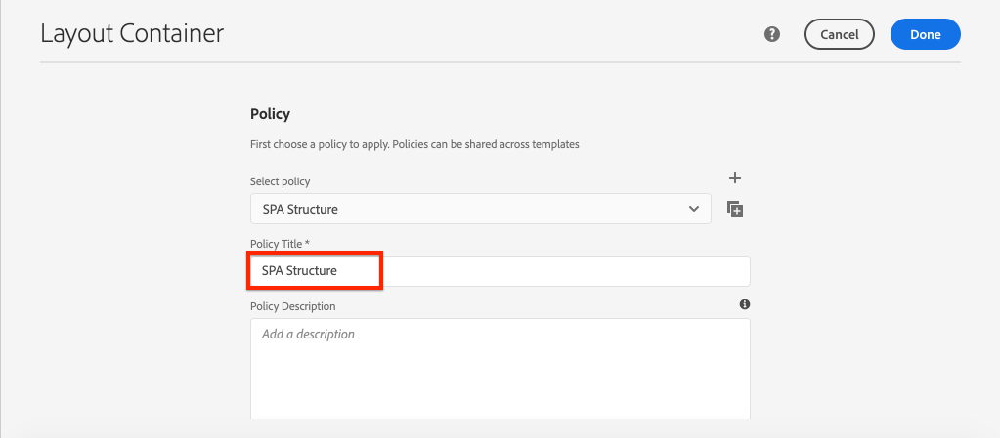
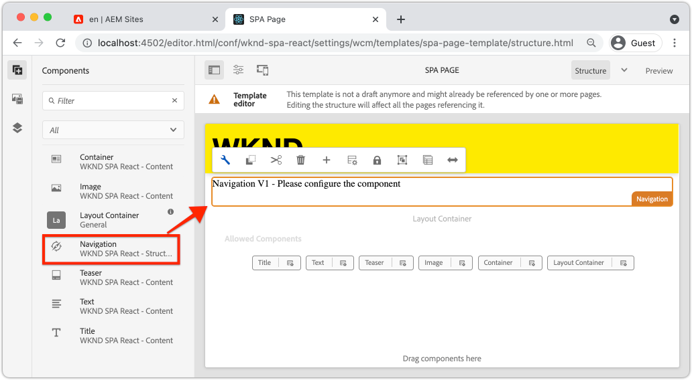
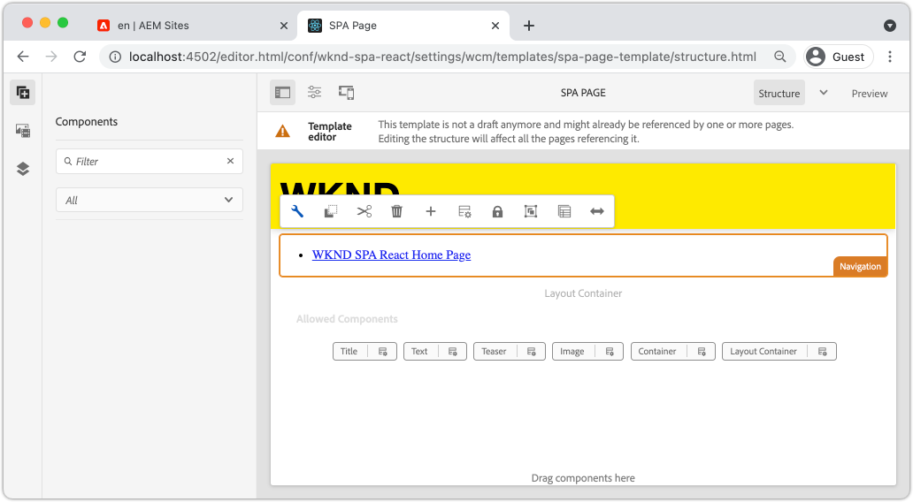
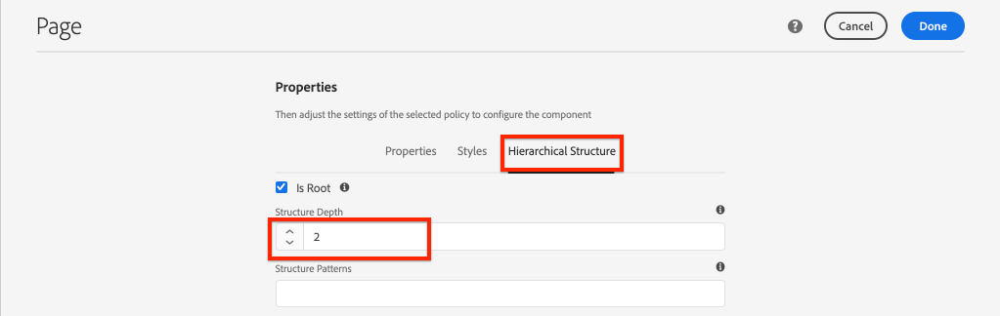

# Adicionar navegação e roteamento {#navigation-routing}

Saiba como várias exibições no SPA podem ser compatíveis com o mapeamento para páginas AEM com o SDK do Editor de SPA. A navegação dinâmica é implementada usando o Roteador React e os Componentes principais do React.

## Objetivo

1. Entenda as opções de roteamento do modelo SPA disponíveis ao usar o Editor SPA.
1. Saiba como usar [Roteador React](https://reacttraining.com/react-router) para navegar entre diferentes visualizações do SPA.
1. Use os Componentes principais de reação do AEM para implementar uma navegação dinâmica orientada pela hierarquia de páginas do AEM.

## O que você vai criar

Este capítulo adicionará a navegação a um SPA no AEM. O menu de navegação é orientado pela hierarquia de página do AEM e usará o modelo JSON fornecido pelo [Componente principal de navegação](https://experienceleague.adobe.com/docs/experience-manager-core-components/using/wcm-components/navigation.html).


## Pré-requisitos

Analisar as ferramentas e instruções necessárias para a configuração de um [ambiente de desenvolvimento local](overview.md#local-dev-environment). O presente capítulo é uma continuação do [Mapear componentes](map-components.md) No entanto, para acompanhar tudo o que você precisa é de um projeto AEM habilitado para SPA implantado em uma instância do AEM local.

## Adicionar a navegação ao modelo {#add-navigation-template}

1. Abra um navegador e faça logon no AEM, [http://localhost:4502/](http://localhost:4502/). A base de código inicial já deve estar implantada.
1. Navegue até a **Modelo de página SPA**: [http://localhost:4502/editor.html/conf/wknd-spa-react/settings/wcm/templates/spa-page-template/structure.html](http://localhost:4502/editor.html/conf/wknd-spa-react/settings/wcm/templates/spa-page-template/structure.html).
1. Selecione o mais externo **Contêiner de layout raiz** e clique em sua **Política** ícone. Tenha cuidado **não** para selecionar o **Contêiner de layout** desbloqueado para criação.

   

1. Crie uma nova política chamada **Estrutura SPA**:

   

   Em **Componentes permitidos** > **Geral** > selecione a **Contêiner de layout** componente.

   Em **Componentes permitidos** > **REAÇÃO SPA WKND - ESTRUTURA** > selecione a **Navegação** componente:

   

   Em **Componentes permitidos** > **REAÇÃO SPA WKND - Conteúdo** > selecione a **Imagem** e **Texto** componentes. Você deve ter um total de quatro componentes selecionados.

   Clique em **Concluído** para salvar as alterações.

1. Atualize a página e adicione o **Navegação** componente acima do desbloqueado **Contêiner de layout**:

   

1. Selecione o **Navegação** e clique em seu **Política** ícone para editar a política.
1. Criar uma nova política com um **Título da política** de **Navegação no SPA**.

   No **Propriedades**:

   * Defina o **Raiz da navegação** para `/content/wknd-spa-react/us/en`.
   * Defina o **Excluir níveis de raiz** para **1**.
   * Desmarcar **Coletar todas as páginas secundárias**.
   * Defina o **Profundidade da estrutura de navegação** para **3**.

   

   Isso coletará os 2 níveis de navegação abaixo `/content/wknd-spa-react/us/en`.

1. Depois de salvar as alterações, você deverá ver a tag `Navigation` como parte do modelo:

   

## Criar páginas secundárias

Em seguida, crie páginas adicionais no AEM que servirão como as diferentes visualizações no SPA. Também vamos inspecionar a estrutura hierárquica do modelo JSON fornecido pelo AEM.

1. Navegue até a **Sites** console: [http://localhost:4502/sites.html/content/wknd-spa-react/us/en/home](http://localhost:4502/sites.html/content/wknd-spa-react/us/en/home). Selecione o **Página inicial do WKND SPA React** e clique em **Criar** > **Página**:

   

1. Em **Modelo** selecionar **Página SPA**. Em **Propriedades** inserir **Página 1** para o **Título** e **página-1** como o nome.

   

   Clique em **Criar** e, na caixa de diálogo pop-up, clique em **Abertura** para abrir a página no Editor SPA AEM.

1. Adicionar um novo **Texto** componente ao principal **Contêiner de layout**. Edite o componente e insira o texto: **Página 1** usando o RTE e o **H2** elemento.

   

   Fique à vontade para adicionar mais conteúdo, como uma imagem.

1. Retorne ao console do AEM Sites e repita as etapas acima, criando uma segunda página chamada **Página 2** como um irmão de **Página 1**.
1. Por último, crie uma terceira página, **Página 3** mas como **filho** de **Página 2**. Depois de concluída, a hierarquia do site deve ser semelhante ao seguinte:

   

1. O componente de Navegação agora pode ser usado para navegar para diferentes áreas do SPA.

   

1. Abra a página fora do Editor de AEM: [http://localhost:4502/content/wknd-spa-react/us/en/home.html](http://localhost:4502/content/wknd-spa-react/us/en/home.html). Use o **Navegação** para navegar em diferentes exibições do aplicativo.

1. Use as ferramentas de desenvolvedor do seu navegador para inspecionar as solicitações de rede enquanto você navega. As capturas de tela abaixo são feitas no navegador Google Chrome.

   

   Observe que após o carregamento da página inicial, a navegação subsequente não causa uma atualização completa da página e que o tráfego de rede é minimizado ao retornar às páginas visitadas anteriormente.

## Modelo JSON da página de hierarquia {#hierarchy-page-json-model}

Em seguida, inspecione o Modelo JSON que direciona a experiência de visualização múltipla do SPA.

1. Em uma nova guia, abra a API do modelo JSON fornecida pelo AEM: [http://localhost:4502/content/wknd-spa-react/us/en.model.json](http://localhost:4502/content/wknd-spa-react/us/en.model.json). Pode ser útil usar uma extensão de navegador para [formatar o JSON](https://chrome.google.com/webstore/detail/json-formatter/bcjindcccaagfpapjjmafapmmgkkhgoa).

   Esse conteúdo JSON é solicitado quando o SPA é carregado pela primeira vez. A estrutura externa tem a seguinte aparência:

   ```json
   {
   "language": "en",
   "title": "en",
   "templateName": "spa-app-template",
   "designPath": "/libs/settings/wcm/designs/default",
   "cssClassNames": "spa page basicpage",
   ":type": "wknd-spa-react/components/spa",
   ":items": {},
   ":itemsOrder": [],
   ":hierarchyType": "page",
   ":path": "/content/wknd-spa-react/us/en",
   ":children": {
      "/content/wknd-spa-react/us/en/home": {},
      "/content/wknd-spa-react/us/en/home/page-1": {},
      "/content/wknd-spa-react/us/en/home/page-2": {},
      "/content/wknd-spa-react/us/en/home/page-2/page-3": {}
      }
   }
   ```

   Em `:children` você deve ver uma entrada para cada uma das páginas criadas. O conteúdo de todas as páginas está nesta solicitação JSON inicial. Com o roteamento de navegação, as exibições subsequentes do SPA são carregadas rapidamente, já que o conteúdo já está disponível no lado do cliente.

   Não é recomendável carregar **TODOS** do conteúdo de um SPA na solicitação JSON inicial, pois isso retardaria o carregamento da página inicial. Em seguida, vamos ver como a profundidade da hierarquia de páginas é coletada.

1. Navegue até a **Raiz SPA** modelo em: [http://localhost:4502/editor.html/conf/wknd-spa-react/settings/wcm/templates/spa-app-template/structure.html](http://localhost:4502/editor.html/conf/wknd-spa-react/settings/wcm/templates/spa-app-template/structure.html).

   Clique em **Menu de propriedades da página** > **Política da página**:

   

1. A variável **Raiz SPA** O modelo tem um **Estrutura Hierárquica** para controlar o conteúdo JSON coletado. A variável **Profundidade da estrutura** determina a profundidade da hierarquia do site para coletar páginas secundárias abaixo de **raiz**. Você também pode usar a variável **Padrões de estrutura** para filtrar páginas adicionais com base em uma expressão regular.

   Atualize o **Profundidade da estrutura** para **2**:

   

   Clique em **Concluído** para salvar as alterações na política.

1. Reabra o modelo JSON [http://localhost:4502/content/wknd-spa-react/us/en.model.json](http://localhost:4502/content/wknd-spa-react/us/en.model.json).

   ```json
   {
   "language": "en",
   "title": "en",
   "templateName": "spa-app-template",
   "designPath": "/libs/settings/wcm/designs/default",
   "cssClassNames": "spa page basicpage",
   ":type": "wknd-spa-react/components/spa",
   ":items": {},
   ":itemsOrder": [],
   ":hierarchyType": "page",
   ":path": "/content/wknd-spa-react/us/en",
   ":children": {
      "/content/wknd-spa-react/us/en/home": {},
      "/content/wknd-spa-react/us/en/home/page-1": {},
      "/content/wknd-spa-react/us/en/home/page-2": {}
      }
   }
   ```

   Observe que **Página 3** o caminho foi removido: `/content/wknd-spa-react/us/en/home/page-2/page-3` do modelo JSON inicial. Isso ocorre porque **Página 3** O está em um nível 3 na hierarquia e atualizamos a política para incluir conteúdo somente em uma profundidade máxima de nível 2.

1. Reabra a página inicial do SPA: [http://localhost:4502/content/wknd-spa-react/us/en/home.html](http://localhost:4502/content/wknd-spa-react/us/en/home.html) e abra as ferramentas do desenvolvedor do seu navegador.

   Atualize a página e você deverá ver a solicitação XHR para `/content/wknd-spa-react/us/en.model.json`, que é a raiz do SPA. Observe que apenas três páginas secundárias são incluídas com base na configuração de profundidade da hierarquia para o modelo Raiz SPA definido anteriormente no tutorial. Isso não inclui **Página 3**.

   

1. Com as ferramentas do desenvolvedor abertas, use a `Navigation` componente para navegar diretamente até **Página 3**:

   Observe que uma nova solicitação XHR é feita para: `/content/wknd-spa-react/us/en/home/page-2/page-3.model.json`

   

   O gerente de modelos do AEM entende que o **Página 3** O conteúdo JSON não está disponível e aciona automaticamente a solicitação XHR adicional.

1. Experimente os deep links navegando diretamente para: [http://localhost:4502/content/wknd-spa-react/us/en/home/page-2.html](http://localhost:4502/content/wknd-spa-react/us/en/home/page-2.html). Observe também que o botão Voltar do navegador continua funcionando.

## Roteamento Inspect React  {#react-routing}

A navegação e o roteamento são implementados com [Roteador React](https://reactrouter.com/en/main). O Roteador React é uma coleção de componentes de navegação para aplicativos React. [Componentes principais do AEM React](https://github.com/adobe/aem-react-core-wcm-components-base) O usa recursos do Roteador React para implementar o **Navegação** componente usado nas etapas anteriores.

Em seguida, inspecione como o Roteador React está integrado ao SPA e experimente usando o Roteador React [Link](https://reactrouter.com/en/main/components/link) componente.

1. No IDE, abra o arquivo `index.js` em `ui.frontend/src/index.js`.

   ```js
   /* index.js */
   import { Router } from 'react-router-dom';
   ...
   ...
    ModelManager.initialize().then(pageModel => {
       const history = createBrowserHistory();
       render(
       <Router history={history}>
           <App
           history={history}
           cqChildren={pageModel[Constants.CHILDREN_PROP]}
           cqItems={pageModel[Constants.ITEMS_PROP]}
           cqItemsOrder={pageModel[Constants.ITEMS_ORDER_PROP]}
           cqPath={pageModel[Constants.PATH_PROP]}
           locationPathname={window.location.pathname}
           />
       </Router>,
       document.getElementById('spa-root')
       );
   });
   ```

   Observe que `App` está envolvido com o `Router` componente de [Roteador React](https://reacttraining.com/react-router). A variável `ModelManager`AEM , fornecido pelo SDK JS do Editor de SPA, adiciona as rotas dinâmicas para páginas AEM com base na API do modelo JSON.

1. Abra o arquivo `Page.js` em `ui.frontend/src/components/Page/Page.js`

   ```js
   class AppPage extends Page {
     get containerProps() {
       let attrs = super.containerProps;
       attrs.className =
         (attrs.className || '') + ' page ' + (this.props.cssClassNames || '');
       return attrs;
     }
   }
   
   export default MapTo('wknd-spa-react/components/page')(
     withComponentMappingContext(withRoute(AppPage))
   );
   ```

   A variável `Page` O componente SPA usa o `MapTo` função a mapear **Páginas** no AEM a um componente SPA correspondente. A variável `withRoute` ajuda a rotear dinamicamente o SPA para a página filho AEM apropriada com base na variável `cqPath` propriedade.

1. Abra o `Header.js` componente em `ui.frontend/src/components/Header/Header.js`.
1. Atualize o `Header` para embrulhar o `<h1>` tag em um [Link](https://reactrouter.com/en/main/components/link) para a página inicial:

   ```diff
     //Header.js
     import React, {Component} from 'react';
   + import {Link} from 'react-router-dom';
     require('./Header.css');
   
   export default class Header extends Component {
   
       render() {
           return (
               <header className="Header">
               <div className="Header-container">
   +              <Link to="/content/wknd-spa-react/us/en/home.html">
                       <h1>WKND</h1>
   +              </Link>
               </div>
               </header>
           );
       }
   ```

   Em vez de usar um padrão `<a>` tag de âncora que usamos `<Link>` fornecido pelo roteador React. Contanto que a variável `to=` para uma rota válida, o SPA mudará para essa rota e **não** execute uma atualização de página completa. Aqui, simplesmente codificamos o link para a página inicial para ilustrar o uso de `Link`.

1. Atualizar o teste em `App.test.js` em `ui.frontend/src/App.test.js`.

   ```diff
   + import { BrowserRouter as Router } from 'react-router-dom';
     import App from './App';
   
     it('renders without crashing', () => {
       const div = document.createElement('div');
   -   ReactDOM.render(<App />, div);
   +   ReactDOM.render(<Router><App /></Router>, div);
     });
   ```

   Como estamos usando recursos do Roteador React em um componente estático referenciado em `App.js` precisamos atualizar o teste de unidade para levar em conta.

1. Abra um terminal, navegue até a raiz do projeto e implante o projeto no AEM usando suas habilidades em Maven:

   ```shell
   $ cd aem-guides-wknd-spa.react
   $ mvn clean install -PautoInstallSinglePackage
   ```

1. SPA Acesse uma das páginas no AEM: [http://localhost:4502/content/wknd-spa-react/us/en/home/page-1.html](http://localhost:4502/content/wknd-spa-react/us/en/home/page-1.html)

   Em vez de usar o `Navigation` para navegar, use o link na caixa `Header`.

   

   Observe que uma atualização de página inteira é **não** acionado e que o roteamento SPA está funcionando.

1. Como opção, experimente o `Header.js` arquivo usando um padrão `<a>` tag de âncora:

   ```js
   <a href="/content/wknd-spa-react/us/en/home.html">
       <h1>WKND</h1>
   </a>
   ```

   Isso pode ajudar a ilustrar a diferença entre o roteamento SPA e os links de páginas da Web regulares.

## Parabéns. {#congratulations}

Parabéns, você aprendeu como várias exibições no SPA podem ser suportadas pelo mapeamento para páginas AEM com o SDK do Editor do SPA. A navegação dinâmica foi implementada usando o Roteador React e adicionada ao `Header` componente.
