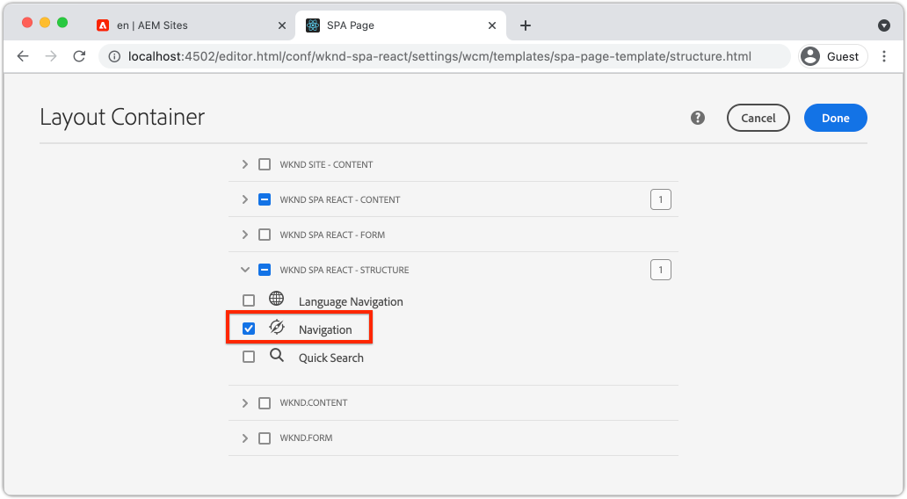

# Adicionar navegação e roteamento {#navigation-routing}

Saiba como várias exibições no SPA podem ser compatíveis com o mapeamento para AEM páginas com o SDK do Editor SPA. A navegação dinâmica é implementada usando o React Router e React Core Components.

## Objetivo

1. Entenda as opções de roteamento do modelo de SPA disponíveis ao usar o Editor de SPA.
1. Saiba como usar [React Router](https://reacttraining.com/react-router/) para navegar entre diferentes visualizações do SPA.
1. Use AEM React Core Components para implementar uma navegação dinâmica orientada pela hierarquia de páginas AEM.

## O que você vai criar

Este capítulo adicionará navegação a um SPA em AEM. O menu de navegação é orientado pela hierarquia de página de AEM e usará o modelo JSON fornecido pela variável [Componente principal de navegação](https://experienceleague.adobe.com/docs/experience-manager-core-components/using/components/navigation.html).


## Pré-requisitos

Revise as ferramentas necessárias e as instruções para configurar um [ambiente de desenvolvimento local](overview.md#local-dev-environment). Este capítulo constitui uma continuação do [Mapear componentes](map-components.md) capítulo, no entanto, para acompanhar tudo o que você precisa é um projeto AEM habilitado para SPA implantado em uma instância de AEM local.

## Adicionar a navegação ao modelo {#add-navigation-template}

1. Abra um navegador e faça logon no AEM, [http://localhost:4502/](http://localhost:4502/). A base de código inicial já deve ser implantada.
1. Navegue até o **Modelo de página SPA**: [http://localhost:4502/editor.html/conf/wknd-spa-react/settings/wcm/templates/spa-page-template/structure.html](http://localhost:4502/editor.html/conf/wknd-spa-react/settings/wcm/templates/spa-page-template/structure.html).
1. Selecione o mais externo **Contêiner de layout raiz** e clique em **Política** ícone . Tenha cuidado **not** para selecionar o **Contêiner de layout** desbloqueado para criação.

   

1. Crie uma nova política chamada **Estrutura SPA**:

   

   Em **Componentes permitidos** > **Geral** > selecione o **Contêiner de layout** componente.

   Em **Componentes permitidos** > **REAÇÃO SPA WKND - ESTRUTURA** > selecione o **Navegação** componente:

   

   Em **Componentes permitidos** > **WKND SPA REACT - Conteúdo** > selecione o **Imagem** e **Texto** componentes. Você deve ter quatro componentes totais selecionados.

   Clique em **Concluído** para salvar as alterações.

1. Atualize a página e adicione o **Navegação** componente acima do desbloqueado **Contêiner de layout**:

   

1. Selecione o **Navegação** e clique em seu **Política** ícone para editar a política.
1. Crie uma nova política com uma **Título da política** de **Navegação de SPA**.

   Em **Propriedades**:

   * Defina as **Raiz de navegação** para `/content/wknd-spa-react/us/en`.
   * Defina as **Excluir níveis raiz** para **1**.
   * Desmarcar **Coletar todas as páginas secundárias**.
   * Defina as **Profundidade da estrutura de navegação** para **3**.

   

   Isso coletará os 2 níveis de navegação abaixo `/content/wknd-spa-react/us/en`.

1. Depois de salvar as alterações, você deve ver o campo preenchido `Navigation` como parte do modelo:

   

## Criar páginas filhas

Em seguida, crie páginas adicionais no AEM que servirão como visualizações diferentes no SPA. Inspecionaremos também a estrutura hierárquica do modelo JSON fornecido pelo AEM.

1. Navegue até o **Sites** console: [http://localhost:4502/sites.html/content/wknd-spa-react/us/en/home](http://localhost:4502/sites.html/content/wknd-spa-react/us/en/home). Selecione o **Página inicial do React SPA WKND** e clique em **Criar** > **Página**:

   

1. Em **Modelo** select **Página SPA**. Em **Propriedades** enter **Página 1** para **Título** e **page-1** como o nome.

   

   Clique em **Criar** e, na janela pop-up, clique em **Abrir** para abrir a página no Editor de SPA de AEM.

1. Adicione um novo **Texto** para o componente principal **Contêiner de layout**. Edite o componente e insira o texto: **Página 1** usando o RTE e o **H2** elemento.

   

   Você pode adicionar conteúdo adicional, como uma imagem.

1. Retorne ao console AEM Sites e repita as etapas acima, criando uma segunda página com o nome **Página 2** como um irmão de **Página 1**.
1. Por fim, crie uma terceira página, **Página 3** mas como um **criança** de **Página 2**. Depois de concluída, a hierarquia do site deve ser semelhante ao seguinte:

   

1. O componente Navegação agora pode ser usado para navegar para áreas diferentes do SPA.

   

1. Abra a página fora do Editor de AEM: [http://localhost:4502/content/wknd-spa-react/us/en/home.html](http://localhost:4502/content/wknd-spa-react/us/en/home.html). Use o **Navegação** para navegar até diferentes exibições do aplicativo.

1. Use as ferramentas de desenvolvedor do seu navegador para inspecionar as solicitações de rede, conforme você navega. As capturas de tela abaixo são capturadas pelo navegador Google Chrome.

   

   Observe que, após o carregamento da página inicial, a navegação subsequente não causa uma atualização de página completa e que o tráfego de rede é minimizado ao retornar às páginas visitadas anteriormente.

## Modelo JSON de página de hierarquia {#hierarchy-page-json-model}

Em seguida, inspecione o Modelo JSON que orienta a experiência de várias visualizações do SPA.

1. Em uma nova guia, abra a API do modelo JSON fornecida pelo AEM: [http://localhost:4502/content/wknd-spa-react/us/en.model.json](http://localhost:4502/content/wknd-spa-react/us/en.model.json). Pode ser útil usar uma extensão do navegador para [formatar o JSON](https://chrome.google.com/webstore/detail/json-formatter/bcjindcccaagfpapjjmafapmmgkkhgoa).

   Esse conteúdo JSON é solicitado quando o SPA é carregado pela primeira vez. A estrutura externa tem a seguinte aparência:

   ```json
   {
   "language": "en",
   "title": "en",
   "templateName": "spa-app-template",
   "designPath": "/libs/settings/wcm/designs/default",
   "cssClassNames": "spa page basicpage",
   ":type": "wknd-spa-react/components/spa",
   ":items": {},
   ":itemsOrder": [],
   ":hierarchyType": "page",
   ":path": "/content/wknd-spa-react/us/en",
   ":children": {
      "/content/wknd-spa-react/us/en/home": {},
      "/content/wknd-spa-react/us/en/home/page-1": {},
      "/content/wknd-spa-react/us/en/home/page-2": {},
      "/content/wknd-spa-react/us/en/home/page-2/page-3": {}
      }
   }
   ```

   Em `:children` você deve ver uma entrada para cada página criada. O conteúdo de todas as páginas está nesta solicitação JSON inicial. Com o roteamento de navegação, as visualizações subsequentes do SPA são carregadas rapidamente, já que o conteúdo já está disponível no lado do cliente.

   Não é recomendável carregar **TODAS** do conteúdo de um SPA na solicitação JSON inicial, pois isso diminuiria o carregamento da página inicial. Em seguida, vamos examinar como a profundidade da hierarquia de páginas é coletada.

1. Navegue até o **Raiz SPA** modelo em: [http://localhost:4502/editor.html/conf/wknd-spa-react/settings/wcm/templates/spa-app-template/structure.html](http://localhost:4502/editor.html/conf/wknd-spa-react/settings/wcm/templates/spa-app-template/structure.html).

   Clique no botão **Menu de propriedades da página** > **Política da página**:

   

1. O **Raiz SPA** O modelo tem um extra **Estrutura Hierárquica** para controlar o conteúdo JSON coletado. O **Profundidade da estrutura** determina o quão profundo na hierarquia do site coletar páginas secundárias abaixo do **root**. Também é possível usar a variável **Padrões da estrutura** para filtrar páginas adicionais com base em uma expressão regular.

   Atualize o **Profundidade da estrutura** para **2**:

   

   Clique em **Concluído** para salvar as alterações na política.

1. Reabra o modelo JSON [http://localhost:4502/content/wknd-spa-react/us/en.model.json](http://localhost:4502/content/wknd-spa-react/us/en.model.json).

   ```json
   {
   "language": "en",
   "title": "en",
   "templateName": "spa-app-template",
   "designPath": "/libs/settings/wcm/designs/default",
   "cssClassNames": "spa page basicpage",
   ":type": "wknd-spa-react/components/spa",
   ":items": {},
   ":itemsOrder": [],
   ":hierarchyType": "page",
   ":path": "/content/wknd-spa-react/us/en",
   ":children": {
      "/content/wknd-spa-react/us/en/home": {},
      "/content/wknd-spa-react/us/en/home/page-1": {},
      "/content/wknd-spa-react/us/en/home/page-2": {}
      }
   }
   ```

   Observe que a variável **Página 3** O caminho foi removido: `/content/wknd-spa-react/us/en/home/page-2/page-3` no modelo JSON inicial. Isso ocorre porque **Página 3** está no nível 3 da hierarquia e atualizamos a política para incluir somente conteúdo em uma profundidade máxima do nível 2.

1. Reabra a página inicial do SPA: [http://localhost:4502/content/wknd-spa-react/us/en/home.html](http://localhost:4502/content/wknd-spa-react/us/en/home.html) e abra as ferramentas do desenvolvedor do seu navegador.

   Atualize a página e você deve ver a solicitação XHR para `/content/wknd-spa-react/us/en.model.json`, que é a raiz SPA. Observe que apenas três páginas filhas são incluídas com base na configuração de profundidade da hierarquia para o modelo Raiz SPA feito anteriormente no tutorial. Isso não inclui **Página 3**.

   

1. Com as ferramentas do desenvolvedor abertas, use o `Navigation` componente para navegar diretamente para o **Página 3**:

   Observe que uma nova solicitação de XHR é feita para: `/content/wknd-spa-react/us/en/home/page-2/page-3.model.json`

   

   O Gerenciador de modelos de AEM entende que a variável **Página 3** O conteúdo JSON não está disponível e aciona automaticamente a solicitação XHR adicional.

1. Experimente com deep links navegando diretamente para: [http://localhost:4502/content/wknd-spa-react/us/en/home/page-2.html](http://localhost:4502/content/wknd-spa-react/us/en/home/page-2.html). Observe também que o botão Voltar do navegador continua funcionando.

## Roteamento do Inspect React  {#react-routing}

A navegação e o roteamento são implementados com [React Router](https://reactrouter.com/). O React Router é uma coleção de componentes de navegação para aplicativos React. [Componentes principais do AEM React](https://github.com/adobe/aem-react-core-wcm-components-base) O usa recursos do React Router para implementar o **Navegação** componente usado nas etapas anteriores.

Em seguida, verifique como o React Router é integrado ao SPA e experimente usando o React Router [Link](https://reactrouter.com/web/api/Link) componente.

1. No IDE, abra o arquivo `index.js` at `ui.frontend/src/index.js`.

   ```js
   /* index.js */
   import { Router } from 'react-router-dom';
   ...
   ...
    ModelManager.initialize().then(pageModel => {
       const history = createBrowserHistory();
       render(
       <Router history={history}>
           <App
           history={history}
           cqChildren={pageModel[Constants.CHILDREN_PROP]}
           cqItems={pageModel[Constants.ITEMS_PROP]}
           cqItemsOrder={pageModel[Constants.ITEMS_ORDER_PROP]}
           cqPath={pageModel[Constants.PATH_PROP]}
           locationPathname={window.location.pathname}
           />
       </Router>,
       document.getElementById('spa-root')
       );
   });
   ```

   Observe que a variável `App` está envolvido no `Router` componente de [React Router](https://reacttraining.com/react-router/). O `ModelManager`, fornecido pelo SDK JS do Editor de SPA AEM, adiciona as rotas dinâmicas às Páginas de AEM com base na API do modelo JSON.

1. Abra o arquivo `Page.js` at `ui.frontend/src/components/Page/Page.js`

   ```js
   class AppPage extends Page {
     get containerProps() {
       let attrs = super.containerProps;
       attrs.className =
         (attrs.className || '') + ' page ' + (this.props.cssClassNames || '');
       return attrs;
     }
   }
   
   export default MapTo('wknd-spa-react/components/page')(
     withComponentMappingContext(withRoute(AppPage))
   );
   ```

   O `Page` SPA componente usa o `MapTo` função a mapear **Páginas** em AEM para um componente de SPA correspondente. O `withRoute` ajuda a rotear dinamicamente o SPA para a página AEM filho apropriada com base no `cqPath` propriedade.

1. Abra o `Header.js` componente em `ui.frontend/src/components/Header/Header.js`.
1. Atualize o `Header` para envolver o `<h1>` em uma [Link](https://reactrouter.com/web/api/Link) à página inicial:

   ```diff
     //Header.js
     import React, {Component} from 'react';
   + import {Link} from 'react-router-dom';
     require('./Header.css');
   
   export default class Header extends Component {
   
       render() {
           return (
               <header className="Header">
               <div className="Header-container">
   +              <Link to="/content/wknd-spa-react/us/en/home.html">
                       <h1>WKND</h1>
   +              </Link>
               </div>
               </header>
           );
       }
   ```

   Em vez de usar um padrão `<a>` tag de âncora que usamos `<Link>` fornecido pelo React Router. Contanto que a variável `to=` aponte para uma rota válida, o SPA mudará para essa rota e **not** execute uma atualização de página completa. Aqui, simplesmente codificamos o link para a página inicial para ilustrar o uso de `Link`.

1. Atualize o teste em `App.test.js` at `ui.frontend/src/App.test.js`.

   ```diff
   + import { BrowserRouter as Router } from 'react-router-dom';
     import App from './App';
   
     it('renders without crashing', () => {
       const div = document.createElement('div');
   -   ReactDOM.render(<App />, div);
   +   ReactDOM.render(<Router><App /></Router>, div);
     });
   ```

   Como estamos usando os recursos do React Router em um componente estático referenciado em `App.js` precisamos atualizar o teste de unidade para considerá-lo.

1. Abra um terminal, navegue até a raiz do projeto e implante o projeto para AEM usando suas habilidades Maven:

   ```shell
   $ cd aem-guides-wknd-spa.react
   $ mvn clean install -PautoInstallSinglePackage
   ```

1. Navegue até uma das páginas no SPA no AEM: [http://localhost:4502/content/wknd-spa-react/us/en/home/page-1.html](http://localhost:4502/content/wknd-spa-react/us/en/home/page-1.html)

   Em vez de usar o `Navigation` para navegar, use o link no `Header`.

   

   Observe que uma atualização de página completa é **not** e que o roteamento de SPA está funcionando.

1. Opcionalmente, experimente com a `Header.js` arquivo usando um padrão `<a>` tag de âncora:

   ```js
   <a href="/content/wknd-spa-react/us/en/home.html">
       <h1>WKND</h1>
   </a>
   ```

   Isso pode ajudar a ilustrar a diferença entre SPA roteamento e links regulares de página da Web.

## Parabéns.  {#congratulations}

Parabéns, você aprendeu como várias exibições no SPA podem ser suportadas com o mapeamento para AEM páginas com o SDK do Editor SPA. A navegação dinâmica foi implementada com o React Router e adicionada ao `Header` componente.
