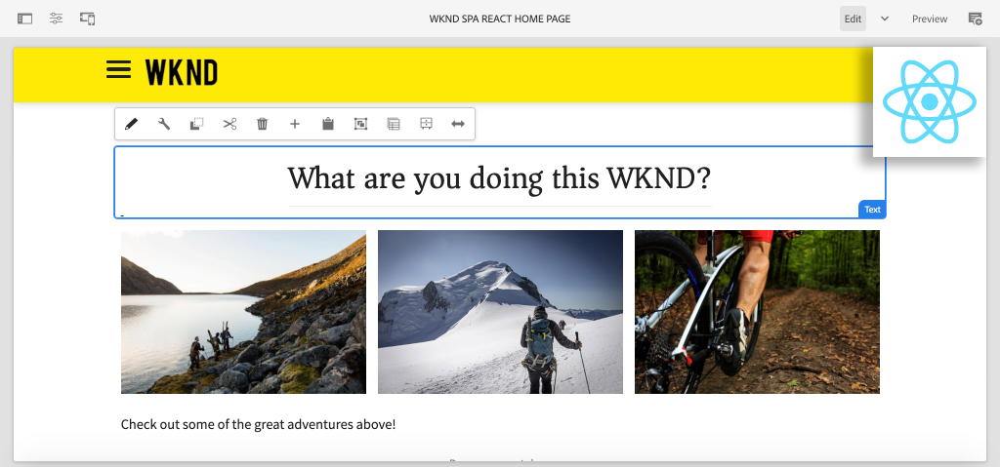

# Crie seu primeiro SPA React em AEM {#overview}

Bem-vindo a um tutorial de várias partes criado para desenvolvedores novos no recurso **SPA Editor** no Adobe Experience Manager (AEM). Este tutorial aborda a implementação de um aplicativo React para uma marca fictícia de estilo de vida, a WKND. O aplicativo React será desenvolvido e projetado para ser implantado com AEM Editor de SPA, que mapeia os componentes React para AEM componentes. O SPA concluído, implantado em AEM, pode ser criado dinamicamente com as ferramentas tradicionais de edição em linha do AEM.

*Implementação de SPA WKND*

## Sobre

O tutorial foi projetado para funcionar com **AEM como um Cloud Service** e é compatível com versões anteriores com **AEM 6.5.4+** e **AEM 6.4.8+**.

## Código mais recente

Todo o código tutorial pode ser encontrado em [GitHub](https://github.com/adobe/aem-guides-wknd-spa).

O [base de código mais recente](https://github.com/adobe/aem-guides-wknd-spa/releases) está disponível como Pacotes de AEM para download.

## Pré-requisitos

Antes de iniciar este tutorial, você precisará do seguinte:

* Um conhecimento básico de HTML, CSS e JavaScript
* Familiaridade básica com [React](https://reactjs.org/tutorial/tutorial.html)

*Embora não seja obrigatório, é benéfico ter uma compreensão básica do  [desenvolvimento de componentes](https://experienceleague.adobe.com/docs/experience-manager-learn/getting-started-wknd-tutorial-develop/overview.html) AEM Sites tradicionais.*

## Ambiente de desenvolvimento local {#local-dev-environment}

Um ambiente de desenvolvimento local é necessário para concluir este tutorial. Capturas de tela e vídeo são capturados usando o AEM como um Cloud Service SDK em execução em um ambiente Mac OS com o [Visual Studio Code](https://code.visualstudio.com/) como o IDE. Os comandos e o código devem ser independentes do sistema operacional local, salvo indicação em contrário.

### Software necessário

* [AEM como SDK](https://experienceleague.adobe.com/docs/experience-manager-learn/cloud-service/local-development-environment-set-up/aem-runtime.html) do Cloud Service,  [AEM 6.5.4+](https://experienceleague.adobe.com/docs/experience-manager-release-information/aem-release-updates/aem-releases-updates.html?lang=en#aem-65) ou  [AEM 6.4.8+](https://experienceleague.adobe.com/docs/experience-manager-release-information/aem-release-updates/aem-releases-updates.html?lang=en#aem-64)
* [Java](https://downloads.experiencecloud.adobe.com/content/software-distribution/en/general.html)
* [Apache Maven](https://maven.apache.org/) (3.3.9 ou mais recente)
* [Node.](https://nodejs.org/en/) jand  [npm](https://www.npmjs.com/)

>[!NOTE]
>
> **Novo no AEM as a Cloud Service?** Consulte o [guia a seguir para configurar um ambiente de desenvolvimento local usando o SDK do AEM as a Cloud Service](https://experienceleague.adobe.com/docs/experience-manager-learn/cloud-service/local-development-environment-set-up/overview.html).
>
> **Novo no AEM 6.5?** Consulte o guia a  [seguir para configurar um ambiente](https://experienceleague.adobe.com/docs/experience-manager-learn/foundation/development/set-up-a-local-aem-development-environment.html) de desenvolvimento local.

## Próximas etapas {#next-steps}

O que você está esperando?! Inicie o tutorial navegando até o capítulo [Criar projeto](create-project.md) e saiba como gerar um projeto habilitado para o Editor de SPA usando o Arquétipo de projeto AEM.
