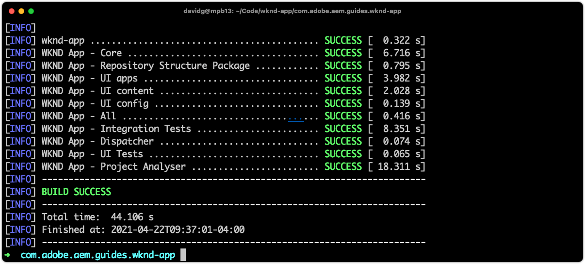

# Configurar AEM para SPA Editor

Embora a base de código de SPA seja gerenciada fora do AEM, um projeto AEM é necessário para configurar o suporte à configuração e aos requisitos de conteúdo. Este capítulo aborda a criação de um projeto AEM que contém as configurações necessárias:

+ AEM proxies dos Componentes principais do WCM
+ Proxy de página de SPA remota AEM
+ AEM Modelos de Página de SPA Remota
+ Página de AEM do SPA Remoto da Linha de Base
+ Subprojeto para definir SPA para AEM mapeamentos de URL
+ Pastas de configuração OSGi

## Criar um projeto AEM

Crie um projeto AEM no qual as configurações e o conteúdo da linha de base sejam gerenciados.

_Sempre use a versão mais recente do Arquétipo de  [AEM](https://github.com/adobe/aem-project-archetype)._


```
$ mkdir -p ~/Code/wknd-app
$ cd ~/Code/wknd-app
$ mvn -B archetype:generate \
 -D archetypeGroupId=com.adobe.aem \
 -D archetypeArtifactId=aem-project-archetype \
 -D archetypeVersion=27 \
 -D aemVersion=cloud \
 -D appTitle="WKND App" \
 -D appId="wknd-app" \
 -D groupId="com.adobe.aem.guides.wkndapp" \
 -D frontendModule="react"
$ mv ~/Code/wknd-app/wknd-app ~/Code/wknd-app/com.adobe.aem.guides.wknd-app
```

_O último comando simplesmente renomeia a pasta do projeto AEM para que fique claro que é o projeto AEM e não seja confundido com o Remote SPA__

Embora `frontendModule="react"` seja especificado, o projeto `ui.frontend` não é usado para o caso de uso de SPA Remoto. O SPA é desenvolvido e gerenciado externamente para AEM e só usa AEM como uma API de conteúdo. O sinalizador `frontendModule="react"` é necessário para o projeto e inclui as `spa-project` AEM dependências Java™ e configura os Modelos de página de SPA Remota.

O Arquétipo de projeto AEM gera os seguintes elementos que foram usados para configurar AEM para integração com o SPA.

+ __AEM__ Proxies dos Componentes principais do WCM  `ui.content/src/.../apps/wknd-app/components`
+ __AEM SPA__ proxicat da página remota  `ui.content/src/.../apps/wknd-app/components/remotepage`
+ __AEM__ modelos de página em  `ui.content/src/.../conf/wknd-app/settings/wcm/templates`
+ __Subprojeto para definir__ mapeamentos de conteúdo em  `ui.content/src/...`
+ __SPA Remoto da Linha de Base AEM__ páginas em  `ui.content/src/.../content/wknd-app`
+ __Pasta de configuração__ OSGi  `ui.config/src/.../apps/wknd-app/osgiconfig`

Com o projeto base AEM gerado, alguns ajustes garantem SPA compatibilidade do Editor com o SPA Remoto.

## Remover projeto ui.frontend

Como o SPA é um SPA Remoto, suponha que ele tenha sido desenvolvido e gerenciado fora do projeto AEM. Para evitar conflitos, remova a implantação do projeto `ui.frontend`. Se o projeto `ui.frontend` não for removido, dois SPA, o SPA padrão fornecido no projeto `ui.frontend` e o SPA Remoto, serão carregados ao mesmo tempo no Editor de SPA de AEM.

1. Abra o AEM projeto (`~/Code/wknd-app/com.adobe.aem.guides.wknd-app`) no IDE
1. Abra a raiz `pom.xml`
1. Comente o `<module>ui.frontend</module` da lista `<modules>`

   ```
   <modules>
       <module>all</module>
       <module>core</module>
   
       <!-- <module>ui.frontend</module> -->
   
       <module>ui.apps</module>
       <module>ui.apps.structure</module>
       <module>ui.config</module>
       <module>ui.content</module>
       <module>it.tests</module>
       <module>dispatcher</module>
       <module>ui.tests</module>
       <module>analyse</module>
   </modules>
   ```

   O arquivo `pom.xml` deve ter a seguinte aparência:

   

1. Abra o `ui.apps/pom.xml`
1. Comente o `<dependency>` em `<artifactId>wknd-app.ui.frontend</artifactId>`

   ```
   <dependencies>
   
       <!-- Remote SPA project will provide all frontend resources
       <dependency>
           <groupId>com.adobe.aem.guides.wkndapp</groupId>
           <artifactId>wknd-app.ui.frontend</artifactId>
           <version>${project.version}</version>
           <type>zip</type>
       </dependency>
       --> 
   </dependencies>
   ```

   O arquivo `ui.apps/pom.xml` deve ter a seguinte aparência:

   

Se o projeto AEM foi criado antes dessas alterações, exclua manualmente a `ui.frontend` Biblioteca de clientes gerada do projeto `ui.apps` em `ui.apps/src/main/content/jcr_root/apps/wknd-app/clientlibs/clientlib-react`.

## Mapeamento de conteúdo AEM

Para que o AEM carregue o SPA Remoto no Editor de SPA, os mapeamentos entre as rotas de SPA e as Páginas de AEM usadas para abrir e criar conteúdo devem ser estabelecidos.

A importância dessa configuração é explorada posteriormente.

O mapeamento pode ser feito com [Mapeamento do Sling](https://sling.apache.org/documentation/the-sling-engine/mappings-for-resource-resolution.html#root-level-mappings-1) definido em `/etc/map`.

1. No IDE, abra o subprojeto `ui.content`
1. Vá até  `src/main/content/jcr_root/etc`
1. Crie uma pasta `map`
1. Em `map`, crie uma pasta `http`
1. Em `http`, crie um arquivo `.content.xml` com o conteúdo:

   ```
   <?xml version="1.0" encoding="UTF-8"?>
   <jcr:root xmlns:sling="http://sling.apache.org/jcr/sling/1.0" xmlns:jcr="http://www.jcp.org/jcr/1.0"
       jcr:primaryType="sling:Mapping">
       <localhost_any/>
   </jcr:root>
   ```

1. Em `http` , crie uma pasta `localhost_any`
1. Em `localhost_any`, crie um arquivo `.content.xml` com o conteúdo:

   ```
   <?xml version="1.0" encoding="UTF-8"?>
   <jcr:root xmlns:sling="http://sling.apache.org/jcr/sling/1.0" xmlns:jcr="http://www.jcp.org/jcr/1.0"
       jcr:primaryType="sling:Mapping"
       sling:match="localhost\\.\\d+">
       <wknd-app-routes-adventure/>
   </jcr:root>
   ```

1. Em `localhost_any` , crie uma pasta `wknd-app-routes-adventure`
1. Em `wknd-app-routes-adventure`, crie um arquivo `.content.xml` com o conteúdo:

   ```
   <?xml version="1.0" encoding="UTF-8"?>
   
   <!--
   The 'wknd-app-routes-adventure' mapping, maps requests to the SPA's adventure route 
   to it's corresponding page in AEM at /content/wknd-app/us/en/home/adventure/xxx.
   
   Note the adventure AEM pages will be created directly in AEM.
   -->
   
   <jcr:root xmlns:sling="http://sling.apache.org/jcr/sling/1.0" xmlns:jcr="http://www.jcp.org/jcr/1.0"
       jcr:primaryType="sling:Mapping"
       sling:match="adventure:.*/([^/]+)/?$"
       sling:internalRedirect="/content/wknd-app/us/en/home/adventure/$1"/>
   ```

1. Adicione os nós de mapeamento a `ui.content/src/main/content/META-INF/vault/filter.xml` para que sejam incluídos no pacote de AEM.

   ```
   <?xml version="1.0" encoding="UTF-8"?>
   <workspaceFilter version="1.0">
       <filter root="/conf/wknd-app" mode="merge"/>
       <filter root="/content/wknd-app" mode="merge"/>
       <filter root="/content/dam/wknd-app/asset.jpg" mode="merge"/>
       <filter root="/content/experience-fragments/wknd-app" mode="merge"/>
   
       <!-- Add the Sling Mapping rules for the WKND App -->
       <filter root="/etc/map" mode="merge"/>
   </workspaceFilter>
   ```

A estrutura de pastas e os arquivos `.context.xml` devem ter a seguinte aparência:


O arquivo `filter.xml` deve ter a seguinte aparência:


Agora, quando o projeto AEM é implantado, essas configurações são incluídas automaticamente.

Os efeitos do Mapeamento do Sling AEM em execução em `http` e `localhost`, portanto, são compatíveis apenas com o desenvolvimento local. Ao implantar no AEM como um Cloud Service, os Mapeamentos do Sling semelhantes devem ser adicionados ao target `https` e ao AEM apropriado como um Cloud Service. Para obter mais informações, consulte a [documentação do Mapeamento do Sling](https://sling.apache.org/documentation/the-sling-engine/mappings-for-resource-resolution.html).

## Políticas de segurança de compartilhamento de recursos entre origens

Em seguida, configure o AEM para proteger o conteúdo, de modo que somente esse SPA possa acessar o conteúdo AEM. C Configure [Compartilhamento de recursos entre origens em AEM](https://experienceleague.adobe.com/docs/experience-manager-learn/foundation/security/develop-for-cross-origin-resource-sharing.html).

1. No IDE, abra o subprojeto `ui.config` Maven
1. Navegar `src/main/content/jcr_root/apps/wknd-app/osgiconfig/config`
1. Crie um arquivo chamado `com.adobe.granite.cors.impl.CORSPolicyImpl~wknd-app_remote-spa.cfg.json`
1. Adicione o seguinte ao arquivo :

   ```
   {
       "supportscredentials":true,
       "exposedheaders":[
           ""
       ],
       "supportedmethods":[
           "GET",
           "HEAD",
           "POST",
           "OPTIONS"
       ],
       "alloworigin":[
           "https://external-hosted-app", "localhost:3000"
       ],
       "maxage:Integer":1800,
       "alloworiginregexp":[
           ".*"
       ],
       "allowedpaths":[
           ".*"
       ],
       "supportedheaders":[
           "Origin",
           "Accept",
           "X-Requested-With",
           "Content-Type",
           "Access-Control-Request-Method",
           "Access-Control-Request-Headers",
           "Authorization"
       ]
   }
   ```

O arquivo `com.adobe.granite.cors.impl.CORSPolicyImpl~wknd-app_remote-spa.cfg.json` deve ter a seguinte aparência:


Os principais elementos de configuração são:

+ `alloworigin` especifica quais hosts têm permissão para recuperar conteúdo do AEM.
   + `localhost:3000` é adicionado para oferecer suporte ao SPA executado localmente
   + `https://external-hosted-app` atua como um espaço reservado a ser substituído pelo domínio no qual o SPA Remoto está hospedado.
+ `allowedpaths` especifique quais caminhos no AEM são cobertos por essa configuração do CORS. O padrão permite acesso a todo o conteúdo no AEM, no entanto, isso pode ser escoado somente para os caminhos específicos que o SPA pode acessar, por exemplo: `/content/wknd-app`.

## Definir AEM página como modelo de página SPA remota

O Arquétipo de projeto AEM gera um projeto iniciado para AEM integração com um SPA Remoto, mas requer um pequeno, mas importante ajuste para a estrutura de página AEM gerada automaticamente. A página de AEM gerada automaticamente deve ter seu tipo alterado para __Remote SPA page__, em vez de __SPA page__.

1. No IDE, abra o subprojeto `ui.content`
1. Abrir em `src/main/content/jcr_root/content/wknd-app/us/en/home/.content.xml`
1. Atualize este arquivo `.content.xml` com:

   ```
   <?xml version="1.0" encoding="UTF-8"?>
   <jcr:root xmlns:sling="http://sling.apache.org/jcr/sling/1.0" xmlns:cq="http://www.day.com/jcr/cq/1.0" xmlns:jcr="http://www.jcp.org/jcr/1.0" xmlns:nt="http://www.jcp.org/jcr/nt/1.0"
           jcr:primaryType="cq:Page">
       <jcr:content
           cq:template="/conf/wknd-app/settings/wcm/templates/spa-remote-page"
           jcr:primaryType="cq:PageContent"
           jcr:title="WKND App Home Page"
           sling:resourceType="wknd-app/components/remotepage">
           <root
               jcr:primaryType="nt:unstructured"
               sling:resourceType="wcm/foundation/components/responsivegrid">
               <responsivegrid
                   jcr:primaryType="nt:unstructured"
                   sling:resourceType="wcm/foundation/components/responsivegrid">
                   <text
                       jcr:primaryType="nt:unstructured"
                       sling:resourceType="wknd-app/components/text"
                       text="&lt;p>Hello World!&lt;/p>"
                       textIsRich="true">
                       <cq:responsive jcr:primaryType="nt:unstructured"/>
                   </text>
               </responsivegrid>
           </root>
       </jcr:content>
   </jcr:root>
   ```

As alterações principais são atualizações no nó `jcr:content`:

+ `cq:template` para `/conf/wknd-app/settings/wcm/templates/spa-remote-page`
+ `sling:resourceType` para `wknd-app/components/remotepage`

O arquivo `src/main/content/jcr_root/content/wknd-app/us/en/home/.content.xml` deve ter a seguinte aparência:


Essas alterações permitem que essa página, que atua como a raiz SPA no AEM, carregue o SPA Remoto SPA Editor.

>[!NOTE]
>
>Se este projeto tiver sido AEM anteriormente, exclua a página AEM como __Sites > Aplicativo WKND > us > en > Página inicial do aplicativo WKND__, pois o projeto `ui.content` está definido como __mesclar__ nós, em vez de __atualizar__.

Essa página também pode ser removida e recriada como uma Página de SPA Remota em si AEM, no entanto, como essa página é criada automaticamente no projeto `ui.content`, é melhor atualizá-la na base de código.

## Implantar o AEM Project no AEM SDK

1. Certifique-se de que o serviço de autor do AEM esteja em execução na porta 4502
1. Na linha de comando, navegue até a raiz do projeto Maven AEM
1. Usar o Maven para implantar o projeto no serviço de autor do SDK do AEM local

   ```
   $ mvn clean install -PautoInstallSinglePackage
   ```

   

## Configurar a página de AEM raiz

Com o AEM Project implantado, há uma última etapa para preparar SPA Editor para carregar nosso SPA Remoto. Em AEM, marque a página AEM que corresponde à raiz SPA,`/content/wknd-app/us/en/home`, gerada pelo Arquétipo de projeto AEM.

1. Faça logon no AEM Author
1. Navegue até __Sites > Aplicativo WKND > us > en__
1. Selecione a __Página Inicial do Aplicativo WKND__ e toque em __Propriedades__

   

1. Navegue até a guia __SPA__
1. Preencha o __Configuração de SPA Remota__
   + __URL__ do host SPA:  `http://localhost:3000`
      + O URL para a raiz do SPA remoto

   

1. Toque em __Salvar e fechar__

Lembre-se de que alteramos o tipo desta página para o de uma __Página de SPA Remota__, que é o que nos permite ver a guia __SPA__ em suas __Propriedades da Página__.

Essa configuração só deve ser definida na página de AEM que corresponde à raiz do SPA. Todas AEM páginas abaixo desta página herdam o valor.

## Parabéns

Agora você preparou AEM configurações e as implantou em seu autor de AEM local! Agora você sabe como:

+ Remova o SPA gerado pelo Arquétipo de Projeto AEM, comentando as dependências em `ui.frontend`
+ Adicionar Mapeamentos do Sling a AEM que mapeiam as rotas SPA para recursos no AEM
+ Configure AEM políticas de segurança de compartilhamento de recursos entre origens que permitem ao SPA remoto consumir conteúdo de AEM
+ Implante o projeto do AEM no serviço de criação AEM SDK local
+ Marcar uma página AEM como a raiz SPA remota usando a propriedade da página URL de host SPA

## Próximas etapas

Com AEM configurados, podemos nos concentrar em [inicializando o SPA Remoto](./spa-bootstrap.md) com suporte para áreas editáveis usando AEM Editor SPA!