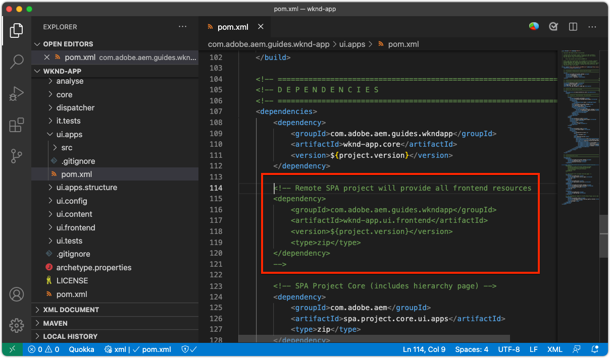
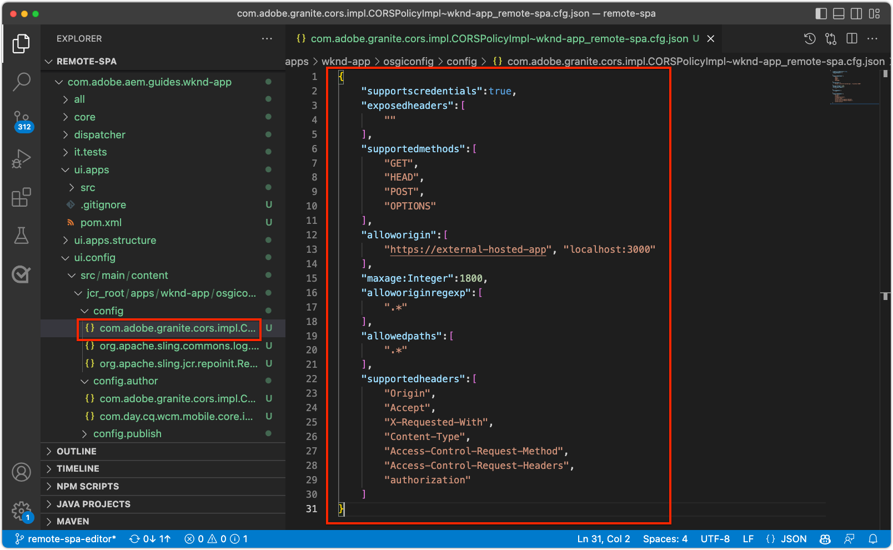
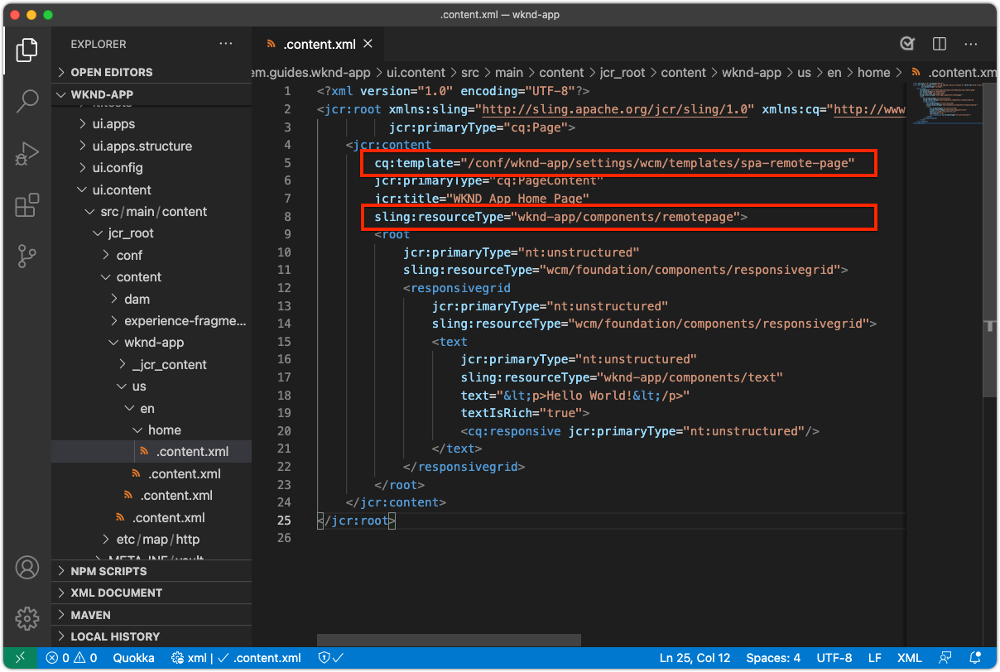
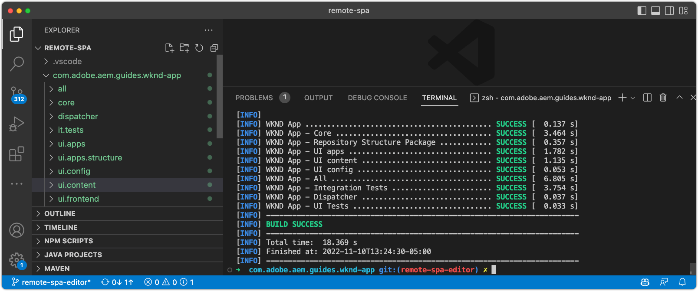
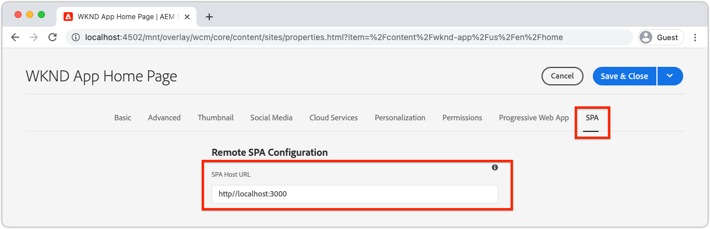

# Configuração do AEM para o Editor SPA

{{spa-editor-deprecation}}

Embora a base de código de SPA seja gerenciada fora do AEM, um projeto do AEM é necessário para configurar os requisitos de configuração e conteúdo de suporte. Este capítulo aborda a criação de um projeto do AEM que contém as configurações necessárias:

* Proxies dos Componentes principais do AEM WCM
* Proxy de página do SPA remoto do AEM
* Modelos de página de SPA remoto do AEM
* Páginas do AEM do SPA Remoto da Linha de Base
* Subprojeto para definir mapeamentos de URL de SPA para AEM
* Pastas de configuração do OSGi

## Baixar o projeto base no GitHub

Baixe o projeto `aem-guides-wknd-graphql` de Github.com. Ele conterá alguns arquivos de linha de base usados neste projeto.

```
$ mkdir -p ~/Code
$ git clone https://github.com/adobe/aem-guides-wknd-graphql.git
$ cd remote-spa-tutorial
```

## Criar um projeto do AEM

Crie um projeto do AEM em que as configurações e o conteúdo da linha de base sejam gerenciados. Este projeto será gerado dentro da pasta `remote-spa-tutorial` do projeto `aem-guides-wknd-graphql` clonado.

_Sempre usar a versão mais recente do [Arquétipo do AEM](https://github.com/adobe/aem-project-archetype)._

```
$ cd ~/Code/aem-guides-wknd-graphql/remote-spa-tutorial
$ mvn -B archetype:generate \
 -D archetypeGroupId=com.adobe.aem \
 -D archetypeArtifactId=aem-project-archetype \
 -D archetypeVersion=39 \
 -D aemVersion=cloud \
 -D appTitle="WKND App" \
 -D appId="wknd-app" \
 -D groupId="com.adobe.aem.guides.wkndapp" \
 -D frontendModule="react"
$ mv ~/Code/aem-guides-wknd-graphql/remote-spa-tutorial/wknd-app ~/Code/aem-guides-wknd-graphql/remote-spa-tutorial/com.adobe.aem.guides.wknd-app
```

_O último comando simplesmente renomeia a pasta do projeto do AEM para que fique claro que é o projeto do AEM e não deve ser confundido com SPA Remoto**

Enquanto `frontendModule="react"` for especificado, o projeto `ui.frontend` não será usado para o caso de uso de SPA Remoto. O SPA é desenvolvido e gerenciado externamente para o AEM e usa somente o AEM como uma API de conteúdo. O sinalizador `frontendModule="react"` é necessário para o projeto incluir as `spa-project` dependências do AEM Java™ e configurar os Modelos de página do SPA Remoto.

O Arquétipo de projeto do AEM gera os seguintes elementos que são usados para configurar o AEM para integração com o SPA.

* **Proxies de Componentes Principais do AEM WCM** em `ui.apps/src/.../apps/wknd-app/components`
* **Proxy de página remota do AEM SPA** em `ui.apps/src/.../apps/wknd-app/components/remotepage`
* **Modelos de página do AEM** em `ui.content/src/.../conf/wknd-app/settings/wcm/templates`
* **Subprojeto para definir mapeamentos de conteúdo** em `ui.content/src/...`
* **Páginas do AEM do SPA Remoto da Linha de Base** em `ui.content/src/.../content/wknd-app`
* **Pastas de configuração OSGi** em `ui.config/src/.../apps/wknd-app/osgiconfig`

Com o projeto básico do AEM gerado, alguns ajustes garantem a compatibilidade do Editor de SPA com SPAs remotos.

## Remover projeto ui.frontend

Como o SPA é um SPA remoto, suponha que ele seja desenvolvido e gerenciado fora do projeto do AEM. Para evitar conflitos, remova a implantação do projeto `ui.frontend`. Se o projeto `ui.frontend` não for removido, dois SPAs, o SPA padrão fornecido no projeto `ui.frontend` e o SPA Remoto, serão carregados ao mesmo tempo no Editor de SPA do AEM.

1. Abra o projeto AEM (`~/Code/aem-guides-wknd-graphql/remote-spa-tutorial/com.adobe.aem.guides.wknd-app`) no IDE
1. Abrir a raiz `pom.xml`
1. Comente o `<module>ui.frontend</module` fora da lista `<modules>`

   ```
   <modules>
       <module>all</module>
       <module>core</module>
   
       <!-- <module>ui.frontend</module> -->
   
       <module>ui.apps</module>
       <module>ui.apps.structure</module>
       <module>ui.config</module>
       <module>ui.content</module>
       <module>it.tests</module>
       <module>dispatcher</module>
       <module>ui.tests</module>
       <module>analyse</module>
   </modules>
   ```

   O arquivo `pom.xml` deve ser semelhante a:

   

1. Abrir o `ui.apps/pom.xml`
1. Comente o `<dependency>` em `<artifactId>wknd-app.ui.frontend</artifactId>`

   ```
   <dependencies>
   
       <!-- Remote SPA project will provide all frontend resources
       <dependency>
           <groupId>com.adobe.aem.guides.wkndapp</groupId>
           <artifactId>wknd-app.ui.frontend</artifactId>
           <version>${project.version}</version>
           <type>zip</type>
       </dependency>
       --> 
   </dependencies>
   ```

   O arquivo `ui.apps/pom.xml` deve ser semelhante a:

   

Se o projeto AEM foi compilado antes dessas alterações, exclua manualmente a Biblioteca do Cliente gerada `ui.frontend` do projeto `ui.apps` em `ui.apps/src/main/content/jcr_root/apps/wknd-app/clientlibs/clientlib-react`.

## Mapeamento de conteúdo do AEM

Para que o AEM carregue o SPA remoto no Editor de SPA, os mapeamentos entre as rotas do SPA e as Páginas do AEM usadas para abrir e criar conteúdo devem ser estabelecidos.

A importância dessa configuração é explorada posteriormente.

O mapeamento pode ser feito com o [Mapeamento do Sling](https://sling.apache.org/documentation/the-sling-engine/mappings-for-resource-resolution.html#root-level-mappings-1) definido em `/etc/map`.

1. No IDE, abra o subprojeto `ui.content`
1. Navegue até `src/main/content/jcr_root`
1. Criar uma pasta `etc`
1. Em `etc`, crie uma pasta `map`
1. Em `map`, crie uma pasta `http`
1. Em `http`, crie um arquivo `.content.xml` com o conteúdo:

   ```
   <?xml version="1.0" encoding="UTF-8"?>
   <jcr:root xmlns:sling="http://sling.apache.org/jcr/sling/1.0" xmlns:jcr="http://www.jcp.org/jcr/1.0"
       jcr:primaryType="sling:Mapping">
       <localhost_any/>
   </jcr:root>
   ```

1. Em `http` , crie uma pasta `localhost_any`
1. Em `localhost_any`, crie um arquivo `.content.xml` com o conteúdo:

   ```
   <?xml version="1.0" encoding="UTF-8"?>
   <jcr:root xmlns:sling="http://sling.apache.org/jcr/sling/1.0" xmlns:jcr="http://www.jcp.org/jcr/1.0"
       jcr:primaryType="sling:Mapping"
       sling:match="localhost\\.\\d+">
       <wknd-app-routes-adventure/>
   </jcr:root>
   ```

1. Em `localhost_any` , crie uma pasta `wknd-app-routes-adventure`
1. Em `wknd-app-routes-adventure`, crie um arquivo `.content.xml` com o conteúdo:

   ```
   <?xml version="1.0" encoding="UTF-8"?>
   
   <!--
   The 'wknd-app-routes-adventure' mapping, maps requests to the SPA's adventure route 
   to it's corresponding page in AEM at /content/wknd-app/us/en/home/adventure/xxx.
   
   Note the adventure AEM pages are created directly in AEM.
   -->
   
   <jcr:root xmlns:sling="http://sling.apache.org/jcr/sling/1.0" xmlns:jcr="http://www.jcp.org/jcr/1.0"
       jcr:primaryType="sling:Mapping"
       sling:match="adventure:.*/([^/]+)/?$"
       sling:internalRedirect="/content/wknd-app/us/en/home/adventure/$1"/>
   ```

1. Adicione os nós de mapeamento a `ui.content/src/main/content/META-INF/vault/filter.xml` para eles incluídos no pacote AEM.

   ```
   <?xml version="1.0" encoding="UTF-8"?>
   <workspaceFilter version="1.0">
       <filter root="/conf/wknd-app" mode="merge"/>
       <filter root="/content/wknd-app" mode="merge"/>
       <filter root="/content/dam/wknd-app/asset.jpg" mode="merge"/>
       <filter root="/content/experience-fragments/wknd-app" mode="merge"/>
   
       <!-- Add the Sling Mapping rules for the WKND App -->
       <filter root="/etc/map" mode="merge"/>
   </workspaceFilter>
   ```

A estrutura de pastas e os arquivos `.context.xml` devem ter a seguinte aparência:


O arquivo `filter.xml` deve ser semelhante a:


Agora, quando o projeto do AEM é implantado, essas configurações são incluídas automaticamente.

O Mapeamento do Sling afeta o AEM em execução em `http` e `localhost`, portanto, oferece suporte apenas ao desenvolvimento local. Ao implantar no AEM as a Cloud Service, mapeamentos Sling semelhantes devem ser adicionados para direcionar `https` e os domínios apropriados do AEM as a Cloud Service. Para obter mais informações, consulte a [documentação de Mapeamento do Sling](https://sling.apache.org/documentation/the-sling-engine/mappings-for-resource-resolution.html).

## Políticas de segurança do Compartilhamento de recursos entre origens

Em seguida, configure o AEM para proteger o conteúdo para que somente esse SPA possa acessar o conteúdo do AEM. Configure o Compartilhamento de Recursos entre Origens [no AEM](https://experienceleague.adobe.com/docs/experience-manager-learn/foundation/security/develop-for-cross-origin-resource-sharing.html?lang=pt-BR).

1. No IDE, abra o subprojeto Maven `ui.config`
1. Navegar `src/main/content/jcr_root/apps/wknd-app/osgiconfig/config`
1. Criar um arquivo chamado `com.adobe.granite.cors.impl.CORSPolicyImpl~wknd-app_remote-spa.cfg.json`
1. Add the following to the file:

   ```
   {
       "supportscredentials":true,
       "exposedheaders":[
           ""
       ],
       "supportedmethods":[
           "GET",
           "HEAD",
           "POST",
           "OPTIONS"
       ],
       "alloworigin":[
           "https://external-hosted-app", "localhost:3000"
       ],
       "maxage:Integer":1800,
       "alloworiginregexp":[
           ".*"
       ],
       "allowedpaths":[
           ".*"
       ],
       "supportedheaders":[
           "Origin",
           "Accept",
           "X-Requested-With",
           "Content-Type",
           "Access-Control-Request-Method",
           "Access-Control-Request-Headers",
           "authorization"
       ]
   }
   ```

O arquivo `com.adobe.granite.cors.impl.CORSPolicyImpl~wknd-app_remote-spa.cfg.json` deve ser semelhante a:



The key configuration elements are:

* `alloworigin` specifies which hosts are allowed to retrieve content from AEM.
   * `localhost:3000` is added to support the SPA running locally
   * `https://external-hosted-app` acts as a placeholder to be replaced with the domain that Remote SPA is hosted on.
* `allowedpaths` specify which paths in AEM are covered by this CORS configuration. The default allows access to all content in AEM, however this can be scoped to only the specific paths the SPA can access, for example: `/content/wknd-app`.

## Set AEM Page as Remote SPA Page Template

The AEM Project Archetype generates a project primed for AEM&#39;s integration with a Remote SPA, but requires a small, but important adjustment to auto-generated AEM page structure. The auto-generated AEM page must have its type changed to **Remote SPA page**, rather than a **SPA page**.

1. In your IDE, open the `ui.content` subproject
1. Open to `src/main/content/jcr_root/content/wknd-app/us/en/home/.content.xml`
1. Update this `.content.xml` file with:

   ```xml
   <?xml version="1.0" encoding="UTF-8"?>
   <jcr:root xmlns:sling="http://sling.apache.org/jcr/sling/1.0" xmlns:cq="http://www.day.com/jcr/cq/1.0" xmlns:jcr="http://www.jcp.org/jcr/1.0" xmlns:nt="http://www.jcp.org/jcr/nt/1.0"
           jcr:primaryType="cq:Page">
       <jcr:content
           cq:template="/conf/wknd-app/settings/wcm/templates/spa-remote-page"
           jcr:primaryType="cq:PageContent"
           jcr:title="WKND App Home Page"
           sling:resourceType="wknd-app/components/remotepage">
           <root
               jcr:primaryType="nt:unstructured"
               sling:resourceType="wcm/foundation/components/responsivegrid">
               <responsivegrid
                   jcr:primaryType="nt:unstructured"
                   sling:resourceType="wcm/foundation/components/responsivegrid">
                   <text
                       jcr:primaryType="nt:unstructured"
                       sling:resourceType="wknd-app/components/text"
                       text="&lt;p>Hello World!&lt;/p>"
                       textIsRich="true">
                       <cq:responsive jcr:primaryType="nt:unstructured"/>
                   </text>
               </responsivegrid>
           </root>
       </jcr:content>
   </jcr:root>
   ```

The key changes are updates to the `jcr:content` node&#39;s:

* `cq:template` to `/conf/wknd-app/settings/wcm/templates/spa-remote-page`
* `sling:resourceType` to `wknd-app/components/remotepage`

O arquivo `src/main/content/jcr_root/content/wknd-app/us/en/home/.content.xml` deve ser semelhante a:



These changes allow this page, which acts are the SPA&#39;s root in AEM, to load the Remote SPA in SPA Editor.

>[!NOTE]
>
>If this project was previously deployed to AEM, make sure to delete the AEM page as **Sites > WKND App > us > en > WKND App Home Page**, as the `ui.content`  project is set to **merge** nodes, rather than **update**.

This page could also be removed and re-created as a Remote SPA Page in AEM itself, however since this page is auto-created in the `ui.content` project it is best to update it in the code base.

## Deploy the AEM Project to AEM SDK

1. Ensure that AEM Author service is running on port 4502
1. Na linha de comando, navegue até a raiz do projeto AEM Maven.
1. Use o Maven para implantar o projeto no serviço de autor local do AEM SDK

   ```
   $ mvn clean install -PautoInstallSinglePackage
   ```

   

## Configurar a página raiz do AEM

Com o projeto do AEM implantado, há uma última etapa para preparar o Editor de SPA para carregar nosso SPA remoto. No AEM, marque a página do AEM que corresponde à raiz do SPA, `/content/wknd-app/us/en/home`, gerada pelo Arquétipo de projeto do AEM.

1. Faça logon no AEM Author
1. Navegue até **Sites > Aplicativo WKND > us > en**
1. Selecione a **Página inicial do aplicativo WKND** e toque em **Propriedades**

   

1. Navegue até a guia **SPA**
1. Preencha a **Configuração de SPA Remoto**
   1. **URL do Host SPA**: `http://localhost:3000`
      1. O URL para a raiz do SPA remoto

   

1. Toque em **Salvar e fechar**

Lembre-se de que alteramos o tipo desta página para o de uma **Página de SPA Remoto**, que é o que nos permite visualizar a guia **SPA** em suas **Propriedades da Página**.

Essa configuração só deve ser definida na página do AEM que corresponde à raiz do SPA. Todas as páginas do AEM abaixo dessa página herdam o valor.

## Parabéns!

Agora você preparou as configurações do AEM e as implantou no autor local do AEM! Agora você sabe como:

* Remova o SPA gerado pelo Arquétipo de Projeto do AEM, comentando as dependências em `ui.frontend`
* Adicionar mapeamentos do Sling ao AEM que mapeiam as rotas de SPA para recursos no AEM
* Configure as políticas de segurança de Compartilhamento de recursos entre origens do AEM que permitem que o SPA remoto consuma conteúdo do AEM
* Implante o projeto do AEM no serviço de autor local do AEM SDK
* Marque uma página do AEM como a raiz do SPA remoto usando a propriedade da página URL do host do SPA

## Próximas etapas

Com o AEM configurado, podemos nos concentrar em [inicializar o SPA Remoto](./spa-bootstrap.md) com suporte para áreas editáveis usando o AEM SPA Editor!
