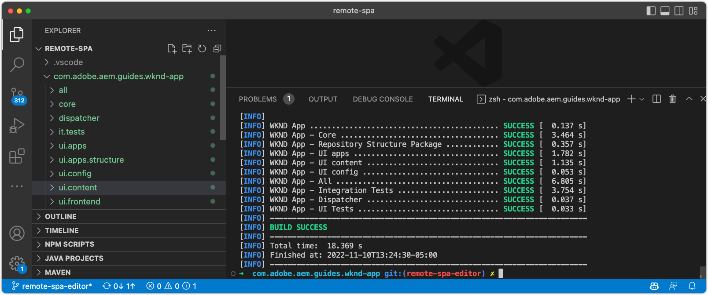

# Configurar o AEM para o editor do SPA

Embora a base de código do SPA seja gerenciada fora do AEM, um projeto do AEM é necessário para configurar requisitos de configuração e conteúdo de suporte. Este capítulo aborda a criação de um projeto AEM que contém as configurações necessárias:

+ Proxies dos Componentes principais do WCM no AEM
+ Proxy da página SPA remota AEM
+ Modelos de página AEM SPA remoto
+ SPA Páginas AEM remotas da linha de base
+ Subprojeto para definir mapeamentos de URL de AEM para SPA
+ Pastas de configuração do OSGi

## Baixar o projeto base no GitHub

Baixe o `aem-guides-wknd-graphql` projeto do Github.com. Ele conterá alguns arquivos de linha de base usados neste projeto.

```
$ mkdir -p ~/Code
$ git clone https://github.com/adobe/aem-guides-wknd-graphql.git
$ cd remote-spa-tutorial
```

## Criar um projeto AEM

Crie um projeto AEM no qual as configurações e o conteúdo da linha de base sejam gerenciados. Este projeto será gerado dentro do `aem-guides-wknd-graphql` do projeto `remote-spa-tutorial` pasta.

_Sempre usar a versão mais recente do [Arquétipo AEM](https://github.com/adobe/aem-project-archetype)._

```
$ cd ~/Code/aem-guides-wknd-graphql/remote-spa-tutorial
$ mvn -B archetype:generate \
 -D archetypeGroupId=com.adobe.aem \
 -D archetypeArtifactId=aem-project-archetype \
 -D archetypeVersion=39 \
 -D aemVersion=cloud \
 -D appTitle="WKND App" \
 -D appId="wknd-app" \
 -D groupId="com.adobe.aem.guides.wkndapp" \
 -D frontendModule="react"
$ mv ~/Code/aem-guides-wknd-graphql/remote-spa-tutorial/wknd-app ~/Code/aem-guides-wknd-graphql/remote-spa-tutorial/com.adobe.aem.guides.wknd-app
```

_O último comando simplesmente renomeia a pasta do projeto AEM para que fique claro que é o projeto AEM, e não deve ser confundido com SPA Remoto__

Enquanto `frontendModule="react"` for especificada, a variável `ui.frontend` O projeto não é usado para o caso de uso de SPA remoto. O SPA é desenvolvido e gerenciado externamente para AEM e só usa o AEM como uma API de conteúdo. A variável `frontendModule="react"` sinalizador é necessário para o projeto incluir o  `spa-project` Dependências de Java™ do AEM e configuração dos Modelos de página do SPA remoto.

O Arquétipo de Projeto AEM gera os seguintes elementos que são usados para configurar o AEM para integração com o SPA.

+ __Proxies dos Componentes principais do WCM no AEM__ em `ui.apps/src/.../apps/wknd-app/components`
+ __AEM SPA Proxy de página remota__ em `ui.apps/src/.../apps/wknd-app/components/remotepage`
+ __Modelos de página AEM__ em `ui.content/src/.../conf/wknd-app/settings/wcm/templates`
+ __Subprojeto para definir mapeamentos de conteúdo__ em `ui.content/src/...`
+ __SPA Páginas AEM remotas da linha de base__ em `ui.content/src/.../content/wknd-app`
+ __Pastas de configuração do OSGi__ em `ui.config/src/.../apps/wknd-app/osgiconfig`

Com a geração do projeto base AEM, alguns ajustes garantem a compatibilidade do Editor de SPA com o SPA remoto.

## Remover projeto ui.frontend

Como o SPA é um SPA remoto, suponha que ele seja desenvolvido e gerenciado fora do projeto AEM. Para evitar conflitos, remova a variável `ui.frontend` implantação do projeto. Se a variável `ui.frontend` não for removido, dois SPA, o SPA por defeito fornecido na variável `ui.frontend` O projeto e o SPA remoto são carregados ao mesmo tempo no editor SPA do AEM do.

1. Abra o projeto AEM (`~/Code/aem-guides-wknd-graphql/remote-spa-tutorial/com.adobe.aem.guides.wknd-app`) no IDE
1. Abra a raiz `pom.xml`
1. Comente o `<module>ui.frontend</module` fora do `<modules>` lista

   ```
   <modules>
       <module>all</module>
       <module>core</module>
   
       <!-- <module>ui.frontend</module> -->
   
       <module>ui.apps</module>
       <module>ui.apps.structure</module>
       <module>ui.config</module>
       <module>ui.content</module>
       <module>it.tests</module>
       <module>dispatcher</module>
       <module>ui.tests</module>
       <module>analyse</module>
   </modules>
   ```

   A variável `pom.xml` O arquivo deve ter a seguinte aparência:

   

1. Abra o `ui.apps/pom.xml`
1. Comente a `<dependency>` em `<artifactId>wknd-app.ui.frontend</artifactId>`

   ```
   <dependencies>
   
       <!-- Remote SPA project will provide all frontend resources
       <dependency>
           <groupId>com.adobe.aem.guides.wkndapp</groupId>
           <artifactId>wknd-app.ui.frontend</artifactId>
           <version>${project.version}</version>
           <type>zip</type>
       </dependency>
       --> 
   </dependencies>
   ```

   A variável `ui.apps/pom.xml` O arquivo deve ter a seguinte aparência:

   

Se o projeto AEM foi criado antes dessas alterações, exclua manualmente a variável `ui.frontend` gerada pela Biblioteca do cliente do `ui.apps` projeto em `ui.apps/src/main/content/jcr_root/apps/wknd-app/clientlibs/clientlib-react`.

## Mapeamento de conteúdo do AEM

Para que o AEM carregue o SPA remoto no Editor de SPA, os mapeamentos entre as rotas do SPA e as Páginas do AEM usadas para abrir e criar conteúdo devem ser estabelecidos.

A importância dessa configuração é explorada posteriormente.

O mapeamento pode ser feito com [Mapeamento do Sling](https://sling.apache.org/documentation/the-sling-engine/mappings-for-resource-resolution.html#root-level-mappings-1) definido em `/etc/map`.

1. No IDE, abra o `ui.content` subprojeto
1. Vá até  `src/main/content/jcr_root`
1. Crie uma pasta `etc`
1. Entrada `etc`, criar uma pasta `map`
1. Entrada `map`, criar uma pasta `http`
1. Entrada `http`, criar um arquivo `.content.xml` pelo conteúdo:

   ```
   <?xml version="1.0" encoding="UTF-8"?>
   <jcr:root xmlns:sling="http://sling.apache.org/jcr/sling/1.0" xmlns:jcr="http://www.jcp.org/jcr/1.0"
       jcr:primaryType="sling:Mapping">
       <localhost_any/>
   </jcr:root>
   ```

1. Entrada `http` , criar uma pasta `localhost_any`
1. Entrada `localhost_any`, criar um arquivo `.content.xml` pelo conteúdo:

   ```
   <?xml version="1.0" encoding="UTF-8"?>
   <jcr:root xmlns:sling="http://sling.apache.org/jcr/sling/1.0" xmlns:jcr="http://www.jcp.org/jcr/1.0"
       jcr:primaryType="sling:Mapping"
       sling:match="localhost\\.\\d+">
       <wknd-app-routes-adventure/>
   </jcr:root>
   ```

1. Entrada `localhost_any` , criar uma pasta `wknd-app-routes-adventure`
1. Entrada `wknd-app-routes-adventure`, criar um arquivo `.content.xml` pelo conteúdo:

   ```
   <?xml version="1.0" encoding="UTF-8"?>
   
   <!--
   The 'wknd-app-routes-adventure' mapping, maps requests to the SPA's adventure route 
   to it's corresponding page in AEM at /content/wknd-app/us/en/home/adventure/xxx.
   
   Note the adventure AEM pages are created directly in AEM.
   -->
   
   <jcr:root xmlns:sling="http://sling.apache.org/jcr/sling/1.0" xmlns:jcr="http://www.jcp.org/jcr/1.0"
       jcr:primaryType="sling:Mapping"
       sling:match="adventure:.*/([^/]+)/?$"
       sling:internalRedirect="/content/wknd-app/us/en/home/adventure/$1"/>
   ```

1. Adicionar os nós de mapeamento a `ui.content/src/main/content/META-INF/vault/filter.xml` incluídos no pacote AEM.

   ```
   <?xml version="1.0" encoding="UTF-8"?>
   <workspaceFilter version="1.0">
       <filter root="/conf/wknd-app" mode="merge"/>
       <filter root="/content/wknd-app" mode="merge"/>
       <filter root="/content/dam/wknd-app/asset.jpg" mode="merge"/>
       <filter root="/content/experience-fragments/wknd-app" mode="merge"/>
   
       <!-- Add the Sling Mapping rules for the WKND App -->
       <filter root="/etc/map" mode="merge"/>
   </workspaceFilter>
   ```

A estrutura de pastas e `.context.xml` os arquivos devem ter a seguinte aparência:


A variável `filter.xml` O arquivo deve ter a seguinte aparência:


Agora, quando o projeto AEM é implantado, essas configurações são incluídas automaticamente.

O Sling Mapping afeta o AEM em execução `http` e `localhost`Portanto, apenas apoiam o desenvolvimento local. Ao implantar no AEM as a Cloud Service, mapeamentos Sling semelhantes devem ser adicionados a esse destino `https` e o(s) domínio(s) as a Cloud Service(s) apropriado(s) do AEM. Para obter mais informações, consulte [Documentação de mapeamento do Sling](https://sling.apache.org/documentation/the-sling-engine/mappings-for-resource-resolution.html).

## Políticas de segurança do Compartilhamento de recursos entre origens

Em seguida, configure o AEM para proteger o conteúdo para que somente esse SPA possa acessar o conteúdo do AEM. Configurar [Compartilhamento de recursos entre origens no AEM](https://experienceleague.adobe.com/docs/experience-manager-learn/foundation/security/develop-for-cross-origin-resource-sharing.html).

1. No IDE, abra o `ui.config` Subprojeto Maven
1. Navegar `src/main/content/jcr_root/apps/wknd-app/osgiconfig/config`
1. Crie um arquivo chamado `com.adobe.granite.cors.impl.CORSPolicyImpl~wknd-app_remote-spa.cfg.json`
1. Adicione o seguinte ao arquivo:

   ```
   {
       "supportscredentials":true,
       "exposedheaders":[
           ""
       ],
       "supportedmethods":[
           "GET",
           "HEAD",
           "POST",
           "OPTIONS"
       ],
       "alloworigin":[
           "https://external-hosted-app", "localhost:3000"
       ],
       "maxage:Integer":1800,
       "alloworiginregexp":[
           ".*"
       ],
       "allowedpaths":[
           ".*"
       ],
       "supportedheaders":[
           "Origin",
           "Accept",
           "X-Requested-With",
           "Content-Type",
           "Access-Control-Request-Method",
           "Access-Control-Request-Headers",
           "authorization"
       ]
   }
   ```

A variável `com.adobe.granite.cors.impl.CORSPolicyImpl~wknd-app_remote-spa.cfg.json` O arquivo deve ter a seguinte aparência:


Os principais elementos de configuração são:

+ `alloworigin` especifica quais hosts têm permissão para recuperar conteúdo de AEM.
   + `localhost:3000` é adicionado para suportar o SPA executado localmente
   + `https://external-hosted-app` O atua como um espaço reservado a ser substituído pelo domínio em que o SPA remoto está hospedado.
+ `allowedpaths` especifique quais caminhos no AEM são cobertos por essa configuração do CORS. O padrão permite o acesso a todo o conteúdo no AEM, no entanto, isso pode ser direcionado somente para os caminhos específicos que o SPA pode acessar, por exemplo: `/content/wknd-app`.

## Definir página AEM como modelo de página SPA remota

O Arquétipo de Projeto AEM gera um projeto primário para integração de AEM com um SPA remoto, mas requer um pequeno, mas importante ajuste para a estrutura de página de AEM gerada automaticamente. A página AEM gerada automaticamente deve ter seu tipo alterado para __Página remota do SPA__, em vez de um __página SPA__.

1. No IDE, abra o `ui.content` subprojeto
1. Abrir para `src/main/content/jcr_root/content/wknd-app/us/en/home/.content.xml`
1. Atualizar isto `.content.xml` arquivo com:

   ```
   <?xml version="1.0" encoding="UTF-8"?>
   <jcr:root xmlns:sling="http://sling.apache.org/jcr/sling/1.0" xmlns:cq="http://www.day.com/jcr/cq/1.0" xmlns:jcr="http://www.jcp.org/jcr/1.0" xmlns:nt="http://www.jcp.org/jcr/nt/1.0"
           jcr:primaryType="cq:Page">
       <jcr:content
           cq:template="/conf/wknd-app/settings/wcm/templates/spa-remote-page"
           jcr:primaryType="cq:PageContent"
           jcr:title="WKND App Home Page"
           sling:resourceType="wknd-app/components/remotepage">
           <root
               jcr:primaryType="nt:unstructured"
               sling:resourceType="wcm/foundation/components/responsivegrid">
               <responsivegrid
                   jcr:primaryType="nt:unstructured"
                   sling:resourceType="wcm/foundation/components/responsivegrid">
                   <text
                       jcr:primaryType="nt:unstructured"
                       sling:resourceType="wknd-app/components/text"
                       text="&lt;p>Hello World!&lt;/p>"
                       textIsRich="true">
                       <cq:responsive jcr:primaryType="nt:unstructured"/>
                   </text>
               </responsivegrid>
           </root>
       </jcr:content>
   </jcr:root>
   ```

As principais alterações são atualizações na `jcr:content` do nó:

+ `cq:template` para `/conf/wknd-app/settings/wcm/templates/spa-remote-page`
+ `sling:resourceType` para `wknd-app/components/remotepage`

A variável `src/main/content/jcr_root/content/wknd-app/us/en/home/.content.xml` O arquivo deve ter a seguinte aparência:


Essas alterações permitem que esta página, que atua como a raiz do SPA no AEM, carregue o SPA remoto no editor do SPA.

>[!NOTE]
>
>Se esse projeto foi implantado anteriormente no AEM, exclua a página AEM como __Sites > Aplicativo WKND > br > pt > Página inicial do aplicativo WKND__, como a `ui.content`  o projeto está definido como __mesclar__ nós, em vez __atualizar__.

Essa página também pode ser removida e recriada como uma página do SPA remoto no próprio AEM, no entanto, como essa página é criada automaticamente na `ui.content` projeto é melhor atualizá-lo na base de código.

## Implantar o projeto AEM no AEM SDK

1. Verifique se o serviço do Autor do AEM está em execução na porta 4502
1. Na linha de comando, navegue até a raiz do projeto Maven para AEM
1. Use o Maven para implantar o projeto no serviço de autor do SDK do AEM local

   ```
   $ mvn clean install -PautoInstallSinglePackage
   ```

   

## Configurar a página raiz do AEM

Com o Projeto AEM implantado, há um último passo para preparar o Editor de SPA para carregar nosso SPA remoto. No AEM, marque a página AEM que corresponde à raiz do SPA,`/content/wknd-app/us/en/home`, gerado pelo Arquétipo de projeto AEM.

1. Faça logon no AEM Author
1. Navegue até __Sites > Aplicativo WKND > br > pt-BR__
1. Selecione o __Página inicial do aplicativo WKND__ e toque em __Propriedades__

   

1. Navegue até a __SPA__ guia
1. Preencha o __Configuração remota do SPA__
   + __URL de host do SPA__: `http://localhost:3000`
      + O URL para a raiz do SPA remoto

   

1. Toque __Salvar e fechar__

Lembre-se de que alteramos o tipo desta página para o tipo de página __Página remota do SPA__, que é o que nos permite ver a __SPA__ em sua __Propriedades da página__.

Essa configuração só deve ser definida na página do AEM que corresponde à raiz do SPA. Todas as páginas AEM abaixo dessa página herdam o valor.

## Parabéns

Agora você preparou configurações do AEM e as implantou no autor local do AEM! Agora você sabe como:

+ Remova o SPA gerado pelo Arquétipo de Projeto AEM, comentando as dependências em `ui.frontend`
+ Adicionar mapeamentos Sling ao AEM que mapeiam as rotas SPA para recursos no AEM
+ Configurar políticas de segurança de compartilhamento de recursos entre origens do AEM que permitem que o SPA remoto consuma conteúdo do AEM
+ Implantar o projeto AEM no serviço de autor do SDK do AEM local
+ Marcar uma página AEM como a raiz de SPA remota usando a propriedade de página do URL do host do SPA

## Próximas etapas

Com o AEM configurado, podemos nos concentrar no [inicialização do SPA remoto](./spa-bootstrap.md) AEM com suporte para áreas editáveis usando o SPA Editor!
