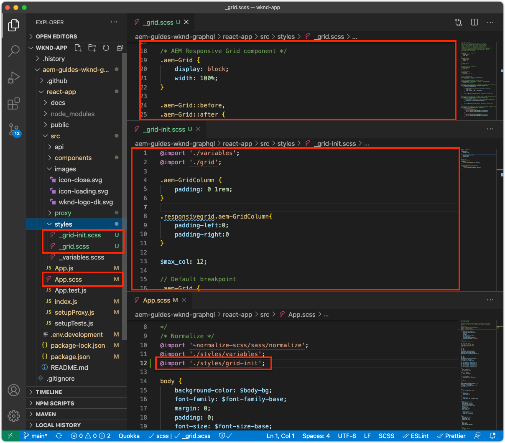
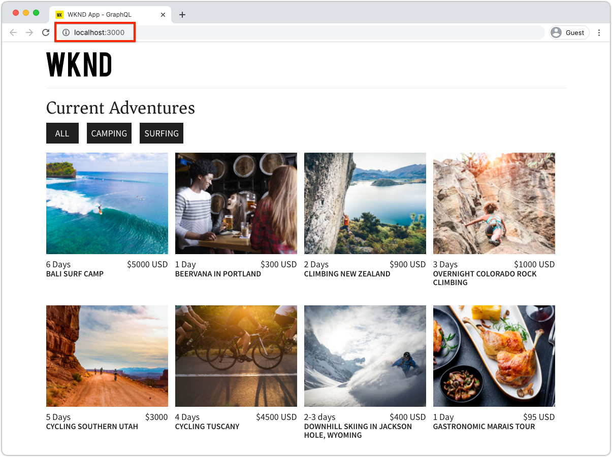

# Bootstrap do SPA Remoto para SPA Editor

Antes que as áreas editáveis possam ser adicionadas ao SPA Remoto, ele deve ser inicializado com o SDK do JavaScript do Editor de SPA AEM e algumas outras configurações.

## Adicionar AEM SPA Editor JS SDK dependências npm

Primeiro, adicione AEM dependências SPA npm ao projeto React .

```
$ cd ~/Code/wknd-app/aem-guides-wknd-graphql/react-app
$ npm install --save \
    @adobe/aem-spa-page-model-manager \
    @adobe/aem-spa-component-mapping \
    @adobe/aem-react-editable-components \
    @adobe/aem-core-components-react-base \
    @adobe/aem-core-components-react-spa
```

+ `@adobe/aem-spa-page-model-manager` fornece a API para recuperar conteúdo do AEM.
+ `@adobe/aem-spa-component-mapping` O fornece a API que mapeia AEM conteúdo para SPA componentes.
+ ` @adobe/aem-react-editable-components` O fornece uma API para criar componentes de SPA personalizados e fornece implementações de uso comum, como o componente  `AEMPage` React .
+ `@adobe/aem-core-components-react-base` O fornece um conjunto de componentes React prontos para uso que se integram perfeitamente aos Componentes principais do WCM AEM e são agnósticos SPA Editor. Eles incluem principalmente componentes de conteúdo, como:
   + Título
   + Texto
   + Navegações estruturais
   + E assim por diante.
+ `@adobe/aem-core-components-react-spa` O fornece um conjunto de componentes React prontos para uso que se integram perfeitamente aos Componentes principais do WCM AEM e exigem SPA Editor. Eles contêm principalmente componentes que contêm componentes de conteúdo de `@adobe/aem-core-components-react-base`, como:
   + Container
   + Carrossel
   + e assim por diante.

## Analisar SPA variáveis de ambiente

Várias variáveis de ambiente devem ser expostas ao SPA remoto para que ele saiba como interagir com o AEM.

1. Abra o projeto do SPA remoto em `~/Code/wknd-app/aem-guides-wknd-graphql/react-app` no IDE
1. Abra o arquivo `.env.development`
1. Adicione o arquivo , prestando atenção específica às chaves:

   ```
   REACT_APP_HOST_URI=http://localhost:4502
   REACT_APP_AUTHORIZATION=admin:admin
   ```

   

   *Lembre-se de que as variáveis de ambiente personalizadas no React devem ter o prefixo  `REACT_APP_`.*

   + `REACT_APP_AEM_URI`: o esquema e o host do serviço de AEM ao qual o SPA remoto se conecta.
      + Esse valor muda com base no ambiente de AEM (local, desenvolvimento, estágio ou produção) e no tipo de Serviço de AEM (autor vs. publicação)
   + `REACT_APP_AEM_AUTH`: as credenciais usadas pelo SPA são autenticadas para AEM e recuperar o conteúdo.
      + Obrigatório para uso com o AEM Author
      + Possivelmente necessário para usar com a publicação do AEM (se o conteúdo estiver protegido)
      + O desenvolvimento no SDK do AEM é compatível com contas locais por meio da autenticação básica. Este é o método usado neste tutorial.
      + Ao integrar com AEM como um Cloud Service, use [tokens de acesso](https://experienceleague.adobe.com/docs/experience-manager-learn/getting-started-with-aem-headless/authentication/overview.html)

## Integrar a API do ModelManager

Com as AEM dependências SPA npm disponíveis para o aplicativo, inicialize AEM `ModelManager` no `index.js` do projeto antes de `ReactDOM.render(...)` ser chamado.

O [ModelManager](https://www.npmjs.com/package/@adobe/aem-spa-page-model-manager) é responsável por se conectar ao AEM para recuperar conteúdo editável.

1. Abra o projeto do SPA remoto no IDE
1. Abra o arquivo `src/index.js`
1. Adicione import `ModelManager` e inicialize-o antes da invocação `ReactDOM.render(..)`,

   ```
   ...
   import { ModelManager } from "@adobe/aem-spa-page-model-manager";
   
   // Initialize the ModelManager before invoking ReactDOM.render(...).
   ModelManager.initializeAsync();
   
   ReactDOM.render(...);
   ```

O arquivo `src/index.js` deve ter a seguinte aparência:


## Configurar um proxy de SPA interno

Ao obter conteúdo editável do AEM no SPA, é melhor configurar um [proxy interno no SPA](https://create-react-app.dev/docs/proxying-api-requests-in-development/#configuring-the-proxy-manually), que esteja configurado para rotear as solicitações apropriadas para AEM. Isso é feito usando o módulo [http-proxy-middleware](https://www.npmjs.com/package/http-proxy-middleware) npm, que já está instalado pelo aplicativo GraphQL WKND base.

1. Abra o projeto do SPA remoto no IDE
1. Crie um arquivo em `src/proxy/setupProxy.spa-editor.auth.basic.js`
1. Adicione o seguinte código ao arquivo:

   ```
   const { createProxyMiddleware } = require('http-proxy-middleware');
   const {REACT_APP_HOST_URI, REACT_APP_AUTHORIZATION } = process.env;
   
   /*
       Set up a proxy with AEM for local development
       In a production environment this proxy should be set up at the webserver level or absolute URLs should be used.
   */
   module.exports = function(app) {
   
       /**
       * Filter to check if the request should be re-routed to AEM. The paths to be re-routed at:
       * - Starts with /content (AEM content)
       * - Starts with /graphql (AEM graphQL endpoint)
       * - Ends with .model.json (AEM Content Services)
       * 
       * @param {*} path the path being requested of the SPA
       * @param {*} req the request object
       * @returns true if the SPA request should be re-routed to AEM
       */
       const toAEM = function(path, req) {
           return path.startsWith('/content') || 
               path.startsWith('/graphq') ||
               path.endsWith('.model.json')
       }
   
       /**
       * Re-writes URLs being proxied to AEM such that they can resolve to real AEM resources
       * - The "root" case of `/.model.json` are rewritten to the SPA's home page in AEM
       * - .model.json requests for /adventure:xxx routes are rewritten to their corresponding adventure page under /content/wknd-app/us/en/home/adventure/ 
       * 
       * @param {*} path the path being requested of the SPA
       * @param {*} req the request object
       * @returns returns a re-written path, or nothing to use the @param path
       */
       const pathRewriteToAEM = function (path, req) { 
           if (path === '/.model.json') {
               return '/content/wknd-app/us/en/home.model.json';
           } else if (path.startsWith('/adventure:') && path.endsWith('.model.json')) {
               return '/content/wknd-app/us/en/home/adventure/' + path.split('/').pop();
           }    
       }
   
       /**
       * Register the proxy middleware using the toAEM filter and pathRewriteToAEM rewriter 
       */
       app.use(
           createProxyMiddleware(
               toAEM, // Only route the configured requests to AEM
               {
                   target: REACT_APP_HOST_URI,
                   changeOrigin: true,
                   // Pass in credentials when developing against an Author environment
                   auth: REACT_APP_AUTHORIZATION,
                   pathRewrite: pathRewriteToAEM // Rewrite SPA paths being sent to AEM
               }
           )
       );
   
       /**
       * Enable CORS on requests from the SPA to AEM
       * 
       * If this rule is not in place, CORS errors will occur when running the SPA on http://localhost:3000
       */
       app.use((req, res, next) => {
           res.header("Access-Control-Allow-Origin", REACT_APP_HOST_URI);
           next();
       });
   };
   ```

   O arquivo `setupProxy.spa-editor.auth.basic.js` deve ter a seguinte aparência:

   

   Essa configuração de proxy faz duas coisas principais:

   1. Solicitações específicas de proxy feitas ao SPA, `http://localhost:3000` para AEM `http://localhost:4502`
      + Somente proxies cujos caminhos correspondem a padrões que indicam que devem ser atendidos por AEM, conforme definido em `toAEM(path, req)`.
      + Ele regrava SPA caminhos para suas páginas de AEM de contrapartida, conforme definido em `pathRewriteToAEM(path, req)`
   1. Ele adiciona cabeçalhos CORS a todas as solicitações para permitir acesso a conteúdo AEM, conforme definido por `res.header("Access-Control-Allow-Origin", REACT_APP_HOST_URI);`
      + Se isso não for adicionado, ocorrerão erros de CORS ao carregar AEM conteúdo no SPA.

1. Abra o arquivo `src/setupProxy.js`
1. Comente a linha `const proxy = require('./proxy/setupProxy.auth.basic')`
1. Adicione uma linha, apontando para o novo arquivo de configuração de proxy:

   ```
   // Proxy configuration for SPA Editor (and GraphQL) using Basic Auth
   const proxy = require('./proxy/setupProxy.spa-editor.auth.basic')
   ```

   O arquivo `setupProxy.js` deve ter a seguinte aparência:

   

Observe que qualquer alteração no `src/setupProxy.js` ou nos arquivos referenciados requer uma reinicialização do SPA.

## Recurso de SPA estático

Os recursos de SPA estáticos, como o logotipo WKND e os gráficos de carregamento, precisam ter seus URLs src atualizados para forçar o carregamento deles a partir do host de SPA Remoto. Se permanecer relativo, quando o SPA é carregado SPA Editor para criação, esses URLs assumem o padrão de usar AEM host em vez do SPA, resultando em 404 solicitações, conforme ilustrado na imagem abaixo.


Para resolver esse problema, faça com que um recurso estático hospedado pelo SPA Remoto use caminhos absolutos que incluem a origem do SPA Remoto.

1. Abra o SPA projeto no IDE
1. Abra o arquivo de variáveis de ambiente SPA `src/.env.development` e adicione uma variável para o URI público SPA:

   ```
   ...
   # The base URI the SPA is accessed from
   REACT_APP_PUBLIC_URI=http://localhost:3000
   ```

   _Ao implantar o AEM como um Cloud Service, é necessário fazer o mesmo para os  `.env` arquivos correspondentes._

1. Abra o arquivo `src/App.js`
1. Importe o URI público SPA das variáveis de ambiente SPA

   ```
   const {  REACT_APP_PUBLIC_URI } = process.env;
   
   function App() { ... }
   ```

1. Coloque o logotipo WKND `` no prefixo `REACT_APP_PUBLIC_URI` para forçar a resolução contra o SPA.

   ```
   
   ```

1. Faça o mesmo para carregar a imagem em `src/components/Loading.js`

   ```
   const { REACT_APP_PUBLIC_URI } = process.env;
   
   class Loading extends Component {
   
       render() {
           return (<div className="loading">
               
           </div>);
       }
   }
   ```

1. ... e para __duas instâncias__ do botão voltar em `src/components/AdventureDetails.js`

   ```
   const { REACT_APP_PUBLIC_URI } = process.env;
   
   function AdventureDetail(props) {
       ...
       render() {
           
       }
   }
   ```

Os arquivos `App.js`, `Loading.js` e `AdventureDetails.js` devem ter a seguinte aparência:


## Grade responsiva de AEM

Para oferecer suporte SPA modo de layout do Editor para áreas editáveis no SPA, é necessário integrar AEM CSS de Grade Responsiva no SPA. Não se preocupe - esse sistema de grade será enviado apenas para os contêineres editáveis e você poderá usar seu sistema de grade preferido para direcionar o layout do resto da SPA.

Adicione os arquivos AEM Responsive Grid SCSS ao SPA.

1. Abra o SPA projeto no IDE
1. Baixe e copie os dois arquivos a seguir em `src/styles`
   + [_grid.scss](./assets/spa-bootstrap/_grid.scss)
      + Gerador SCSS de Grade Responsiva de AEM
   + [_grid-init.scss](./assets/spa-bootstrap/_grid.scss)
      + Chama `_grid.scss` usando os pontos de interrupção específicos SPA (desktop e dispositivos móveis) e as colunas (12).
1. Abra `src/App.scss` e importe `./styles/grid-init.scss`

   ```
   ...
   @import './styles/grid-init';
   ...
   ```

Os arquivos `_grid.scss` e `_grid-init.scss` devem ter a seguinte aparência:



Agora, o SPA inclui o CSS necessário para oferecer suporte AEM modo de layout para componentes adicionados a um contêiner de AEM.

## Inicie o SPA

Agora que o SPA foi inicializado para integração com AEM, vamos executar o SPA e ver como ele é!

1. Na linha de comando, navegue até a raiz do projeto de SPA
1. Inicie o SPA usando os comandos normais (execute `npm install` se ainda não tiver executado)

   ```
   $ cd ~/Code/wknd-app/aem-guides-wknd-graphql/react-app
   $ npm install 
   $ npm run start
   ```

1. Navegue pelo SPA em [http://localhost:3000](http://localhost:3000). Tudo deve ficar bem!



## Abra o SPA no AEM Editor SPA

Com a SPA em execução em [http://localhost:3000](http://localhost:3000), vamos abri-la usando AEM Editor SPA. Ainda não é editável no SPA, isso só valida o SPA no AEM.

1. Faça logon no AEM Author
1. Navegue até __Sites > Aplicativo WKND > us > en__
1. Selecione a __Página Inicial do Aplicativo WKND__ e toque em __Editar__, e a SPA será exibida.

   

1. Alterne para __Visualizar__ usando o alternador de modo no canto superior direito
1. Clique em volta da SPA

   

## Parabéns!

Você inicializou o SPA Remoto para ser AEM compatível SPA Editor! Agora você sabe como:

+ Adicionar as dependências do AEM SPA Editor JS SDK do npm ao projeto SPA
+ Configurar as variáveis de ambiente do SPA
+ Integre a API do ModelManager ao SPA
+ Configure um proxy interno para o SPA, para que ele roteie as solicitações de conteúdo apropriadas para o AEM
+ Solucionar problemas com recursos de SPA estáticos que são resolvidos no contexto do SPA Editor
+ Adicionar AEM CSS de Grade Responsiva para suportar o layout em contêineres editáveis AEM

## Próximas etapas

Agora que atingimos uma linha de base de compatibilidade com AEM Editor de SPA, podemos começar a introduzir áreas editáveis. Primeiro, observaremos como colocar um [componente editável fixo](./spa-fixed-component.md) no SPA.
