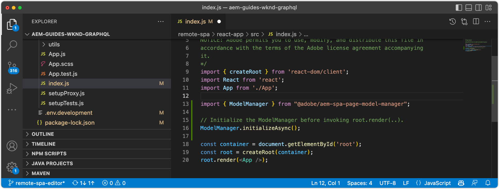

# Bootstrap do SPA remoto para o editor SPA

Antes de ser possível adicionar as áreas editáveis ao SPA AEM remoto, ele deve ser inicializado com o SDK JavaScript do editor do SPA e algumas outras configurações.

## AEM Instalar dependências npm do editor JS do SPA

Primeiro, analise as dependências do SPA AEM npm para o projeto React e instale-as.

+ [`@adobe/aem-spa-page-model-manager`](https://github.com/adobe/aem-spa-page-model-manager) : fornece a API para recuperar conteúdo do AEM.
+ [`@adobe/aem-spa-component-mapping`](https://github.com/adobe/aem-spa-component-mapping) : fornece a API que mapeia o conteúdo de AEM para componentes SPA.
+ [`@adobe/aem-react-editable-components` v2](https://github.com/adobe/aem-react-editable-components) : fornece uma API para a criação de componentes personalizados de SPA e fornece implementações de uso comum, como a `AEMPage` Componente do React.

```shell
$ cd ~/Code/aem-guides-wknd-graphql/remote-spa-tutorial/react-app
$ npm install @adobe/aem-spa-page-model-manager 
$ npm install @adobe/aem-spa-component-mapping
$ npm install @adobe/aem-react-editable-components 
```

## Revisar variáveis de ambiente do SPA

Várias variáveis de ambiente devem ser expostas ao SPA remoto para que ele saiba como interagir com AEM.

1. Abrir projeto do SPA remoto em `~/Code/aem-guides-wknd-graphql/remote-spa-tutorial/react-app` no IDE
1. Abra o arquivo `.env.development`
1. No arquivo, preste atenção específica às chaves e atualize conforme necessário:

   ```
   REACT_APP_HOST_URI=http://localhost:4502
   
   REACT_APP_USE_PROXY=true
   
   REACT_APP_AUTH_METHOD=basic
   
   REACT_APP_BASIC_AUTH_USER=admin
   REACT_APP_BASIC_AUTH_PASS=admin
   ```

   

   *Lembre-se de que as variáveis de ambiente personalizadas no React devem receber o prefixo `REACT_APP_`.*

   + `REACT_APP_HOST_URI`: o esquema e o host do serviço AEM ao qual o SPA remoto se conecta.
      + Esse valor muda com base no tipo de serviço AEM (local, Desenvolvimento, Preparo ou Produção) e AEM (Autor vs. Publicação)
   + `REACT_APP_USE_PROXY`: evita problemas do CORS durante o desenvolvimento, informando o servidor de desenvolvimento de reação para solicitações de AEM de proxy, como `/content, /graphql, .model.json` usar `http-proxy-middleware` módulo.
   + `REACT_APP_AUTH_METHOD`: método de autenticação para solicitações enviadas pelo AEM, as opções são &quot;service-token&quot;, &quot;dev-token&quot;, &quot;basic&quot; ou deixe em branco para caso de uso sem autenticação
      + Obrigatório para uso com o AEM Author
      + Possivelmente necessário para uso com AEM Publish (se o conteúdo estiver protegido)
      + O desenvolvimento em relação ao SDK do AEM é compatível com contas locais via Autenticação básica. Este é o método usado neste tutorial.
      + Ao integrar com o AEM as a Cloud Service, use [tokens de acesso](https://experienceleague.adobe.com/docs/experience-manager-learn/getting-started-with-aem-headless/authentication/overview.html)
   + `REACT_APP_BASIC_AUTH_USER`: o AEM __nome de usuário__ pelo SPA para autenticar ao recuperar o conteúdo do AEM.
   + `REACT_APP_BASIC_AUTH_PASS`: o AEM __senha__ pelo SPA para autenticar ao recuperar o conteúdo do AEM.

## Integrar a API ModelManager

AEM Com as dependências SPA npm disponíveis para o aplicativo, inicialize o AEM `ModelManager` no do projeto `index.js` antes `ReactDOM.render(...)` é chamado.

A variável [ModelManager](https://github.com/adobe/aem-spa-page-model-manager/blob/master/src/ModelManager.ts) O é responsável pela conexão com o AEM para recuperar o conteúdo editável.

1. Abra o projeto do SPA remoto no IDE
1. Abra o arquivo `src/index.js`
1. Adicionar importação `ModelManager` e inicializá-la antes da variável `root.render(..)` invocação,

   ```javascript
   ...
   import { ModelManager } from "@adobe/aem-spa-page-model-manager";
   
   // Initialize the ModelManager before invoking root.render(..).
   ModelManager.initializeAsync();
   
   const container = document.getElementById('root');
   const root = createRoot(container);
   root.render(<App />);
   ```

A variável `src/index.js` O arquivo deve ter a seguinte aparência:



## Configurar um proxy SPA interno

Ao criar um SPA editável, é melhor configurar um [proxy interno no SPA](https://create-react-app.dev/docs/proxying-api-requests-in-development/#configuring-the-proxy-manually), que é configurado para encaminhar as solicitações apropriadas ao AEM. Isso é feito usando [http-proxy-middleware](https://www.npmjs.com/package/http-proxy-middleware) Módulo npm, que já foi instalado pelo aplicativo WKND GraphQL base.

1. Abra o projeto do SPA remoto no IDE
1. Abra o arquivo em `src/proxy/setupProxy.spa-editor.auth.basic.js`
1. Atualize o arquivo com o seguinte código:

   ```javascript
   const { createProxyMiddleware } = require('http-proxy-middleware');
   const {REACT_APP_HOST_URI, REACT_APP_BASIC_AUTH_USER, REACT_APP_BASIC_AUTH_PASS } = process.env;
   
   /*
       Set up a proxy with AEM for local development
       In a production environment this proxy should be set up at the webserver level or absolute URLs should be used.
   */
   module.exports = function(app) {
   
       /**
       * Filter to check if the request should be re-routed to AEM. The paths to be re-routed at:
       * - Starts with /content (AEM content)
       * - Starts with /graphql (AEM graphQL endpoint)
       * - Ends with .model.json (AEM Content Services)
       * 
       * @param {*} path the path being requested of the SPA
       * @param {*} req the request object
       * @returns true if the SPA request should be re-routed to AEM
       */
       const toAEM = function(path, req) {
           return path.startsWith('/content') || 
               path.startsWith('/graphql') ||
               path.endsWith('.model.json')
       }
   
       /**
       * Re-writes URLs being proxied to AEM such that they can resolve to real AEM resources
       * - The "root" case of `/.model.json` are rewritten to the SPA's home page in AEM
       * - .model.json requests for /adventure:xxx routes are rewritten to their corresponding adventure page under /content/wknd-app/us/en/home/adventure/ 
       * 
       * @param {*} path the path being requested of the SPA
       * @param {*} req the request object
       * @returns returns a re-written path, or nothing to use the @param path
       */
       const pathRewriteToAEM = function (path, req) { 
           if (path === '/.model.json') {
               return '/content/wknd-app/us/en/home.model.json';
           } else if (path.startsWith('/adventure/') && path.endsWith('.model.json')) {
               return '/content/wknd-app/us/en/home/adventure/' + path.split('/').pop();
           }    
       }
   
       /**
       * Register the proxy middleware using the toAEM filter and pathRewriteToAEM rewriter 
       */
       app.use(
           createProxyMiddleware(
               toAEM, // Only route the configured requests to AEM
               {
                   target: REACT_APP_HOST_URI,
                   changeOrigin: true,
                   // Pass in credentials when developing against an Author environment
                   auth: `${REACT_APP_BASIC_AUTH_USER}:${REACT_APP_BASIC_AUTH_PASS}`,
                   pathRewrite: pathRewriteToAEM // Rewrite SPA paths being sent to AEM
               }
           )
       );
   
       /**
       * Enable CORS on requests from the SPA to AEM
       * 
       * If this rule is not in place, CORS errors will occur when running the SPA on http://localhost:3000
       */
       app.use((req, res, next) => {
           res.header("Access-Control-Allow-Origin", REACT_APP_HOST_URI);
           next();
       });
   };
   ```

   A variável `setupProxy.spa-editor.auth.basic.js` O arquivo deve ter a seguinte aparência:

   

   Essa configuração de proxy faz duas coisas principais:

   1. Solicitações específicas de proxy feitas ao SPA (`http://localhost:3000`) para AEM `http://localhost:4502`
      + Somente as solicitações de proxy cujos caminhos correspondem aos padrões que indicam que devem ser atendidas pelo AEM, conforme definido em `toAEM(path, req)`.
      + Ele reescreve os caminhos do SPA para suas páginas correspondentes do AEM, conforme definido em `pathRewriteToAEM(path, req)`
   1. Ele adiciona cabeçalhos CORS a todas as solicitações para permitir o acesso a conteúdo AEM, conforme definido por `res.header("Access-Control-Allow-Origin", REACT_APP_HOST_URI);`
      + Se isso não for adicionado, erros do CORS ocorrem ao carregar o conteúdo de AEM no SPA.

1. Abra o arquivo `src/setupProxy.js`
1. Revise a linha que aponta para a `setupProxy.spa-editor.auth.basic` arquivo de configuração de proxy:

   ```
   ...
   case BASIC:
   // Use user/pass for local development with Local Author Env
   return require('./proxy/setupProxy.spa-editor.auth.basic');
   ...
   ```

Observe que qualquer alteração no `src/setupProxy.js` ou seus arquivos referenciados exigem uma reinicialização do SPA.

## Recurso estático de SPA

Os recursos estáticos de SPA, como o Logotipo WKND e o Carregamento de gráficos, precisam ter seus URLs src atualizados para forçá-los a serem carregados do host remoto SPA. Se relativo, quando o SPA é carregado no Editor SPA para criação, esses URLs assumem como padrão o uso do host do AEM SPA em vez do, resultando em 404 solicitações, conforme ilustrado na imagem abaixo.


Para resolver esse problema, faça com que um recurso estático hospedado pelo SPA remoto use caminhos absolutos que incluem a origem SPA remoto.

1. Abra o projeto SPA no IDE
1. Abra o arquivo de variáveis de ambiente do SPA `src/.env.development` e adicione uma variável para o URI público do SPA:

   ```
   ...
   # The base URI the SPA is accessed from
   REACT_APP_PUBLIC_URI=http://localhost:3000
   ```

   _Ao implantar no AEM as a Cloud Service, é necessário fazer o mesmo para o correspondente `.env` arquivos._

1. Abra o arquivo `src/App.js`
1. Importar o URI público do SPA das variáveis de ambiente SPA

   ```javascript
   const {  REACT_APP_PUBLIC_URI } = process.env;
   
   function App() { ... }
   ```

1. Prefixe o logotipo WKND `` com `REACT_APP_PUBLIC_URI` para forçar a resolução contra o SPA.

   ```html
   
   ```

1. Faça o mesmo para carregar a imagem no `src/components/Loading.js`

   ```javascript
   const { REACT_APP_PUBLIC_URI } = process.env;
   
   class Loading extends Component {
   
       render() {
           return (<div className="loading">
               
           </div>);
       }
   }
   ```

1. E para o __duas instâncias__ do botão Voltar em `src/components/AdventureDetails.js`

   ```javascript
   const { REACT_APP_PUBLIC_URI } = process.env;
   
   function AdventureDetail(props) {
       ...
       render() {
           
       }
   }
   ```

A variável `App.js`, `Loading.js`, e `AdventureDetails.js` os arquivos devem ter a seguinte aparência:


## Grade responsiva AEM

Para dar suporte ao modo de layout do Editor de SPA para áreas editáveis no SPA, devemos integrar o CSS de grade responsiva AEM no SPA. Não se preocupe - esse sistema de grade é aplicável apenas aos contêineres editáveis e você pode usar o sistema de grade de sua escolha para direcionar o layout do restante do SPA.

Adicione os arquivos AEM Responsive Grid SCSS ao SPA.

1. Abra o projeto SPA no IDE
1. Baixe e copie os dois arquivos a seguir em `src/styles`
   + [_grid.scss](./assets/spa-bootstrap/_grid.scss)
      + O gerador de SCSS da grade responsiva AEM
   + [_grid-init.scss](./assets/spa-bootstrap/_grid-init.scss)
      + Chamadas `_grid.scss` utilização dos pontos de interrupção específicos do SPA (computadores de secretária e dispositivos móveis) e das colunas (12).
1. Abertura `src/App.scss` e importar `./styles/grid-init.scss`

   ```scss
   ...
   @import './styles/grid-init';
   ...
   ```

A variável `_grid.scss` e `_grid-init.scss` os arquivos devem ter a seguinte aparência:


Agora, o SPA inclui o CSS necessário para oferecer suporte ao Modo de layout AEM para componentes adicionados a um contêiner AEM.

## Classes de utilitário

Copie as seguintes classes de utilitários no projeto de aplicativo React.

+ [RoutedLink.js](./assets/spa-bootstrap/RoutedLink.js) para `~/Code/aem-guides-wknd-graphql/remote-spa-tutorial/react-app/src/components/editable/core/RoutedLink.js`
+ [EditorPlaceholder.js](./assets/spa-bootstrap/EditorPlaceholder.js) para `~/Code/aem-guides-wknd-graphql/remote-spa-tutorial/react-app/src/components/editable/core/util/EditorPlaceholder.js`
+ [withConditionalPlaceholder.js](./assets/spa-bootstrap/withConditionalPlaceholder.js) para `~/Code/aem-guides-wknd-graphql/remote-spa-tutorial/react-app/src/components/editable/core/util/withConditionalPlaceholder.js`
+ [withStandardBaseCssClass.js](./assets/spa-bootstrap/withStandardBaseCssClass.js) para `~/Code/aem-guides-wknd-graphql/remote-spa-tutorial/react-app/src/components/editable/core/util/withStandardBaseCssClass.js`


## Iniciar o SPA

Agora que o SPA está bootstrapped para integração com AEM, vamos executar o SPA e ver como ele se parece!

1. Na linha de comando, navegue até a raiz do projeto SPA
1. Inicie o SPA usando os comandos normais (se você ainda não tiver feito isso)

   ```shell
   $ cd ~/Code/aem-guides-wknd-graphql/remote-spa-tutorial/react-app
   $ npm install 
   $ npm run start
   ```

1. Navegue pelo SPA [http://localhost:3000](http://localhost:3000). Tudo deve ficar bem!


## Abrir o SPA no Editor SPA do AEM

Com o SPA ligado [http://localhost:3000](http://localhost:3000), vamos abri-lo usando o Editor SPA AEM. Nada é editável no SPA ainda, isso só valida o SPA no AEM.

1. Faça logon no AEM Author
1. Navegue até __Sites > Aplicativo WKND > br > pt-BR__
1. Selecione o __Página inicial do aplicativo WKND__ e toque em __Editar__, e o SPA aparece.

   

1. Alternar para __Visualizar__ utilização do alternador de modo no canto superior direito
1. Clique ao redor do SPA

   

## Parabéns.

Você inicializou o SPA remoto para ser compatível com o Editor de SPA do AEM! Agora você sabe como:

+ Adicionar as dependências npm do SDK JS do SPA AEM Editor do ao projeto SPA
+ Configurar as variáveis de ambiente do SPA
+ Integrar a API ModelManager ao SPA
+ Configurar um proxy interno do SPA para que ele encaminhe as solicitações de conteúdo apropriadas para o AEM
+ Resolver problemas com recursos estáticos do SPA resolvidos no contexto do Editor de SPA
+ Adicionar CSS de grade responsiva AEM para oferecer suporte à definição de layout em containers editáveis AEM

## Próximas etapas

AEM Agora que atingimos uma linha de base de compatibilidade com o SPA Editor, podemos começar a introduzir áreas editáveis. Primeiro, analisamos como colocar um [componente editável fixo](./spa-fixed-component.md) no SPA.
