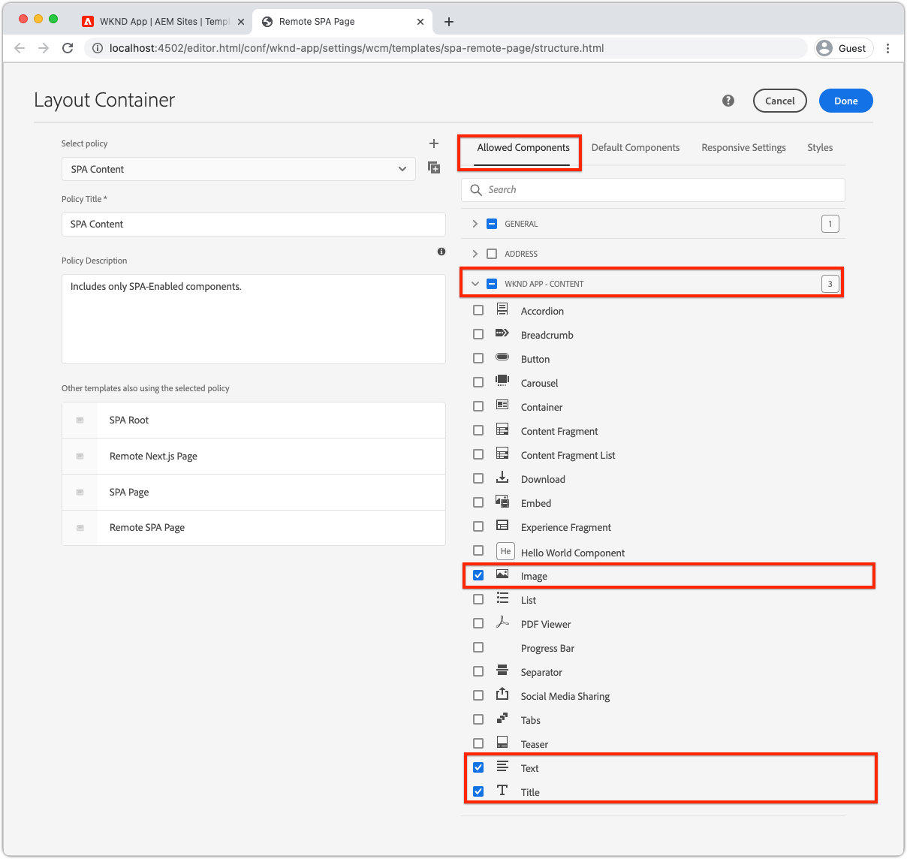

# Componentes de contêiner editáveis

[Os ](./spa-fixed-component.md) componentes fixos oferecem alguma flexibilidade para a criação de conteúdo SPA, no entanto, essa abordagem é rígida e requer que os desenvolvedores definam a composição exata do conteúdo editável. Para suportar a criação de experiências excepcionais por autores, o Editor do SPA suporta o uso de componentes de contêiner no SPA. Os componentes do contêiner permitem aos autores arrastar e soltar componentes permitidos no contêiner e criá-los, da mesma forma que na criação tradicional do AEM Sites!


Neste capítulo, adicionaremos um contêiner editável à exibição inicial, permitindo que os autores componham e façam o layout de experiências de conteúdo rico usando AEM Componentes principais de reação diretamente no SPA.

## Atualizar o aplicativo WKND

Para adicionar um componente de contêiner à exibição Início:

+ Importe o componente ResponsiveGrid do Componente Editável de Reação de AEM
+ Importe e registre AEM Componentes principais do React (Texto e Imagem) para uso no componente de contêiner

### Importar no componente do contêiner ResponsiveGrid

Para colocar uma área editável na exibição Início, devemos:

1. Importe o componente ResponsiveGrid de `@adobe/aem-react-editable-components`
1. Registre-o usando `withMappable` para que os desenvolvedores possam colocá-lo no SPA
1. Além disso, registre-se com `MapTo` para que possa ser reutilizado em outros componentes do Contêiner, aninhando contêineres de maneira eficaz.

Para fazer isso:

1. Abra o SPA projeto no IDE
1. Criar um componente de reação em `src/components/aem/AEMResponsiveGrid.js`
1. Adicione o seguinte código a `AEMResponsiveGrid.js`

   ```
   // Import the withMappable API provided bu the AEM SPA Editor JS SDK
   import { withMappable, MapTo } from '@adobe/aem-react-editable-components';
   
   // Import the base ResponsiveGrid component
   import { ResponsiveGrid } from "@adobe/aem-react-editable-components";
   
   // The sling:resourceType for which this Core Component is registered with in AEM
   const RESOURCE_TYPE = "wcm/foundation/components/responsivegrid";
   
   // Create an EditConfig to allow the AEM SPA Editor to properly render the component in the Editor's context
   const EditConfig = {
       emptyLabel: "Layout Container",  // The component placeholder in AEM SPA Editor
       isEmpty: function(props) { 
           return props.cqItemsOrder == null || props.cqItemsOrder.length === 0;
       },                              // The function to determine if this component has been authored
       resourceType: RESOURCE_TYPE     // The sling:resourceType this SPA component is mapped to
   };
   
   // MapTo allows the AEM SPA Editor JS SDK to dynamically render components added to SPA Editor Containers
   MapTo(RESOURCE_TYPE)(ResponsiveGrid, EditConfig);
   
   // withMappable allows the component to be hardcoded into the SPA; <AEMResponsiveGrid .../>
   const AEMResponsiveGrid = withMappable(ResponsiveGrid, EditConfig);
   
   export default AEMResponsiveGrid;
   ```

O código é semelhante `AEMTitle.js` que [importou o componente de Título AEM Alcance Core Components](./spa-fixed-component.md).


O arquivo `AEMResponsiveGrid.js` deve ter a seguinte aparência:


### Use o componente AEMResponsiveGrid SPA

Agora que AEM componente ResponsiveGrid está registrado e disponível para uso no SPA, podemos colocá-lo na exibição Início.

1. Abra e edite `react-app/src/App.js`
1. Importe o componente `AEMResponsiveGrid` e coloque-o acima do componente `<AEMTitle ...>`.
1. Defina os seguintes atributos no componente `<AEMResponsiveGrid...>`
   + `pagePath = '/content/wknd-app/us/en/home'`
   + `itemPath = 'root/responsivegrid'`

   Isso instrui esse componente `AEMResponsiveGrid` a recuperar o conteúdo do recurso de AEM:

   + `/content/wknd-app/us/en/home/jcr:content/root/responsivegrid`

   O `itemPath` mapeia para o nó `responsivegrid` definido no Modelo de AEM `Remote SPA Page` e é automaticamente criado em novas Páginas de AEM criadas no Modelo de AEM `Remote SPA Page`.

   Atualize `App.js` para adicionar o componente `<AEMResponsiveGrid...>`.

   ```
   ...
   import AEMResponsiveGrid from './components/aem/AEMResponsiveGrid';
   ...
   
   function Home() {
   return (
       <div className="Home">
           <AEMResponsiveGrid
               pagePath='/content/wknd-app/us/en/home' 
               itemPath='root/responsivegrid'/>
   
           <AEMTitle
               pagePath='/content/wknd-app/us/en/home' 
               itemPath='title'/>
           <Adventures />
       </div>
   );
   }
   ```

O arquivo `Apps.js` deve ter a seguinte aparência:


## Criar componentes editáveis

Para obter o efeito total da experiência de criação flexível que os contêineres fornecem no Editor de SPA. Já criamos um componente de Título editável, mas vamos fazer mais algumas coisas que permitem que os autores usem os Componentes principais de Texto e Imagem AEM WCM no componente de contêiner recém-adicionado.

### Componente de texto

1. Abra o SPA projeto no IDE
1. Criar um componente de reação em `src/components/aem/AEMText.js`
1. Adicione o seguinte código a `AEMText.js`

   ```
   import { withMappable, MapTo } from '@adobe/aem-react-editable-components';
   import { TextV2, TextV2IsEmptyFn } from "@adobe/aem-core-components-react-base";
   
   const RESOURCE_TYPE = "wknd-app/components/text";
   
   const EditConfig = {    
       emptyLabel: "Text",
       isEmpty: TextV2IsEmptyFn,
       resourceType: RESOURCE_TYPE
   };
   
   MapTo(RESOURCE_TYPE)(TextV2, EditConfig);
   
   const AEMText = withMappable(TextV2, EditConfig);
   
   export default AEMText;
   ```

O arquivo `AEMText.js` deve ter a seguinte aparência:


### Componente de imagem

1. Abra o SPA projeto no IDE
1. Criar um componente de reação em `src/components/aem/AEMImage.js`
1. Adicione o seguinte código a `AEMImage.js`

   ```
   import { withMappable, MapTo } from '@adobe/aem-react-editable-components';
   import { ImageV2, ImageV2IsEmptyFn } from "@adobe/aem-core-components-react-base";
   
   const RESOURCE_TYPE = "wknd-app/components/image";
   
   const EditConfig = {    
       emptyLabel: "Image",
       isEmpty: ImageV2IsEmptyFn,
       resourceType: RESOURCE_TYPE
   };
   
   MapTo(RESOURCE_TYPE)(ImageV2, EditConfig);
   
   const AEMImage = withMappable(ImageV2, EditConfig);
   
   export default AEMImage;
   ```

1. Crie um arquivo SCSS `src/components/aem/AEMImage.scss` que forneça estilos personalizados para o `AEMImage.scss`. Esses estilos direcionam as classes CSS de notação BEM do AEM React Core Component.
1. Adicione o seguinte SCSS a `AEMImage.scss`

   ```
   .cmp-image__image {
       margin: 1rem 0;
       width: 100%;
       border: 0;
    }
   ```

1. Importar `AEMImage.scss` em `AEMImage.js`

   ```
   ...
   import './AEMImage.scss';
   ...
   ```

Os `AEMImage.js` e `AEMImage.scss` devem ter a seguinte aparência:


### Importar os componentes editáveis

Os componentes de SPA `AEMText` e `AEMImage` recém-criados são referenciados no SPA e são instanciados dinamicamente com base no JSON retornado pelo AEM. Para garantir que esses componentes estejam disponíveis para o SPA, crie instruções de importação para eles em `App.js`

1. Abra o SPA projeto no IDE
1. Abra o arquivo `src/App.js`
1. Adicionar instruções de importação para `AEMText` e `AEMImage`

   ```
   ...
   import AEMText from './components/aem/AEMText';
   import AEMImage from './components/aem/AEMImage';
   ...
   ```


O resultado deve ser semelhante a:


Se essas importações forem _not_ adicionadas, o código `AEMText` e `AEMImage` não será chamado pelo SPA e, portanto, os componentes não serão registrados em relação aos tipos de recursos fornecidos.

## Configuração do contêiner no AEM

AEM componentes de contêiner usam políticas para ditar seus componentes permitidos. Essa é uma configuração crítica ao usar o Editor de SPA, já que somente AEM os Componentes principais do WCM que mapearam SPA componentes são renderizáveis pelo SPA. Verifique se apenas os componentes para os quais fornecemos implementações SPA são permitidos:

+ `AEMTitle` mapeado para  `wknd-app/components/title`
+ `AEMText` mapeado para  `wknd-app/components/text`
+ `AEMImage` mapeado para  `wknd-app/components/image`

Para configurar o contêiner reponsivegrid do modelo da Página de SPA Remota:

1. Faça logon no AEM Author
1. Navegue até __Ferramentas > Geral > Modelos > Aplicativo WKND__
1. Editar __Página SPA Relatório__

   

1. Selecione __Estrutura__ no alternador de modo no canto superior direito
1. Toque para selecionar o __Contêiner de layout__
1. Toque no ícone __Política__ na barra pop-up

   

1. À direita, na guia __Componentes permitidos__, expanda __APLICATIVO WKND - CONTEÚDO__
1. Certifique-se de que somente as seguintes opções estejam selecionadas:
   + Imagem
   + Texto
   + Título

   

1. Toque em __Concluído__

## Criação do contêiner no AEM

Com o SPA atualizado para incorporar o `<AEMResponsiveGrid...>`, wrappers para três componentes AEM React Core (`AEMTitle`, `AEMText` e `AEMImage`) e AEM é atualizado com uma política de Modelo correspondente, podemos começar a criar conteúdo no componente de contêiner.

1. Faça logon no AEM Author
1. Navegue até __Sites > Aplicativo WKND__
1. Toque em __Início__ e selecione __Editar__ na barra de ações superior
   + Um componente de Texto &quot;Hello World&quot; é exibido, pois ele foi adicionado automaticamente ao gerar o projeto a partir do arquétipo de Projeto AEM
1. Selecione __Editar__ no seletor de modo na parte superior direita do Editor de páginas
1. Localize a área editável __Contêiner de layout__ abaixo do Título
1. Abra a __barra lateral do Editor de páginas__ e selecione a __Exibição de componentes__
1. Arraste os seguintes componentes para o __Contêiner de layout__
   + Imagem
   + Título
1. Arraste os componentes para reorganizá-los na seguinte ordem:
   1. Título
   1. Imagem
   1. Texto
1. ____ Autorizar o componente  ____ de título
   1. Toque no componente Título e toque no ícone __chave__ para __editar__ o componente Título
   1. Adicione o seguinte texto:
      + Título: __O verão está chegando, vamos aproveitar ao máximo!__
      + Tipo: __H1__
   1. Toque em __Concluído__
1. ____ Autorizar o componente  ____ Imagem
   1. Arraste uma imagem para a barra lateral (depois de alternar para a exibição Ativos) no componente Imagem
   1. Toque no componente Imagem e toque no ícone __chave inglesa__ para editar
   1. Marque a caixa de seleção __Image is decorative__
   1. Toque em __Concluído__
1. ____ Autorizar o  ____ Textcomponent
   1. Edite o componente de Texto ao tocar no componente de Texto e tocar no ícone __chave inglesa__
   1. Adicione o seguinte texto:
      + _Agora, você pode obter 15% em todas as aventuras de 1 semana e 20% de desconto em todas as aventuras que tenham 2 semanas ou mais! No checkout, basta adicionar o código da campanha SUMMERISCOMING para obter seus descontos!_
   1. Toque em __Concluído__

1. Seus componentes agora são criados, mas empilhados verticalmente.

   

   Use AEM modo Layout para permitir que ajustemos o tamanho e o layout dos componentes.

1. Alterne para __Modo de layout__ usando o seletor de modo no canto superior direito
1. ____ Redimensionar os componentes de imagem e texto, de modo que fiquem lado a lado
   + ____ O componente de imagem deve ter  __8 colunas de largura__
   + ____ Textcomponent deve ter  __3 colunas de largura__

   

1. ____ Visualizar as alterações no Editor AEM página
1. Atualize o aplicativo WKND executado localmente em [http://localhost:3000](http://localhost:3000) para ver as alterações criadas!

   


## Parabéns!

Você adicionou um componente de contêiner que permite que componentes editáveis sejam adicionados por autores ao aplicativo WKND! Agora você sabe como:

+ Use o componente ResponsiveGrid do Componente Editável de Reação de AEM no SPA
+ Registre AEM React Core Components (Texto e Imagem) para uso no SPA por meio do componente de contêiner
+ Configure o modelo de Página de SPA Remota para permitir os Componentes principais habilitados para SPA
+ Adicionar componentes editáveis ao componente de contêiner
+ Componentes de criação e layout no Editor SPA

## Próximas etapas

A próxima etapa será usar essa mesma técnica para [adicionar um componente editável a uma rota Detalhes da Aventura](./spa-dynamic-routes.md) no SPA.
