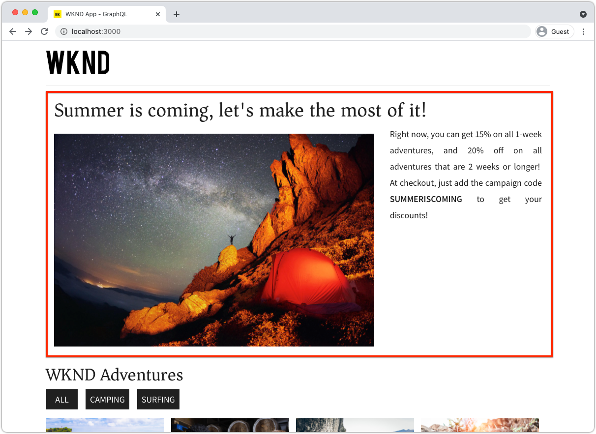
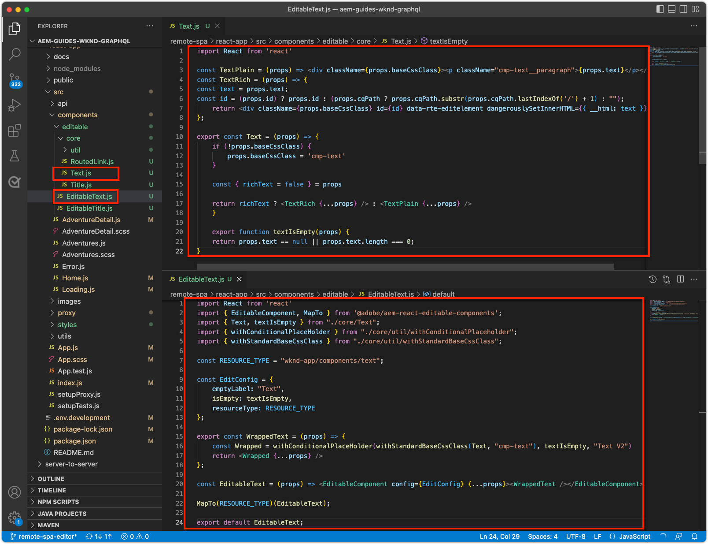
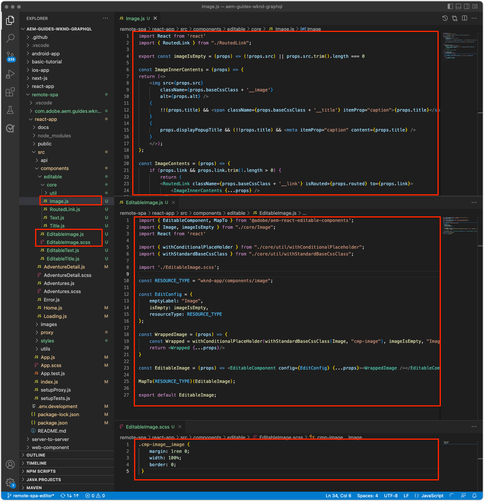
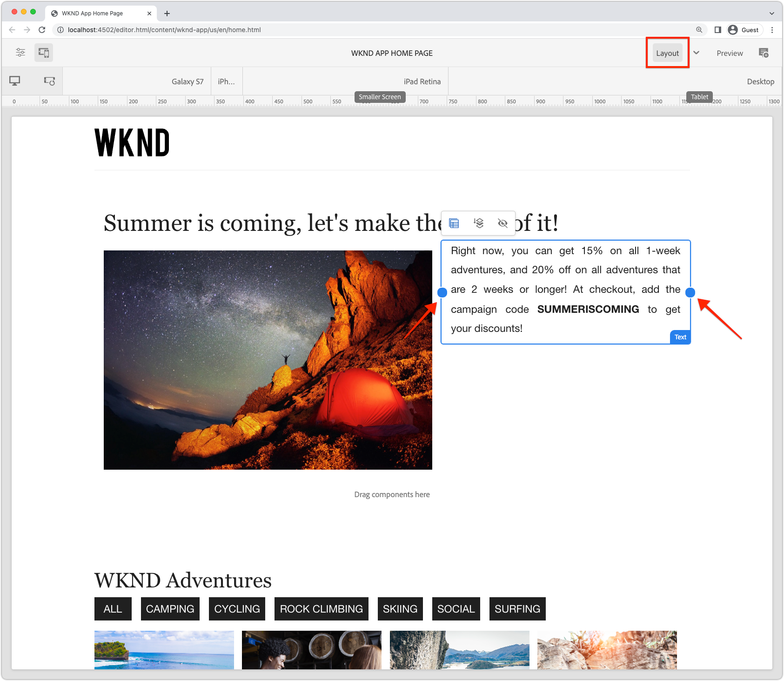
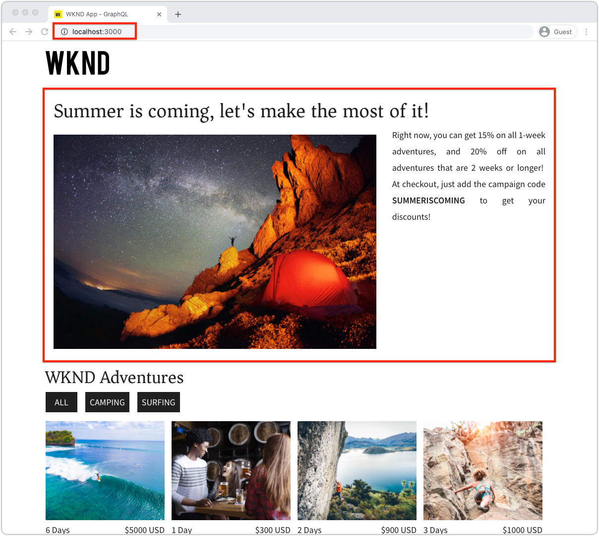

# Componentes de contêiner editáveis

{{spa-editor-deprecation}}

[Fixed components](./spa-fixed-component.md) provide some flexibility for authoring SPA content, however this approach is rigid and requires developers to define the exact composition of the editable content. To support the creation of exceptional experiences by authors, SPA Editor supports the use of container components in the SPA. Container components allow authors to drag and drop allowed components into the container, and author them, just like they can in traditional AEM Sites authoring!



In this chapter, we add an editable container to the home view allowing authors to compose and layout rich content experiences using Editable React components directly in the SPA.

## Update the WKND App

To add a container component to the Home view:

* Import the AEM React Editable Component&#39;s `ResponsiveGrid` component
* Import and register custom Editable React Components (Text and Image) for use in the ResponsiveGrid component

### Use the ResponsiveGrid component

To add an editable area to the Home view:

1. Open and edit `react-app/src/components/Home.js`
1. Import the `ResponsiveGrid` component from `@adobe/aem-react-editable-components` and add it to the `Home` component.
1. Set the following attributes on the `<ResponsiveGrid...>` component
   1. `pagePath = '/content/wknd-app/us/en/home'`
   1. `itemPath = 'root/responsivegrid'`

   This instructs the `ResponsiveGrid` component to retrieve its content from the AEM resource:

   1. `/content/wknd-app/us/en/home/jcr:content/root/responsivegrid`

   The `itemPath` maps to the `responsivegrid` node defined in the `Remote SPA Page` AEM Template and is automatically created on new AEM Pages created from the `Remote SPA Page` AEM Template.

   Update `Home.js` to add the `<ResponsiveGrid...>` component.

   ```javascript
   ...
   import { ResponsiveGrid } from '@adobe/aem-react-editable-components';
   ...
   
   function Home() {
       return (
           <div className="Home">
               <ResponsiveGrid
                   pagePath='/content/wknd-app/us/en/home' 
                   itemPath='root/responsivegrid'/>
   
               <EditableTitle
                   pagePath='/content/wknd-app/us/en/home' 
                   itemPath='title'/>
   
               <Adventures />
           </div>
       );
   }
   ```

The `Home.js` file should look like:


## Create editable components

To get the full effect of the flexible authoring experience containers provide in SPA Editor. We&#39;ve already create an editable Title component, but let&#39;s make a few more that allow authors to use editable Text and Image components in the newly added ResponsiveGrid component.

Os novos componentes editáveis Texto e Imagem React são criados usando o padrão de definição do componente editável exportado em [componentes editáveis fixos](./spa-fixed-component.md).

### Componente de texto editável

1. Abra o projeto SPA no IDE
1. Criar um componente React em `src/components/editable/core/Text.js`
1. Adicionar o seguinte código a `Text.js`

   ```javascript
   import React from 'react'
   
   const TextPlain = (props) => <div className={props.baseCssClass}><p className="cmp-text__paragraph">{props.text}</p></div>;
   const TextRich = (props) => {
   const text = props.text;
   const id = (props.id) ? props.id : (props.cqPath ? props.cqPath.substr(props.cqPath.lastIndexOf('/') + 1) : "");
       return <div className={props.baseCssClass} id={id} data-rte-editelement dangerouslySetInnerHTML={{ __html: text }} />
   };
   
   export const Text = (props) => {
       if (!props.baseCssClass) {
           props.baseCssClass = 'cmp-text'
       }
   
       const { richText = false } = props
   
       return richText ? <TextRich {...props} /> : <TextPlain {...props} />
       }
   
       export function textIsEmpty(props) {
       return props.text == null || props.text.length === 0;
   }
   ```

1. Criar um componente editável do React em `src/components/editable/EditableText.js`
1. Adicionar o seguinte código a `EditableText.js`

   ```javascript
   import React from 'react'
   import { EditableComponent, MapTo } from '@adobe/aem-react-editable-components';
   import { Text, textIsEmpty } from "./core/Text";
   import { withConditionalPlaceHolder } from "./core/util/withConditionalPlaceholder";
   import { withStandardBaseCssClass } from "./core/util/withStandardBaseCssClass";
   
   const RESOURCE_TYPE = "wknd-app/components/text";
   
   const EditConfig = {
       emptyLabel: "Text",
       isEmpty: textIsEmpty,
       resourceType: RESOURCE_TYPE
   };
   
   export const WrappedText = (props) => {
       const Wrapped = withConditionalPlaceHolder(withStandardBaseCssClass(Text, "cmp-text"), textIsEmpty, "Text V2")
       return <Wrapped {...props} />
   };
   
   const EditableText = (props) => <EditableComponent config={EditConfig} {...props}><WrappedText /></EditableComponent>
   
   MapTo(RESOURCE_TYPE)(EditableText);
   
   export default EditableText;
   ```

A implementação do componente de Texto editável deve ser semelhante a:



### Componente de imagem

1. Abra o projeto SPA no IDE
1. Criar um componente React em `src/components/editable/core/Image.js`
1. Adicionar o seguinte código a `Image.js`

   ```javascript
   import React from 'react'
   import { RoutedLink } from "./RoutedLink";
   
   export const imageIsEmpty = (props) => (!props.src) || props.src.trim().length === 0
   
   const ImageInnerContents = (props) => {
   return (<>
       
       {
           !!(props.title) && <span className={props.baseCssClass + '__title'} itemProp="caption">{props.title}</span>
       }
       {
           props.displayPopupTitle && (!!props.title) && <meta itemProp="caption" content={props.title} />
       }
       </>);
   };
   
   const ImageContents = (props) => {
       if (props.link && props.link.trim().length > 0) {
           return (
           <RoutedLink className={props.baseCssClass + '__link'} isRouted={props.routed} to={props.link}>
               <ImageInnerContents {...props} />
           </RoutedLink>
           )
       }
       return <ImageInnerContents {...props} />
   };
   
   export const Image = (props) => {
       if (!props.baseCssClass) {
           props.baseCssClass = 'cmp-image'
       }
   
       const { isInEditor = false } = props;
       const cssClassName = (isInEditor) ? props.baseCssClass + ' cq-dd-image' : props.baseCssClass;
   
       return (
           <div className={cssClassName}>
               <ImageContents {...props} />
           </div>
       )
   };
   ```

1. Criar um componente editável do React em `src/components/editable/EditableImage.js`
1. Adicionar o seguinte código a `EditableImage.js`

```javascript
import { EditableComponent, MapTo } from '@adobe/aem-react-editable-components';
import { Image, imageIsEmpty } from "./core/Image";
import React from 'react'

import { withConditionalPlaceHolder } from "./core/util/withConditionalPlaceholder";
import { withStandardBaseCssClass } from "./core/util/withStandardBaseCssClass";

const RESOURCE_TYPE = "wknd-app/components/image";

const EditConfig = {
    emptyLabel: "Image",
    isEmpty: imageIsEmpty,
    resourceType: RESOURCE_TYPE
};

const WrappedImage = (props) => {
    const Wrapped = withConditionalPlaceHolder(withStandardBaseCssClass(Image, "cmp-image"), imageIsEmpty, "Image V2");
    return <Wrapped {...props}/>
}

const EditableImage = (props) => <EditableComponent config={EditConfig} {...props}><WrappedImage /></EditableComponent>

MapTo(RESOURCE_TYPE)(EditableImage);

export default EditableImage;
```


1. Crie um arquivo SCSS `src/components/editable/EditableImage.scss` que forneça estilos personalizados para o `EditableImage.scss`. Esses estilos têm como alvo as classes CSS do componente React editável.
1. Adicionar o SCSS a seguir a `EditableImage.scss`

   ```css
   .cmp-image__image {
       margin: 1rem 0;
       width: 100%;
       border: 0;
    }
   ```

1. Importar `EditableImage.scss` em `EditableImage.js`

   ```javascript
   ...
   import './EditableImage.scss';
   ...
   ```

A implementação do componente de Imagem editável deve ser semelhante a:




### Importar os componentes editáveis

Os componentes do React `EditableText` e `EditableImage` recém-criados são referenciados no SPA e são dinamicamente instanciados com base no JSON retornado pelo AEM. Para garantir que esses componentes estejam disponíveis para o SPA, crie instruções de importação para eles em `Home.js`

1. Abra o projeto SPA no IDE
1. Abra o arquivo `src/Home.js`
1. Adicionar instruções de importação para `AEMText` e `AEMImage`

   ```javascript
   ...
   // The following need to be imported, so that MapTo is run for the components
   import EditableText from './editable/EditableText';
   import EditableImage from './editable/EditableImage';
   ...
   ```

O resultado deve ser semelhante a:


Se essas importações forem _não_ adicionadas, o código `EditableText` e `EditableImage` não será chamado pelo SPA e, portanto, os componentes não serão mapeados para os tipos de recursos fornecidos.

## Configuração do container no AEM

Os componentes de contêiner do AEM usam políticas para ditar seus componentes permitidos. Essa é uma configuração crítica ao usar o Editor de SPA, já que somente os Componentes do AEM que têm equivalentes de componentes de SPA mapeados podem ser renderizados pelo SPA. Verifique se somente os componentes para os quais fornecemos implementações de SPA são permitidos:

* `EditableTitle` mapeado para `wknd-app/components/title`
* `EditableText` mapeado para `wknd-app/components/text`
* `EditableImage` mapeado para `wknd-app/components/image`

Para configurar o contêiner reponsivegrid do modelo da Página do SPA Remoto:

1. Faça logon no AEM Author
1. Navegue até __Ferramentas > Geral > Modelos > Aplicativo WKND__
1. Editar __Página de SPA do Relatório__

   

1. Selecione __Estrutura__ no alternador de modo na parte superior direita
1. Toque para selecionar o __Contêiner de layout__
1. Toque no ícone __Política__ na barra pop-up

   

1. À direita, na guia __Componentes Permitidos__, expanda o __APLICATIVO WKND - CONTEÚDO__
1. Certifique-se de que apenas os seguintes sejam selecionados:
   1. Imagem
   1. Texto
   1. Título

   

1. Toque em __Concluído__

## Criação do container no AEM

Depois que o SPA foi atualizado para incorporar o `<ResponsiveGrid...>`, invólucros para três componentes editáveis do React (`EditableTitle`, `EditableText` e `EditableImage`), e o AEM foi atualizado com uma política de Modelo correspondente, podemos começar a criar conteúdo no componente de contêiner.

1. Faça logon no AEM Author
1. Navigate to __Sites > WKND App__
1. Tap __Home__ and select __Edit__ from the top action bar
   1. A &quot;Hello World&quot; Text component displays, as this was automatically added when generating the project from the AEM Project archetype
1. Select __Edit__ from the mode-selector in the top right of the Page Editor
1. Locate the __Layout Container__ editable area beneath the Title
1. Open the __Page Editor&#39;s side bar__, and select the __Components view__
1. Drag the following components into the __Layout Container__
   1. Imagem
   1. Título
1. Drag the components to reorder them to the following order:
   1. Título
   1. Imagem
   1. Texto
1. __Author__ the __Title__ component
   1. Tap the Title component, and tap the __wrench__ icon to __edit__ the Title component
   1. Add the following text:
      1. Title: __Summer is coming, let&#39;s make the most of it!__
      1. Type: __H1__
   1. Toque em __Concluído__
1. __Author__ the __Image__ component
   1. Drag an image in from the Side bar (after switching to the Assets view) on the Image component
   1. Tap the Image component, and tap the __wrench__ icon to edit
   1. Check the __Image is decorative__ checkbox
   1. Toque em __Concluído__
1. __Author__ the __Text__ component
   1. Edit the Text component by tapping the Text component, and tapping the __wrench__ icon
   1. Add the following text:
      1. _Right now, you can get 15% on all 1-week adventures, and 20% off on all adventures that are 2 weeks or longer! At checkout, add the campaign code SUMMERISCOMING to get your discounts!_
   1. Toque em __Concluído__

1. Seus componentes agora foram criados, mas são empilhados verticalmente.

   

   Use o Modo de layout do AEM para permitir que ajustemos o tamanho e o layout dos componentes.

1. Alternar para __Modo de layout__ usando o seletor de modo no canto superior direito
1. __Redimensionar__ os componentes Imagem e Texto, de forma que fiquem lado a lado
   1. O componente __Imagem__ deve ter __8 colunas de largura__
   1. O componente __Texto__ deve ter __3 colunas__

   

1. __Visualizar__ suas alterações no Editor de páginas do AEM
1. Atualize o Aplicativo WKND em execução localmente em [http://localhost:3000](http://localhost:3000) para ver as alterações criadas!

   


## Parabéns!

Você adicionou um componente de contêiner que permite que os componentes editáveis sejam adicionados pelos autores ao aplicativo WKND! Agora você sabe como:

* Usar o componente `ResponsiveGrid` do componente editável do AEM React no SPA
* Criar e registrar componentes editáveis do React (Texto e Imagem) para uso no SPA por meio do componente de contêiner
* Configure o modelo Página de SPA Remoto para permitir os componentes habilitados para SPA
* Adicionar componentes editáveis ao componente do contêiner
* Componentes de autor e layout no Editor SPA

## Próximas etapas

A próxima etapa usa a mesma técnica para [adicionar um componente editável a uma rota de Detalhes de Aventura](./spa-dynamic-routes.md) no SPA.
