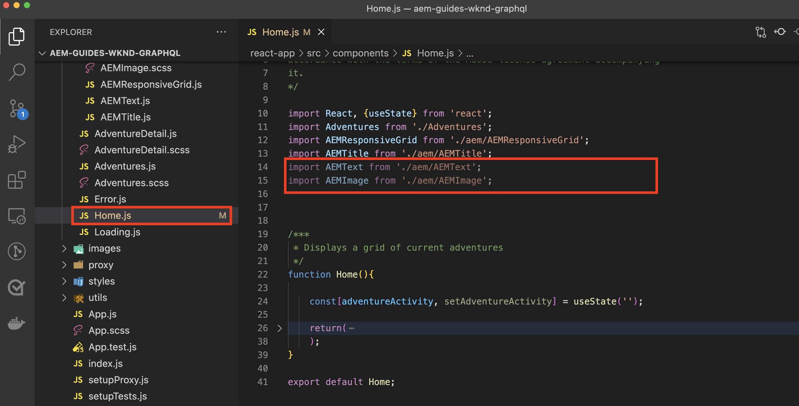

# Componentes de contêiner editáveis

{{spa-editor-deprecation}}

[Os componentes fixos](./spa-fixed-component.md) fornecem alguma flexibilidade para a criação de conteúdo SPA, no entanto, essa abordagem é rígida e requer que os desenvolvedores definam a composição exata do conteúdo editável. Para auxiliar na criação de experiências excepcionais pelos autores, o Editor de SPA é compatível com o uso de componentes de contêiner no SPA. Os componentes do contêiner permitem que os autores arrastem e soltem componentes permitidos no contêiner e os criem, da mesma forma que fazem na criação tradicional do AEM Sites.


Neste capítulo, adicionamos um contêiner editável à visualização inicial, permitindo que os autores componham e layout de experiências de conteúdo avançadas usando componentes editáveis do React diretamente no SPA.

## Atualizar o aplicativo WKND

Para adicionar um componente de contêiner à exibição Início:

* Importar o componente `ResponsiveGrid` do componente editável do AEM React
* Importar e registrar Componentes editáveis personalizados do React (Texto e Imagem) para uso no componente ResponsiveGrid

### Uso do componente ResponsiveGrid

Para adicionar uma área editável à exibição Início:

1. Abrir e editar `react-app/src/components/Home.js`
1. Importe o componente `ResponsiveGrid` de `@adobe/aem-react-editable-components` e adicione-o ao componente `Home`.
1. Definir os seguintes atributos no componente `<ResponsiveGrid...>`
   1. `pagePath = '/content/wknd-app/us/en/home'`
   1. `itemPath = 'root/responsivegrid'`

   Isso instrui o componente `ResponsiveGrid` a recuperar seu conteúdo do recurso AEM:

   1. `/content/wknd-app/us/en/home/jcr:content/root/responsivegrid`

   O `itemPath` mapeia para o nó `responsivegrid` definido no Modelo do AEM `Remote SPA Page` e é criado automaticamente em novas Páginas do AEM criadas a partir do Modelo do AEM `Remote SPA Page`.

   Atualize `Home.js` para adicionar o componente `<ResponsiveGrid...>`.

   ```javascript
   ...
   import { ResponsiveGrid } from '@adobe/aem-react-editable-components';
   ...
   
   function Home() {
       return (
           <div className="Home">
               <ResponsiveGrid
                   pagePath='/content/wknd-app/us/en/home' 
                   itemPath='root/responsivegrid'/>
   
               <EditableTitle
                   pagePath='/content/wknd-app/us/en/home' 
                   itemPath='title'/>
   
               <Adventures />
           </div>
       );
   }
   ```

O arquivo `Home.js` deve ser semelhante a:


## Criar componentes editáveis

Para obter o efeito total dos contêineres flexíveis da experiência de criação fornecidos no SPA Editor. Já criamos um componente de Título editável, mas vamos fazer mais algumas coisas que permitem aos autores usar componentes de Texto e Imagem editáveis no componente ResponsiveGrid recém-adicionado.

Os novos componentes editáveis Texto e Imagem React são criados usando o padrão de definição do componente editável exportado em [componentes editáveis fixos](./spa-fixed-component.md).

### Componente de texto editável

1. Abra o projeto SPA no IDE
1. Criar um componente React em `src/components/editable/core/Text.js`
1. Adicionar o seguinte código a `Text.js`

   ```javascript
   import React from 'react'
   
   const TextPlain = (props) => <div className={props.baseCssClass}><p className="cmp-text__paragraph">{props.text}</p></div>;
   const TextRich = (props) => {
   const text = props.text;
   const id = (props.id) ? props.id : (props.cqPath ? props.cqPath.substr(props.cqPath.lastIndexOf('/') + 1) : "");
       return <div className={props.baseCssClass} id={id} data-rte-editelement dangerouslySetInnerHTML={{ __html: text }} />
   };
   
   export const Text = (props) => {
       if (!props.baseCssClass) {
           props.baseCssClass = 'cmp-text'
       }
   
       const { richText = false } = props
   
       return richText ? <TextRich {...props} /> : <TextPlain {...props} />
       }
   
       export function textIsEmpty(props) {
       return props.text == null || props.text.length === 0;
   }
   ```

1. Criar um componente editável do React em `src/components/editable/EditableText.js`
1. Adicionar o seguinte código a `EditableText.js`

   ```javascript
   import React from 'react'
   import { EditableComponent, MapTo } from '@adobe/aem-react-editable-components';
   import { Text, textIsEmpty } from "./core/Text";
   import { withConditionalPlaceHolder } from "./core/util/withConditionalPlaceholder";
   import { withStandardBaseCssClass } from "./core/util/withStandardBaseCssClass";
   
   const RESOURCE_TYPE = "wknd-app/components/text";
   
   const EditConfig = {
       emptyLabel: "Text",
       isEmpty: textIsEmpty,
       resourceType: RESOURCE_TYPE
   };
   
   export const WrappedText = (props) => {
       const Wrapped = withConditionalPlaceHolder(withStandardBaseCssClass(Text, "cmp-text"), textIsEmpty, "Text V2")
       return <Wrapped {...props} />
   };
   
   const EditableText = (props) => <EditableComponent config={EditConfig} {...props}><WrappedText /></EditableComponent>
   
   MapTo(RESOURCE_TYPE)(EditableText);
   
   export default EditableText;
   ```

A implementação do componente de Texto editável deve ser semelhante a:


### Componente de imagem

1. Abra o projeto SPA no IDE
1. Criar um componente React em `src/components/editable/core/Image.js`
1. Adicionar o seguinte código a `Image.js`

   ```javascript
   import React from 'react'
   import { RoutedLink } from "./RoutedLink";
   
   export const imageIsEmpty = (props) => (!props.src) || props.src.trim().length === 0
   
   const ImageInnerContents = (props) => {
   return (<>
       
       {
           !!(props.title) && <span className={props.baseCssClass + '__title'} itemProp="caption">{props.title}</span>
       }
       {
           props.displayPopupTitle && (!!props.title) && <meta itemProp="caption" content={props.title} />
       }
       </>);
   };
   
   const ImageContents = (props) => {
       if (props.link && props.link.trim().length > 0) {
           return (
           <RoutedLink className={props.baseCssClass + '__link'} isRouted={props.routed} to={props.link}>
               <ImageInnerContents {...props} />
           </RoutedLink>
           )
       }
       return <ImageInnerContents {...props} />
   };
   
   export const Image = (props) => {
       if (!props.baseCssClass) {
           props.baseCssClass = 'cmp-image'
       }
   
       const { isInEditor = false } = props;
       const cssClassName = (isInEditor) ? props.baseCssClass + ' cq-dd-image' : props.baseCssClass;
   
       return (
           <div className={cssClassName}>
               <ImageContents {...props} />
           </div>
       )
   };
   ```

1. Criar um componente editável do React em `src/components/editable/EditableImage.js`
1. Adicionar o seguinte código a `EditableImage.js`

```javascript
import { EditableComponent, MapTo } from '@adobe/aem-react-editable-components';
import { Image, imageIsEmpty } from "./core/Image";
import React from 'react'

import { withConditionalPlaceHolder } from "./core/util/withConditionalPlaceholder";
import { withStandardBaseCssClass } from "./core/util/withStandardBaseCssClass";

const RESOURCE_TYPE = "wknd-app/components/image";

const EditConfig = {
    emptyLabel: "Image",
    isEmpty: imageIsEmpty,
    resourceType: RESOURCE_TYPE
};

const WrappedImage = (props) => {
    const Wrapped = withConditionalPlaceHolder(withStandardBaseCssClass(Image, "cmp-image"), imageIsEmpty, "Image V2");
    return <Wrapped {...props}/>
}

const EditableImage = (props) => <EditableComponent config={EditConfig} {...props}><WrappedImage /></EditableComponent>

MapTo(RESOURCE_TYPE)(EditableImage);

export default EditableImage;
```


1. Crie um arquivo SCSS `src/components/editable/EditableImage.scss` que forneça estilos personalizados para o `EditableImage.scss`. Esses estilos têm como alvo as classes CSS do componente React editável.
1. Adicionar o SCSS a seguir a `EditableImage.scss`

   ```css
   .cmp-image__image {
       margin: 1rem 0;
       width: 100%;
       border: 0;
    }
   ```

1. Importar `EditableImage.scss` em `EditableImage.js`

   ```javascript
   ...
   import './EditableImage.scss';
   ...
   ```

A implementação do componente de Imagem editável deve ser semelhante a:


### Importar os componentes editáveis

Os componentes do React `EditableText` e `EditableImage` recém-criados são referenciados no SPA e são dinamicamente instanciados com base no JSON retornado pelo AEM. Para garantir que esses componentes estejam disponíveis para o SPA, crie instruções de importação para eles em `Home.js`

1. Abra o projeto SPA no IDE
1. Abrir o arquivo `src/Home.js`
1. Adicionar instruções de importação para `AEMText` e `AEMImage`

   ```javascript
   ...
   // The following need to be imported, so that MapTo is run for the components
   import EditableText from './editable/EditableText';
   import EditableImage from './editable/EditableImage';
   ...
   ```

O resultado deve ser semelhante a:



Se essas importações forem _não_ adicionadas, o código `EditableText` e `EditableImage` não será chamado pelo SPA e, portanto, os componentes não serão mapeados para os tipos de recursos fornecidos.

## Configuração do container no AEM

Os componentes de contêiner do AEM usam políticas para ditar seus componentes permitidos. Essa é uma configuração crítica ao usar o Editor de SPA, já que somente os Componentes do AEM que têm equivalentes de componentes de SPA mapeados podem ser renderizados pelo SPA. Verifique se somente os componentes para os quais fornecemos implementações de SPA são permitidos:

* `EditableTitle` mapeado para `wknd-app/components/title`
* `EditableText` mapeado para `wknd-app/components/text`
* `EditableImage` mapeado para `wknd-app/components/image`

Para configurar o contêiner reponsivegrid do modelo da Página do SPA Remoto:

1. Faça logon no AEM Author
1. Navegue até __Ferramentas > Geral > Modelos > Aplicativo WKND__
1. Editar __Página de SPA do Relatório__

   

1. Selecione __Estrutura__ no alternador de modo na parte superior direita
1. Toque para selecionar o __Contêiner de layout__
1. Toque no ícone __Política__ na barra pop-up

   

1. À direita, na guia __Componentes Permitidos__, expanda o __APLICATIVO WKND - CONTEÚDO__
1. Certifique-se de que apenas os seguintes sejam selecionados:
   1. Imagem
   1. Texto
   1. Título

   

1. Toque em __Concluído__

## Criação do container no AEM

Depois que o SPA foi atualizado para incorporar o `<ResponsiveGrid...>`, invólucros para três componentes editáveis do React (`EditableTitle`, `EditableText` e `EditableImage`), e o AEM foi atualizado com uma política de Modelo correspondente, podemos começar a criar conteúdo no componente de contêiner.

1. Faça logon no AEM Author
1. Navegue até __Sites > Aplicativo WKND__
1. Toque em __Página inicial__ e selecione __Editar__ na barra de ações superior
   1. Um componente de texto &quot;Olá, mundo&quot; é exibido, pois ele é adicionado automaticamente ao gerar o projeto a partir do arquétipo de projeto do AEM
1. Selecione __Editar__ no seletor de modo, na parte superior direita do Editor de páginas
1. Localize a área editável __Contêiner de layout__ abaixo do Título
1. Abra a __barra lateral do Editor de páginas__ e selecione a __exibição de Componentes__
1. Arraste os seguintes componentes para o __Contêiner de layout__
   1. Imagem
   1. Título
1. Arraste os componentes para reordená-los na seguinte ordem:
   1. Título
   1. Imagem
   1. Texto
1. __Autor__ o componente __Título__
   1. Toque no componente Título e toque na __chave inglesa__ para __editar__ o componente Título
   1. Adicione o seguinte texto:
      1. Título: __O verão está chegando, vamos aproveitar ao máximo!__
      1. Tipo: __H1__
   1. Toque em __Concluído__
1. __Crie__ o componente __Imagem__
   1. Arraste uma imagem para o a partir da barra Lateral (após alternar para a exibição do Assets) no componente Imagem
   1. Toque no componente de Imagem e toque na __chave inglesa__ para editar
   1. Marque a caixa de seleção __A imagem é decorativa__
   1. Toque em __Concluído__
1. __Autor__ o componente __Texto__
   1. Edite o componente de Texto ao tocar no componente de Texto e tocar na __chave inglesa__
   1. Adicione o seguinte texto:
      1. _Nesse momento, você pode obter 15% em todas as aventuras de uma semana e 20% de desconto em todas as aventuras de duas semanas ou mais! No check-out, adicione o código da campanha SUMMERISCOMING para obter seus descontos!_
   1. Toque em __Concluído__

1. Seus componentes agora foram criados, mas são empilhados verticalmente.

   

   Use o Modo de layout do AEM para permitir que ajustemos o tamanho e o layout dos componentes.

1. Alternar para __Modo de layout__ usando o seletor de modo no canto superior direito
1. __Redimensionar__ os componentes Imagem e Texto, de forma que fiquem lado a lado
   1. O componente __Imagem__ deve ter __8 colunas de largura__
   1. O componente __Texto__ deve ter __3 colunas__

   

1. __Visualizar__ suas alterações no Editor de páginas do AEM
1. Atualize o Aplicativo WKND em execução localmente em [http://localhost:3000](http://localhost:3000) para ver as alterações criadas!

   


## Parabéns!

Você adicionou um componente de contêiner que permite que os componentes editáveis sejam adicionados pelos autores ao aplicativo WKND! Agora você sabe como:

* Usar o componente `ResponsiveGrid` do componente editável do AEM React no SPA
* Criar e registrar componentes editáveis do React (Texto e Imagem) para uso no SPA por meio do componente de contêiner
* Configure o modelo Página de SPA Remoto para permitir os componentes habilitados para SPA
* Adicionar componentes editáveis ao componente do contêiner
* Componentes de autor e layout no Editor SPA

## Próximas etapas

A próxima etapa usa a mesma técnica para [adicionar um componente editável a uma rota de Detalhes de Aventura](./spa-dynamic-routes.md) no SPA.
