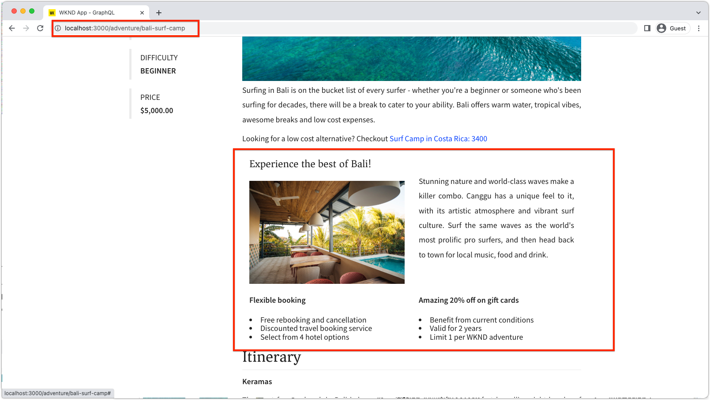

# Rotas dinâmicas e componentes editáveis

Neste capítulo, habilitamos duas rotas de Detalhe do Aventura dinâmicas para suportar componentes editáveis; __Campo de Surfe de Bali__ e __Beervana em Portland__.



O Detalhe da Aventura SPA rota é definido como `/adventure:path` onde `path` é o caminho para a Aventura WKND (Fragmento do Conteúdo) para exibir detalhes.

## Mapear os URLs SPA para AEM páginas

Nos dois capítulos anteriores, mapeamos o conteúdo editável do componente da exibição Início do SPA para a página raiz Remota SPA correspondente no AEM em `/content/wknd-app/us/en/`.

A definição de mapeamento para componentes editáveis para as rotas dinâmicas de SPA é semelhante, no entanto, devemos criar um esquema de mapeamento 1:1 entre instâncias da rota e páginas de AEM.

Neste tutorial, pegaremos o nome do Fragmento de conteúdo de aventura WKND, que é o último segmento do caminho, e o mapearemos para um caminho simples em `/content/wknd-app/us/en/adventure`.

| Rota de SPA remota | Caminho da página AEM |
|------------------------------------|--------------------------------------------|
| / | /content/wknd-app/us/en/home |
| /adventure:/content/dam/wknd/en/adventures/bali-surf-camp/__bali-surf-camp__ | /content/wknd-app/us/en/home/adventure/__bali-surf-camp__ |
| /adventure:/content/dam/wknd/en/adventures/beervana-portland/__beervana-portland__ | /content/wknd-app/us/en/home/adventure/__beervana-in-portland__ |

Portanto, com base nesse mapeamento, devemos criar duas novas páginas de AEM em:

+ `/content/wknd-app/us/en/home/adventure/bali-surf-camp`
+ `/content/wknd-app/us/en/home/adventure/beervana-in-portland`

## Mapeamento de SPA remoto

O mapeamento de solicitações que saem do SPA Remoto é configurado por meio da configuração `setupProxy` feita em [Bootstrap o SPA](./spa-bootstrap.md).

## Mapeamento do editor de SPA

O mapeamento para solicitações de SPA quando o SPA é aberto por meio AEM Editor SPA são configurados por meio da configuração de Mapeamentos do Sling feita em [Configurar AEM](./aem-configure.md).

## Criar páginas de conteúdo em AEM

Primeiro, crie o segmento intermediário `adventure` Página :

1. Faça logon no AEM Author
1. Navegue até __Sites > Aplicativo WKND > us > en > Página inicial do aplicativo WKND__
   + Essa página de AEM é mapeada como a raiz do SPA, então é aqui que começamos a criar a estrutura de página de AEM para outras rotas de SPA.
1. Toque em __Criar__ e selecione __Página__
1. Selecione o modelo __Página de SPA Remota__ e toque em __Próximo__
1. Preencha as propriedades da página
   + __Título__: Aventura
   + __Nome__: `adventure`
      + Esse valor define o URL da página AEM e, portanto, deve corresponder ao segmento de rota do SPA.
1. Toque em __Concluído__

Em seguida, crie as páginas de AEM que correspondem a cada URLs de SPA que exigem áreas editáveis.

1. Navegue até a nova página __Adventure__ no Administrador do site
1. Toque em __Criar__ e selecione __Página__
1. Selecione o modelo __Página de SPA Remota__ e toque em __Próximo__
1. Preencha as propriedades da página
   + __Título__: Campo de Surf de Bali
   + __Nome__: `bali-surf-camp`
      + Esse valor define o URL da página AEM e, portanto, deve corresponder ao último segmento da rota SPA
1. Toque em __Concluído__
1. Repita as etapas 3 a 6 para criar a página __Beervana em Portland__, com:
   + __Título__: Beervana em Portland
   + __Nome__: `beervana-in-portland`
      + Esse valor define o URL da página AEM e, portanto, deve corresponder ao último segmento da rota SPA

Essas duas páginas de AEM contêm o respectivo conteúdo criado para suas rotas de SPA correspondentes. Se outras rotas de SPA exigirem criação, novas Páginas de AEM devem ser criadas em seu URL de SPA na página raiz da página de SPA Remota (`/content/wknd-app/us/en/home`) no AEM.

## Atualizar o aplicativo WKND

Vamos colocar o componente `<AEMResponsiveGrid...>` criado no [último capítulo](./spa-container-component.md), em nosso componente de SPA `AdventureDetail`, criando um contêiner editável.

### Coloque o componente AEMResponsiveGrid SPA

Colocar `<AEMResponsiveGrid...>` no componente `AdventureDetail` cria um contêiner editável nessa rota. O truque é porque várias rotas usam o componente `AdventureDetail` para renderizar, devemos ajustar dinamicamente o atributo `<AEMResponsiveGrid...>'s pagePath`. O `pagePath` deve ser derivado para apontar para a página de AEM correspondente, com base na aventura que a instância da rota exibe.

1. Abra e edite `react-app/src/components/AdventureDetail.js`
1. Adicione a seguinte linha antes da segunda instrução `AdventureDetail(..)'s` , que deriva o nome da aventura do caminho do fragmento de conteúdo.`return(..)`

   ```
   ...
   // Get the last segment of the Adventure Content Fragment path to used to generate the pagePath for the AEMResponsiveGrid
   const adventureName = adventureData._path.split('/').pop();
   ...
   ```

1. Importe o componente `AEMResponsiveGrid` e coloque-o acima do componente `<h2>Itinerary</h2>`.
1. Defina os seguintes atributos no componente `<AEMResponsiveGrid...>`
   + `pagePath = '/content/wknd-app/us/en/home/adventure/${adventureName}'`
   + `itemPath = 'root/responsivegrid'`

   Isso instrui o componente `AEMResponsiveGrid` a recuperar o conteúdo do recurso de AEM:

   + `/content/wknd-app/us/en/home/adventure/${adventureName}/jcr:content/root/responsivegrid`


Atualize `AdventureDetail.js` com as seguintes linhas:

```
...
import AEMResponsiveGrid from '../components/aem/AEMResponsiveGrid';
...

function AdventureDetail(props) {
    ...
    // Get the last segment of the Adventure Content Fragment path to used to generate the pagePath for the AEMResponsiveGrid
    const adventureName = adventureData._path.split('/').pop();

    return(
        ...
        <AEMResponsiveGrid 
            pagePath={`/content/wknd-app/us/en/home/adventure/${adventureName}`}
            itemPath="root/responsivegrid"/>
            
        <h2>Itinerary</h2>
        ...
    )
}
```

O arquivo `AdventureDetail.js` deve ter a seguinte aparência:


## Crie o contêiner no AEM

Com o `<AEMResponsiveGrid...>` no lugar e seu `pagePath` definido dinamicamente com base na aventura que está sendo renderizada, tentamos criar conteúdo nele.

1. Faça logon no AEM Author
1. Navegue até __Sites > Aplicativo WKND > us > en__
1. ____ Editar a página inicial do aplicativo  __WKND__ 
   + Navegue até a rota __Bali Surf Camp__ no SPA para editá-lo
1. Selecione __Preview__ no seletor de modo no canto superior direito
1. Toque no cartão __Bali Surf Camp__ no SPA para navegar até sua rota
1. Selecione __Editar__ no seletor de modo
1. Localize a área editável __Contêiner de layout__ logo acima do __Itinerário__
1. Abra a __barra lateral do Editor de páginas__ e selecione a __Exibição de componentes__
1. Arraste alguns dos componentes ativados para o __Contêiner de layout__
   + Imagem
   + Texto
   + Título

   E criar algum material promocional de marketing. Pode ser algo como isto:

   

1. ____ Visualizar as alterações no Editor AEM página
1. Atualize o aplicativo WKND executado localmente em [http://localhost:3000](http://localhost:3000), navegue até a rota __Bali Surf Camp__ para ver as alterações criadas!

   

Ao navegar para uma rota de detalhes de aventura que não tem uma página de AEM mapeada, não haverá capacidade de criação nessa instância de rota. Para ativar a criação nessas páginas, basta criar uma Página AEM com o nome correspondente na página __Adventure__!

## Parabéns!

Parabéns! Você adicionou capacidade de criação a rotas dinâmicas no SPA!

+ Adição do componente ResponsiveGrid do Componente Editável de Reação de AEM a uma rota dinâmica
+ Criadas AEM páginas para apoiar a criação de duas rotas específicas no SPA (Campo de Surfe de Bali e Beervana em Portland)
+ Conteúdo criado na rota dinâmica do Campo de Surfe de Bali!

Agora você concluiu a exploração das primeiras etapas de como AEM Editor SPA pode ser usado para adicionar áreas editáveis específicas a um SPA Remoto!


>[!NOTE]
>
>Fique ligado! Este tutorial será expandido para abranger as práticas recomendadas e recomendações do Adobe sobre como implantar a solução do Editor de SPA como Cloud Service e os ambientes de produção.