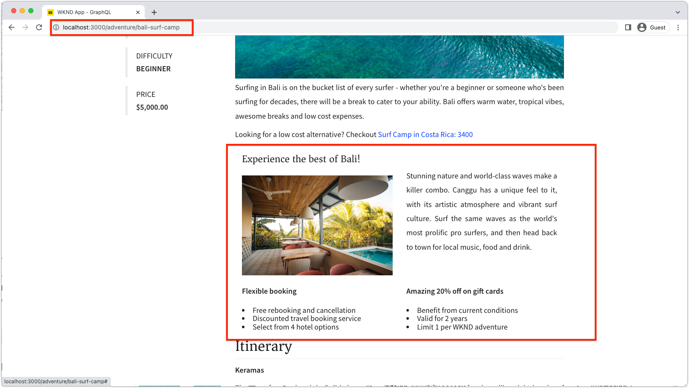
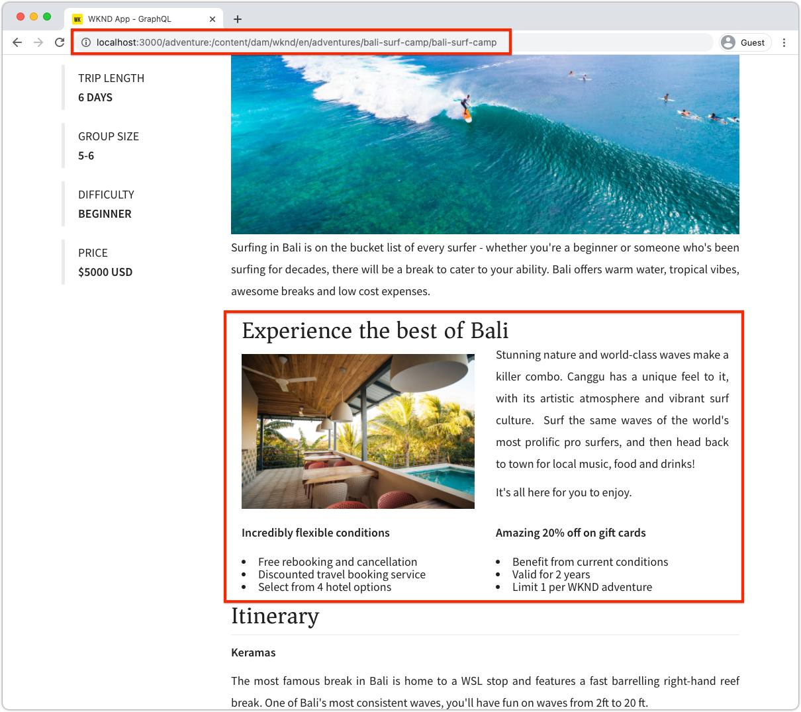

# Rotas dinâmicas e componentes editáveis

{{spa-editor-deprecation}}

Neste capítulo, ativamos duas rotas dinâmicas de Detalhe de Aventura para suportar componentes editáveis: __Campo de Surfe de Bali__ e __Beervana em Portland__.



A rota SPA Adventure Detail é definida como `/adventure/:slug`, onde `slug` é uma propriedade de identificador exclusivo no Fragmento de Conteúdo Adventure.

## Mapear os URLs de SPA para páginas do AEM

Nos dois capítulos anteriores, mapeamos o conteúdo do componente editável da exibição Início do SPA para a página raiz do SPA remoto correspondente no AEM em `/content/wknd-app/us/en/`.

A definição de mapeamento para componentes editáveis para as rotas dinâmicas do SPA é semelhante, no entanto, devemos criar um esquema de mapeamento 1:1 entre as instâncias da rota e as páginas do AEM.

Neste tutorial, pegamos o nome do Fragmento de conteúdo WKND Adventure, que é o último segmento do caminho, e o mapeamos para um caminho simples em `/content/wknd-app/us/en/adventure`.

| Rota SPA remota | Caminho da página do AEM |
|------------------------------------|--------------------------------------------|
| / | /content/wknd-app/us/en/home |
| /aventura/__bali-surf-camp__ | /content/wknd-app/us/en/home/Adventure/__bali-surf-camp__ |
| /aventura/__beervana-portland__ | /content/wknd-app/us/en/home/Adventure/__beervana-in-portland__ |

Portanto, com base nesse mapeamento, devemos criar duas novas páginas do AEM em:

* `/content/wknd-app/us/en/home/adventure/bali-surf-camp`
* `/content/wknd-app/us/en/home/adventure/beervana-in-portland`

## Mapeamento de SPA remoto

O mapeamento de solicitações que deixam o SPA Remoto é configurado por meio da configuração `setupProxy` feita no [Bootstrap do SPA](./spa-bootstrap.md).

## Mapeamento do Editor SPA

O mapeamento de solicitações de SPA quando o SPA é aberto por meio do AEM SPA Editor é configurado por meio da configuração Mapeamentos do Sling realizada em [Configurar AEM](./aem-configure.md).

## Criar páginas de conteúdo no AEM

Primeiro, crie o segmento de página `adventure` intermediário:

1. Faça logon no AEM Author
1. Navigate to __Sites > WKND App > us > en > WKND App Home Page__
   1. This AEM page is mapped as the root of the SPA, so this is where we begin building out the AEM page structure for other SPA routes.
1. Tap __Create__ and select __Page__
1. Select the __Remote SPA Page__ template, and tap __Next__
1. Fill out the Page Properties
   1. __Title__: Adventure
   1. __Nome__: `adventure`
      1. This value defines the AEM page&#39;s URL, and therefore must match the SPA&#39; route segment.
1. Toque em __Concluído__

Then, create the AEM pages that correspond to each of the SPA&#39;s URLs that require editable areas.

1. Navigate into the new __Adventure__ page in the Site Admin
1. Tap __Create__ and select __Page__
1. Select the __Remote SPA Page__ template, and tap __Next__
1. Fill out the Page Properties
   1. __Title__: Bali Surf Camp
   1. __Nome__: `bali-surf-camp`
      1. This value defines the AEM page&#39;s URL, and therefore must match the SPA&#39; route&#39;s last segment
1. Toque em __Concluído__
1. Repeat the steps 3-6 to create the __Beervana in Portland__ page, with:
   1. __Title__: Beervana in Portland
   1. __Nome__: `beervana-in-portland`
      1. This value defines the AEM page&#39;s URL, and therefore must match the SPA&#39; route&#39;s last segment

These two AEM pages hold the respective-authored content for their matching SPA routes. If other SPA routes require authoring, new AEM Pages must be created at their SPA&#39;s URL under the Remote SPA page&#39;s root page (`/content/wknd-app/us/en/home`) in AEM.

## Update the WKND App

Let&#39;s place the `<ResponsiveGrid...>` component created in the [last chapter](./spa-container-component.md), into our `AdventureDetail` SPA component, creating an editable container.

### Place the ResponsiveGrid SPA component

Placing the `<ResponsiveGrid...>` in the `AdventureDetail` component creates an editable container in that route. The trick is because multiple routes use the `AdventureDetail` component to render, we must dynamically adjust the  `<ResponsiveGrid...>'s pagePath` attribute. The `pagePath` must be derived to point to the corresponding AEM page, based on the adventure the route&#39;s instance displays.

1. Open and edit `react-app-/src/components/AdventureDetail.js`
1. Import the `ResponsiveGrid` component and place it above the `<h2>Itinerary</h2>` component.
1. Set the following attributes on the `<ResponsiveGrid...>` component. Note the `pagePath` attribute adds the current `slug` which maps to the adventure page per the mapping defined above.
   1. `pagePath = '/content/wknd-app/us/en/home/adventure/${slug}'`
   1. `itemPath = 'root/responsivegrid'`

   This instructs the `ResponsiveGrid` component to retrieve its content from the AEM resource:

   1. `/content/wknd-app/us/en/home/adventure/${slug}/jcr:content/root/responsivegrid`

Update `AdventureDetail.js` with the following lines:

```javascript
...
import { ResponsiveGrid } from '@adobe/aem-react-editable-components';
...

function AdventureDetailRender(props) {
    ...
    // Get the slug from the React route parameter, this will be used to specify the AEM Page to store/read editable content from
    const { slug } = useParams();

    return(
        ...
        // Pass the slug in
        function AdventureDetailRender({ title, primaryImage, activity, adventureType, tripLength, 
                groupSize, difficulty, price, description, itinerary, references, slug }) {
            ...
            return (
                ...
                <ResponsiveGrid 
                    pagePath={`/content/wknd-app/us/en/home/adventure/${slug}`}
                    itemPath="root/responsivegrid"/>
                    
                <h2>Itinerary</h2>
                ...
            )
        }
    )
}
```

O arquivo `AdventureDetail.js` deve ser semelhante a:


## Author the Container in AEM

With the `<ResponsiveGrid...>` in place, and its `pagePath` dynamically set based on the adventure being rendered, we try authoring content in it.

1. Faça logon no AEM Author
1. Navegue até __Sites > Aplicativo WKND > us > en__
1. __Edit__ the __WKND App Home Page__ page
   1. Navigate to the __Bali Surf Camp__ route in the SPA to edit it
1. Select __Preview__ from the mode-selector in the top-right
1. Tap on the __Bali Surf Camp__ card in the SPA to navigate to its route
1. Select __Edit__ from the mode-selector
1. Locate the __Layout Container__ editable area right above the __Itinerary__
1. Open the __Page Editor&#39;s side bar__, and select the __Components view__
1. Drag some of the enabled components into the __Layout Container__
   1. Imagem
   1. Texto
   1. Título

   E criar algum material de marketing promocional. Pode ser semelhante a:

   

1. __Visualizar__ suas alterações no Editor de páginas do AEM
1. Atualize o aplicativo WKND em execução localmente em [http://localhost:3000](http://localhost:3000), navegue até a rota __Campo de Surf de Bali__ para ver as alterações criadas!

   

Ao navegar para uma rota de detalhes de aventura que não tem uma Página do AEM mapeada, não há capacidade de criação nessa instância de rota. Para habilitar a criação nessas páginas, basta criar uma Página do AEM com o nome correspondente na página __Aventura__!

## Parabéns!

Parabéns! Você adicionou a capacidade de criação a rotas dinâmicas no SPA!

* Adição do componente ResponsiveGrid do componente editável do AEM React a uma rota dinâmica
* Páginas do AEM criadas para dar suporte à criação de duas rotas específicas no SPA (Campo de surf de Bali e Beervana em Portland)
* Conteúdo criado na rota dinâmica do Campo de Surf de Bali!

Agora você concluiu a exploração das primeiras etapas de como o Editor SPA do AEM pode ser usado para adicionar áreas editáveis específicas a um SPA remoto!
