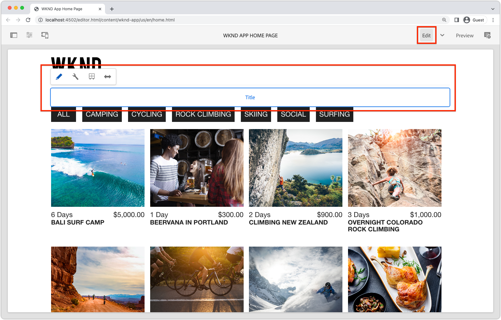

# Componentes fixos editáveis

Os componentes React editáveis podem ser &quot;fixos&quot; ou codificados nas visualizações de SPA. Isso permite que os desenvolvedores coloquem SPA componentes compatíveis com o Editor nas visualizações de SPA e que os usuários criem o conteúdo dos componentes AEM Editor SPA.


Neste capítulo, substituímos o título da exibição Início, &quot;Aventuras atuais&quot;, que é um texto codificado em `Home.js` por um componente Título fixo, mas editável. Os componentes fixos garantem o posicionamento do título, mas também permitem a criação do texto do título e a alteração fora do ciclo de desenvolvimento.

## Atualizar o aplicativo WKND

Para adicionar um componente corrigido à exibição Início:

+ Importe o componente Título do componente principal de reação de AEM e registre-o no tipo de recurso Título do projeto
+ Coloque o componente Título editável na exibição Início do SPA

### Importar no componente Título do Componente principal de reação do AEM

Na exibição Início do SPA, substitua o texto codificado `<h2>Current Adventures</h2>` pelo componente Título dos componentes principais do AEM React. Antes do componente Título poder ser usado, é necessário:

1. Importe o componente de Título de `@adobe/aem-core-components-react-base`
1. Registre-o usando `withMappable` para que os desenvolvedores possam colocá-lo no SPA
1. Além disso, registre-se com `MapTo` para que possa ser usado no [componente do contêiner mais tarde](./spa-container-component.md).

Para fazer isso:

1. Abra o projeto do SPA remoto em `~/Code/wknd-app/aem-guides-wknd-graphql/react-app` no IDE
1. Criar um componente de reação em `react-app/src/components/aem/AEMTitle.js`
1. Adicione o seguinte código a `AEMTitle.js`.

   ```
   // Import the withMappable API provided by the AEM SPA Editor JS SDK
   import { withMappable, MapTo } from '@adobe/aem-react-editable-components';
   
   // Import the AEM React Core Components' Title component implementation and it's Empty Function 
   import { TitleV2, TitleV2IsEmptyFn } from "@adobe/aem-core-components-react-base";
   
   // The sling:resourceType for which this Core Component is registered with in AEM
   const RESOURCE_TYPE = "wknd-app/components/title";
   
   // Create an EditConfig to allow the AEM SPA Editor to properly render the component in the Editor's context
   const EditConfig = {    
       emptyLabel: "Title",  // The component placeholder in AEM SPA Editor
       isEmpty: TitleV2IsEmptyFn, // The function to determine if this component has been authored
       resourceType: RESOURCE_TYPE // The sling:resourceType this component is mapped to
   };
   
   // MapTo allows the AEM SPA Editor JS SDK to dynamically render components added to SPA Editor Containers
   MapTo(RESOURCE_TYPE)(TitleV2, EditConfig);
   
   // withMappable allows the component to be hardcoded into the SPA; <AEMTitle .../>
   const AEMTitle = withMappable(TitleV2, EditConfig);
   
   export default AEMTitle;
   ```

Leia os comentários do código para obter os detalhes de implementação.

O arquivo `AEMTitle.js` deve ter a seguinte aparência:


### Use o componente React AEMTitle

Agora que o componente Título do Componente principal do React do AEM está registrado e disponível para uso no aplicativo React, substitua o texto do título codificado na exibição Início.

1. Editar `react-app/src/App.js`
1. na parte inferior `Home()`, substitua o título codificado por um novo componente `AEMTitle`:

   ```
   <h2>Current Adventures</h2>
   ```

   com

   ```
   <AEMTitle
       pagePath='/content/wknd-app/us/en/home' 
       itemPath='root/title'/>
   ```

   Atualize `Apps.js` com o seguinte código:

   ```
   ...
   import { AEMTitle } from './components/aem/AEMTitle';
   ...
   function Home() {
       return (
           <div className="Home">
   
               <AEMTitle
                   pagePath='/content/wknd-app/us/en/home' 
                   itemPath='root/title'/>
   
               <Adventures />
           </div>
       );
   }
   ```

O arquivo `Apps.js` deve ter a seguinte aparência:


## Crie o componente de Título no AEM

1. Faça logon no AEM Author
1. Navegue até __Sites > Aplicativo WKND__
1. Toque em __Início__ e selecione __Editar__ na barra de ações superior
1. Selecione __Editar__ no seletor de modo de edição na parte superior direita do Editor de páginas
1. Passe o mouse sobre o texto de título padrão abaixo do logotipo WKND e acima da lista de aventuras, até que o contorno de edição azul seja exibido
1. Toque em para expor a barra de ação do componente e toque na __chave inglesa__ para editar

   

1. Crie o componente Título :
   + Título: __Aventuras WKND__
   + Tipo/tamanho: __H2__

      

1. Toque em __Concluído__ para salvar
1. Visualizar as alterações no AEM Editor SPA
1. Atualize o aplicativo WKND em execução localmente em [http://localhost:3000](http://localhost:3000) e veja as alterações no título de criação imediatamente refletidas.

   

## Parabéns!

Você adicionou um componente fixo e editável ao aplicativo WKND! Agora você sabe como:

+ Importar e reutilizar um Componente principal de reação AEM no SPA
+ Adicionar um componente fixo, mas editável, ao SPA
+ Crie o componente fixo no AEM
+ Ver o conteúdo criado no SPA remoto

## Próximas etapas

As próximas etapas são para [adicionar um componente do contêiner ResponsiveGrid AEM](./spa-container-component.md) ao SPA que permite que o autor adicione e edite componentes ao SPA!
