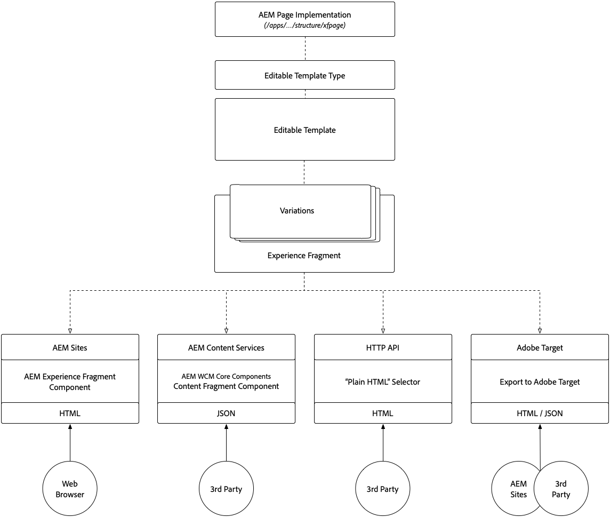

# Compreender fragmentos de conteúdo e fragmentos de experiência

Os Fragmentos de conteúdo e os Fragmentos de experiência do Adobe Experience Manager podem parecer semelhantes na superfície, mas cada um desempenha funções principais em diferentes casos de uso. Saiba como Fragmentos de conteúdo e Fragmentos de experiência são semelhantes, diferentes e quando e como usá-los.

## Comparação entre Fragmentos de conteúdo e Fragmentos de experiência

<table>
<tbody><tr><td><strong> </strong></td>
<td><strong>Fragmentos de conteúdo (CF)</strong></td>
<td><strong>Fragmentos de experiência (XF)</strong></td>
</tr><tr><td><strong>Definição</strong></td>
<td><ul>
<li>Reutilizável, independente de apresentação <strong>content</strong>, composto de elementos de dados estruturados (texto, datas, referências etc.)</li>
</ul>
</td>
<td><ul>
<li>Um composto reutilizável de um ou mais componentes do AEM que definem o conteúdo e a apresentação que forma uma <strong>experiência</strong> que faz sentido</li>
</ul>
</td>
</tr><tr><td><strong>Locatários principais</strong></td>
<td><ul>
<li>Centralizado no conteúdo</li>
<li>Definido por um <a href="https://helpx.adobe.com/experience-manager/6-5/assets/using/content-fragments-models.html" target="_blank">modelo de dados estruturado, baseado em formulário.</a></li>
<li>Design e layout agnósticos.</li>
<li>O canal é proprietário da apresentação do conteúdo do Fragmento de conteúdo (layout e design)</li>
</ul>
</td>
<td><ul>
<li>Centrado na apresentação</li>
<li>Definido pela composição não estruturada dos Componentes do AEM</li>
<li>Define o design e o layout do conteúdo</li>
<li>Usado "no estado em que se encontra" em canais</li>
</ul>
</td>
</tr><tr><td><strong>Detalhes técnicos</strong></td>
<td><ul>
<li>Implementado como um <strong>dam:Asset</strong></li>
<li>Definido por um <a href="https://helpx.adobe.com/experience-manager/6-5/assets/using/content-fragments-models.html" target="_blank">Modelo de fragmento de conteúdo</a></li>
</ul>
</td>
<td><ul>
<li>Implementado como um <strong>cq:Page</strong></li>
<li>Definido por modelos editáveis</li>
<li>Representação HTML nativa</li>
</ul>
</td>
</tr><tr><td><strong>Variações</strong></td>
<td><ul>
<li>A variação Master é a variação canônica</li>
<li>As variações são específicas para casos de uso, que podem ser alinhadas com canais.</li>
</ul>
</td>
<td><ul>
<li>As variações são específicas de canal ou contexto</li>
<li>As variações são mantidas sincronizadas por meio do AEM Live Copy</li>
<li><a href="https://helpx.adobe.com/experience-manager/6-5/sites/authoring/using/experience-fragments.html#BuildingBlocks" target="_blank">Criação de conteúdo </a> em branco reuso em variações</li>
</ul>
</td>
</tr><tr><td><strong>Recursos</strong></td>
<td><ul>
<li>Variações</li>
<li>Versões</li>
<li> Sincronização do conteúdo entre variações</li>
<li><a href="https://helpx.adobe.com/experience-manager/6-5/assets/using/content-fragments-managing.html#ComparingFragmentVersions" target="_blank">Comparar </a> com fragmentos de conteúdo com diferenças visuais</li>
<li> Anotações de elementos de texto de várias linhas</li>
<li>Inteligente <a href="https://helpx.adobe.com/experience-manager/6-5/assets/using/content-fragments-variations.html#SummarizingText" target="_blank">resumo</a> de elementos de texto de várias linhas.</li>
<li><a href="https://helpx.adobe.com/experience-manager/6-5/assets/using/creating-translation-projects-for-content-fragments.html" target="_blank">Tradução/localização</a></li>
</ul>
</td>
<td><ul>
<li>Variações</li>
<li>Variações como Live Copies</li>
<li>Versões</li>
<li><a href="https://helpx.adobe.com/experience-manager/6-5/sites/authoring/using/experience-fragments.html#BuildingBlocks" target="_blank">Elementos básicos</a></li>
<li>Anotações</li>
<li>Layout responsivo e visualização</li>
<li>Tradução/localização</li>
</ul>
</td>
</tr><tr><td><strong>Uso</strong></td>
<td><ul>
<li><a href="https://docs.adobe.com/content/help/en/experience-manager-core-components/using/components/content-fragment-component.html" target="_blank">Componente de fragmento de conteúdo dos componentes principais do AEM </a> para usar no AEM Sites, no AEM Screens ou em Fragmentos de experiência.</li>
<li>Exportação JSON via <a href="https://helpx.adobe.com/experience-manager/kt/sites/using/content-services-tutorial-use.html" target="_blank">AEM Content Services</a> para consumo de terceiros</li>
<li>JSON por meio das APIs do AEM HTTP Assets para consumo de terceiros.</li>
</ul>
</td>
<td><ul>
<li>Componente de fragmento de experiência do AEM para uso no AEM Sites, AEM Screens ou outros Fragmentos de experiência.</li>
<li>Exportar como <a href="https://helpx.adobe.com/experience-manager/6-5/sites/authoring/using/experience-fragments.html#ThePlainHTMLRendition" target="_blank">HTML simples</a> para uso por sistemas de terceiros</li>
<li><a href="https://helpx.adobe.com/br/experience-manager/6-5/sites/administering/using/experience-fragments-target.html" target="_blank">Exportação de HTML para o Adobe </a> Target de ofertas direcionadas</li>
<li>Exportação JSON para o Adobe Target de ofertas direcionadas</li>
</ul>
</td>
</tr><tr><td><strong>Casos de uso comuns</strong></td>
<td><ul>
<li>Entrada de dados altamente estruturada/conteúdo baseado em formulário</li>
<li>Conteúdo editorial de forma longa (elemento de várias linhas)</li>
<li>Conteúdo gerenciado fora do ciclo de vida dos canais que o entregam</li>
</ul>
</td>
<td><ul>
<li>Gerenciamento centralizado de materiais promocionais de vários canais usando variações por canal.</li>
<li>Conteúdo reutilizado em várias páginas em um site.</li>
<li>Chrome do site (ex.: cabeçalho e rodapé)</li>
<li>Uma experiência gerenciada fora do ciclo de vida dos canais que a entregam</li>
</ul>
</td>
</tr><tr><td><strong>Documentação</strong></td>
<td><ul>
<li><a href="https://helpx.adobe.com/experience-manager/6-5/assets/user-guide.html?topic=/experience-manager/6-5/assets/morehelp/content-fragments.ug.js" target="_blank">Guia do usuário de Fragmentos de conteúdo do AEM</a></li>
<li><a href="https://helpx.adobe.com/experience-manager/kt/sites/using/content-fragments-feature-video-use.html" target="_blank">Uso de fragmentos de conteúdo no AEM</a></li>
</ul>
</td>
<td><ul>
<li><a href="https://helpx.adobe.com/experience-manager/6-5/sites/authoring/using/experience-fragments.html" target="_blank">Documentação da Adobe sobre fragmentos de experiência</a></li>
</ul>
</td>
</tr></tbody></table>

## Arquitetura dos fragmentos de conteúdo

O diagrama a seguir ilustra a arquitetura geral dos Fragmentos de conteúdo do AEM

!

+ **Os** Modelos de fragmento de conteúdo definem os elementos (ou campos) que definem o conteúdo que o Fragmento de conteúdo pode capturar e expor.
+ O **Fragmento de conteúdo** é uma instância de um Modelo de fragmento de conteúdo que representa uma entidade de conteúdo lógico.
+ No entanto, o Fragmento de conteúdo **variações** adere ao Modelo de fragmento de conteúdo, tem variações no conteúdo.
+ Fragmentos de conteúdo podem ser expostos/consumidos por:
   + Uso de Fragmentos de conteúdo em **AEM Sites** (ou AEM Screens) por meio do componente Fragmento de conteúdo dos Componentes principais do WCM no AEM.
   + Incorporação de um fragmento de conteúdo em um **Fragmento de experiência** por meio do componente Fragmento de conteúdo dos componentes principais do WCM AEM, para uso em qualquer caso de uso de Fragmento de experiência.
   + Expor um Fragmento de conteúdo altera o conteúdo como JSON por meio de **Serviços de conteúdo do AEM** e Páginas de API para casos de uso somente leitura.
   + Exposição direta do conteúdo do Fragmento de conteúdo (todas as variações) como JSON por meio de chamadas diretas ao AEM Assets por meio da **API HTTP do AEM Assets** para casos de uso de CRUD.

## Arquitetura dos fragmentos de experiência

!

+ **Modelos editáveis**, que, por sua vez, são definidos por  **Tipos de modelo** editáveis e uma implementação do componente Página do  **AEM**, definem os componentes do AEM permitidos que podem ser usados para compor um Fragmento de experiência.
+ O **Fragmento de experiência** é uma instância de um Modelo editável que representa uma experiência lógica.
+ No entanto, o Fragmento de experiência **variações** adere ao Modelo editável tem variações na experiência (conteúdo e design).
+ Fragmentos de experiência podem ser expostos/consumidos por:
   + Uso de fragmentos de experiência no AEM Sites (ou AEM Screens) por meio do componente Fragmento de experiência do AEM.
   + Expor um Fragmento de experiência aumenta o conteúdo como JSON (com HTML incorporado) via **AEM Content Services** e Páginas de API.
   + Exposição direta de uma variação do Fragmento de experiência como **&quot;HTML simples&quot;**.
   + Exportar fragmentos de experiência para **Adobe Target** como ofertas HTML ou JSON.
   + O AEM Sites oferece suporte nativo a ofertas HTML, no entanto, as ofertas JSON exigem desenvolvimento personalizado.

## Materiais de suporte para fragmentos de conteúdo

+ [Guia do usuário de Fragmentos de conteúdo](https://helpx.adobe.com/experience-manager/6-5/assets/user-guide.html?topic=/experience-manager/6-5/assets/morehelp/content-fragments.ug.js)
+ [Uso de fragmentos de conteúdo no AEM](https://helpx.adobe.com/experience-manager/kt/sites/using/content-fragments-feature-video-use.html)
+ [Componente de fragmento de conteúdo dos componentes principais do WCM AEM](https://docs.adobe.com/content/help/pt-BR/experience-manager-core-components/using/components/content-fragment-component.html)
+ [Uso de fragmentos de conteúdo e serviços de conteúdo do AEM](https://helpx.adobe.com/experience-manager/kt/sites/using/structured-fragments-content-services-feature-video-use.html)
+ [Introdução aos serviços de conteúdo do AEM](https://helpx.adobe.com/experience-manager/kt/sites/using/content-services-tutorial-use.html)

## Materiais de suporte para fragmentos de experiência

+ [Documentação da Adobe sobre fragmentos de experiência](https://helpx.adobe.com/experience-manager/6-5/sites/authoring/using/experience-fragments.html)
+ [Compreensão dos fragmentos de experiência do AEM](https://helpx.adobe.com/experience-manager/kt/sites/using/experience-fragments-feature-video-understand.html)
+ [Uso de fragmentos de experiência do AEM](https://helpx.adobe.com/experience-manager/kt/sites/using/experience-fragments-feature-video-use.html)
+ [Uso de fragmentos de experiência do AEM com o Adobe Target](https://medium.com/adobetech/experience-fragments-and-adobe-target-d8d74381b9b2)
