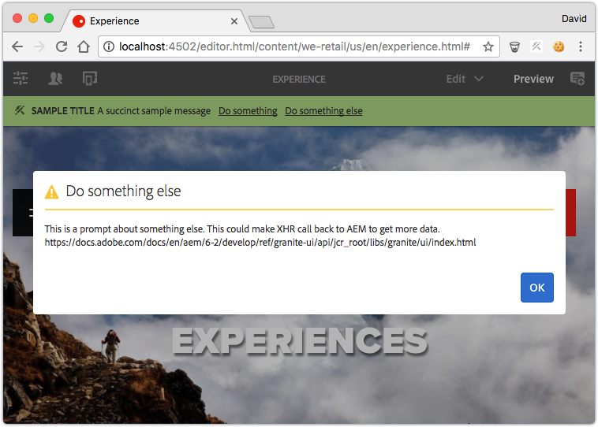

# Desenvolvendo status de recursos {#developing-resource-statuses-in-aem-sites}

As APIs de status de recursos do Adobe Experience Manager são uma estrutura conectável para expor mensagens de status nas várias interfaces do usuário da Web do editor do AEM.

## Visão geral {#overview}

A estrutura Status dos recursos para editores fornece APIs do lado do servidor e do lado do cliente para exibir e interagir com os status do editor, de maneira padrão e uniforme.

As barras de status do editor estão disponíveis nativamente nos editores Página, Fragmento de experiência e Modelo do AEM.

Exemplos de casos de uso para provedores de status de recurso personalizados:

* Notificar autores quando uma página estiver no prazo de 2 horas após a ativação programada
* Notificar os autores que uma página foi ativada nos últimos 15 minutos
* Notificar os autores que uma página foi editada nos últimos 5 minutos e por quem



## Estrutura do provedor de status do recurso {#resource-status-provider-framework}

Ao desenvolver Status de Recursos personalizados, o trabalho de desenvolvimento é composto de:

1. A implementação ResourceStatusProvider, responsável por determinar se um status é necessário, e as informações básicas sobre o status: título, mensagem, prioridade, variante, ícone e ações disponíveis.
2. Como opção, GraniteUI JavaScript que implementa a funcionalidade de qualquer ação disponível.

   

3. O recurso de status fornecido como parte dos editores de Página, Fragmento de experiência e Modelo recebe um tipo por meio da propriedade &quot;[!DNL statusType]&quot; dos recursos.

   * Editor de páginas: `editor`
   * Editor de fragmento de experiência: `editor`
   * Editor de modelo: `template-editor`

4. O `statusType` do recurso de status corresponde à propriedade `name` OSGi configurada `CompositeStatusType` registrada.

   Para todas as correspondências, os tipos `CompositeStatusType's` são coletados e usados para coletar as implementações `ResourceStatusProvider` que têm esse tipo, via `ResourceStatusProvider.getType()`.

5. O `ResourceStatusProvider` correspondente recebe o `resource` no editor e determina se o `resource` tem status para ser exibido. Se o status for necessário, essa implementação será responsável pela compilação de 0 ou muitos `ResourceStatuses` a serem retornados, cada um representando um status a ser exibido.

   Normalmente, um `ResourceStatusProvider` retorna 0 ou 1 `ResourceStatus` por `resource`.

6. ResourceStatus é uma interface que pode ser implementada pelo cliente ou o útil `com.day.cq.wcm.commons.status.EditorResourceStatus.Builder` pode ser usado para criar um status. Um status é composto de:

   * Título
   * Mensagem
   * Ícone
   * Variante
   * Prioridade
   * Ações
   * Dados

7. Opcionalmente, se `Actions` forem fornecidos para o objeto `ResourceStatus`, clientlibs de suporte serão necessários para vincular a funcionalidade aos links de ação na barra de status.

   ```js
   (function(jQuery, document) {
       'use strict';
   
       $(document).on('click', '.editor-StatusBar-action[data-status-action-id="do-something"]', function () {
           // Do something on the click of the resource status action
   
       });
   })(jQuery, document);
   ```

8. Qualquer JavaScript ou CSS compatível para oferecer suporte às ações deve ser enviado por proxy por meio das respectivas bibliotecas de clientes de cada editor para garantir que o código de front-end esteja disponível no editor.

   * Categoria do editor de páginas: `cq.authoring.editor.sites.page`
   * Categoria do editor de Fragmento de experiência: `cq.authoring.editor.sites.page`
   * Categoria do editor de modelo: `cq.authoring.editor.sites.template`

## Exibir o código {#view-the-code}

[Consulte o código no GitHub](https://github.com/Adobe-Consulting-Services/acs-aem-samples/tree/master/bundle/src/main/java/com/adobe/acs/samples/resourcestatus/impl/SampleEditorResourceStatusProvider.java)

## Recursos adicionais {#additional-resources}

* [`com.adobe.granite.resourcestatus` JavaDocs](https://helpx.adobe.com/experience-manager/6-5/sites/developing/using/reference-materials/javadoc/com/adobe/granite/resourcestatus/package-summary.html)
* [`com.day.cq.wcm.commons.status.EditorResourceStatus` JavaDocs](https://helpx.adobe.com/experience-manager/6-5/sites/developing/using/reference-materials/javadoc/com/day/cq/wcm/commons/status/EditorResourceStatus.html)
