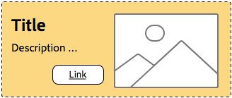

# Como entender as práticas recomendadas do sistema de estilo{#understanding-style-organization-with-the-aem-style-system}

>[!NOTE]
>
>Revise o conteúdo em [Entendendo como codificar para o Sistema de estilo](style-system-technical-video-understand.md), para garantir uma compreensão das convenções semelhantes a BEM usadas pelo Sistema de estilo AEM.

Há dois sabores ou estilos principais que são implementados para o Sistema de estilo AEM:

* **Estilos de layout**
* **Exibir estilos**

**Os** estilos de layout afetam muitos elementos de um componente para criar uma renderização bem definida e identificável (design e layout) do componente, geralmente alinhando-se a um conceito de Marca reutilizável específico. Por exemplo, um componente Teaser pode ser apresentado no layout tradicional baseado em cartão, em um estilo promocional horizontal ou como um layout principal sobrepondo o texto em uma imagem.

**Os** estilos de exibição são usados para afetar pequenas variações nos estilos de Layout, no entanto, eles não alteram a natureza fundamental ou a intenção do estilo de Layout. Por exemplo, um estilo de layout Herói pode ter estilos de exibição que mudam o esquema de cores do esquema de cores da marca principal para o esquema de cores da marca secundária.

## Práticas recomendadas de organização de estilo {#style-organization-best-practices}

Ao definir os nomes de estilo disponíveis para AEM autores, é melhor:

* Nomear estilos usando um vocabulário compreendido pelos autores
* Minimizar o número de opções de estilo
* Exponha apenas as opções e combinações de estilo permitidas pelos padrões de marca
* Expor somente combinações de estilo que tenham um efeito
   * Se estiverem expostas combinações ineficazes, assegure-se que pelo menos não produzem efeitos adversos

À medida que o número de combinações de estilo possíveis disponíveis para AEM autores aumenta, mais permutações existem que devem ser QAs e validadas em relação aos padrões da marca. Muitas opções também podem confundir os autores, pois podem não ficar claras quais opções ou combinações são necessárias para produzir o efeito desejado.

### Nomes de estilo vs classes CSS {#style-names-vs-css-classes}

Os nomes de estilo ou as opções apresentadas aos autores AEM e os nomes de classe CSS implementados são dissociados em AEM.

Isso permite que as opções de Estilo sejam rotuladas em um vocabulário claro e entendidas pelos autores AEM, mas permite que os desenvolvedores de CSS nomeiem as classes de CSS de uma forma semântica e de prova futura. Por exemplo:

Um componente deve ter as opções para ser colorido com as cores **primárias** e **secundárias** da marca, no entanto, os autores AEM conhecem as cores como **verde** e **amarelo**, em vez da linguagem de design primária e secundária.

O Sistema de Estilos de AEM pode expor esses estilos de exibição de cores usando rótulos amigáveis ao autor **Verde** e **Amarelo**, ao mesmo tempo em que permite que os desenvolvedores de CSS usem o nome semântico de `.cmp-component--primary-color` e `.cmp-component--secondary-color` para definir a implementação de estilo real no CSS.

O nome de Estilo de **Verde** está mapeado para `.cmp-component--primary-color` e **Amarelo** para `.cmp-component--secondary-color`.

Se a cor da marca do empresa mudar no futuro, tudo o que precisa ser alterado é a implementação única de `.cmp-component--primary-color` e `.cmp-component--secondary-color` e os nomes de estilo.

## O componente Teaser como exemplo usa case {#the-teaser-component-as-an-example-use-case}

A seguir está um exemplo de uso de estilização de um componente Teaser para ter vários estilos diferentes de Layout e Exibição.

Isso explorará como os nomes de estilo (expostos aos autores) e como as classes CSS de backup são organizadas.

### Configuração de estilos de componentes do Teaser {#component-styles-configuration}

A imagem a seguir mostra a configuração [!UICONTROL Estilos] do componente Teaser para as variações discutidas no caso de uso.

Os nomes [!UICONTROL Grupo de estilos], Layout e Exibição correspondem, por acaso, aos conceitos gerais de Estilos de exibição e Estilos de layout usados para categorizar conceitualmente tipos de estilos neste artigo.

Os nomes [!UICONTROL Grupo de Estilos] e o número de [!UICONTROL Grupos de Estilos] devem ser adaptados às convenções de estilização de componentes de caso de uso e de componente específico do projeto.

Por exemplo, o nome do grupo de estilos **Display** poderia ter sido chamado de **Cores**.


### Menu de seleção de estilo {#style-selection-menu}

A imagem abaixo exibe os autores do menu [!UICONTROL Estilo] com os quais interagem para selecionar os estilos apropriados para o componente. Observe que os nomes [!UICONTROL Style Grpi], bem como os nomes de Estilo, estão expostos ao autor.


### Estilo padrão {#default-style}

O estilo padrão é frequentemente o estilo mais usado do componente, e a visualização padrão e sem estilo do teaser quando adicionada a uma página.

Dependendo da compatibilidade do estilo padrão, o CSS pode ser aplicado diretamente em `.cmp-teaser` (sem modificadores) ou em um `.cmp-teaser--default`.

Se as regras de estilo padrão se aplicarem com mais frequência do que não a todas as variações, é melhor usar `.cmp-teaser` como as classes CSS do estilo padrão, já que todas as variações devem herdá-las implicitamente, supondo que as convenções semelhantes a BEM sejam seguidas. Caso contrário, eles devem ser aplicados por meio do modificador padrão, como `.cmp-teaser--default`, que por sua vez precisa ser adicionado ao campo [Classes CSS Padrão](#component-styles-configuration) da configuração de estilo do componente, caso contrário, essas regras de estilo terão de ser substituídas em cada variação.

É possível atribuir um estilo &quot;nomeado&quot; como o estilo padrão, por exemplo, o estilo Hero `(.cmp-teaser--hero)` definido abaixo, no entanto, é mais claro implementar o estilo padrão em relação às implementações de classe `.cmp-teaser` ou `.cmp-teaser--default` CSS.

>[!NOTE]
>
>Observe que o estilo de layout padrão NÃO tem um nome de estilo de exibição; no entanto, o autor poderá selecionar uma opção de exibição na ferramenta de seleção Sistema de estilo AEM.
>
>Isto em violação das melhores práticas:
>
>**Expor somente combinações de estilo que tenham um efeito**
>
>Se um autor selecionar o estilo de exibição de **Verde**, nada acontecerá.
>
>Nesse caso de uso, concederemos essa violação, pois todos os outros estilos de layout devem ser coloridos usando as cores da marca.
>
>Na seção **Promoção (alinhada à direita)** abaixo, veremos como evitar combinações de estilo indesejadas.


* **Estilo de layout**
   * Padrão
* **Estilo de exibição**
   * Nenhum
* **Classes** CSS efetivas:  `.cmp-teaser--promo` ou  `.cmp-teaser--default`

### Estilo promocional {#promo-style}

O **Estilo de layout promocional** é usado para promover conteúdo de alto valor no site e é apresentado horizontalmente para ocupar uma faixa de espaço na página da Web e deve ser compatível com estilo por cores de marca, com o estilo de layout promocional padrão usando texto preto.

Para isso, um **estilo de layout** de **Promo** e os **estilos de exibição** de **Verde** e **Amarelo** são configurados no Sistema de estilo AEM para o componente Teaser.

#### Padrão de promoção


* **Estilo de layout**
   * Nome do estilo: **Promo**
   * Classe CSS: `cmp-teaser--promo`
* **Estilo de exibição**
   * Nenhum
* **Classes** CSS efetivas:  `.cmp-teaser--promo`

#### Principal da Promo


* **Estilo de layout**
   * Nome do estilo: **Promo**
   * Classe CSS: `cmp-teaser--promo`
* **Estilo de exibição**
   * Nome do estilo: **Verde**
   * Classe CSS: `cmp-teaser--primary-color`
* **Classes** CSS efetivas:  `cmp-teaser--promo.cmp-teaser--primary-color`

#### Promo secundário


* **Estilo de layout**
   * Nome do estilo: **Promo**
   * Classe CSS: `cmp-teaser--promo`
* **Estilo de exibição**
   * Nome do estilo: **Amarelo**
   * Classe CSS: `cmp-teaser--secondary-color`
* **Classes** CSS efetivas:  `cmp-teaser--promo.cmp-teaser--secondary-color`

### Estilo promocional alinhado à direita {#promo-r-align}

O estilo de layout **Promo alinhado à direita** é uma variação do estilo promocional que gira o local da imagem e do texto (imagem à direita, texto à esquerda).

O alinhamento direito, no núcleo, é um estilo de exibição; ele pode ser inserido no Sistema de estilo AEM como um estilo de exibição selecionado em conjunto com o estilo de layout Promoção. Isso viola a melhor prática de:

**Expor somente combinações de estilo que tenham um efeito**

...que já foi violado no [Estilo padrão](#default-style).

Como o alinhamento direito afeta apenas o estilo de layout Promoção, e não os outros 2 estilos de layout: padrão e principal, podemos criar um novo estilo de layout promocional (alinhado à direita) que inclui a classe CSS que alinha com o direito o conteúdo de estilos de layout promocional: `cmp -teaser--alternate`.

Essa combinação de vários estilos em uma única entrada de Estilo também pode ajudar a reduzir o número de estilos e permutas de estilo disponíveis, o que é melhor para minimizar.

Observe que o nome da classe CSS, `cmp-teaser--alternate`, não precisa corresponder à nomenclatura amigável para o autor de &quot;alinhado à direita&quot;.

#### Padrão alinhado à direita promocional


* **Estilo de layout**
   * Nome do estilo: **Promo (alinhado à direita)**
   * Classes em CSS: `cmp-teaser--promo cmp-teaser--alternate`
* **Estilo de exibição**
   * Nenhum
* **Classes** CSS efetivas:  `.cmp-teaser--promo.cmp-teaser--alternate`

#### Principal alinhado à direita promocional


* **Estilo de layout**
   * Nome do estilo: **Promo (alinhado à direita)**
   * Classes em CSS: `cmp-teaser--promo cmp-teaser--alternate`
* **Estilo de exibição**
   * Nome do estilo: **Verde**
   * Classe CSS: `cmp-teaser--primary-color`
* **Classes** CSS efetivas:  `.cmp-teaser--promo.cmp-teaser--alternate.cmp-teaser--primary-color`

#### Promo secundário alinhado à direita



* **Estilo de layout**
   * Nome do estilo: **Promo (alinhado à direita)**
   * Classes em CSS: `cmp-teaser--promo cmp-teaser--alternate`
* **Estilo de exibição**
   * Nome do estilo: **Amarelo**
   * Classe CSS: `cmp-teaser--secondary-color`
* **Classes** CSS efetivas:  `.cmp-teaser--promo.cmp-teaser--alternate.cmp-teaser--secondary-color`

### Estilo principal {#hero-style}

O estilo de layout Herdado exibe a imagem dos componentes como um plano de fundo com o título e o link sobrepostos. O estilo de layout Herói, como o estilo de layout Promoção, deve ser colorido com as cores da marca.

Para colorir o estilo de layout Herói com as cores da marca, os mesmos estilos de exibição usados para o estilo de layout Promoção podem ser aproveitados.

Por componente, o nome do estilo é mapeado para o conjunto único de classes CSS, o que significa que os nomes de Classe CSS que colorem o plano de fundo do estilo de layout Promoção devem colorir o texto e o link do estilo de layout Herdado.

Isso pode ser alcançado com o escopo das regras de CSS, no entanto, isso exige que os desenvolvedores de CSS entendam como essas permutações serão implementadas no AEM.

CSS para colorir o plano de fundo do estilo de layout **Promote** com a cor primária (verde):

```css
.cmp-teaser--promo.cmp-teaser--primary--color {
   ...
   background-color: green;
   ...
}
```

CSS para colorir o texto do estilo de layout **Herói** com a cor primária (verde):

```css
.cmp-teaser--hero.cmp-teaser--primary--color {
   ...
   color: green;
   ...
}
```

#### Padrão Herói


* **Estilo de layout**
   * Nome do estilo: **Hero**
   * Classe CSS: `cmp-teaser--hero`
* **Estilo de exibição**
   * Nenhum
* **Classes** CSS efetivas:  `.cmp-teaser--hero`

#### Principal Principal Principal


* **Estilo de layout**
   * Nome do estilo: **Promo**
   * Classe CSS: `cmp-teaser--hero`
* **Estilo de exibição**
   * Nome do estilo: **Verde**
   * Classe CSS: `cmp-teaser--primary-color`
* **Classes** CSS efetivas:  `cmp-teaser--hero.cmp-teaser--primary-color`

#### Secundário Herdado


* **Estilo de layout**
   * Nome do estilo: **Promo**
   * Classe CSS: `cmp-teaser--hero`
* **Estilo de exibição**
   * Nome do estilo: **Amarelo**
   * Classe CSS: `cmp-teaser--secondary-color`
* **Classes** CSS efetivas:  `cmp-teaser--hero.cmp-teaser--secondary-color`

## Recursos adicionais {#additional-resources}

* [Documentação do sistema de estilo](https://helpx.adobe.com/experience-manager/6-5/sites/authoring/using/style-system.html)
* [Criar bibliotecas AEM cliente](https://helpx.adobe.com/experience-manager/6-5/sites/developing/using/clientlibs.html)
* [Site de documentação BEM (Block Element Modifier)](https://getbem.com/)
* [Sítio Web da LESS Documentation](https://lesscss.org/)
* [Site do jQuery](https://jquery.com/)
