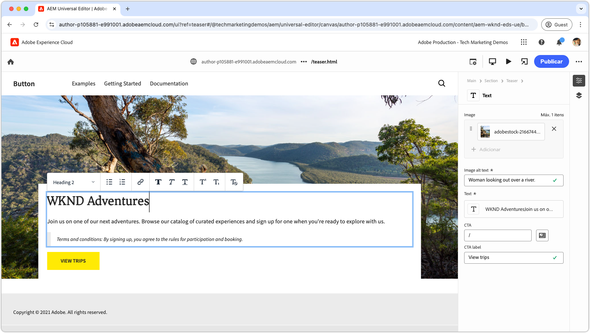
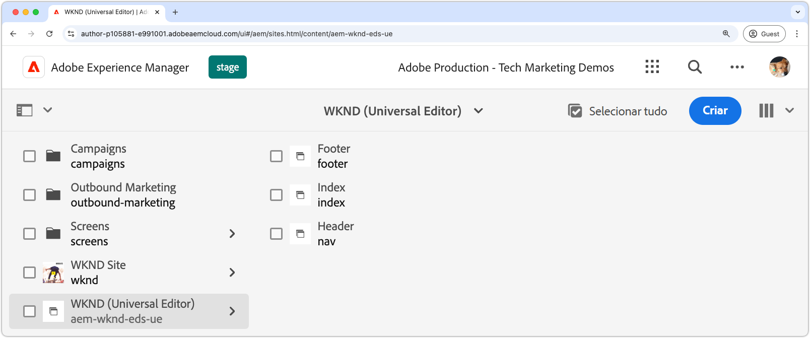
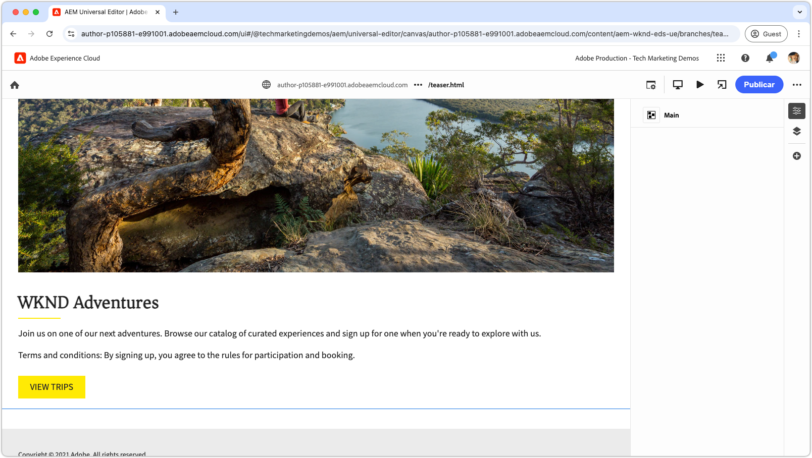
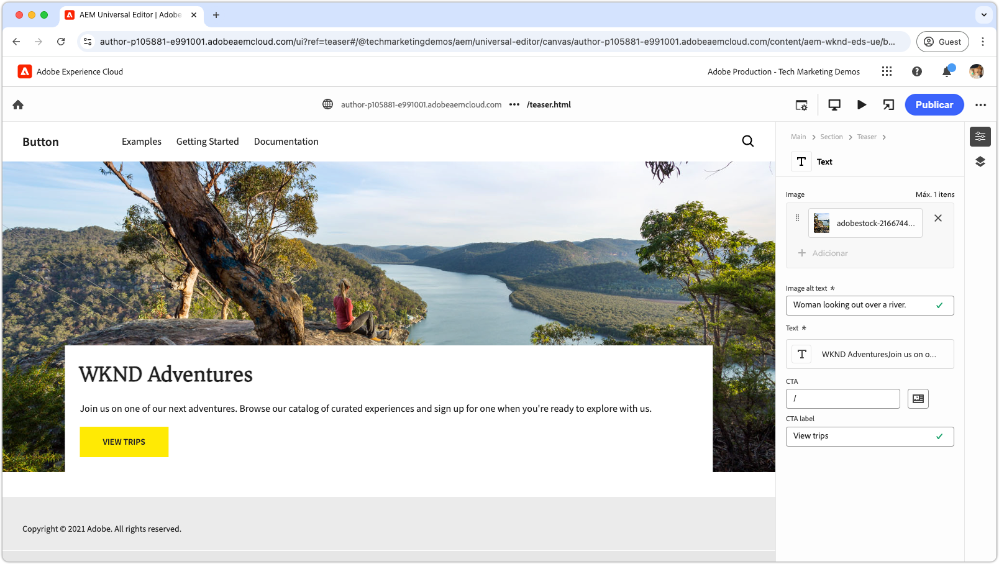
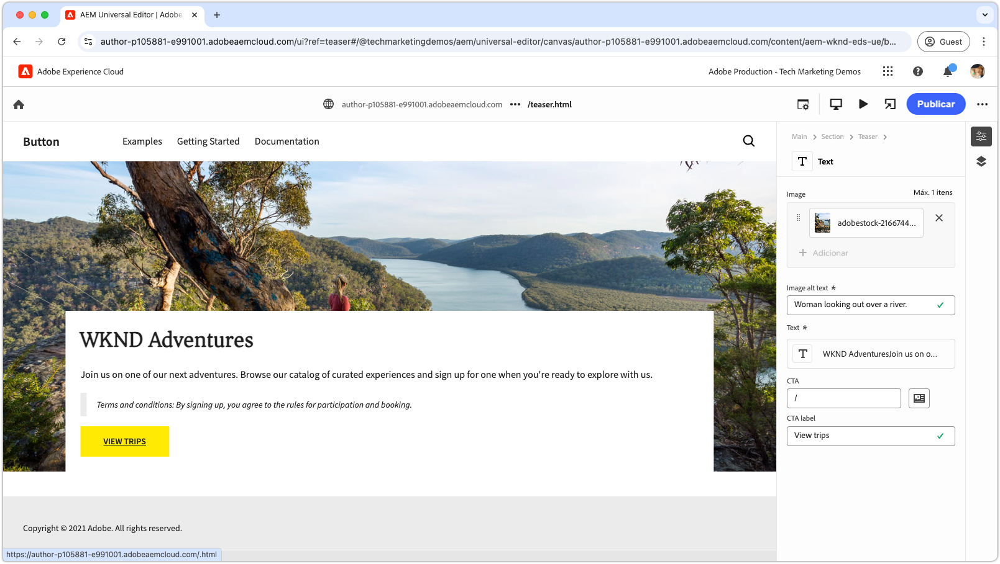
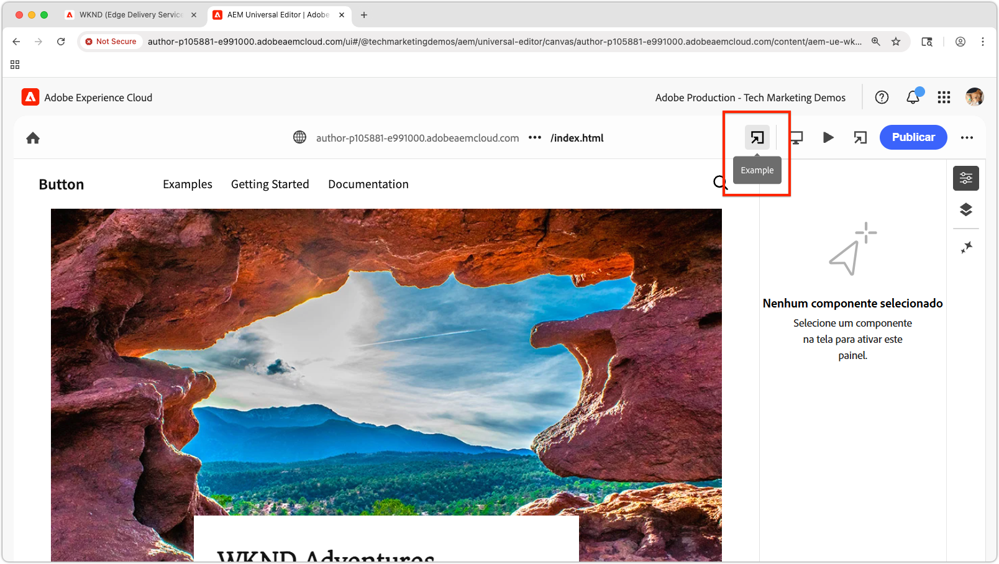

# Tutorial de desenvolvedor do Edge Delivery Services e do editor universal

Neste tutorial, você aprenderá os fundamentos da criação de um site do AEM que combine a criação avançada do editor universal e a entrega de alta velocidade do Edge Delivery Services. Após conclui-lo, você terá uma compreensão básica de como criar um novo projeto, configurar um ambiente de desenvolvimento local e criar um novo bloco.

## Configuração do projeto

Saiba como criar um projeto de código e configurar um novo site no AEM as a Cloud Service. Essa configuração permite o desenvolvimento contínuo com o editor universal para a criação de conteúdo e a entrega rápida por meio do Edge Delivery Services.

<!-- CARDS 

* ./1-new-code-project.md
* ./2-new-aem-site.md

-->
<!-- START CARDS HTML - DO NOT MODIFY BY HAND -->

    

        

            

                <figure class="image x-is-16by9">
                    
                </figure>
            

            

                

                    

                        <a href="./1-new-code-project.md" target="_blank" rel="referrer" title="Criar um projeto de código">Criar um projeto de código</a>
                    

                    
Crie um projeto de código para o Edge Delivery Services, editável por meio do editor universal.

                

                <a href="./1-new-code-project.md" target="_blank" rel="referrer" class="spectrum-Button spectrum-Button--outline spectrum-Button--primary spectrum-Button--sizeM" style="align-self: flex-start; margin-top: 1rem;">
                    Saiba mais
                </a>
            

        

    

    

        

            

                <figure class="image x-is-16by9">
                    
                </figure>
            

            

                

                    

                        <a href="./2-new-aem-site.md" target="_blank" rel="referrer" title="Criar um site do AEM">Criar um site do AEM</a>
                    

                    
Crie um site no AEM Sites para Edge Delivery Services que é editável por meio do editor universal.

                

                <a href="./2-new-aem-site.md" target="_blank" rel="referrer" class="spectrum-Button spectrum-Button--outline spectrum-Button--primary spectrum-Button--sizeM" style="align-self: flex-start; margin-top: 1rem;">
                    Saiba mais
                </a>
            

        

    

<!-- END CARDS HTML - DO NOT MODIFY BY HAND -->

## Configuração de desenvolvimento

Saiba como configurar o ambiente de desenvolvimento local para habilitar o desenvolvimento rápido do site. Essa configuração permite a criação contínua de sites com o editor universal e a entrega eficiente de conteúdo por meio do Edge Delivery Services, garantindo um fluxo de trabalho de desenvolvimento descomplicado e otimizado.
<!-- CARDS 

* ./3-local-development-environment.md
* ./4-website-branding.md

-->
<!-- START CARDS HTML - DO NOT MODIFY BY HAND -->

    

        

            

                <figure class="image x-is-16by9">
                    
                </figure>
            

            

                

                    

                        <a href="./3-local-development-environment.md" target="_blank" rel="referrer" title="Configurar um ambiente de desenvolvimento local">Configurar um ambiente de desenvolvimento local</a>
                    

                    
Configure um ambiente de desenvolvimento local para sites fornecidos pelo Edge Delivery Services que são editáveis no editor universal.

                

                <a href="./3-local-development-environment.md" target="_blank" rel="referrer" class="spectrum-Button spectrum-Button--outline spectrum-Button--primary spectrum-Button--sizeM" style="align-self: flex-start; margin-top: 1rem;">
                    Saiba mais
                </a>
            

        

    

    

        

            

                <figure class="image x-is-16by9">
                    
                </figure>
            

            

                

                    

                        <a href="./4-website-branding.md" target="_blank" rel="referrer" title="Adicionar identidade visual do site">Adicionar identidade visual do site</a>
                    

                    
Defina o CSS global, variáveis de CSS e fontes da web para um site do Edge Delivery Services.

                

                <a href="./4-website-branding.md" target="_blank" rel="referrer" class="spectrum-Button spectrum-Button--outline spectrum-Button--primary spectrum-Button--sizeM" style="align-self: flex-start; margin-top: 1rem;">
                    Saiba mais
                </a>
            

        

    

<!-- END CARDS HTML - DO NOT MODIFY BY HAND -->

## Desenvolvimento de bloco

Saiba como criar um novo bloco definindo seu modelo de conteúdo e configurando conteúdos de amostra para teste e desenvolvimento. Conheça dois métodos para renderizar o bloco e entenda como estruturá-lo para obter desempenho e flexibilidade ideais no AEM e no Edge Delivery Services.

<!-- CARDS 

* ./5-new-block.md {image = ./assets/5-new-block/card.png}
* ./6-author-block.md {image = ./assets/6-author-block/card.png}
* ./7a-block-css.md {image = ./assets/7a-block-css/card.png}
* ./7b-block-js-css.md {image = ./assets/7b-block-js-css/card.png}

-->
<!-- START CARDS HTML - DO NOT MODIFY BY HAND -->

    

        

            

                <figure class="image x-is-16by9">
                    
                </figure>
            

            

                

                    

                        <a href="./5-new-block.md" target="_blank" rel="referrer" title="Criar um bloco">Criar um bloco</a>
                    

                    
Crie um bloco para um site do Edge Delivery Services que seja editável com o editor universal.

                

                <a href="./5-new-block.md" target="_blank" rel="referrer" class="spectrum-Button spectrum-Button--outline spectrum-Button--primary spectrum-Button--sizeM" style="align-self: flex-start; margin-top: 1rem;">
                    Saiba mais
                </a>
            

        

    

    

        

            

                <figure class="image x-is-16by9">
                    
                </figure>
            

            

                

                    

                        <a href="./6-author-block.md" target="_blank" rel="referrer" title="Criar um bloco">Criar um bloco</a>
                    

                    
Crie um bloco do Edge Delivery Services com o editor universal.

                

                <a href="./6-author-block.md" target="_blank" rel="referrer" class="spectrum-Button spectrum-Button--outline spectrum-Button--primary spectrum-Button--sizeM" style="align-self: flex-start; margin-top: 1rem;">
                    Saiba mais
                </a>
            

        

    

    

        

            

                <figure class="image x-is-16by9">
                    
                </figure>
            

            

                

                    

                        <a href="./7a-block-css.md" target="_blank" rel="referrer" title="Desenvolver um bloco com CSS">Desenvolver um bloco com CSS</a>
                    

                    
Desenvolva um bloco com CSS para o Edge Delivery Services, o qual seja editável por meio do editor universal.

                

                <a href="./7a-block-css.md" target="_blank" rel="referrer" class="spectrum-Button spectrum-Button--outline spectrum-Button--primary spectrum-Button--sizeM" style="align-self: flex-start; margin-top: 1rem;">
                    Saiba mais
                </a>
            

        

    

    

        

            

                <figure class="image x-is-16by9">
                    
                </figure>
            

            

                

                    

                        <a href="./7b-block-js-css.md" target="_blank" rel="referrer" title="Desenvolver um bloco com CSS e JS">Desenvolver um bloco com CSS e JS</a>
                    

                    
Desenvolva um bloco com CSS e JavaScript para o Edge Delivery Services, o qual seja editável por meio do editor universal.

                

                <a href="./7b-block-js-css.md" target="_blank" rel="referrer" class="spectrum-Button spectrum-Button--outline spectrum-Button--primary spectrum-Button--sizeM" style="align-self: flex-start; margin-top: 1rem;">
                    Saiba mais
                </a>
            

        

    

<!-- END CARDS HTML - DO NOT MODIFY BY HAND -->

## Próximas etapas

Agora que você concluiu este tutorial, pratique o que aprendeu com estas instruções específicas. Esses guias expandem o código e os conceitos abordados aqui, explorando casos de uso específicos de função, técnicas avançadas e dicas adicionais para aprimorar suas habilidades de desenvolvimento no Edge Delivery Services e no editor universal.

<!-- CARDS 

* ./how-to/block-options.md
* ./how-to/header-and-footer.md
* ./how-to/local-extension-preview.md {image = ./how-to/assets/local-extension-preview/extension-loaded.png}

-->
<!-- START CARDS HTML - DO NOT MODIFY BY HAND -->

    

        

            

                <figure class="image x-is-16by9">
                    
                </figure>
            

            

                

                    

                        <a href="./how-to/block-options.md" target="_blank" rel="referrer" title="Opções de bloco">Opções de bloco</a>
                    

                    
Saiba como criar um bloco com várias opções de exibição.

                

                <a href="./how-to/block-options.md" target="_blank" rel="referrer" class="spectrum-Button spectrum-Button--outline spectrum-Button--primary spectrum-Button--sizeM" style="align-self: flex-start; margin-top: 1rem;">
                    Saiba mais
                </a>
            

        

    

    

        

            

                <figure class="image x-is-16by9">
                    
                </figure>
            

            

                

                    

                        <a href="./how-to/header-and-footer.md" target="_blank" rel="referrer" title="Cabeçalho e rodapé">Cabeçalho e rodapé</a>
                    

                    
Saiba como o cabeçalho e os rodapés são desenvolvidos no Edge Delivery Services e no editor universal.

                

                <a href="./how-to/header-and-footer.md" target="_blank" rel="referrer" class="spectrum-Button spectrum-Button--outline spectrum-Button--primary spectrum-Button--sizeM" style="align-self: flex-start; margin-top: 1rem;">
                    Saiba mais
                </a>
            

        

    

    

        

            

                <figure class="image x-is-16by9">
                    
                </figure>
            

            

                

                    

                        <a href="./how-to/local-extension-preview.md" target="_blank" rel="referrer" title="Visualizar uma extensão do editor universal">Visualizar uma extensão do editor universal</a>
                    

                    
Saiba como visualizar uma extensão do editor universal executado localmente durante o desenvolvimento.

                

                <a href="./how-to/local-extension-preview.md" target="_blank" rel="referrer" class="spectrum-Button spectrum-Button--outline spectrum-Button--primary spectrum-Button--sizeM" style="align-self: flex-start; margin-top: 1rem;">
                    Saiba mais
                </a>
            

        

    

<!-- END CARDS HTML - DO NOT MODIFY BY HAND -->
