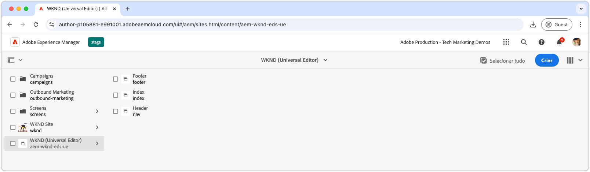

# Tutorial do desenvolvedor do Edge Delivery Services e do Universal Editor

Neste tutorial, você aprenderá os fundamentos da criação de um site de AEM que combine criação poderosa com Universal Editor e entrega ultrarrápida usando Edge Delivery Services. Ao final, você terá uma compreensão básica de como criar um novo projeto, configurar um ambiente de desenvolvimento local e criar um novo bloco.

## Configuração do projeto

Saiba como criar um projeto de código e configurar um novo site no AEM as a Cloud Service. Essa configuração permite o desenvolvimento contínuo com o Editor universal para a criação de conteúdo e a entrega rápida de conteúdo por meio do Edge Delivery Services.

<!-- CARDS 

* ./1-new-code-project.md
  {}
* ./2-new-aem-site.md

-->
<!-- START CARDS HTML - DO NOT MODIFY BY HAND -->

    

        

            

                <figure class="image x-is-16by9">
                    
                </figure>
            

            

                

                    

                        <a href="./1-new-code-project.md" target="_blank" rel="referrer" title="Criar um novo projeto">Criar um novo projeto</a>
                    

                    
Criar um novo projeto para o Edge Delivery Services para o Universal Editor

                

                <a href="./1-new-code-project.md" target="_blank" rel="referrer" class="spectrum-Button spectrum-Button--outline spectrum-Button--primary spectrum-Button--sizeM" style="align-self: flex-start; margin-top: 1rem;">
                    Saiba mais
                </a>
            

        

    

    

        

            

                <figure class="image x-is-16by9">
                    
                </figure>
            

            

                

                    

                        <a href="./2-new-aem-site.md" target="_blank" rel="referrer" title="Criar um novo site">Criar um novo site</a>
                    

                    
Criar um novo site no AEM Sites para Edge Delivery Services para Universal Editor

                

                <a href="./2-new-aem-site.md" target="_blank" rel="referrer" class="spectrum-Button spectrum-Button--outline spectrum-Button--primary spectrum-Button--sizeM" style="align-self: flex-start; margin-top: 1rem;">
                    Saiba mais
                </a>
            

        

    

<!-- END CARDS HTML - DO NOT MODIFY BY HAND -->

## Configuração de desenvolvimento

Saiba como configurar o ambiente de desenvolvimento local para permitir o desenvolvimento rápido do site. Essa configuração permite a criação contínua de sites com o Editor universal e a entrega eficiente de conteúdo por meio de Edge Delivery Services, garantindo um fluxo de trabalho de desenvolvimento suave e otimizado.
<!-- CARDS 

* ./3-local-development-environment.md
* ./4-website-branding.md

-->
<!-- START CARDS HTML - DO NOT MODIFY BY HAND -->

    

        

            

                <figure class="image x-is-16by9">
                    
                </figure>
            

            

                

                    

                        <a href="./3-local-development-environment.md" target="_blank" rel="referrer" title="Configurar um ambiente de desenvolvimento local">Configurar um ambiente de desenvolvimento local</a>
                    

                    
Criar um novo projeto para o Edge Delivery Services para o Universal Editor

                

                <a href="./3-local-development-environment.md" target="_blank" rel="referrer" class="spectrum-Button spectrum-Button--outline spectrum-Button--primary spectrum-Button--sizeM" style="align-self: flex-start; margin-top: 1rem;">
                    Saiba mais
                </a>
            

        

    

    

        

            

                <figure class="image x-is-16by9">
                    
                </figure>
            

            

                

                    

                        <a href="./4-website-branding.md" target="_blank" rel="referrer" title="Identidade visual do site">Identidade visual do site</a>
                    

                    
Configure CSS global, variáveis CSS e fontes da Web.

                

                <a href="./4-website-branding.md" target="_blank" rel="referrer" class="spectrum-Button spectrum-Button--outline spectrum-Button--primary spectrum-Button--sizeM" style="align-self: flex-start; margin-top: 1rem;">
                    Saiba mais
                </a>
            

        

    

<!-- END CARDS HTML - DO NOT MODIFY BY HAND -->

## Desenvolvimento em bloco

Saiba como criar um novo bloco definindo seu modelo de conteúdo e configurando conteúdos de amostra para teste e desenvolvimento. Explore dois métodos para renderizar o bloco e entenda como estruturá-lo para obter o desempenho e a flexibilidade ideais no AEM e no Edge Delivery Services.

<!-- CARDS 

* ./5-new-block.md
* ./6-author-block.md
* ./7a-block-css.md
* ./7b-block-js-css.md

-->
<!-- START CARDS HTML - DO NOT MODIFY BY HAND -->

    

        

            

                <figure class="image x-is-16by9">
                    
                </figure>
            

            

                

                    

                        <a href="./5-new-block.md" target="_blank" rel="referrer" title="Criar um novo bloco para o Editor Universal">Criar um novo bloco para o Editor Universal</a>
                    

                    
Criar um novo bloco.

                

                <a href="./5-new-block.md" target="_blank" rel="referrer" class="spectrum-Button spectrum-Button--outline spectrum-Button--primary spectrum-Button--sizeM" style="align-self: flex-start; margin-top: 1rem;">
                    Saiba mais
                </a>
            

        

    

    

        

            

                <figure class="image x-is-16by9">
                    
                </figure>
            

            

                

                    

                        <a href="./6-author-block.md" target="_blank" rel="referrer" title="Criar o bloco">Criar o bloco</a>
                    

                    
Crie o novo bloco para que ele possa se desenvolver contra ele.

                

                <a href="./6-author-block.md" target="_blank" rel="referrer" class="spectrum-Button spectrum-Button--outline spectrum-Button--primary spectrum-Button--sizeM" style="align-self: flex-start; margin-top: 1rem;">
                    Saiba mais
                </a>
            

        

    

    

        

            

                <figure class="image x-is-16by9">
                    
                </figure>
            

            

                

                    

                        <a href="./7a-block-css.md" target="_blank" rel="referrer" title="Desenvolvimento de blocos com CSS">Bloquear desenvolvimento com CSS</a>
                    

                    
Crie o bloco usando apenas CSS.

                

                <a href="./7a-block-css.md" target="_blank" rel="referrer" class="spectrum-Button spectrum-Button--outline spectrum-Button--primary spectrum-Button--sizeM" style="align-self: flex-start; margin-top: 1rem;">
                    Saiba mais
                </a>
            

        

    

    

        

            

                <figure class="image x-is-16by9">
                    
                </figure>
            

            

                

                    

                        <a href="./7b-block-js-css.md" target="_blank" rel="referrer" title="Desenvolvimento de blocos com CSS e JS">Bloquear desenvolvimento com CSS e JS</a>
                    

                    
Crie um bloco usando CSS e JS.

                

                <a href="./7b-block-js-css.md" target="_blank" rel="referrer" class="spectrum-Button spectrum-Button--outline spectrum-Button--primary spectrum-Button--sizeM" style="align-self: flex-start; margin-top: 1rem;">
                    Saiba mais
                </a>
            

        

    

<!-- END CARDS HTML - DO NOT MODIFY BY HAND -->
