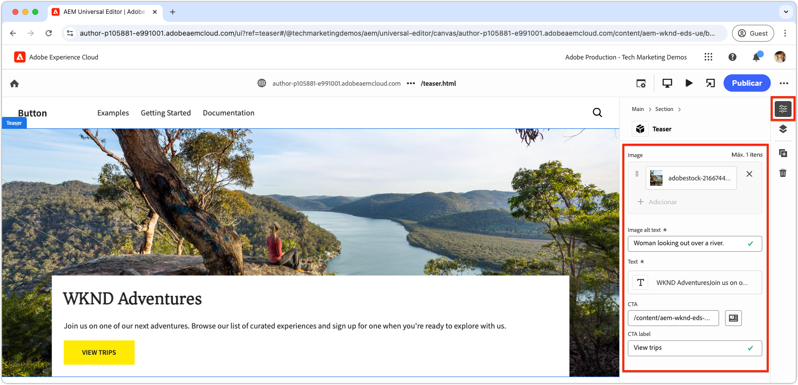
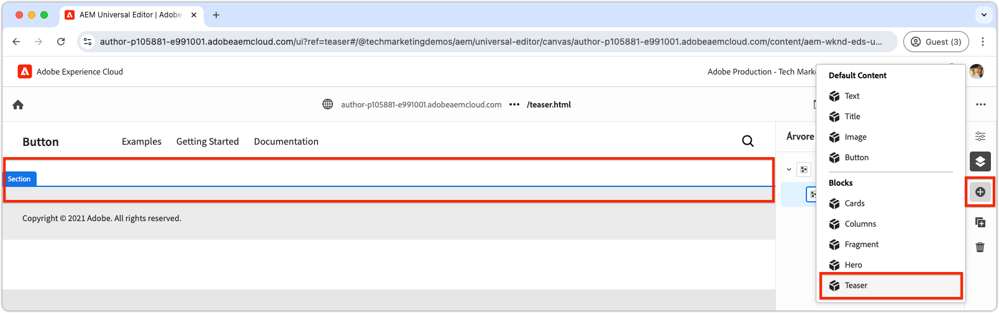

# Criar um novo bloco

Este capítulo aborda o processo de criação de um novo bloco de teaser editável para um site Edge Delivery Services usando o Editor universal.


O bloco, chamado `teaser`, mostra os seguintes elementos:

- **Imagem**: uma imagem visualmente envolvente.
- **Conteúdo do texto**:
   - **Título**: um título convincente para chamar a atenção.
   - **Corpo de texto**: conteúdo descritivo que fornece contexto ou detalhes, incluindo termos e condições opcionais.
   - **Botão de chamada para ação (CTA)**: um link criado para solicitar interação do usuário e orientá-lo para maior engajamento.

O conteúdo do bloco `teaser` é editável no Universal Editor, garantindo facilidade de uso e reutilização em todo o site.

Observe que o bloco `teaser` é semelhante ao bloco `hero` do modelo; portanto, o bloco `teaser` serve apenas como um exemplo simples para ilustrar conceitos de desenvolvimento.

## Criar uma nova ramificação Git

Para manter um fluxo de trabalho limpo e organizado, crie uma nova ramificação para cada tarefa de desenvolvimento específica. Isso ajuda a evitar problemas com a implantação de código incompleto ou não testado na produção.

1. **Iniciar a partir da ramificação principal**: trabalhar a partir do código de produção mais atualizado garante uma base sólida.
2. **Buscar alterações remotas**: buscar as atualizações mais recentes do GitHub garante que o código mais atual esteja disponível antes de iniciar o desenvolvimento.
   - Exemplo: após mesclar as alterações da ramificação `wknd-styles` no `main`, obtenha as atualizações mais recentes.
3. **Criar uma nova ramificação**:

```bash
# ~/Code/aem-wknd-eds-ue

$ git fetch origin  
$ git checkout -b teaser origin/main  
```

Depois que a ramificação `teaser` for criada, você estará pronto para começar a desenvolver o bloco de teaser.

## Bloquear pasta

Crie uma nova pasta chamada `teaser` no diretório `blocks` do projeto. Esta pasta contém os arquivos JSON, CSS e JavaScript do bloco, organizando os arquivos do bloco em um local:

```
# ~/Code/aem-wknd-eds-ue

/blocks/teaser
```

O nome da pasta de blocos atua como a ID do bloco e é usado para fazer referência ao bloco em todo o desenvolvimento.

## Bloquear JSON

O bloco JSON define três aspectos principais do bloco:

- **Definição**: registra o bloco como um componente editável no Editor Universal, vinculando-o a um modelo de bloco e, opcionalmente, a um filtro.
- **Modelo**: especifica os campos de criação do bloco e como esses campos são renderizados como HTML Edge Delivery Services semântico.
- **Filtro**: configura as regras de filtragem para restringir a quais contêineres o bloco pode ser adicionado por meio do Editor Universal. A maioria dos blocos não é contêiner, mas suas IDs são adicionadas aos filtros de outros blocos de contêiner.

Crie um novo arquivo em `/blocks/teaser/_teaser.json` com a seguinte estrutura inicial, na ordem exata. Se as chaves estiverem fora de ordem, elas talvez não sejam criadas corretamente.

[!BADGE /blocks/teaser/_teaser.json]{type=Neutral tooltip="Nome do arquivo da amostra de código abaixo."}

```json
{
    "definitions": [],
    "models": [],
    "filters": []
}
```

### Bloquear modelo

O modelo de bloco é uma parte crítica da configuração do bloco, pois define:

1. A experiência de criação definindo os campos disponíveis para edição.

   

2. Como os valores do campo são renderizados em HTML Edge Delivery Services.

Aos modelos é atribuído um `id` que corresponde à definição do [bloco](#block-definition) e inclui uma matriz `fields` para especificar os campos editáveis.

Cada campo na matriz `fields` tem um objeto JSON que inclui as seguintes propriedades necessárias:

| propriedade JSON | Descrição |
|---------------|-----------------------------------------------------------------------------------------------------------------------|
| `component` | O [tipo de campo](https://experienceleague.adobe.com/en/docs/experience-manager-cloud-service/content/implementing/developing/universal-editor/field-types#component-types), como `text`, `reference` ou `aem-content`. |
| `name` | O nome do campo, mapeando para a propriedade JCR em que o valor está armazenado no AEM. |
| `label` | O rótulo exibido para autores no Editor universal. |

Para obter uma lista abrangente de propriedades, incluindo opcionais, reveja a [documentação de campos do Editor Universal](https://experienceleague.adobe.com/en/docs/experience-manager-cloud-service/content/implementing/developing/universal-editor/field-types#fields).

#### Design de bloco


O bloco de teaser inclui os seguintes elementos editáveis:

1. **Imagem**: representa o conteúdo visual do teaser.
2. **Conteúdo de texto**: inclui o título, o texto do corpo e o botão de frase de chamariz, e fica em um retângulo branco.
   - O **título** e o **corpo de texto** podem ser criados por meio do mesmo editor de rich text.
   - O **CTA** pode ser criado por meio de um campo `text` para o **rótulo**, e um campo `aem-content` para o **link**.

O design do bloco de teaser é dividido nesses dois componentes lógicos (imagem e conteúdo de texto), garantindo uma experiência de criação estruturada e intuitiva para os usuários.

### Bloquear campos

Defina os campos necessários para o bloco: imagem, texto alternativo da imagem, texto, rótulo do CTA e link do CTA.

>[!BEGINTABS]

>[!TAB Do jeito certo]

**Esta guia ilustra a maneira correta de modelar o bloco do teaser.**

O teaser consiste em duas áreas lógicas: imagem e texto. Para simplificar o código necessário para exibir o HTML Edge Delivery Services como a experiência da Web desejada, o modelo de bloco deve refletir essa estrutura.

- Agrupe o **imagem** e o **texto alternativo de imagem** usando o [recolhimento de campo](https://experienceleague.adobe.com/en/docs/experience-manager-cloud-service/content/edge-delivery/wysiwyg-authoring/content-modeling#field-collapse).
- Agrupe os campos de conteúdo de texto usando o [agrupamento de elementos](https://experienceleague.adobe.com/en/docs/experience-manager-cloud-service/content/edge-delivery/wysiwyg-authoring/content-modeling#element-grouping) e o [recolhimento de campos para o CTA](https://experienceleague.adobe.com/en/docs/experience-manager-cloud-service/content/edge-delivery/wysiwyg-authoring/content-modeling#field-collapse).

Se você não estiver familiarizado com [recolhimento de campo](https://experienceleague.adobe.com/en/docs/experience-manager-cloud-service/content/edge-delivery/wysiwyg-authoring/content-modeling#field-collapse), [agrupamento de elementos](https://experienceleague.adobe.com/en/docs/experience-manager-cloud-service/content/edge-delivery/wysiwyg-authoring/content-modeling#element-grouping) ou [inferência de tipo](https://experienceleague.adobe.com/en/docs/experience-manager-cloud-service/content/edge-delivery/wysiwyg-authoring/content-modeling#type-inference), revise a documentação vinculada antes de continuar, pois elas são essenciais para criar um modelo de bloco bem estruturado.

[!BADGE /blocks/teaser/_teaser.json]{type=Neutral tooltip="Nome do arquivo da amostra de código abaixo."}

```json
{
    "definitions": [],
    "models": [
        {
            "id": "teaser", 
            "fields": [
                {
                    "component": "reference",
                    "valueType": "string",
                    "name": "image",
                    "label": "Image",
                    "multi": false
                },
                {
                    "component": "text",
                    "valueType": "string",
                    "name": "imageAlt",
                    "label": "Image alt text",
                    "required": true
                },
                {
                    "component": "richtext",
                    "name": "textContent_text",
                    "label": "Text",
                    "valueType": "string",
                    "required": true
                },
                {
                    "component": "aem-content",
                    "name": "textContent_cta",
                    "label": "CTA",
                    "valueType": "string"
                },
                {
                    "component": "text",
                    "name": "textContent_ctaText",
                    "label": "CTA label",
                    "valueType": "string"
                }
            ]
        }
    ],
    "filters": []
}
```

Esse modelo define as entradas de criação no Universal Editor para o bloco.

O HTML Edge Delivery Services resultante desse bloco coloca a imagem na primeira div e os campos do grupo de elementos `textContent` na segunda div.

```html
<div>
    <div>
        <!-- This div contains the field-collapsed image fields  -->
        <picture>
            ...
            <source .../>            
            
        </picture>
    </div>
    <div>
        <!-- This div, via element grouping contains the textContent fields -->
        <h2>The authored title</h2>
        <p>The authored body text</p>
        <a href="/authored/cta/link">The authored CTA label</a>
    </div>
</div>        
```

Como demonstrado [no próximo capítulo](./7a-block-css.md), essa estrutura de HTML simplifica o estilo do bloco como uma unidade coesa.

Para entender as consequências de não usar o recolhimento de campo e o agrupamento de elementos, consulte a guia **Da maneira errada** acima.

>[!TAB Do jeito errado]

**Esta guia ilustra uma maneira não ideal de modelar o bloco de teaser e é apenas uma justaposição à maneira correta.**

Pode parecer tentador definir cada campo como um campo autônomo no modelo de bloco sem usar [recolhimento de campo](https://experienceleague.adobe.com/en/docs/experience-manager-cloud-service/content/edge-delivery/wysiwyg-authoring/content-modeling#field-collapse) e [agrupamento de elementos](https://experienceleague.adobe.com/en/docs/experience-manager-cloud-service/content/edge-delivery/wysiwyg-authoring/content-modeling#element-grouping). No entanto, esse descuido complica a estilização do bloco como uma unidade coesa.

Por exemplo, o modelo de teaser pode ser definido **sem** recolhimento de campos ou agrupamento de elementos da seguinte maneira:

[!BADGE /blocks/teaser/_teaser.json]{type=Neutral tooltip="Nome do arquivo da amostra de código abaixo."}

```json
{
    "definitions": [],
    "models": [
        {
            "id": "teaser", 
            "fields": [
                {
                    "component": "reference",
                    "valueType": "string",
                    "name": "image",
                    "label": "Image",
                    "multi": false
                },
                {
                    "component": "text",
                    "valueType": "string",
                    "name": "alt",
                    "label": "Image alt text",
                    "required": true
                },
                {
                    "component": "richtext",
                    "name": "text",
                    "label": "Text",
                    "valueType": "string",
                    "required": true
                },
                {
                    "component": "aem-content",
                    "name": "link",
                    "label": "CTA",
                    "valueType": "string"
                },
                {
                    "component": "text",
                    "name": "label",
                    "label": "CTA label",
                    "valueType": "string"
                }
            ]
        }
    ],
    "filters": []
}
```

O HTML Edge Delivery Services para o bloco renderiza o valor de cada campo em um `div` separado, complicando a compreensão do conteúdo, a aplicação do estilo e os ajustes de estrutura HTML para alcançar o design desejado.

```html
<div>
    <div>
        <!-- This div contains the field-collapsed image  -->
        <picture>
            ...
            <source .../>            
            
        </picture>
    </div>
    <div>
        <p>The authored alt text</p>
    </div>
    <div>
        <h2>The authored title</h2>
        <p>The authored body text</p>
    </div>
    <div>
        <a href="/authored/cta/link">/authored/cta/link</a>
    </div>
    <div>
        The authored CTA label
    </div>
</div>        
```

Cada campo é isolado em seu próprio `div`, tornando difícil estilizar a imagem e o conteúdo do texto como unidades coesas. É possível atingir o design desejado com esforço e criatividade, mas usar o [agrupamento de elementos](https://experienceleague.adobe.com/en/docs/experience-manager-cloud-service/content/edge-delivery/wysiwyg-authoring/content-modeling#element-grouping) para agrupar campos de conteúdo de texto e o [recolhimento de campos](https://experienceleague.adobe.com/en/docs/experience-manager-cloud-service/content/edge-delivery/wysiwyg-authoring/content-modeling#field-collapse) para adicionar valores criados como atributos de elemento é mais simples, mais fácil e semanticamente correto.

Consulte a guia **Write Way** acima para saber como modelar melhor o bloco do teaser.

>[!ENDTABS]


### Definição de bloco

A definição de bloco registra o bloco no Editor Universal. Veja a seguir um detalhamento das propriedades JSON usadas na definição do bloco:

| propriedade JSON | Descrição |
|---------------|-------------|
| `definition.title` | O título do bloco como ele é exibido nos blocos **Adicionar** do Editor Universal. |
| `definition.id` | Um identificador exclusivo para o bloco, usado para controlar seu uso em `filters`. |
| `definition.plugins.xwalk.page.resourceType` | Define o tipo de recurso Sling para renderizar o componente no Editor universal. Sempre use um tipo de recurso `core/franklin/components/block/v#/block`. |
| `definition.plugins.xwalk.page.template.name` | O nome do bloco. Ele deve estar em minúsculas e hifenizado para corresponder ao nome da pasta do bloco. Esse valor também é usado para rotular a instância do bloco no Editor universal. |
| `definition.plugins.xwalk.page.template.model` | Vincula esta definição à sua definição `model`, que controla os campos de criação exibidos para o bloco no Editor Universal. O valor aqui deve corresponder a um valor de `model.id`. |

Este é um exemplo de JSON para a definição de bloco:

[!BADGE /blocks/teaser/_teaser.json]{type=Neutral tooltip="Nome do arquivo da amostra de código abaixo."}

```json
{
    "definitions": [{
      "title": "Teaser",
      "id": "teaser",
      "plugins": {
        "xwalk": {
          "page": {
            "resourceType": "core/franklin/components/block/v1/block",
            "template": {
              "name": "Teaser",
              "model": "teaser",
              "textContent_text": "<h2>Enter a title</h2><p>...and body text here!</p>",
              "textContent_cta": "/",
              "textContent_ctaText": "Click me!"
            }
          }
        }
      }
    }],
    "models": [... from previous section ...],
    "filters": []
}
```

Neste exemplo:

- O bloco é denominado &quot;Teaser&quot; e usa o modelo `teaser` que determina quais campos estão disponíveis para edição no Editor Universal.
- O bloco inclui conteúdo padrão para o campo `textContent_text`, que é uma área de rich text para o título e o corpo de texto, e `textContent_cta` e `textContent_ctaText` para o link e rótulo da CTA (chamada para ação). Os nomes de campos do modelo que contêm conteúdo inicial correspondem aos nomes de campos definidos na [matriz de campos do modelo de conteúdo](#block-model);

Essa estrutura garante que o bloco seja configurado no Editor universal com os campos, o modelo de conteúdo e o tipo de recurso adequados para renderização.

### Bloquear filtros

A matriz `filters` do bloco define, para [blocos de contêiner](https://experienceleague.adobe.com/en/docs/experience-manager-cloud-service/content/edge-delivery/wysiwyg-authoring/content-modeling#container), quais outros blocos podem ser adicionados ao contêiner. Os filtros definem uma lista de IDs de bloco (`model.id`) que podem ser adicionadas ao contêiner.

[!BADGE /blocks/teaser/_teaser.json]{type=Neutral tooltip="Nome do arquivo da amostra de código abaixo."}

```json
{
  "definitions": [... populated from previous section ...],
  "models": [... populated from previous section ...],
  "filters": []
}
```

O componente de teaser não é um [bloco de contêiner](https://experienceleague.adobe.com/en/docs/experience-manager-cloud-service/content/edge-delivery/wysiwyg-authoring/content-modeling#container), o que significa que não é possível adicionar outros blocos a ele. Como resultado, sua matriz `filters` é deixada vazia. Em vez disso, adicione a ID do teaser à lista de filtros do bloco de seção para que o teaser possa ser adicionado a uma seção.



Blocos fornecidos pelo Adobe, como o bloco de seção, armazenam filtros na pasta `models` do projeto. Para ajustar, localize o arquivo JSON para o bloco fornecido pelo Adobe (por exemplo, `/models/_section.json`) e adicione a ID do teaser (`teaser`) à lista de filtros. A configuração sinaliza ao Editor universal que o componente de teaser pode ser adicionado ao bloco do container da seção.

[!BADGE /models/_section.json]{type=Neutral tooltip="Nome do arquivo da amostra de código abaixo."}

```json
{
  "definitions": [],
  "models": [],
  "filters": [
    {
      "id": "section",
      "components": [
        "text",
        "image",
        "button",
        "title",
        "hero",
        "cards",
        "columns",
        "fragment",
        "teaser"
      ]
    }
  ]
}
```

A ID de definição de bloco de teaser de `teaser` foi adicionada à matriz `components`.

## Implante seus arquivos JSON

Verifique se você [vincula com frequência](./3-local-development-environment.md#linting) suas alterações para garantir que elas sejam limpas e consistentes. A impressão com frequência ajuda a detectar problemas antecipadamente e reduz o tempo geral de desenvolvimento. O comando `npm run lint:js` também vincula arquivos JSON e captura todos os erros de sintaxe.

```bash
# ~/Code/aem-wknd-eds-ue

$ npm run lint:js
```

## Criar o JSON do projeto

Após configurar os arquivos JSON de bloco (`blocks/teaser/_teaser.json`, `models/_section.json`), eles devem ser compilados nos arquivos `component-models.json`, `component-definitions.json` e `component-filters.json` do projeto. A compilação é feita executando a [compilação JSON](./3-local-development-environment.md#build-json-fragments) npm de scripts do projeto.

```bash
# ~/Code/aem-wknd-eds-ue

$ npm run build:json
```

## Implantar a definição de bloco

Para disponibilizar o bloco no Editor Universal, o projeto deve ser confirmado e enviado para a ramificação de um repositório GitHub, neste caso, a ramificação `teaser`.

O nome exato da ramificação que o Universal Editor usa pode ser ajustado, por usuário, através do URL do Universal Editor.

```bash
# ~/Code/aem-wknd-eds-ue

$ git add .
$ git commit -m "Add teaser block JSON files so it is available in Universal Editor"
$ git push origin teaser
```

Quando o Editor Universal é aberto com o parâmetro de consulta `?ref=teaser`, o novo bloco `teaser` aparece na paleta de blocos. Observe que o bloco não tem estilo; ele renderiza os campos do bloco como HTML semântico, estilizado somente por meio do [global CSS](./4-website-branding.md#global-css).
