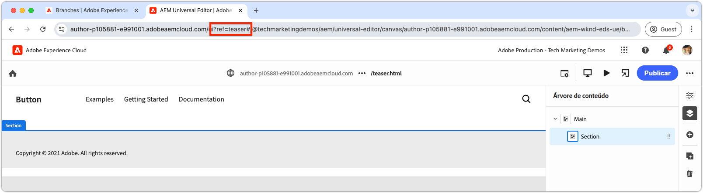

# Criar um bloco

Depois de enviar o [JSON do bloco de teaser](./5-new-block.md) para a ramificação `teaser`, o bloco torna-se editável no AEM Universal Editor.

A criação de um bloco em desenvolvimento é importante por vários motivos:

1. Ele verifica se a definição e o modelo do bloco são precisos.
1. Ele permite que os desenvolvedores revisem o HTML semântico do bloco, que serve como base para o desenvolvimento.
1. Ela permite a implantação do conteúdo e do HTML semântico no ambiente de visualização, oferecendo suporte ao desenvolvimento de blocos mais rápido.

## Abrir Editor Universal usando código da ramificação `teaser`

1. Faça logon no AEM Author.
2. Navegue até **Sites** e selecione o site (WKND (Universal Editor)) criado no [capítulo anterior](./2-new-aem-site.md).

   

3. Crie ou edite uma página para adicionar o novo bloco, garantindo que o contexto esteja disponível para oferecer suporte ao desenvolvimento local. Embora as páginas possam ser criadas em qualquer lugar no site, geralmente é melhor criar páginas separadas para cada novo corpo de trabalho. Crie uma nova página de &quot;pasta&quot; chamada **Ramificações**. Cada subpágina é usada para suportar o desenvolvimento da ramificação Git de mesmo nome.

   

4. Na página **Ramificações**, crie uma nova página denominada **Teaser**, que corresponda ao nome da ramificação de desenvolvimento, e clique em **Abrir** para editar a página.

   

5. Atualize o Editor Universal para carregar o código da ramificação `teaser` adicionando `?ref=teaser` à URL. Certifique-se de adicionar o parâmetro de consulta **ANTES** o símbolo `#`.

   

6. Selecione a primeira seção em **Principal**, clique no botão **adicionar** e escolha o bloco **Teaser**.

   

7. Na tela, selecione o teaser recém-adicionado e crie os campos à direita ou por meio do recurso de edição em linha.

   

8. Após concluir a criação, clique no botão **Publicar** na parte superior direita do Universal Editor, escolha Publicar na **Visualização** e publique as alterações no ambiente de visualização. As alterações são publicadas no domínio `aem.page` do site.
   

9. Aguarde as alterações para publicar para visualização e, em seguida, abra a página da Web pela [CLI do AEM](./3-local-development-environment.md#install-the-aem-cli) em [http://localhost:3000/branches/teaser](http://localhost:3000/branches/teaser).

   

Agora, o conteúdo do bloco de teaser criado e o HTML semântico estão disponíveis no site de visualização, prontos para desenvolvimento usando a CLI do AEM no ambiente de desenvolvimento local.
