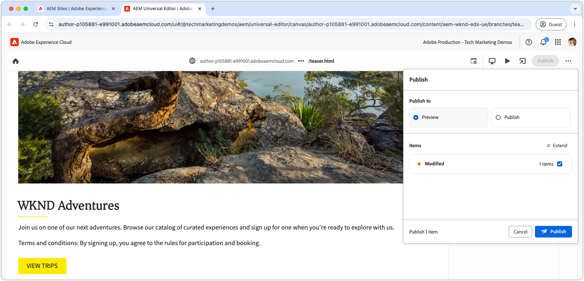

# Criar um bloco

Depois de enviar o [JSON do bloco de teaser](./5-new-block.md) à ramificação `teaser`, o bloco torna-se editável no editor universal do AEM.

A criação de um bloco em desenvolvimento é importante por vários motivos:

1. Isso confirma se a definição e o modelo do bloco estão corretos.
1. Permite que os desenvolvedores revisem o HTML semântico do bloco, o que serve de base para o desenvolvimento.
1. Permite a implantação do conteúdo e do HTML semântico no ambiente de visualização, permitindo um desenvolvimento mais rápido do bloco.

## Abrir o editor universal com o código da ramificação `teaser`

1. Faça logon no ambiente de criação do AEM.
2. Navegue até **Sites** e selecione o site (WKND (editor universal)) criado no [capítulo anterior](./2-new-aem-site.md).

   

3. Crie ou edite uma página para adicionar o novo bloco, certificando-se de que o contexto esteja disponível para permitir o desenvolvimento local. Embora seja possível criar páginas em qualquer lugar do site, é recomendado criar páginas separadas para cada novo trabalho. Crie uma nova página de “pasta” denominada **Ramificações**. Cada subpágina auxilia no desenvolvimento da ramificação do Git com o mesmo nome.

   

4. Na página **Ramificações**, crie uma nova página denominada **Teaser**, correspondente ao nome da ramificação de desenvolvimento, e clique em **Abrir** para editar a página.

   

5. Atualize o editor universal para carregar o código da ramificação `teaser`, adicionando `?ref=teaser` ao URL. Certifique-se de adicionar o parâmetro de consulta **ANTES** do símbolo `#`.

   

6. Selecione a primeira seção em **Principal**, clique no botão de **adicionar** e escolha o bloco **Teaser**.

   

7. Na tela, selecione o teaser recém-adicionado e crie os campos à direita ou por meio do recurso de edição em linha.

   

8. Após concluir a criação, clique no botão **Publicar** na parte superior direita do editor universal e escolha a opção **Visualização** para publicar as alterações feitas no ambiente de visualização. As alterações são publicadas no domínio `aem.page` do site.
   

9. Aguarde até que as alterações sejam publicadas para visualização e, em seguida, abra a página da web pela [CLI do AEM](./3-local-development-environment.md#install-the-aem-cli) em [http://localhost:3000/branches/teaser](http://localhost:3000/branches/teaser).

   

Agora, o conteúdo do bloco de teaser criado e o HTML semântico estarão disponíveis no site de visualização e prontos para desenvolvimento por meio da CLI do AEM no ambiente de desenvolvimento local.
