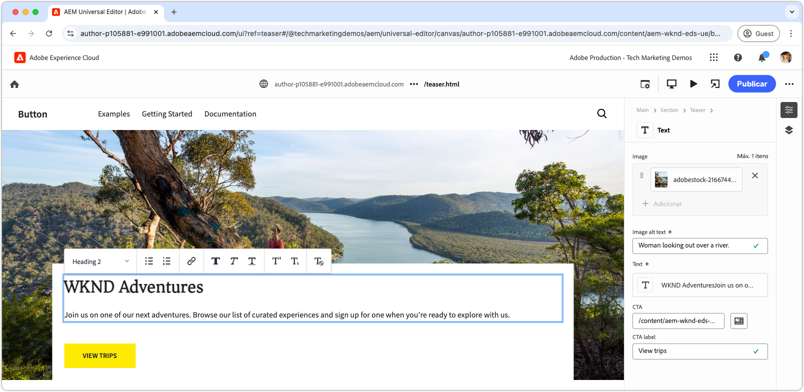

# Desenvolver um bloco com CSS

Os blocos no Edge Delivery Services são estilizados usando CSS. O arquivo CSS de um bloco é armazenado no diretório do bloco e tem o mesmo nome do bloco. Por exemplo, o arquivo CSS para um bloco chamado `teaser` está localizado em `blocks/teaser/teaser.css`.

Idealmente, um bloco deve precisar apenas do CSS para estilização, sem depender do JavaScript para modificar o DOM ou adicionar classes CSS. A necessidade do JavaScript depende da [modelagem de conteúdo](./5-new-block.md#block-model) do bloco e de sua complexidade. Se necessário, [bloquear JavaScript](./7b-block-js-css.md) pode ser adicionado.

Usando uma abordagem somente CSS, os elementos de HTML semânticos (em sua maioria) simples do bloco são direcionados e estilizados.

## Bloquear HTML

Para entender como estilizar um bloco, revise primeiro o DOM exposto pelo Edge Delivery Services, pois ele é o que está disponível para estilização. O DOM pode ser encontrado ao inspecionar o bloco distribuído pelo ambiente de desenvolvimento local da CLI do AEM. Evite usar o DOM do Editor Universal, pois ele é ligeiramente diferente.

>[!BEGINTABS]

>[!TAB Estilo do DOM]

Veja a seguir o DOM do bloco de teaser que é o destino do estilo.

Observe o `<p class="button-container">...` que é [automaticamente aumentado](./4-website-branding.md#inferred-elements) como um elemento inferido pelo Edge Delivery Services JavaScript.

```html
...
<body>
    <header/>
    <main>
        <div>
            <!-- Start block HTML -->
            <div class="teaser block" data-block-name="teaser" data-block-status="loaded">
                <div>
                    <div>
                        <picture>
                            <source type="image/webp" srcset="./media_15ba2b455e29aca38c1ca653d24c40acaec8a008f.jpeg?width=2000&amp;format=webply&amp;optimize=medium" media="(min-width: 600px)">
                            <source type="image/webp" srcset="./media_15ba2b455e29aca38c1ca653d24c40acaec8a008f.jpeg?width=750&amp;format=webply&amp;optimize=medium">
                            <source type="image/jpeg" srcset="./media_15ba2b455e29aca38c1ca653d24c40acaec8a008f.jpeg?width=2000&amp;format=jpeg&amp;optimize=medium" media="(min-width: 600px)">
                            
                        </picture>
                    </div>
                </div>
                <div>
                    <div>
                        <h2 id="wknd-adventures">WKND Adventures</h2>
                        <p>Join us on one of our next adventures. Browse our list of curated experiences and sign up for one when you're ready to explore with us.</p>
                        <p class="button-container"><a href="/" title="View trips" class="button">View trips</a></p>
                    </div>
                </div>
            </div>     
            <!-- End block HTML -->
        </div>
    </main>
    <footer/>
</body>
...
```

>[!TAB Como encontrar o DOM]

Para localizar o DOM com estilo, abra a página com o bloco sem estilo no ambiente de desenvolvimento local, selecione o bloco e inspecione o DOM.


>[!ENDTABS]

## Bloquear CSS

Crie um novo arquivo CSS na pasta do bloco, usando o nome do bloco como o nome do arquivo. Por exemplo, para o bloco **teaser**, o arquivo está localizado em `/blocks/teaser/teaser.css`.

Esse arquivo CSS é carregado automaticamente quando o JavaScript dos serviços de entrega de borda detecta um elemento DOM na página que representa um bloco de teaser.

[!BADGE /blocks/teaser/teaser.css]{type=Neutral tooltip="Nome do arquivo da amostra de código abaixo."}

```css
/* /blocks/teaser/teaser.css */

/* Scope each selector in the block with `.block.teaser` using CSS nesting (https://developer.mozilla.org/en-US/docs/Web/CSS/CSS_nesting) to avoid accidental conflicts outside the block */
.block.teaser {
    animation: teaser-fade-in .6s;
    position: relative;
    width: 1600px;
    max-width: 100vw;
    left: 50%; 
    transform: translateX(-50%);
    height: 500px;
    overflow: hidden; 

    /* The image is rendered to the first div in the block */
    picture {
        position: absolute;
        z-index: -1;
        inset: 0;
        box-sizing: border-box;

        img {
            object-fit: cover;
            object-position: center;
            width: 100%;
            height: 100%;
        }
    }

    /** 
    The teaser's text is rendered to the second (also the last) div in the block.

    These styles are scoped to the second (also the last) div in the block (.block.teaser > div:last-child).

    This div order can be used to target different styles to the same semantic elements in the block. 
    For example, if the block has two images, we could target the first image with `.block.teaser > div:first-child img`, 
    and the second image with `.block.teaser > div:nth-child(2) img`.
    **/
    & > div:last-child {
        position: absolute;
        bottom: 0;
        left: 50%;
        transform: translateX(-50%);
        background: var(--background-color);
        padding: 1.5rem 1.5rem 1rem;
        width: 80vw;
        max-width: 1200px;

        /** 
        The following elements reside within `.block.teaser > div:last-child` and could be scoped as such, for example:

        .block.teaser > div:last-child p { .. }

        However since these element can only appear in the second/last div per our block's model, it's unnecessary to add this additional scope.
        **/

        /* Regardless of the authored heading level, we only want one style the heading */
        h1,
        h2,
        h3,
        h4,
        h5,
        h6 {
            font-size: var(--heading-font-size-xl);
            margin: 0;
        }

        h1::after,
        h2::after,
        h3::after,
        h4::after,
        h5::after,
        h6::after {
            border-bottom: 0;
        }

        p {
            font-size: var(--body-font-size-s);
            margin-bottom: 1rem;
        }

        /* Add underlines to links in the text */
        a:hover {
            text-decoration: underline;
        }

        /* Add specific spacing to buttons. These button CSS classes are automatically added by Edge Delivery Services. */
        .button-container {
            margin: 0;
            padding: 0;

            .button {
                background-color: var(--primary-color);
                border-radius: 0;
                color: var(--dark-color);
                font-size: var(--body-font-size-xs);
                font-weight: bold;
                padding: 1em 2.5em;
                margin: 0;
                text-transform: uppercase;
            }
        }
    }
}

/** Animations 
    Scope the @keyframes to the block (teaser) to avoid accidental conflicts outside the block

    Global @keyframes can defines in styles/styles.css and used in this file.
**/

@keyframes teaser-fade-in {
    from {
        opacity: 0;
    }

    to {
        opacity: 1;
    }
}
```

## Visualização do desenvolvimento

À medida que o CSS é gravado no projeto de código, o recarregamento automático da CLI do AEM altera, tornando mais rápido e fácil entender como o CSS está afetando o bloco.


## Implante seu código

Verifique se você [lint frequente](./3-local-development-environment.md#linting) suas alterações de código para garantir que ele seja limpo e consistente. A impressão ajuda a detectar problemas antecipadamente e reduz o tempo geral de desenvolvimento. Lembre-se, você não pode mesclar seu trabalho de desenvolvimento com o `main` até que todos os problemas de listas sejam resolvidos!

```bash
# ~/Code/aem-wknd-eds-ue

$ npm run lint:css
```

## Visualizar no Editor Universal

Para exibir as alterações no Editor universal do AEM, adicione, confirme e envie-as para a ramificação do repositório Git usada pelo Editor universal. Essa etapa ajuda a garantir que a implementação em bloco não interrompa a experiência de criação.

```bash
# ~/Code/aem-wknd-eds-ue

$ git add .
$ git commit -m "Add CSS-only implementation for teaser block"
$ git push origin teaser
```

Agora, você pode visualizar as alterações no Editor Universal ao adicionar o parâmetro de consulta `?ref=teaser`.


