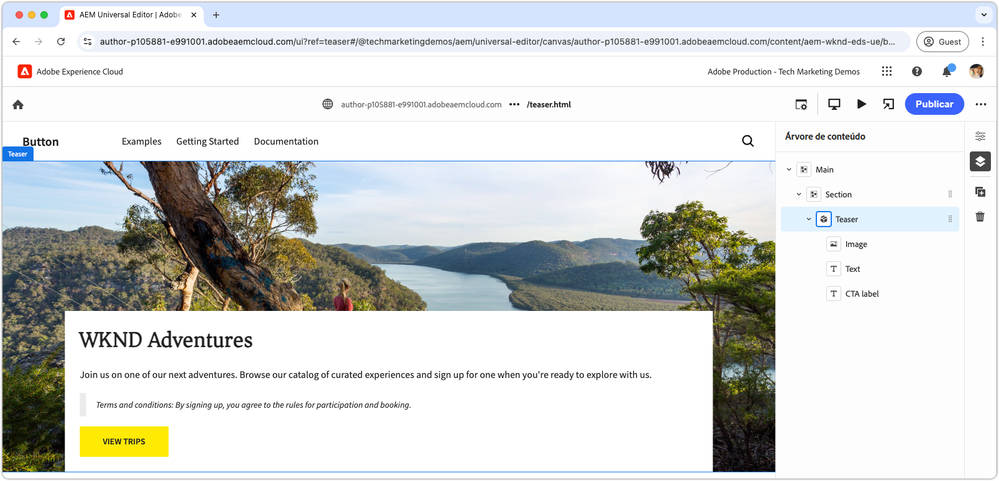

# Desenvolver um bloco com CSS e JavaScript

No [capítulo anterior](./7b-block-js-css.md), abordamos como estilizar um bloco apenas com CSS. Agora, o foco muda para o desenvolvimento de um bloco com JavaScript e CSS.

Este exemplo mostra como aprimorar um bloco de três maneiras:

1. Adicionar classes de CSS personalizadas.
1. Usar ouvintes de eventos para adicionar movimento.
1. Tratar termos e condições que podem ser incluídos opcionalmente no texto do teaser.

## Casos de uso comuns

Essa abordagem é particularmente útil nos seguintes casos:

- **Gerenciamento de CSS externa:** quando o CSS do bloco é gerenciado fora do Edge Delivery Services e não está alinhado à estrutura HTML.
- **Atributos adicionais:** quando atributos extras são necessários, como [ARIA](https://developer.mozilla.org/pt-BR/docs/Web/Accessibility/ARIA) para acessibilidade ou [microdados](https://developer.mozilla.org/en-US/docs/Web/HTML/Microdata).
- **Aprimoramentos do JavaScript:** quando recursos interativos são necessários, como ouvintes de eventos.

Este método depende da manipulação do DOM do JavaScript nativa do navegador, mas requer cuidado ao modificar o DOM, principalmente ao mover elementos. Essas alterações podem interromper a experiência de criação do editor universal. No melhor dos casos, o [modelo de conteúdo](./5-new-block.md#block-model) do bloco deve ser projetado cuidadosamente para minimizar a necessidade de alterações extensas do DOM.

## HTML do bloco

Para abordar o desenvolvimento do bloco, revise primeiro o DOM exposto pelo Edge Delivery Services. A estrutura é aprimorada com o JavaScript e estilizada com o CSS.

>[!BEGINTABS]

>[!TAB DOM a ser decorado]

Confira abaixo o DOM do bloco de teaser que é o destino a ser decorado com JavaScript e CSS.

```html
...
<body>
    <header/>
    <main>
        <div>
            <!-- Start block HTML -->
            <div class="teaser block" data-block-name="teaser" data-block-status="loaded">
                <div>
                    <div>
                    <picture>
                        <source type="image/webp" srcset="./media_15ba2b455e29aca38c1ca653d24c40acaec8a008f.jpeg?width=2000&amp;format=webply&amp;optimize=medium" media="(min-width: 600px)">
                        <source type="image/webp" srcset="./media_15ba2b455e29aca38c1ca653d24c40acaec8a008f.jpeg?width=750&amp;format=webply&amp;optimize=medium">
                        <source type="image/jpeg" srcset="./media_15ba2b455e29aca38c1ca653d24c40acaec8a008f.jpeg?width=2000&amp;format=jpeg&amp;optimize=medium" media="(min-width: 600px)">
                        
                    </picture>
                    </div>
                </div>
                <div>
                    <div>
                    <h2 id="wknd-adventures">WKND Adventures</h2>
                    <p>Join us on one of our next adventures. Browse our list of curated experiences and sign up for one when you're ready to explore with us.</p>
                    <p class="button-container"><a href="/" title="View trips" class="button">View trips</a></p>
                    </div>
                </div>
            </div>     
            <!-- End block HTML -->
        </div>
    </main>
    <footer/>
</body>
...
```

>[!TAB Como encontrar o DOM]

Para encontrar o DOM a ser decorado, abra a página com o bloco não decorado no ambiente de desenvolvimento local, selecione o bloco e inspecione o DOM.


>[!ENDTABS]


## JavaScript do bloco

Para adicionar a funcionalidade de JavaScript a um bloco, crie um arquivo de JavaScript no diretório do bloco com o mesmo nome do bloco, como, por exemplo, `/blocks/teaser/teaser.js`.

O arquivo de JavaScript deve exportar uma função padrão:

```javascript
export default function decorate(block) { ... }
```

A função padrão pega o elemento/árvore de DOM que representa o bloco no HTML do Edge Delivery Services e contém o JavaScript personalizado executado quando o bloco é renderizado.

Este exemplo de JavaScript executa três ações principais:

1. Adiciona um ouvinte de eventos ao botão de CTA, ampliando a imagem ao passar o cursor do mouse.
1. Adiciona classes de CSS semânticas aos elementos do bloco, o que é útil na integração de sistemas de design de CSS existentes.
1. Adiciona uma classe de CSS especial a parágrafos que começam com `Terms and conditions:`.

[!BADGE /blocks/teaser/teaser.js]{type=Neutral tooltip="Nome do arquivo da amostra de código abaixo."}

```javascript
/* /blocks/teaser/teaser.js */

/**
 * Adds a zoom effect to image using event listeners.
 *
 * When the CTA button is hovered over, the image zooms in.
 *
 * @param {HTMLElement} block represents the block's' DOM tree
 */
function addEventListeners(block) {
  block.querySelector('.button').addEventListener('mouseover', () => {
    block.querySelector('.image').classList.add('zoom');
  });

  block.querySelector('.button').addEventListener('mouseout', () => {
    block.querySelector('.image').classList.remove('zoom');
  });
}

/**
   * Entry point to block's JavaScript.
   * Must be exported as default and accept a block's DOM element.
   * This function is called by the project's style.js, and passed the block's element.
   *
   * @param {HTMLElement} block represents the block's' DOM element/tree
   */
export default function decorate(block) {
  /* This JavaScript makes minor adjustments to the block's DOM */

  // Dress the DOM elements with semantic CSS classes so it's obvious what they are.
  // If needed we could also add ARIA roles and attributes, or add/remove/move DOM elements.

  // Add a class to the first picture element to target it with CSS
  block.querySelector('picture').classList.add('image-wrapper');

  // Use previously applied classes to target new elements
  block.querySelector('.image-wrapper img').classList.add('image');

  // Mark the second/last div as the content area (white, bottom aligned box w/ text and cta)
  block.querySelector(':scope > div:last-child').classList.add('content');

  // Mark the first H1-H6 as a title
  block.querySelector('h1,h2,h3,h4,h5,h6').classList.add('title');

  // Process each paragraph and mark it as text or terms-and-conditions
  block.querySelectorAll('p').forEach((p) => {
    const innerHTML = p.innerHTML?.trim();

    // If the paragraph starts with Terms and conditions: then style it as such
    if (innerHTML?.startsWith("Terms and conditions:")) {
      /* If a paragraph starts with '*', add a special CSS class. */
      p.classList.add('terms-and-conditions');
    }
  });

  // Add event listeners to the block
  addEventListeners(block);
}
```

## CSS do bloco

Se você tiver criado um `teaser.css` no [capítulo anterior](./7a-block-css.md), exclua-o ou renomeie-o como `teaser.css.bak`, pois este capítulo implementa um CSS diferente para o bloco de teaser.

Crie um arquivo de `teaser.css` na pasta do bloco. Esse arquivo contém o código de CSS que estiliza o bloco. Esse código de CSS direciona os elementos do bloco e as classes de CSS semânticas específicas adicionadas pelo JavaScript em `teaser.js`.

Os elementos simples ainda podem ser estilizados diretamente ou com as classes de CSS personalizadas aplicadas. Para blocos mais complexos, a aplicação de classes de CSS semânticas pode ajudar a tornar o CSS mais compreensível e sustentável, principalmente ao trabalhar com equipes maiores por períodos mais longos.

[Como antes](./7a-block-css.md#develop-a-block-with-css), defina o escopo do CSS para `.block.teaser`, usando o [aninhamento de CSS](https://developer.mozilla.org/en-US/docs/Web/CSS/CSS_nesting) para evitar conflitos com outros blocos.

[!BADGE /blocks/teaser/teaser.css]{type=Neutral tooltip="Nome do arquivo da amostra de código abaixo."}

```css
/* /blocks/teaser/teaser.css */

/* Scope each selector in the block with `.block.teaser` to avoid accidental conflicts outside the block */
.block.teaser {
    animation: teaser-fade-in 1s;
    position: relative;
    width: 1600px;
    max-width: 100vw;
    left: 50%; 
    transform: translateX(-50%);
    height: 500px;
    overflow: hidden; 

    /* The teaser image */
    .image-wrapper {
        position: absolute;
        z-index: -1;
        inset: 0;
        box-sizing: border-box;
        overflow: hidden; 

        .image {
            object-fit: cover;
            object-position: center;
            width: 100%;
            height: 100%;
            transform: scale(1); 
            transition: transform 0.6s ease-in-out;

            .zoom {
                transform: scale(1.1);
            }            
        }
    }

    /* The teaser text content */
    .content {
        position: absolute;
        bottom: 0;
        left: 50%;
        transform: translateX(-50%);
        background: var(--background-color);
        padding: 1.5rem 1.5rem 1rem;
        width: 80vw;
        max-width: 1200px;
  
        .title {
            font-size: var(--heading-font-size-xl);
            margin: 0;
        }

        .title::after {
            border-bottom: 0;
        }

        p {
            font-size: var(--body-font-size-s);
            margin-bottom: 1rem;
            animation: teaser-fade-in .6s;
        
            &.terms-and-conditions {
                font-size: var(--body-font-size-xs);
                color: var(--secondary-color);
                padding: .5rem 1rem;
                font-style: italic;
                border: solid var(--light-color);
                border-width: 0 0 0 10px;
            }
        }

        /* Add underlines to links in the text */
        a:hover {
            text-decoration: underline;
        }

        /* Add specific spacing to buttons. These button CSS classes are automatically added by Edge Delivery Services. */
        .button-container {
            margin: 0;
            padding: 0;
        
            .button {   
                background-color: var(--primary-color);
                border-radius: 0;
                color: var(--dark-color);
                font-size: var(--body-font-size-xs);
                font-weight: bold;
                padding: 1em 2.5em;
                margin: 0;
                text-transform: uppercase;
            }
        }
    }
}

/** Animations 
    Scope the @keyframes to the block (teaser) to avoid accidental conflicts outside the block

    Global @keyframes can defines in styles/styles.css and used in this file.
**/
@keyframes teaser-fade-in {
    from {
        opacity: 0;
    }

    to {
        opacity: 1;
    }
}
```

## Adicionar termos e condições

A implementação acima adiciona a possibilidade de incluir parágrafos de estilo especial que começam com o texto `Terms and conditions:`. Para validar essa funcionalidade, no editor universal, atualize o conteúdo do texto do bloco de teaser para incluir os termos e condições.

Siga as etapas em [crie um bloco](./6-author-block.md) e edite o texto para incluir um parágrafo de **termos e condições** no fim:

```
WKND Adventures

Join us on one of our next adventures. Browse our list of curated experiences and sign up for one when you're ready to explore with us.

Terms and conditions: By signing up, you agree to the rules for participation and booking.
```

Verifique se o parágrafo é renderizado com o estilo de termos e condições no ambiente de desenvolvimento local. Lembre-se de que essas alterações no código não serão refletidas no editor universal até que sejam [enviadas a uma ramificação do GitHub](#preview-in-universal-editor) configurada para uso pelo editor universal.

## Visualização do desenvolvimento

À medida que o CSS e o JavaScript são adicionados, o ambiente de desenvolvimento local da CLI do AEM recarrega as alterações automaticamente, permitindo uma visualização rápida e fácil de como o código afeta o bloco. Passe o mouse sobre a CTA e verifique se o zoom da imagem do teaser aumenta ou diminui.


## Limpar o seu código

Certifique-se de [limpar com frequência](./3-local-development-environment.md#linting) as alterações no seu código para garantir que ele esteja limpo e seja consistente. A limpeza periódica ajuda a detectar problemas antecipadamente, reduzindo o tempo geral de desenvolvimento. Lembre-se de que você não pode mesclar o seu trabalho de desenvolvimento com a ramificação `main` até que todos os problemas de limpeza sejam resolvidos.

```bash
# ~/Code/aem-wknd-eds-ue

$ npm run lint
```

## Visualizar no editor universal

Para exibir as alterações no editor universal do AEM, adicione, confirme e envie-as à ramificação do repositório do Git usada pelo editor universal. Isso garante que a implementação do bloco não interrompa a experiência de criação.

```bash
# ~/Code/aem-wknd-eds-ue

$ git add .
$ git commit -m "CSS and JavaScript implementation for teaser block"
$ git push origin teaser
```

Agora, você pode visualizar as alterações no editor universal ao adicionar o parâmetro de consulta `?ref=teaser`.


