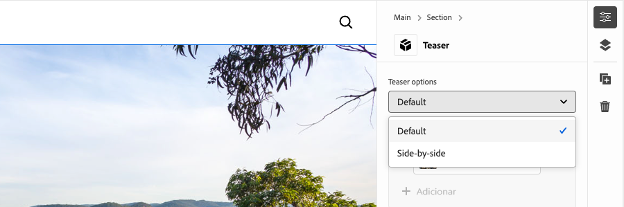
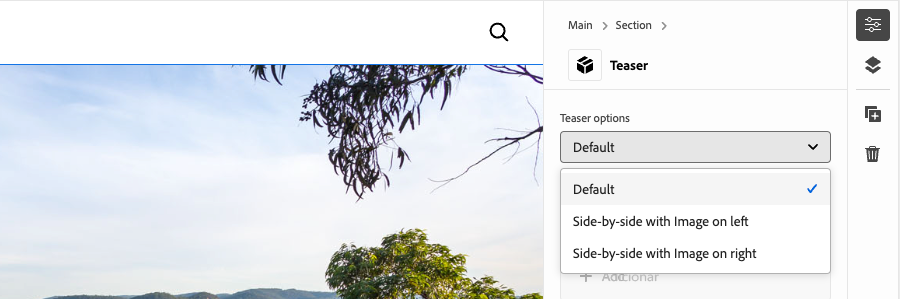
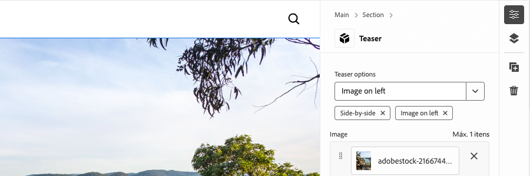
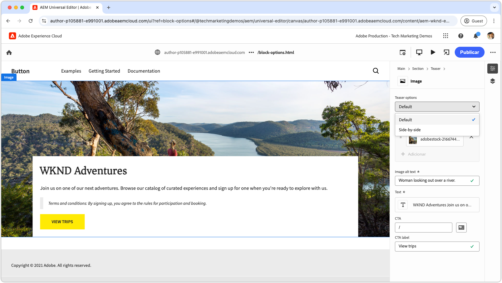
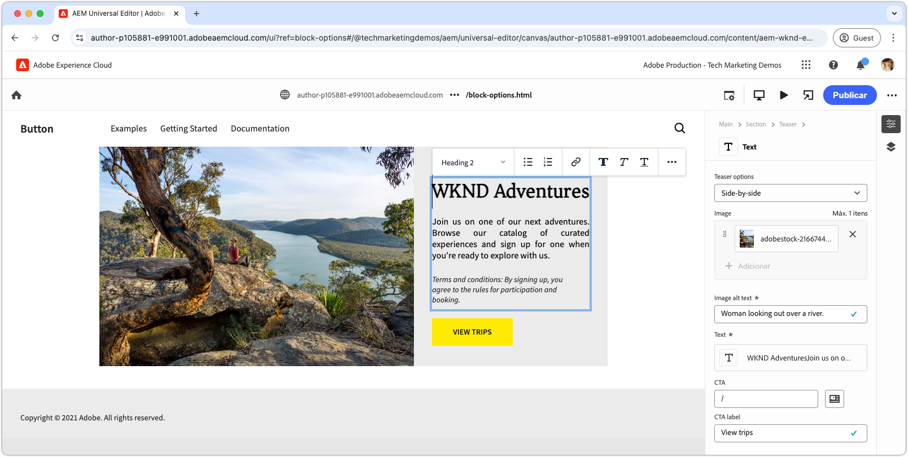

# Desenvolver um bloco com opções

Este tutorial se baseia no tutorial do Edge Delivery Services e do Universal Editor, orientando você pelo processo de adicionar opções de bloco a um bloco. Ao definir opções de bloco, você pode personalizar a aparência e a funcionalidade de um bloco, permitindo que diferentes variações atendam a várias necessidades de conteúdo. Isso permite maior flexibilidade e reutilização no sistema de design do site.

{align="center"}

Neste tutorial, você adicionará opções de bloco ao bloco Teaser, permitindo que os autores escolham entre duas opções de exibição: **Padrão** e **Lado a lado**. A opção **Padrão** exibe a imagem acima e atrás do texto, enquanto a opção **Lado a lado** exibe a imagem e o texto lado a lado.

## Casos de uso comuns

Casos de uso comuns para o uso de **Opções de Bloqueio** no desenvolvimento do **Edge Delivery Services** e do **Universal Editor** incluem, mas não estão limitados a:

1. **Variações de layout:** Alterne facilmente entre os layouts. Por exemplo, horizontal vs. vertical ou grade vs. lista.
2. **Variações de estilo:** alterne facilmente entre temas ou tratamentos visuais. Por exemplo, modo claro vs. escuro ou texto grande vs. pequeno.
3. **Controle de exibição de conteúdo:** alterna a visibilidade dos elementos ou alterna entre estilos de conteúdo (compacto vs. detalhado).

Essas opções oferecem flexibilidade e eficiência na criação de blocos dinâmicos e adaptáveis.

Este tutorial demonstra o caso de uso de variações de layout, em que o bloco Teaser pode ser exibido em dois layouts diferentes: **Padrão** e **Lado a lado**.

## Bloquear modelo

Para adicionar opções de bloco ao bloco Teaser, abra o fragmento JSON em `/block/teaser/_teaser.json` e adicione um novo campo à definição do modelo. Este campo define sua propriedade `name` como `classes`, que é um campo protegido usado pelo AEM para armazenar opções de bloco, que são aplicadas ao Edge Delivery Services HTML do bloco.

### Configurações de campo

As guias abaixo ilustram várias maneiras de configurar opções de bloco no modelo de bloco, incluindo a seleção única com uma única classe CSS, a seleção única com várias classes CSS e a seleção múltipla com várias classes CSS. Este tutorial [implementa a abordagem mais simples](#field-configuration-for-this-tutorial) usada em **select com uma única classe CSS**.

>[!BEGINTABS]

>[!TAB Selecionar com classe CSS única]

Este tutorial demonstra como usar um tipo de entrada `select` (lista suspensa) para permitir que os autores escolham uma única opção de bloco, que é aplicada como uma única classe CSS correspondente.

{align="center"}

#### Bloquear modelo

A opção **Padrão** é representada por uma cadeia de caracteres vazia (`""`), enquanto a opção **Lado a Lado** usa `"side-by-side"`. O **nome** e o **valor** da opção não precisam ser iguais, mas o **valor** determina as classes CSS aplicadas ao HTML do bloco. Por exemplo, o valor da opção **Lado a Lado** poderia ser `layout-10` em vez de `side-by-side`. No entanto, é melhor usar nomes semanticamente significativos para classes CSS, garantindo clareza e consistência nos valores de opção.

[!BADGE /blocks/teaser/_teaser.json]{type=Neutral tooltip="Nome do arquivo da amostra de código abaixo."}

```json{highlight="4,8,9-18"}
...
"fields": [
    {
        "component": "select",
        "name": "classes",
        "value": "",
        "label": "Teaser options",
        "valueType": "string",
        "options": [
            {
                "name": "Default",
                "value": ""
            },
            {
                "name": "Side-by-side",
                "value": "side-by-side"
            }
        ]
    }
]
...
```

#### Bloquear HTML

Quando o autor seleciona uma opção, o valor correspondente é adicionado como uma classe CSS ao HTML do bloco:

- Se **Padrão** estiver selecionado:

  ```html
  <div class="block teaser">
      <!-- Block content here -->
  </div>
  ```

- Se **Lado a lado** estiver selecionado:

  ```html
  <div class="block teaser side-by-side">
      <!-- Block content here -->
  </div>
  ```

Isso permite que um estilo diferente e um JavaScript condicional sejam aplicados, dependendo da abertura escolhida.


>[!TAB Selecionar com várias classes CSS]

**Esta abordagem não é usada neste tutorial, mas ilustra um método alternativo e opções avançadas de bloqueio.**

O tipo de entrada `select` permite que os autores escolham uma única opção de bloco, que pode, opcionalmente, mapear para várias classes CSS. Para fazer isso, liste as classes CSS como valores delimitados por espaço.

{align="center"}

#### Bloquear modelo

Por exemplo, a opção **Lado a Lado** pode suportar variações em que a imagem aparece à esquerda (`side-by-side left`) ou à direita (`side-by-side right`).

[!BADGE /blocks/teaser/_teaser.json]{type=Neutral tooltip="Nome do arquivo da amostra de código abaixo."}

```json{highlight="4,8,9-21"}
...
"fields": [
    {
        "component": "select",
        "name": "classes",
        "value": "",
        "label": "Teaser options",
        "valueType": "string",
        "options": [
            {
                "name": "Default",
                "value": ""
            },
            {
                "name": "Side-by-side with Image on left",
                "value": "side-by-side left"
            },
            {
                "name": "Side-by-side with Image on right",
                "value": "side-by-side right"
            }
        ]
    }
]
...
```

#### Bloquear HTML

Quando o autor seleciona uma opção, o valor correspondente é aplicado como um conjunto de classes CSS separadas por espaços no HTML do bloco:

- Se **Padrão** estiver selecionado:

  ```html
  <div class="block teaser">
      <!-- Block content here -->
  </div>
  ```

- Se **Lado a lado com Imagem à esquerda** estiver selecionado:

  ```html
  <div class="block teaser side-by-side left">
      <!-- Block content here -->
  </div>
  ```

- Se **Lado a lado com a Imagem à direita** estiver selecionado:

  ```html
  <div class="block teaser side-by-side right">
      <!-- Block content here -->
  </div>
  ```

Isso permite que estilos e JavaScript condicionais diferentes sejam aplicados, dependendo da opção escolhida.


>[!TAB Multisseleção com várias classes CSS]

**Esta abordagem não é usada neste tutorial, mas ilustra um método alternativo e opções avançadas de bloqueio.**

O tipo de entrada `"component": "multiselect"` permite que o autor selecione várias opções simultaneamente. Isso permite permutas complexas da aparência do bloco ao combinar várias opções de design.

{align="center"}

### Bloquear modelo

Por exemplo, a **Imagem lado a lado**, **Imagem à esquerda** e **Imagem à direita** podem oferecer suporte a variações em que a imagem está posicionada à esquerda (`side-by-side left`) ou à direita (`side-by-side right`).

[!BADGE /blocks/teaser/_teaser.json]{type=Neutral tooltip="Nome do arquivo da amostra de código abaixo."}

```json{highlight="4,6,8,10-21"}
...
"fields": [
    {
        "component": "multiselect",
        "name": "classes",
        "value": [],
        "label": "Teaser options",
        "valueType": "array",
        "options": [
            {
                "name": "Side-by-side",
                "value": "side-by-side"
            },
            {
                "name": "Image on left",
                "value": "left"
            },
            {
                "name": "Image on right",
                "value": "right"
            }
        ]
    }
]
...
```

#### Bloquear HTML

Quando o autor seleciona várias opções, os valores correspondentes são aplicados como classes CSS separadas por espaço no HTML do bloco:

- Se **Lado a lado** e **Imagem à esquerda** estiverem selecionados:

  ```html{highlight="1"}
  <div class="block teaser side-by-side left">
      <!-- Block content here -->
  </div>
  ```

- Se **Lado a lado** e **Imagem à direita** estiverem selecionados:

  ```html{highlight="1"}
  <div class="block teaser side-by-side right">
      <!-- Block content here -->
  </div>
  ```

Embora a seleção múltipla ofereça flexibilidade, ela introduz complexidade no gerenciamento de permutas de design. Sem restrições, seleções conflitantes podem levar a experiências quebradas ou fora da marca.

Por exemplo:

- **Imagem à esquerda** ou **Imagem à direita** sem selecionar **Lado a lado** aplica-as implicitamente ao **Padrão**, que sempre define a imagem como um plano de fundo, portanto, o alinhamento à esquerda e à direita é irrelevante.
- A seleção de **Imagem à esquerda** e **Imagem à direita** é contraditória.
- Selecionar **lado a lado** sem **Imagem à esquerda** ou **Imagem à direita** pode ser considerado ambíguo, pois a posição da imagem não está especificada.

Para evitar problemas e confusão do autor ao usar a seleção múltipla, verifique se as opções estão bem planejadas e se todas as permutas foram testadas. A seleção múltipla funciona melhor para aprimoramentos simples e não conflitantes, como &quot;grande&quot; ou &quot;destaque&quot;, em vez de opções de alteração de layout.


>[!TAB Opção padrão]

**Esta abordagem não é usada neste tutorial, mas ilustra um método alternativo e opções avançadas de bloqueio.**

As opções de bloco podem ser definidas como padrão ao adicionar uma nova instância de bloco a uma página no Universal Editor. Isso é feito definindo o valor padrão da propriedade `classes` na definição do [bloco](../5-new-block.md#block-definition).

#### Definição de bloco

No exemplo abaixo, a opção padrão é definida como **Lado a Lado** atribuindo a propriedade `value` do campo `classes` a `side-by-side`. A entrada da opção de bloco correspondente no modelo de bloco é opcional.

Você também pode definir várias entradas para o mesmo bloco, cada uma com um nome e classe diferentes. Isso permite que o Editor Universal exiba entradas de blocos distintos, cada um pré-configurado com uma opção de bloco específica. Embora esses apareçam como blocos separados no editor, a base de código contém um único bloco que é renderizado dinamicamente com base na opção selecionada.

[!BADGE /blocks/teaser/_teaser.json]{type=Neutral tooltip="Nome do arquivo da amostra de código abaixo."}

```json{highlight="12"}
{
    "definitions": [{
      "title": "Teaser",
      "id": "teaser",
      "plugins": {
        "xwalk": {
          "page": {
            "resourceType": "core/franklin/components/block/v1/block",
            "template": {
              "name": "Teaser",
              "model": "teaser",
              "classes": "side-by-side",
              "textContent_text": "<h2>Enter a title</h2><p>...and body text here!</p>",
              "textContent_cta": "/",
              "textContent_ctaText": "Click me!"
            }
          }
        }
      }
    }],
    "models": [... from previous section ...],
    "filters": []
}
```

>[!ENDTABS]


### Configuração de campo para este tutorial


Neste tutorial, usaremos a abordagem select with single CSS class descrita acima na primeira guia, que permite duas opções de bloco discreto: **Padrão** e **Lado a lado**.

Na definição do modelo no fragmento JSON do bloco, adicione um único campo de seleção para opções de bloco. Esse campo permite que os autores escolham entre o layout padrão e um layout lado a lado.

[!BADGE /blocks/teaser/_teaser.json]{type=Neutral tooltip="Nome do arquivo da amostra de código abaixo."}

```json{highlight="7-24"}
{
    "definitions": [...],
    "models": [
        {
            "id": "teaser", 
            "fields": [
                {
                    "component": "select",
                    "name": "classes",
                    "value": "",
                    "label": "Teaser options",
                    "description": "",
                    "valueType": "string",
                    "options": [
                        {
                            "name": "Default",
                            "value": ""
                        },
                        {
                            "name": "Side-by-side",
                            "value": "side-by-side"
                        }
                    ]
                },
                {
                    "component": "reference",
                    "valueType": "string",
                    "name": "image",
                    "label": "Image",
                    "multi": false
                },
                {
                    "component": "text",
                    "valueType": "string",
                    "name": "imageAlt",
                    "label": "Image alt text",
                    "required": true
                },
                {
                    "component": "richtext",
                    "name": "textContent_text",
                    "label": "Text",
                    "valueType": "string",
                    "required": true
                },
                {
                    "component": "aem-content",
                    "name": "textContent_cta",
                    "label": "CTA",
                    "valueType": "string"
                },
                {
                    "component": "text",
                    "name": "textContent_ctaText",
                    "label": "CTA label",
                    "valueType": "string"
                }
            ]
        }
    ],
    "filters": []
}
```

## Atualizar bloco no Editor Universal

Para disponibilizar a entrada das opções de bloco atualizadas no Universal Editor, implante as alterações de código JSON no GitHub, crie uma nova página, adicione e crie o bloco Teaser com a opção **Lado a Lado** e publique a página para visualização. Depois de publicada, carregue a página no ambiente de desenvolvimento local para codificação.

### Enviar alterações para o GitHub

Para disponibilizar a entrada das opções de bloco atualizadas no Universal Editor para definir opções de bloco e desenvolver em relação ao HTML resultante, o projeto deve ser vinculado e as alterações enviadas para uma ramificação GitHub — neste caso, a ramificação `block-options`.

```bash
# ~/Code/aem-wknd-eds-ue

# Lint the changes to catch any syntax errors
$ npm run lint 

$ git add .
$ git commit -m "Add Teaser block option to JSON file so it is available in Universal Editor"
$ git push origin teaser
```

### Criar uma página de teste

No serviço de Autor do AEM, crie uma nova página para adicionar o bloco Teaser para desenvolvimento. Seguindo a convenção do capítulo [Criar um bloco](../6-author-block.md) do [Tutorial do desenvolvedor do Edge Delivery Services e do Universal Editor](../0-overview.md), crie uma página de teste em uma página `branches`, nomeando-a com o nome da ramificação Git em que você está trabalhando— neste caso, `block-options`.

### Criar o bloco

Edite a nova página **Opções de Bloco** no Editor Universal e adicione o bloco **Teaser**. Adicione o parâmetro de consulta `?ref=block-options` à URL para carregar a página usando o código da ramificação GitHub `block-options`,

A caixa de diálogo de bloqueio agora inclui uma lista suspensa de **Opções de Teaser** com **Padrão** e **Lado a Lado** seleções. Escolha **Lado a Lado** e conclua a criação do conteúdo restante.

{align="center"}

Opcionalmente, adicione dois blocos **Teaser**: um definido como **Padrão** e o outro como **Lado a Lado**. Isso permite que você visualize as duas opções lado a lado durante o desenvolvimento e garante que a implementação do **Lado a Lado** não afete a opção **Padrão**.

### Publicar para visualização

Depois que o bloco Teaser for adicionado à página, [publique a página para visualização](../6-author-block.md) usando **Gerenciar Publicações** e o Administrador do Site do Autor do AEM.

## Bloquear HTML

Para iniciar o desenvolvimento de bloco, comece revisando a estrutura DOM exposta pela pré-visualização do Edge Delivery Services. O DOM é aprimorado com o JavaScript e estilizado com CSS, fornecendo a base para a criação e personalização do bloco.

>[!BEGINTABS]

>[!TAB DOM a decorar]

O código a seguir é o DOM do bloco Teaser, com a opção de bloco **Lado a lado** selecionada, que é o destino a ser decorado usando JavaScript e CSS.

```html{highlight="7"}
...
<body>
    <header/>
    <main>
        <div>
            <!-- Start block HTML -->
            <div class="teaser block side-by-side" data-block-name="teaser" data-block-status="loaded">
                <div>
                    <div>
                    <picture>
                        <source type="image/webp" srcset="./media_15ba2b455e29aca38c1ca653d24c40acaec8a008f.jpeg?width=2000&amp;format=webply&amp;optimize=medium" media="(min-width: 600px)">
                        <source type="image/webp" srcset="./media_15ba2b455e29aca38c1ca653d24c40acaec8a008f.jpeg?width=750&amp;format=webply&amp;optimize=medium">
                        <source type="image/jpeg" srcset="./media_15ba2b455e29aca38c1ca653d24c40acaec8a008f.jpeg?width=2000&amp;format=jpeg&amp;optimize=medium" media="(min-width: 600px)">
                        
                    </picture>
                    </div>
                </div>
                <div>
                    <div>
                    <h2 id="wknd-adventures">WKND Adventures</h2>
                    <p>Join us on one of our next adventures. Browse our list of curated experiences and sign up for one when you're ready to explore with us.</p>
                    <p>Terms and conditions: By signing up, you agree to the rules for participation and booking.</p>
                    <p class="button-container"><a href="/" title="View trips" class="button">View trips</a></p>
                    </div>
                </div>
            </div>     
            <!-- End block HTML -->
        </div>
    </main>
    <footer/>
</body>
...
```

>[!TAB Como encontrar o DOM]

Para localizar o DOM a ser decorado, abra a página com o bloco no ambiente de desenvolvimento local, selecione o bloco usando as ferramentas de desenvolvedor do navegador da Web e inspecione o DOM. Isso permitirá identificar os elementos relevantes para decorar.

{align="center"}

>[!ENDTABS]

## Bloquear CSS

Edite `blocks/teaser/teaser.css` para adicionar estilos CSS específicos para a opção **Lado a Lado**. Esse arquivo contém o CSS padrão do bloco.

Para modificar estilos da opção **Lado a Lado**, adicione uma nova regra CSS com escopo no arquivo `teaser.css` que segmente blocos de teaser configurados com a classe `side-by-side`.

```css
.block.teaser.side-by-side { ... }
```

Como alternativa, você pode usar o Aninhamento de CSS para obter uma versão mais concisa:

```css
.block.teaser {
    ... Default teaser block styles ...

    &.side-by-side {
        ... Side-by-side teaser block styles ...
    }
}
```

Na regra `&.side-by-side`, adicione as propriedades CSS necessárias para estilizar o bloco quando a classe `side-by-side` for aplicada.

Uma abordagem comum é redefinir os estilos padrão aplicando `all: initial` aos seletores compartilhados e adicionando os estilos necessários para a variante `side-by-side`. Se a maioria dos estilos for compartilhada entre opções, substituir propriedades específicas pode ser mais fácil. No entanto, se vários seletores precisarem de alterações, redefinir todos os estilos e reaplicar apenas os necessários poderá tornar o código mais claro e mais sustentável.
[!BADGE /blocks/teaser/teaser.css]{type=Neutral tooltip="Nome do arquivo da amostra de código abaixo."}

```css
/* /blocks/teaser/teaser.css */

/* Scope each selector in the block with `.block.teaser` to avoid accidental conflicts outside the block */
.block.teaser {
    animation: teaser-fade-in 1s;
    position: relative;
    width: 1600px;
    max-width: 100vw;
    left: 50%; 
    transform: translateX(-50%);
    height: 500px;
    overflow: hidden; 


    /* The teaser image */
    .image-wrapper {
        position: absolute;
        z-index: -1;
        inset: 0;
        box-sizing: border-box;
        overflow: hidden; 

        .image {
            object-fit: cover;
            object-position: center;
            width: 100%;
            height: 100%;
            transform: scale(1); 
            transition: transform 0.6s ease-in-out;

            .zoom {
                transform: scale(1.1);
            }            
        }
    }

    /* The teaser text content */
    .content {
        position: absolute;
        bottom: 0;
        left: 50%;
        transform: translateX(-50%);
        background: var(--background-color);
        padding: 1.5rem 1.5rem 1rem;
        width: 80vw;
        max-width: 1200px;
  
        .title {
            font-size: var(--heading-font-size-xl);
            margin: 0;
        }

        .title::after {
            border-bottom: 0;
        }

        p {
            font-size: var(--body-font-size-s);
            margin-bottom: 1rem;
            animation: teaser-fade-in .6s;
        }

        p.terms-and-conditions {
            font-size: var(--body-font-size-xs);
            color: var(--secondary-color);
            padding: .5rem 1rem;
            font-style: italic;
            border: solid var(--light-color);
            border-width: 0 0 0 10px;
        }

        /* Add underlines to links in the text */
        a:hover {
            text-decoration: underline;
        }

        /* Add specific spacing to buttons. These button CSS classes are automatically added by Edge Delivery Services. */
        .button-container {
            margin: 0;
            padding: 0;        

            .button {   
                background-color: var(--primary-color);
                border-radius: 0;
                color: var(--dark-color);
                font-size: var(--body-font-size-xs);
                font-weight: bold;
                padding: 1em 2.5em;
                margin: 0;
                text-transform: uppercase;
            }
        }
    }

    /**
    *  Add styling for the side-by-side variant 
    **/

    /* This evaluates to .block.teaser.side-by-side */
    &.side-by-side {    
        /* Since this default teaser option doesn't have a style (such as `.default`), we use `all: initial` to reset styles rather than overriding individual styles. */
        all: initial;
        display: flex;
        margin: auto;
        max-width: 900px;

        .image-wrapper {
            all: initial;
            flex: 2;
            overflow: hidden;                 
            
            * {
                height: 100%;
            }        

            .image {
                object-fit: cover;
                object-position: center;
                width: 100%;
                height: 100%;
                transform: scale(1); 
                transition: transform 0.6s ease-in-out;                

                &.zoom {
                    /* This option has a different zoom level than the default */
                    transform: scale(1.5);
                }
            }
        }

        .content {
            all: initial;
            flex: 1;
            background-color: var(--light-color);
            padding: 3.5em 2em 2em;
            font-size: var(--body-font-size-s);
            font-family: var(--body-font-family);
            text-align: justify;
            text-justify: newspaper;
            hyphens: auto;

            p.terms-and-conditions {
                border: solid var(--text-color);
                border-width: 0;
                padding-left: 0;
                text-align: left;
            }
        }

        /* Media query for mobile devices */
        @media (width <= 900px) {
            flex-direction: column; /* Stack elements vertically on mobile */
        }
    }
}

/** Animations 
    Scope the @keyframes to the block (teaser) to avoid accidental conflicts outside the block

    Global @keyframes can defines in styles/styles.css and used in this file.
**/
@keyframes teaser-fade-in {
    from {
        opacity: 0;
    }

    to {
        opacity: 1;
    }
}
```


## Bloquear JavaScript

Identificar as opções ativas para o bloco é simples, verificando as classes aplicadas ao elemento do bloco. Neste exemplo, precisamos ajustar onde os estilos `.image-wrapper` são aplicados dependendo da opção ativa.

A função `getOptions` retorna uma matriz de classes aplicada ao bloco, excluindo `block` e `teaser` (já que todos os blocos têm a classe `block` e todos os blocos Teaser têm a classe `teaser`). As classes restantes na matriz indicam as opções ativas. Se a matriz estiver vazia, a opção padrão será aplicada.

```javascript
function getOptions(block) {
  // Get the block's classes, excluding 'block' and 'teaser'; anything remaining is a block option.
  return [...block.classList].filter((c) => !['block', 'teaser'].includes(c));
}
```

Essa lista de opções pode ser usada para executar condicionalmente a lógica personalizada no JavaScript do bloco:

```javascript
if (getOptions(block).includes('side-by-side')) {
  /* For side-by-side teaser, add the image-wrapper to a higher-level div to support CSS */
  block.querySelector(':scope > div:first-child').classList.add('image-wrapper');
} else if (!getOptions(block)) {
  /* For the default option, add the image-wrapper to the picture element to support CSS */
  block.querySelector('picture').classList.add('image-wrapper');
}
```

O arquivo JavaScript completo atualizado para o bloco de teaser com as opções Padrão e Lado a Lado é o seguinte:

[!BADGE /blocks/teaser/teaser.js]{type=Neutral tooltip="Nome do arquivo da amostra de código abaixo."}

```javascript
/* /blocks/teaser/teaser.js */

/**
 * Block options are applied as classes to the block's DOM element
 * alongside the `block` and `<block-name>` classes.
 *
 * @param {HTMLElement} block represents the block's DOM element/tree
 */
function getOptions(block) {
  // Get the block's classes, excluding 'block' and 'teaser'.
  return [...block.classList].filter((c) => !['block', 'teaser'].includes(c));
}

/**
 * Adds a zoom effect to the image using event listeners.
 *
 * When the CTA button is hovered over, the image zooms in.
 *
 * @param {HTMLElement} block represents the block's DOM tree
 */
function addEventListeners(block) {
  block.querySelector('.button').addEventListener('mouseover', () => {
    block.querySelector('.image').classList.add('zoom');
  });

  block.querySelector('.button').addEventListener('mouseout', () => {
    block.querySelector('.image').classList.remove('zoom');
  });
}

/**
 * Entry point to the block's JavaScript.
 * Must be exported as default and accept a block's DOM element.
 * This function is called by the project's style.js, passing the block's element.
 *
 * @param {HTMLElement} block represents the block's DOM element/tree
 */
export default function decorate(block) {
  /* Common treatments for all options */
  block.querySelector(':scope > div:last-child').classList.add('content');
  block.querySelector('h1,h2,h3,h4,h5,h6').classList.add('title');
  block.querySelector('img').classList.add('image');

  // Process each paragraph and mark it as text or terms-and-conditions
  block.querySelectorAll('p').forEach((p) => {
    const innerHTML = p.innerHTML?.trim();
    if (innerHTML?.startsWith('Terms and conditions:')) {
      p.classList.add('terms-and-conditions');
    }
  });

  /* Conditional treatments for specific options */
  if (getOptions(block).includes('side-by-side')) {
    /* For side-by-side teaser, add the image-wrapper to a higher-level div to support CSS */
    block.querySelector(':scope > div:first-child').classList.add('image-wrapper');
  } else if (!getOptions(block)) {
    /* For the default option, add the image-wrapper to the picture element to support CSS */
    block.querySelector('picture').classList.add('image-wrapper');
  }

  addEventListeners(block);
}
```

## Visualização do desenvolvimento

À medida que o CSS e o JavaScript são adicionados, o ambiente de desenvolvimento local da CLI do AEM recarrega as alterações automaticamente, permitindo uma visualização rápida e fácil de como o código afeta o bloco. Passe o mouse sobre a CTA e verifique se a imagem do teaser aumenta ou diminui o zoom.


## Implante seu código

Certifique-se de [lint frequente](../3-local-development-environment.md#linting) suas alterações de código para mantê-lo limpo e consistente. A impressão regular ajuda a detectar problemas antecipadamente, reduzindo o tempo geral de desenvolvimento. Lembre-se, você não pode mesclar seu trabalho de desenvolvimento na ramificação `main` até que todos os problemas de listas sejam resolvidos!

```bash
# ~/Code/aem-wknd-eds-ue

$ npm run lint
```

## Visualizar no Editor Universal

Para exibir as alterações no Editor universal do AEM, adicione, confirme e envie-as para a ramificação do repositório Git usada pelo Editor universal. Isso garante que a implementação em bloco não interrompa a experiência de criação.

```bash
# ~/Code/aem-wknd-eds-ue

$ git add .
$ git commit -m "CSS and JavaScript implementation for Teaser block option Side-by-side"
# JSON files are compiled automatically and added to the commit via a Husky pre-commit hook
$ git push origin block-options
```

Agora, as alterações ficam visíveis no Editor Universal ao usar o parâmetro de consulta `?ref=block-options`.

{align="center"}


## Parabéns.

Agora você explorou as opções de bloco no Edge Delivery Services e no Universal Editor, fornecendo as ferramentas para personalizar e simplificar a edição de conteúdo com maior flexibilidade. Comece a aplicar essas opções em seus projetos para melhorar a eficiência e manter a consistência.

Para obter mais práticas recomendadas e técnicas avançadas, consulte a [documentação do Universal Editor](https://experienceleague.adobe.com/en/docs/experience-manager-cloud-service/content/edge-delivery/wysiwyg-authoring/create-block#block-options).
